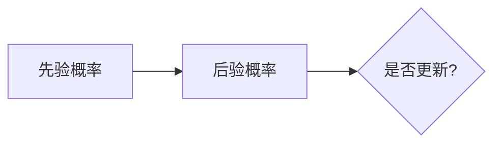
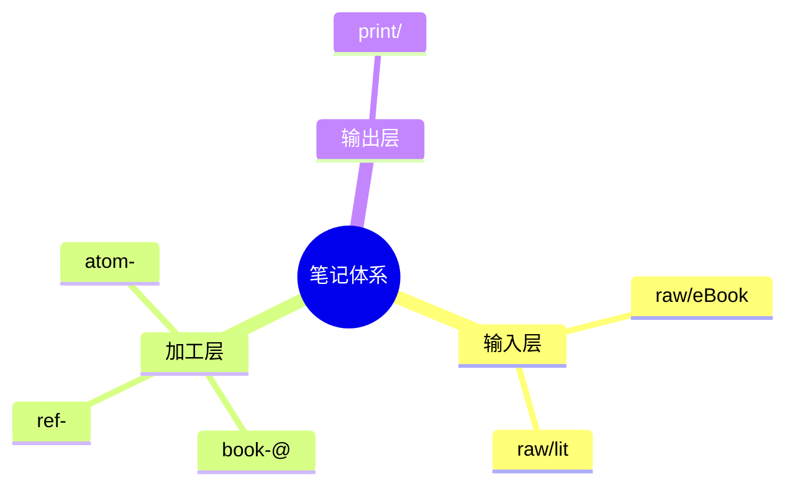
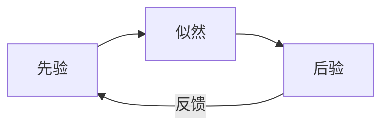

# 笔记可视化（note-visualize）

## 何时启用

- 用户明确要求："画一下"、"做个图"、"mermaid 表示一下"。
- 写 [模板-card](!template/模板-card.md) 第 1 节时，那个 `mermaid` 代码块**默认要填**，不要留空。
- 主动时机：当一段论证里出现 ≥3 个概念之间的关系时，主动建议"要不要补一张 mermaid"。

## 选图原则：图随关系走

不要一律 flowchart。先识别**关系类型**，再选图：

| 关系类型 | 推荐图型 | 例子 |
| --- | --- | --- |
| 因果/流程 | `flowchart LR` 或 `TD` | 输入 → 加工 → 输出 |
| 状态切换 | `stateDiagram-v2` | atom → hypo → 新 atom |
| 时间线 | `timeline` 或 `gantt` | 读书 → 实践 → 反思 |
| 层级/分类 | `mindmap` | 笔记体系树 |
| 概念网络 | `graph` 自由连边 | 贝叶斯 ↔ 自由能 ↔ 双系统 |
| 对比 | 表格 + `quadrantChart` | 系统 1 vs 系统 2 |
| 时序交互 | `sequenceDiagram` | 多人对话、API 调用 |

如果三种以上关系混杂，**拆成多张图**而不是塞进一张。

## mermaid 写作要点

### 1. 中文节点要用引号或括号包



不加引号容易踩到 mermaid 的中文/标点解析坑（尤其逗号、冒号、问号）。

### 2. 边的标签要短

边上写完整句子会让图爆炸，节点用名词，边用动词或关系符号：

- 好：`A --|预测误差|--> B`
- 差：`A --|当预测和实际不符时会产生预测误差|--> B`

### 3. 方向选择

- 概念因果：`LR`（左右）阅读顺畅。
- 树状层级：`TD`（上下）。
- 6 个以上节点：考虑 `LR` + `subgraph` 分组。

### 4. 不要堆样式

`classDef`、颜色、图标这些放最后。先把关系画对，再考虑美化。**笔记里的图是给作者本人快速复盘用的，不是给别人看 PPT。**

## 思维导图（mindmap / markmap）

当层级 ≥3 层、且是纯**分类树**而非网络时，用 `mindmap`：



如果用户在用 markmap 渲染，输出可以直接是层级 markdown（`#`/`##`/`-`），不必非要 mermaid 包裹。

## 反模式

- **不要把图当装饰**：图必须替代或压缩一段文字。如果删掉图正文不受影响，那张图就是废的。
- **不要画"万能架构图"**：把所有概念塞一张图，结果谁也看不懂。3-7 个节点是甜蜜区，超过 12 个就该拆。
- **不要照搬训练数据里的经典示意图**：即使概念相同（如双系统），也要按当前笔记的语境重画，节点措辞用作者本人的表达。
- **不要忘了 mermaid 不是所有 markdown 渲染器都支持**：本仓库用 Typora，原生支持 mermaid，可以放心用。导出成 docx 时图会渲染成图片。

## 输出格式

直接给可粘贴的 mermaid 代码块，并附 1-2 句"这张图想表达什么"：

````


> 这张图强调贝叶斯不是单向计算，而是后验回写先验的循环。
````

如果用户没说放在哪一节，**默认建议放在「核心内容」或「全书框架梳理」下**，让用户决定。
