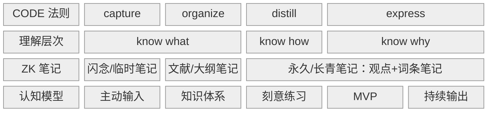
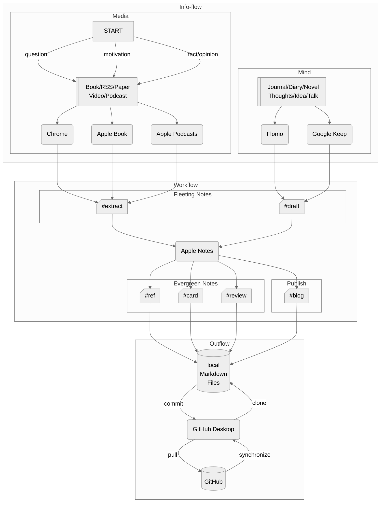
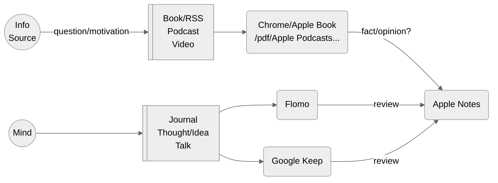
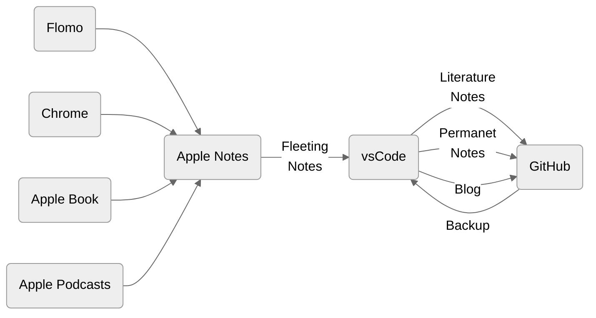
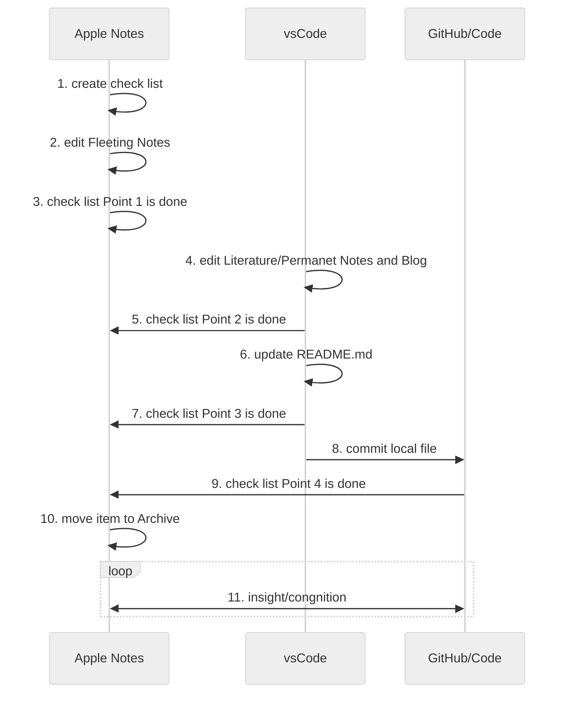

```mermaid
%%{init: {'theme':'neutral'}}%%
block-beta
  columns 6
    A0["CODE 法则"] capture organize distill express:2
    A1["理解层次"] a["know what"]:2 b["know how"] c["know why"]:2
    A2["ZK 笔记"] 闪念/临时笔记 文献/大纲笔记 永久/长青笔记：观点+词条笔记:3
    A3["认知模型"] 主动输入 知识体系 刻意练习 MVP 持续输出
```

```mermaid
%%{init:{'theme':'neutral'}}%%
flowchart TD
    %%Source:
    L1@{ shape: lin-rect, label: "Journal/Diary/Novel </br> Thoughts/Idea/Talk" }
    L2@{ shape: lin-rect, label: "Book/RSS/Paper </br> Video/Podcast" }
    %%T1x: Mind
    T11(Flomo)
    T12(Google Keep)
    %%T2x: Infosource
    T21(Chrome)
    T22(Apple Book)
    T23(Apple Podcasts)
    %%T24(Zotero)
    %%T25(PegBoard?)

    subgraph 1[Info-flow]
        subgraph Mind
        L1 --> T11 & T12
        end
        subgraph Media
        START:::hidden --> |question|L2
        START:::hidden --> |motivation|L2
        START:::hidden --> |fact/opinion|L2
        L2 --> T21 & T22 & T23
        end
    end
    
    subgraph 2[Workflow]
        T(Apple Notes)
        subgraph FN[Fleeting Notes]
        tag1@{ shape: notch-rect, label: "#extract"}
        tag2@{ shape: notch-rect, label: "#draft" }
        end
        %%subgraph Prog[Progressive Reading]
            %%subgraph LN[Literature Notes]

            %%end        
            subgraph EN[Evergreen Notes]
            tag3@{ shape: notch-rect, label: "#ref"}
            tag4@{ shape: notch-rect, label: "#card"}
            tag5@{ shape: notch-rect, label: "#review"}
            end
        %%end
        subgraph Blog[Publish]
            %%subgraph Publish[Publish]
        tag6@{ shape: notch-rect, label: "#blog"}
            %%end
        end
    %% Fleeting Notes
    T11 & T12 --> tag2
    T21 & T22 & T23 --> tag1
    tag1 & tag2 --> T

    %%T --> LN & EN & Publish
    T --> tag3 & tag4 & tag5 & tag6
    end

    subgraph 3 [Outflow]
    %% vscode & GitHub
    vsCode@{ shape: db, label: "local </br> Markdown </br> Files"}
    GitHub@{ shape: db, label: "GitHub"}
    GD(GitHub Desktop)
    vsCode --> |commit|GD
    GD --> |pull|GitHub
    GitHub --> |synchronize|GD
    GD --> |clone|vsCode
    end
    tag3 & tag4 & tag5 & tag6 --> vsCode
```

```mermaid
%%{init: {'theme':'neutral'}}%%
flowchart LR
  %% N: Notes
  %% S: Source
  %% T: Tool
  %% L: Layer
  L01((Mind))
  L02((Info </br> Source))
  S01@{ shape: lin-rect, label: "Journal </br> Thought/Idea </br> Talk" }
  S02@{ shape: lin-rect, label: "Book/RSS </br> Podcast </br> Video" }
  T01(Flomo)
  T02(Apple Notes)
  T03(Google Keep)
  T09(Chrome/Apple Book </br> /pdf/Apple Podcasts...)
  
  L01 --> S01
  L02 --> |question/motivation|S02
  S01 --> T01 & T03
  S02 --> T09 --> |fact/opinion?|T02 
  T01 & T03 --> |review|T02 

```

```mermaid
%%{init: {'theme':'neutral'}}%%
flowchart LR
  AN(Apple Notes)
  AP(Apple Podcasts)
  AB(Apple Book)
  Flomo(Flomo)
  Chrome(Chrome)
  %%Z(Zotero)
  vs(vsCode)
  gh(GitHub)

  Flomo --> AN
  Chrome --> AN
  AB --> AN
  AP --> AN
  %%Z -.-> vs
  AN --> |Fleeting </br> Notes|vs --> |Literature </br> Notes| gh
  vs --> |Permanet </br> Notes| gh
  vs --> |Blog| gh
  gh --> |Backup|vs

```

```mermaid
%%{init: {'theme':'neutral'}}%%
sequenceDiagram
  Apple Notes ->> Apple Notes: 1. create check list
  Apple Notes ->> Apple Notes: 2. edit Fleeting Notes
  Apple Notes ->> Apple Notes: 3. check list Point 1 is done
  vsCode ->> vsCode: 4. edit Literature/Permanet Notes and Blog
  vsCode ->> Apple Notes: 5. check list Point 2 is done
  vsCode ->> vsCode: 6. update README.md
  vsCode ->> Apple Notes: 7. check list Point 3 is done
  vsCode ->> GitHub/Code: 8. commit local file
  GitHub/Code ->> Apple Notes: 9. check list Point 4 is done
  Apple Notes ->> Apple Notes: 10. move item to Archive
  loop
    Apple Notes <<->> GitHub/Code: 11. insight/congnition
  end

    
```

