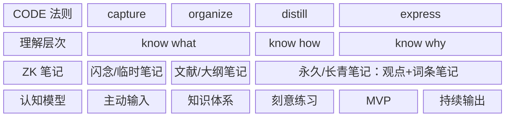
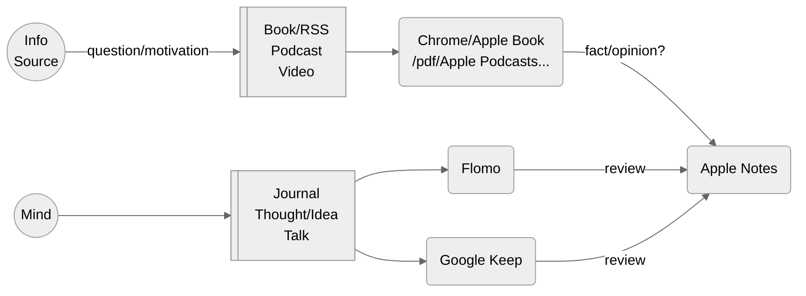
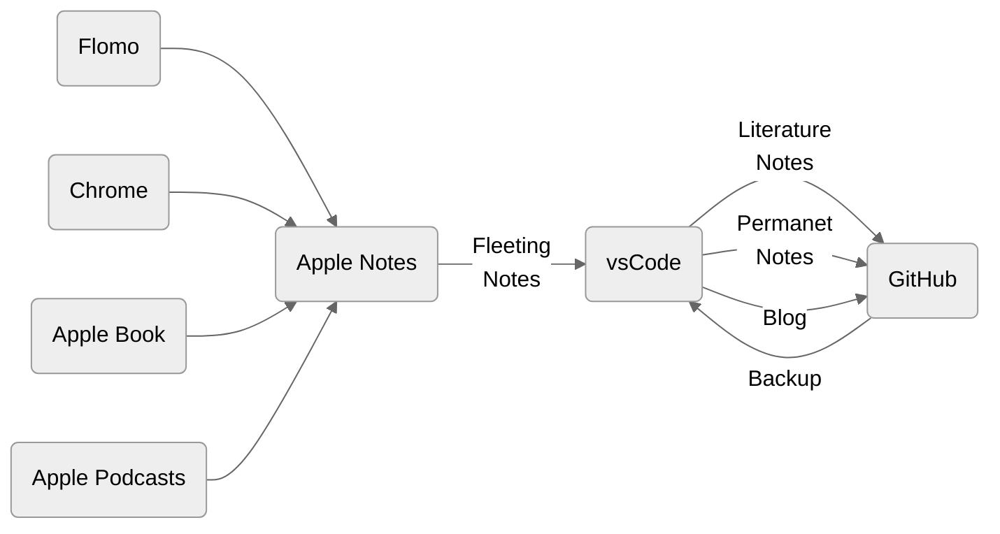
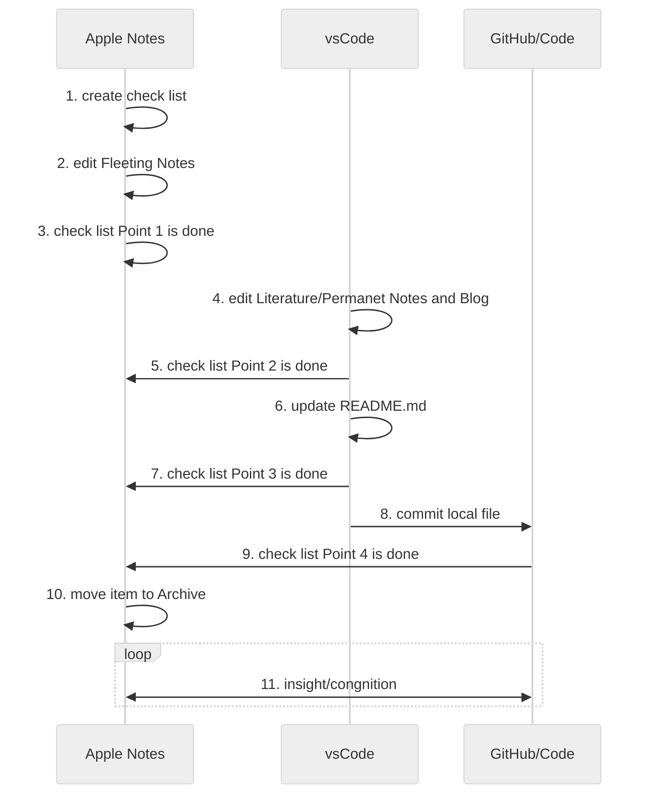

```mermaid
%%{init: {'theme':''}}%%
block-beta
  columns 6
    A0["CODE 法则"] capture organize distill express:2
    A1["理解层次"] a["know what"]:2 b["know how"] c["know why"]:2
    A2["ZK 笔记"] 闪念/临时笔记 文献/大纲笔记 永久/长青笔记：观点+词条笔记:3
    A3["认知模型"] 主动输入 知识体系 刻意练习 MVP 持续输出
```

```mermaid
%%{init: {'theme':'neutral'}}%%
flowchart LR
  %% N: Notes
  %% S: Source
  %% T: Tool
  %% L: Layer
  L01((Mind))
  L02((Info </br> Source))
  S01@{ shape: lin-rect, label: "Journal </br> Thought/Idea </br> Talk" }
  S02@{ shape: lin-rect, label: "Book/RSS </br> Podcast </br> Video" }
  T01(Flomo)
  T02(Apple Notes)
  T03(Google Keep)
  T09(Chrome/Apple Book </br> /pdf/Apple Podcasts...)
  
  L01 --> S01
  L02 --> |question/motivation|S02
  S01 --> T01 & T03
  S02 --> T09 --> |fact/opinion?|T02 
  T01 & T03 --> |review|T02 

```

```mermaid
%%{init: {'theme':'neutral'}}%%
flowchart LR
  AN(Apple Notes)
  AP(Apple Podcasts)
  AB(Apple Book)
  Flomo(Flomo)
  Chrome(Chrome)
  %%Z(Zotero)
  vs(vsCode)
  gh(GitHub)

  Flomo --> AN
  Chrome --> AN
  AB --> AN
  AP --> AN
  %%Z -.-> vs
  AN --> |Fleeting </br> Notes|vs --> |Literature </br> Notes| gh
  vs --> |Permanet </br> Notes| gh
  vs --> |Blog| gh
  gh --> |Backup|vs

```

```mermaid
%%{init: {'theme':'neutral'}}%%
sequenceDiagram
  Apple Notes ->> Apple Notes: 1. create check list
  Apple Notes ->> Apple Notes: 2. edit Fleeting Notes
  Apple Notes ->> Apple Notes: 3. check list Point 1 is done
  vsCode ->> vsCode: 4. edit Literature/Permanet Notes and Blog
  vsCode ->> Apple Notes: 5. check list Point 2 is done
  vsCode ->> vsCode: 6. update README.md
  vsCode ->> Apple Notes: 7. check list Point 3 is done
  vsCode ->> GitHub/Code: 8. commit local file
  GitHub/Code ->> Apple Notes: 9. check list Point 4 is done
  Apple Notes ->> Apple Notes: 10. move item to Archive
  loop
    Apple Notes <<->> GitHub/Code: 11. insight/congnition
  end

    
```

