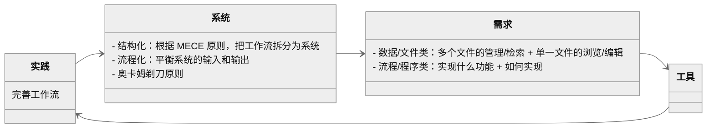

## Question

如何降低折腾工具的成本

## Statement

通过实践 $\rightarrow$ 系统  $\rightarrow$  需求  $\rightarrow$  工具  $\rightarrow$  实践的循环构建工作流。

## Argument

---
---

## 实践 → 系统：系统性思维看待工作流

作者认为，工具不应被视为孤立存在，而应成为某个系统的一部分​。为此，需要培养工具的系统意识。那么，如何才能做到系统化的选择工具，作者给出了两点建议：
• 结构化 
• 流程化

结构的意思是，每一个工具应该要满足其独特的需求。

流程化的意思是，输入和输出要做到平衡。对于知识管理而言，输入对应阅读，输出对应写作。如果工作流出现问题，很有可能是输入和输出之间失衡，或者理解为思考与行动之间的失衡。为此，要找到合适的处理顺序。

结构化 + 流程化，未来可以进一步实现标准化 + 自动化，并不断迭代优化，使其更加完善。

根据奥卡姆剃刀原理「​如无必要，勿增实体​」，考虑两点：
• 是不是可以让别人来做
• 是不是可以在已有系统上加工

## 系统 → 需求：在工作流中，有不同类型的需求

在 PKM-构建工作流-认知篇 中已经提到认清需求的重要性。那么如何才能选择满足自己需求的工具？作者认为，要把工作流拆解开来，使每个子工作流做到「高内聚、低耦合」，即相互独立但又紧密相关。然后根据子工作流的需求选择工具。需求分为两种：

- 数据/文件类
  - 管理：提供恰当的视图来浏览文件列表，提供文件的组织和检索功能
  - 浏览：对单一文件的浏览
  - 编辑：对单一文件的创建/修改
- 程序/流程类

数据/文件类最重要的需求是管理。传统的文件夹管理让文件只能放在单一目录。库管理工具加入了元数据管理，让检索更灵活。作者给出了几个常用的工具：

|             |     管理                          |     编辑                   |     浏览                   |
|-------------|-----------------------------------|----------------------------|----------------------------|
|     图书    |     calibre                       |     Sigil                  |     多看阅读               |
|     音乐    |     Foobar、Roon                  |     XLD                    |     Symfonium、椒盐音乐    |
|     论文    |     Zotero、JabRef                |     Adobe   Acrobat Pro    |     PDF   Expert           |
|     电影    |     tinyMediaManager、Jellyfin    |     ffmpeg                 |     PotPlayer、mpv         |
|     图片    |     Eagle、Picsee                 |     Photoshop              |     Irfanview、XnView      |

程序/流程类的需求最好使用代码实现。作者认为，一个基本的逻辑可以是「If This Then Trigger That」。This 代表 What，即实现哪些功能；That 代表 How，即如何调用这些功能。

文件和流程类的需求并非泾渭分明。作者之所以分出这两种需求，是因为这种分类可以帮助我们更好的理解工具的应用逻辑。比如，把 zotero 和 pdf expert 比较，就相当于把管理工具和浏览工具作比较，这样只会增加管理工具的复杂性。

