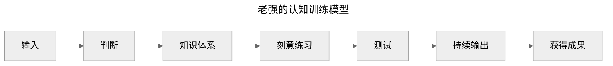

## Question

很多人在建立知识体系后却不使用知识，久而久之就会遗忘。那么应该如何建立模型，进而提升认知？

## Statement

## Argument

前三步为**获取知识**:
>You are what you read/watch/think

* 减少被动输入
* 选择主动输入
* <mark>判断信息的来源是观点还是事实</mark>[^批注1]
* up 主并没有对知识体系做过多说明

后四步为**转为认知**，通过 MVP 学以致用，并最终不断给自己带来复利:

* 刻意练习：如何把知识转化为认知/思维习惯
  * 建立模型
  * 刻意练习
  * 及时反馈
* <mark>MVP：让认知带来复利的最小成本</mark>[^批注2]
* 持续输出/获得成果
  * 人生的商业模式：把自己当作一家公司运营
  * <mark>能力 X 效率 X 杠杆</mark>[^批注3]

## Conclusion

作者认为：

* 带着批判性思维去主动输入信息
* 刻意训练和 MVP 提供给我们一个使用知识的机会，通过反馈让我们更好地：
  * 加深知识的理解
  * 明确未来的目标
  * 了解自身的不足

[^批注1]: i.e. 批判性思维
[^批注2]: i.e. 创业成本
[^批注3]: 这个观点在《纳瓦尔宝典》中也提到过
