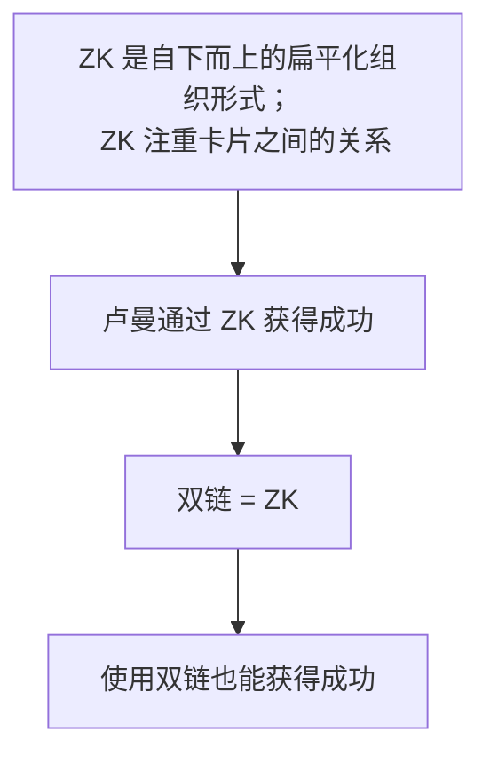

## Source

## Question

双链笔记/卡片盒笔记法 (Zettelkasten) 真的可以提高生产力吗？

## Statement

尽管传统的层级结构笔记有诸多痛点，双链简化了笔记之间建立关联的过程，但是不要一味地迷信双链，因为这会让使用者忽略主动思考的过程。任凭双链自由生长只能带来一团乱麻。只有经过思考，才能设计出适合自己的系统结构。

## Argument

大部分吹捧双链的文章/视频的逻辑如下：

作者认为这样的逻辑是存在缺陷的：

1. 在使用扁平化的、以输出为导向的卡片之前，卢曼的第一个卡片盒是自上而下的、更偏向传统结构的层级形式。这是否说明只有经过一定系统学习的积累才能转为输出？
2. 卢曼每写一张卡片都要对其编号，编号的过程对应层级结构的分类
3. 卢曼写完卡片后还会阅读与之关联的其他卡片，这似乎对应了双链功能。然而，双链只体现了引用和被引用的关系，笔记之间是同级关系，无法突出核心笔记

## Conclusion

做笔记的目的用十二字概括为：

- 用得着
- 想得起
- 找得到
- 记得住

不管是层级化还是扁平化的结构，我们首先要明确的是记笔记的目的，不要过多纠结于形式。然后理清自身需求，设计最小可用系统 (Minimum Viable Product)，最后再不断迭代优化。

---
---
## 传统笔记的缺陷

传统笔记的层级结构有几大缺陷：
	• 只能按照一种方法分类，很难实现 MECE 原则
	• 不方便检索查找
	• 不利于发现笔记之间的联系
	

## 卡片盒笔记法真的有用吗

作者指出，大部分文章的逻辑链条为：

a. 卢曼自下而上地生成卡片 → b. 卢曼重视在笔记之间建立联系 → c. 现在的双向链接就是卢曼卡片盒笔记法的软件实现 → d. 得益于卡片盒笔记法，卢曼从公务员成为德国当代重要的社会学家，因此这种扁平化的组织形式是十分有效的。

然而这样的逻辑链是值得商榷的。

首先，a 和 d 的有效性不足。在以输出为导向的、没有严格层级划分的第二个卡片盒笔记法之前，卢曼还有一个预置了树形结构的、更贴近传统笔记的卡片盒。那么，第二个是否是第一个的升级版？作者认为，只有经过系统的学习之后，才能从积累转为输出。

其次，b → c 和 c → d 的逻辑也有问题。卢曼的卡片盒笔记法有两个流程：
	1. 给卡片编号
	2. 编号之后重新阅读邻近卡片的内容，增强联系
在思考给卡片编号的过程其实就对应了层级结构的分类。双链快捷的编码功能让使用者缺少了人工思考阅读的过程。因此双链并不能全面的反映卡片盒笔记法。

## 双链的缺陷
1. 并非所有类型的笔记都适合双链。比如菜谱、会议纪要等笔记之间本身就不会产生太多关联
2. 过分信任无层级的网络结构，会让双链无序生长，最终形成的神经网络是一团乱麻
3. 本质上，双链描述的是笔记之间引用和被引用的关系。二者之间只有关系而缺少关联度。这会让笔记之间是只能是同级关系，无法像层级结构那样突出核心笔记。

## 重新思考笔记

不论是自上而下的层级（标签/目录），还是自下而上的双链，其目的都是尽可能消除笔记内容和搜索的不确定性。消除不确定性的信息必定是带有结构性的。结构绝对不会自发生长出来，而是经过思考设计出来的。
