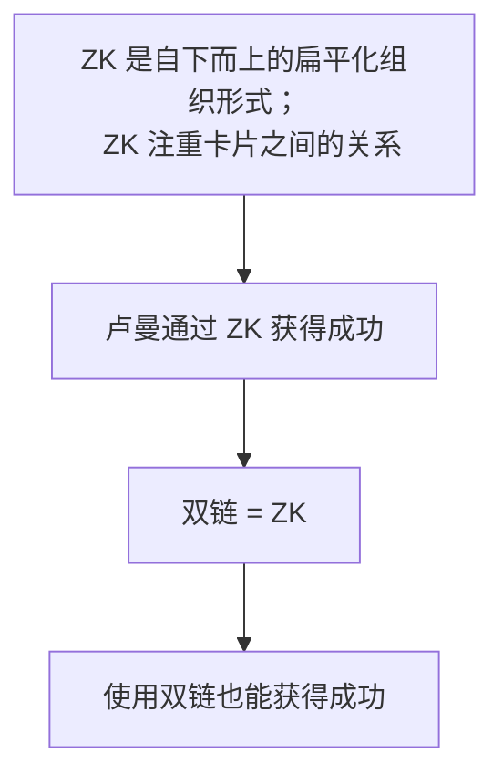

## Source

[请不要神化双链笔记](https://sspai.com/post/65273)

## Question

双链笔记/卡片盒笔记法 (Zettelkasten) 真的可以提高生产力吗？

## Statement

尽管传统的层级结构笔记有诸多痛点，双链简化了笔记之间建立关联的过程，但是不要一味地迷信双链，因为这会让使用者忽略主动思考的过程。任凭双链自由生长只能带来一团乱麻。只有经过思考，才能设计出适合自己的系统结构。

## Argument

大部分吹捧双链的文章/视频的逻辑如下：

作者认为这样的逻辑是存在缺陷的：

1. 在使用扁平化的、以输出为导向的卡片之前，卢曼的第一个卡片盒是自上而下的、更偏向传统结构的层级形式。这是否说明只有经过一定系统学习的积累才能转为输出？
2. 卢曼每写一张卡片都要对其编号，编号的过程对应层级结构的分类
3. 卢曼写完卡片后还会阅读与之关联的其他卡片，这似乎对应了双链功能。然而，双链只体现了引用和被引用的关系，笔记之间是同级关系，无法突出核心笔记

## Conclusion

做笔记的目的用十二字概括为：

- 用得着
- 想得起
- 找得到
- 记得住

不管是层级化还是扁平化的结构，我们首先要明确的是记笔记的目的，不要过多纠结于形式。然后理清自身需求，设计最小可用系统 (Minimum Viable Product)，最后再不断迭代优化。
