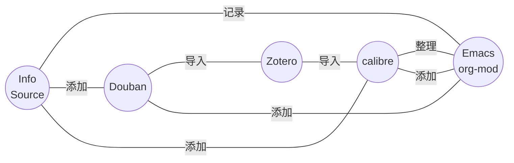

## Source

## Question

## Statement

## Argument

## Conclusion

---
---

## 引言

作者将从以下几个方面介绍他的阅读系统方案：
	• 如何发现、挑选书籍
	• 如何管理想读的和已读的书
	• 如何设计年度阅读计划
	• 如何阅读
	• 如何把阅读所得切实运用
作者的方案具有以下特点：
	• 全流程 + 数字化 + 自动化
	• 没有订阅制软件
	• 文件没有专有格式
	• 管理书目的「首」 (calibre) 和管理笔记的「尾」 (emacs) 应该是挂平台 + 开源
作者的工作流参考了 GTD 思想：
	1. 收集：认知层面如何确定待读书籍，工具层面如何将所有待读书籍统一收集到一处（重点！！！）
	2. 处理：未读书库是什么？为什么需要它？如何管理它？
	3. 计划：如何围绕个人的关注点，设计主题书单，制定年度读书计划。
	4. 执行：书籍格式和阅读工具的选择，以及一些帮助我保持阅读的习惯。
	5. 回顾：怎么做读书笔记。
	6. 输出：怎样把阅读阅读所得切实运用起来。

## 收集

认知层面：作者认为，与书交流是比与人交流更为方便经济的认识自我的方式。那么，如何找到适合自己的书籍：
	• 去（独立）书店翻找真实的书籍
	• 他人推荐
	• 自己的兴趣：从一个节点出发，跟随自己的兴趣，总会抵达某处。回头再看来时寻找的路，都是每个人独有的经验，而非弯路
	• 积累、维护自己关于阅读的信息渠道：同一作者/同一系列/好的书评人主页

工具层面：把所有感兴趣的书收归一处。
- 有灵活的添加方式：可以从图书资源添加、根据 ISBN 添加，也可以批量添加；
- 对数据有完全的自主权，不用担心一些书籍没有收录或者被下架，也可以自定义新的字段辅助管理。所有字段可以自行修改，不用担心无法修改「读过」的时间；
- 可以批量下载图书元数据，减少人工工作量；
- 有良好的图书资源管理机制：如果图书书目和资源分开管理，将使得维护成本大幅提高；
- 有强大的数据组织能力：可以方便地查看封面、标题、作者等各种信息，可以自定义栏目并进行多维度筛选，可以设置层级标签；
- 书目能够导出，可以与笔记系统打通。

作者给出了他的收集工作流：

## 处理

处理的内核：明确书的类型（分类），以及将来在何时会用到，定期整理书库

## 计划

首先，作者阐述了制定年度阅读计划的重要性：
- 有助于构建个人知识框架
- 安排合适的阅读顺序才能更好地理解一些书籍
- 养成良好的阅读习惯

其次，作者解释了如何制作阅读计划：
1. 明确自己希望了解的主题
  a. 长期关注的领域是否存在一些需要深度探究的方向
  b. 近期的困惑/关注点
2. 针对主题设置书单
3. 选取一些主题之外的书籍阅读，避免信息茧房和培养更多元、立体的思考
4. 如果书单过长，也要适当删减，原则为：
  a. 保证广度
		
	

## 执行

## 输出

