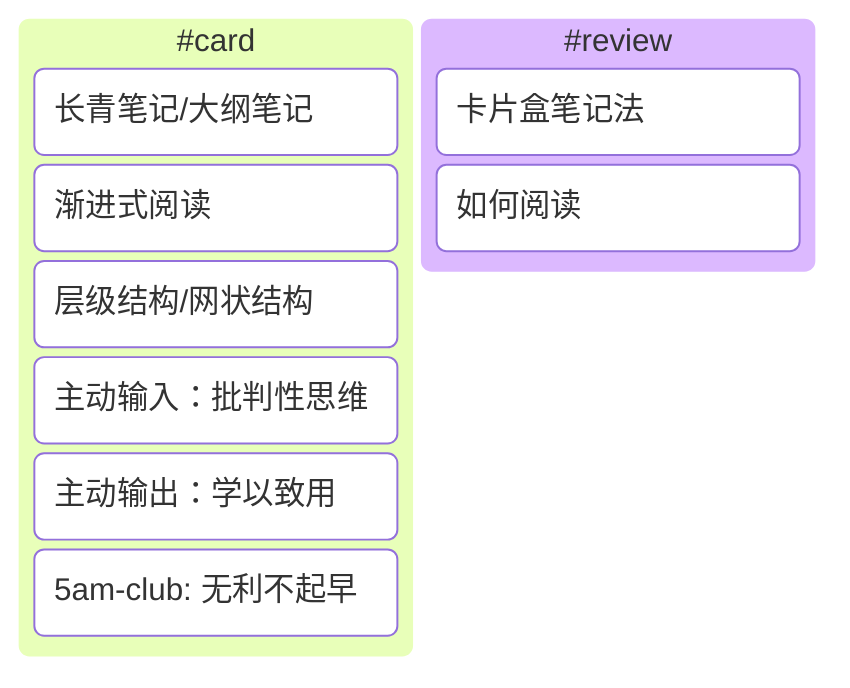

## #PKM

基本概念和大纲笔记：



框架：

```mermaid
%%{init:{'theme': ''}}%%
flowchart TD
    确定目标@{ shape: stadium, label: "1.确定目标" }
    subgraph 1[4.学以致用]
    刻意练习@{ shape: stadium, label: "刻意练习 + MVP" }
    %%MVP@{ shape: stadium, label: "MVP" }
    end
    subgraph 2[2.主动输入]
    批判性思维@{ shape: stadium, label: "无利不起早 + 批判性思维" }
    %%无利不起早@{ shape: stadium, label: "无利不起早" }
    end
    subgraph 3[3.知识体系]
    长青笔记@{ shape: procs, label: "长青笔记" }
    大纲笔记@{ shape: procs, label: "大纲笔记" }
    临时笔记@{ shape: procs, label: "临时笔记" }
    direction LR
        %%长青笔记 --> 大纲笔记
        %%大纲笔记 --> 长青笔记
        subgraph 4[层级结构]
        长青笔记
        end
        %%大纲笔记 --> 临时笔记
        %%临时笔记 --> 大纲笔记
        subgraph 5[网状结构]
        临时笔记
        end
    %%临时笔记 --> |渐进式阅读|长青笔记
    4 --> 大纲笔记 --> 5
    5 --> 大纲笔记 --> 4
    5 --> |渐进式阅读|4

    end
确定目标 --> 2 --> 3 --> 1
````

---

- [ ] [blog-我的知识管理-工具篇](/docs/PKM-blog-我的知识管理-工具篇.md)
- [ ] [blog-我的知识管理-认知篇](/docs/PKM-blog-我的知识管理-认知篇.md)
- [x] [blog-我的知识管理-笔记篇](/docs/PKM-blog-我的知识管理-笔记篇.md)

---

- [x] [card-渐进式阅读](/docs/PKM-card-渐进式阅读.md)
- [x] [card-5am-project](/docs/PKM-card-5am-project.md)
- [ ] [review-卡片盒笔记法](/docs/PKM-review-卡片盒笔记法.md)
- [ ] [review-如何阅读](/docs/PKM-review-如何阅读.md)
  
---

- [ ] [ref-打造个人工作流-系统篇](/docs/PKM-ref-打造个人工作流-系统篇.md)
- [x] [ref-打造个人工作流-认知篇](/docs/PKM-ref-打造个人工作流-认知篇.md)
- [x] [ref-三种卡片类型](/docs/PKM-ref-三种卡片类型.md)
- [x] [ref-把阅读作为方法：从选书到笔记的经验分享](/docs/PKM-ref-把阅读作为方法：从选书到笔记的经验分享.md)
- [x] [ref-极简三步-我的个人知识管理工作流-少数派](/docs/PKM-ref-极简三步-我的个人知识管理工作流-少数派.md)
- [x] [ref-不要神话双链笔记](/docs/PKM-ref-请不要神化双链笔记-少数派.md)
- [x] [ref-认知模型](/docs/PKM-ref-认知模型.md)
- [x] [ref-巧用分类法解决使用卡片笔记时遇到的困境](/docs/PKM-ref-巧用分类法解决使用卡片笔记时遇到的困境-少数派.md)

## #SS

- [x] [card-血酬定律-潜规则-吴思访谈](/docs/SS-card-血酬定律-潜规则-吴思访谈.md)

## #Thoughts

- [x] [blog-强风吹拂](/docs/Thoughts-blog-「强风吹拂」-何谓强大.md)
