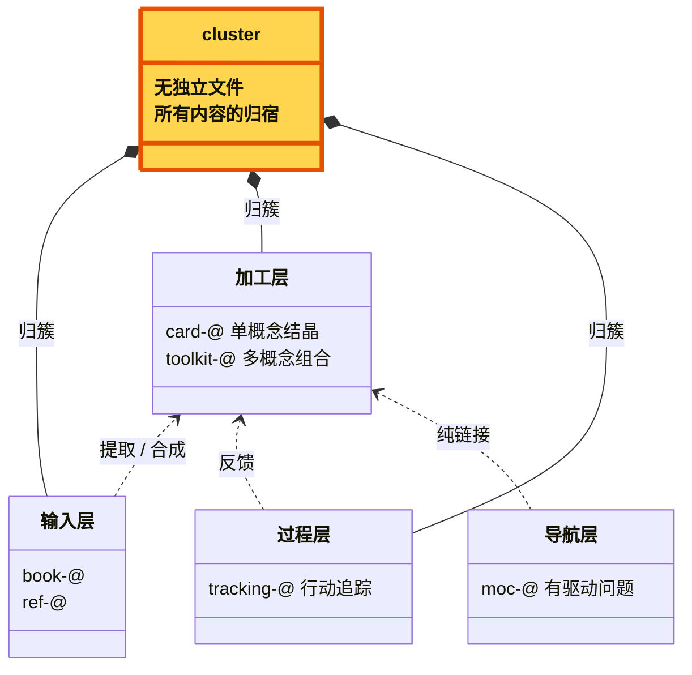
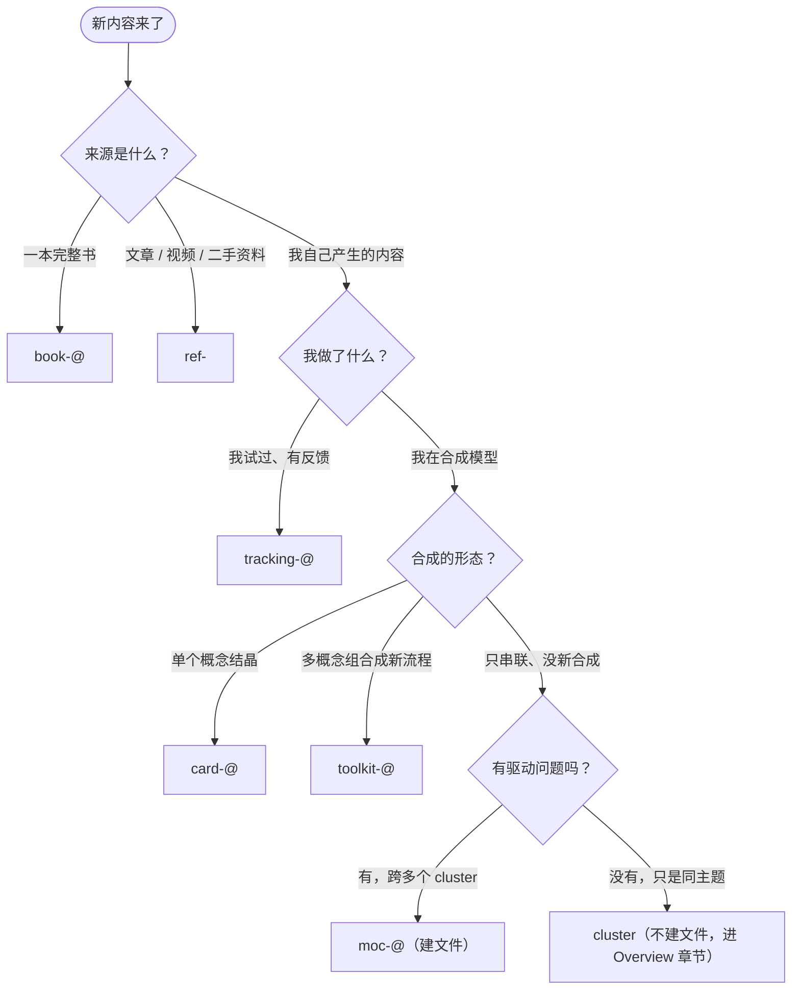

# _Aleph 笔记知识库

一个基于 Typora + Git 的个人知识管理（PKM）库，遵循「输入 → 加工 → 输出」三层结构

---

## 一、文件夹结构

```
_Aleph/
├── README.md
├── docs/                       # 笔记主体（加工层）
│   ├── _models.md              # 模型清单与实践映射（现阶段理解，非权威）
│   ├── _overview.md            # 知识库总索引（cluster + moc + 待挖矿）
│   ├── _inbox.md               # 待处理收件箱（打开就写）
│   ├── book-@*.md              # 读书笔记（输入）
│   ├── ref-*.md                # 外部参考摘要（输入）
│   ├── toolkit-@*.md           # 多模型合成的可用工具
│   ├── card-@*.md              # 单概念结晶（知识最小单元）
│   ├── tracking-@*.md          # 行动 / 状态追踪
│   ├── movie-@*.md             # 观影笔记
│   ├── moc-@*.md               # 问题导航地图
│   ├── !q-*.md                 # 认知摩擦 / 开放问题（"！" 标记主动认知，置顶）
│   └── !h-*.md                 # 阶段性假设（"！" 标记主动认知，置顶）
│
├── raw/                        # 原始素材（输入层）
│   ├── eBook/                  # 电子书（按 PKM 角色分类）
│   │   ├── 00-distilled/       # 已做笔记
│   │   ├── 01-model/           # 待提取模型
│   │   ├── 02-context/         # 背景通识
│   │   ├── 03-literature/      # 文学
│   │   └── 04-pending/         # 暂不处理
│   ├── lit/                    # 学术文献 PDF
│   └── ref/                    # PKM 参考文章 PDF
│
├── print/                      # 导出件（输出层，distill-note-*.docx 等）
├── image-hosting/              # 笔记内嵌图片
├── !template/                  # 笔记模板
├── copilot/                    # Copilot 对话与 Prompt
│
└── .claude/                    # Claude Code 配置
```

**核心约束**：`raw/eBook/00-distilled/` 与 `docs/book-@*.md` 一一对应——读完一本书写完笔记后，电子书从 `01-model/` 移入 `00-distilled/`，闭环完成

---

## 二、笔记分类体系

### 2.1 输入层（他人内容）

- `book-@`：读书笔记——「模型提取 + 概念框架」（作者的观点）
- `ref-`：外部参考——文章 / 视频 / 资料的方法与观点

### 2.2 加工层（合成产物）

- `toolkit-@`：多个模型/概念合成的**可用新工具**——能在具体场景"想用就拿出来用"
- `card-@`：单一概念的稳定结晶——知识的最小单元；含核心定义 + 一张可视化或对比 + ≥2 个 book/ref 链接

`toolkit-@` 与 `card-@` 的差别：toolkit 是**多概念合成**（如"贝叶斯+斯多葛+反思 = 行动前/中/后三层决策"）；card 是**单概念结晶**（如"精度操控三型：锁死/通胀/坍塌"）。

### 2.3 过程层（持续追踪）

- `tracking-@`：行动 / 状态 / 实践追踪——持续更新，**不依附某本书**（按书做容器是反模式，已废弃）
- `movie-@`：观影笔记

### 2.4 自我认知层（开放问题）

- `!q-`：当前真实存在的认知摩擦、问题或困惑（"！" 前缀让它在文件树最顶部，强调主动认知）
- `!h-`：基于一个或多个 `!q-` 形成的阶段性假设 / 解释 / 猜想

**核心规则**：

- `!q-` 与 `!h-` 不是线性升级关系，而是**循环关系**：`!q- → !h- → 新的 !q- → 修正 / 替换 !h-`
- `!h-` 只是暂时压缩问题的工作模型，**绝不代表问题已经得到解决**
- 命名规则：`!` 前缀 = 主动认知，需要持续回应；区别于 `_inbox / _models / _overview` 的 `_` 前缀（被动基础设施）

**何时建一条 `!q-`**（触发情境）：

- 一个问题让我反复回避 / 卡顿，需要借助 AI 才能勉强复述
- 文献里读到一个观点让我**不安 / 反感 / 不完全认同**，但说不清原因
- 同一个困惑在 2 篇以上笔记里冒过头，已经从 inbox 升级出来
- 最低门槛：能写出 1 句"锚点句" + 至少 1 组"张力"

**何时不建**（边界条件）：

- 问题查一下就有答案 → 不建，直接搜 / 链接到现成 card
- 问题已经在某个 card / toolkit 里有解 → 不建，引用它
- 仅仅是"暂时不知道"、还没卡过 → 留 `_inbox`，不升级
- 单纯想抒发 / 吐槽 → 不属于认知摩擦，留 inbox 或不写

**升级与归档**：

- `!q-` (status: seed) → 反复回访 + 形成临时假设 → 起 `!h-`
- `!q-` (status: stable) + 新证据 → 修改或推翻对应 `!h-`
- `!q-` 三个月没动 + 不再卡顿 → 归档到 `docs/archive/`

### 2.5 导航层（不是笔记，是地图）

- `moc-@`：问题导航地图（必须有驱动问题，参见 §三）
- `_overview.md`：知识库总索引（cluster + moc 全景）

### 2.6 全景图：三层结构与主要流转


```mermaid
classDiagram
    direction BT

    class 输入层 {
        book-@
        ref-@
    }
    class 加工层 {
        card-@ 单概念结晶
        toolkit-@ 多概念组合
    }
    class 过程层 {
        tracking-@ 行动追踪
    }
    class 导航层 {
        moc-@ 有驱动问题
    }
    class cluster:::hub {
        无独立文件
        所有内容的归宿
    }
    %%class Overview["_overview.md"]

    输入层 ..> 加工层 : 提取 / 合成
    过程层 ..> 加工层 : 反馈
    导航层 ..> 加工层 : 纯链接

    输入层 --* cluster : 归簇
    加工层 --* cluster : 归簇
    过程层 --* cluster : 归簇

    %%cluster --> Overview
    %%导航层 --> Overview

    classDef hub fill:#ffd54f,stroke:#e65100,stroke-width:4px,font-weight:bold
```

> 暂不纳入图中：`movie-@`（仅 1 篇，价值路径独立）、`!q-` / `!h-`（自我认知层的开放问题，循环关系 `!q- → !h- → 新 !q-`，与主流转独立运行）。

读图三件事：

1. **cluster 是中心**（黄色高亮，三条 `--*` composition 实线汇聚）——输入 / 加工 / 过程三层的内容笔记都"归簇"到这里，cluster 是知识库的引力中心。
2. **加工层是枢纽**（三条 `..>` dependency 虚线指向）——输入层提取到这里、过程层反馈到这里、导航层链接到这里。
3. **两条独立通路汇入 Overview**：cluster（物理归簇）和 moc（问题导航）是 `_overview.md` 的两张并列总览表。

---

## 三、cluster 与 moc

笔记的两种组织方式，**不在同一个轴上**：

- **cluster（簇）** = 静态聚类，回答"这些笔记讲的是同一类东西"。例：所有沟通类笔记是一个 cluster。cluster **没有独立文件**，只在 `_overview.md` 中以章节形式存在。
- **moc（Map of Content）** = 问题导航地图，回答"我从哪里进、走到哪里去"。一张 moc 必须有一个**驱动它存在的问题**。

判断要不要建 moc：

- ✅ 有一个反复出现、跨多个 cluster 的问题——例：`moc-@认知链路` 串了贝叶斯 / 自由能 / 多巴胺 / 基因，回答"人是怎么决策的"
- ❌ 只是把同主题笔记列出来——这是 cluster，不需要 moc 文件
- ❌ 状态追踪表（如 `moc-@健康` 的最后更新表）——这是 dashboard，不是导航

**默认姿势**：先有问题，再造 moc。cluster 只是物理归簇；moc 是被问题召唤出来的路径。

### `moc-@` vs `toolkit-@` 边界

容易混淆，差别抓一句话：

- `moc-@` 只**链接**——内容是"X 笔记讨论 Y" + 链接 + 上下文，没有新合成
- `toolkit-@` 是**合成产物**——把 N 个模型组合成 1 个可用的新工具流程

如果你写的内容**没有新合成**，只是串联和导航——那是 moc。如果你写的内容**有可使用的新工具流程**——那是 toolkit。

### 3.1 类型判定决策树

新内容来了不知道是哪种？走这张图：


```mermaid
flowchart TD
    start([新内容来了])
    start --> q1{"来源是什么？"}

    q1 -- "一本完整书" --> book["book-@"]
    q1 -- "文章 / 视频 / 二手资料" --> ref["ref-"]
    q1 -- "我自己产生的内容" --> q2

    q2{"我做了什么？"}
    q2 -- "我试过、有反馈" --> tracking["tracking-@"]
    q2 -- "我在合成模型" --> q3

    q3{"合成的形态？"}
    q3 -- "单个概念结晶" --> card["card-@"]
    q3 -- "多概念组合成新流程" --> toolkit["toolkit-@"]
    q3 -- "只串联、没新合成" --> q4

    q4{"有驱动问题吗？"}
    q4 -- "有，跨多个 cluster" --> moc["moc-@（建文件）"]
    q4 -- "没有，只是同主题" --> cluster["cluster（不建文件，进 Overview 章节）"]
```

> 未在图中：`movie-@` 走文学价值路径独立处理；`!q-` / `!h-` 是开放问题与阶段性假设的循环（详见 §2.4）。

每个分支正好处理一个易混边界：

- **q1**：`book` vs `ref` ——完整作品 vs 二手摘要
- **q2**：`tracking` vs 合成产物——有反馈 vs 在做合成
- **q3**：`card` vs `toolkit` vs `moc`——单概念结晶 / 多概念合成 / 只链接不合成
- **q4**：`moc` vs `cluster` ——有驱动问题就建文件，否则只在 Overview 列章节

---

## 四、统一字段结构

每条笔记建议包含以下字段：

- `title`：标题
- `type`：book / ref / tracking / toolkit / card / moc / movie / q（认知摩擦，文件前缀 `!q-`）/ h（阶段性假设，文件前缀 `!h-`）
- `coreConcepts`：本笔记的核心模型或关键词列表
- `source`：原始来源或书名 / 作者（toolkit / card 类填"提炼自哪条 tracking 或 book"）
- `appliedModels`：tracking 列出应用的模型；book/ref 列出可应用的模型
- `actionItems`：可直接落地的行动或实验
- `links`：关联笔记，如 `book-@...` / `ref-...` / `toolkit-@...` / `card-@...` / `tracking-@...`
- `comment`：当前状态、疑问、补充说明

