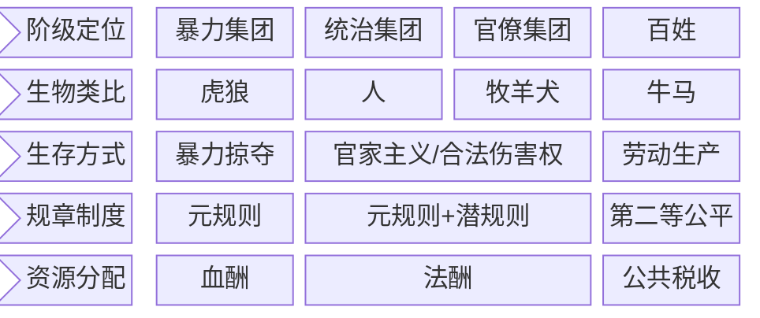

https://github.com/El25Aleph/_Aleph/issues/7

## 1. Glossary

### 1.1 血酬

- what
  - 通过暴力掠夺换取的酬劳
- why
  - 生产带来的财富小于暴力掠夺带来的财富
- how：
  - 暴力掠夺的强度/广度与血酬正相关
  - 与成本（道德/机会/财务）负相关

### 1.2 法酬

- what
  - 法酬 = 全部税收 - 公共税收 （维持社会基本运转 + 百姓基本生存所需要的资金）
  - 暴力集团变为统治集团后，制度化的血酬
- why
  - 统治集团和官僚集团追求利益最大化
- how
  - 皇室利用征税获得的财富
  - 官家利用潜规则/合法伤害权获得的财富

### 1.3 元规则

- what
  - 暴力最强者说了算
  - 各种规则的规则
- why
  - 追求自身利益的最大化
- how
  - 暴力竞争
  - 谁拥有让对手得不偿失的伤害能力，谁就拥有规则的否决权
- who
  - 暴力竞争的胜利者
  - 接受暴力集团统治的人

### 1.4 潜规则

- what
  - 潜规则是偏离元规则的、当事人实际遵守并执行的规则
  - 潜规则在明朝被称为「陋规」
- why
  - 元规则产生的收益不足以满足当事人的利益需求
  - 受到血酬定律约束，如果利益（法酬）分配不均，将招致暴力集团报复
- how
  - 当事人将元规则的代表屏蔽于局部互动之外
  - 将元规则的代表拉入私下交易之中
- who
  - 制定潜规则的人
  - 接受潜规则的人
  - 元规则的代表 

### 1.5 官家主义

官员利用职位/权力合法伤害同级/下级/百姓的权力

### 1.6 第二等公平

相对于绝对公平，第二等公平是在潜规则框架下实现的相对公平。可以理解为，拿人钱财，替人消灾

## 2. Relation

### 2.1 血酬定律 

暴力最强者制定元规则

血酬定律所描述的核心问题，就是生命与生存资源的交换。
血酬的价值是如何决定的？是由拼命争夺的对象的价值决定的

### 2.2 暴力集团与生产集团的均衡

