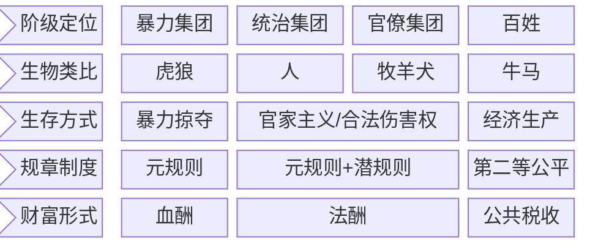

https://github.com/El25Aleph/_Aleph/issues/7

## 1. Glossary

### 1.1 血酬

- what
  - 通过暴力掠夺换取的酬劳
- why
  - 生产带来的财富小于暴力掠夺带来的财富
- how：
  - 暴力掠夺的强度/广度与血酬正相关
  - 与成本（道德/机会/财务）负相关

公共税收：维持社会基本运转 + 百姓基本生存所需要的资金

### 1.2 法酬

即不违反法规/制度的血酬。
1. 暴力集团变为统治阶级后，组件官僚集团，制定元规则（即法律/制度），按照一定比例向百姓征税，类似现在董事会的股东；
2. 在元规则之下还有一套满足各阶层利益的潜规则。官僚阶级打着元规则的旗号，实际按照潜规则做事。利用潜规则/合法伤害权获得的收益即为法酬

### 1.3 元规则

暴力竞争中的胜利者制定的规则，是各种规则的规则

### 1.4 潜规则

- what
  - xx
  - xx
- why
- how

偏离元规则但是被元规则束缚的，满足各个阶级利益的，官员实际奉为标准的规则

### 1.5 官家主义

官员利用职位/权力合法伤害同级/下级/百姓的权力

### 1.6 第二等公平

相对于绝对公平，第二等公平是在潜规则框架下实现的相对公平。可以理解为，拿人钱财，替人消灾

## 2. Relation

