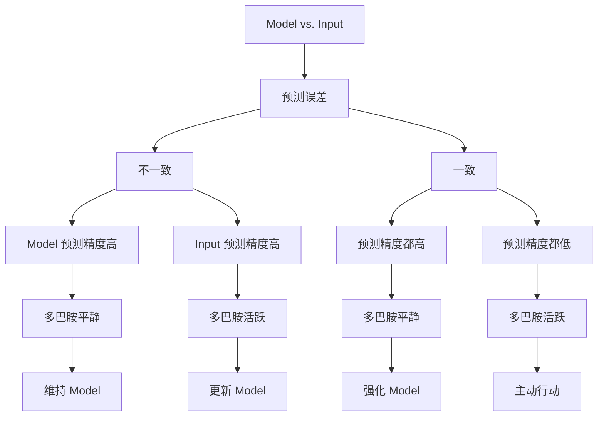

## 动机

本篇笔记要解决的问题是 (why): INTJ 在面对信息过载与不确定性时，如何避免陷入 Ni-Fi 以及 Ni-Ti 循环，以行动为导向进行理性决策？

本文结构 (how): 从感知层、认知层、决策层和行动层四个层面出发，以**非对称性**作为主干，寻找贝叶斯思维、多巴胺、认知模型、刻意练习以及荣格性格分析之间的关系。其中，重点强调了决策层和行动层这两个层面。

本文的核心思想 (what): 做决策并产生高精度行动的过程，就是利用：

1. 感知层——识别非对称的直觉信号
2. 认知层——建立非线性的抽象模型
3. 决策层——多巴胺公式（5 模型 +3 工具）定性分析得失利弊
4. 行动层——Te 工程化兑现 Ni 模型 

## 隐性假设前提

从以前的笔记中，我们已经知道：

- 大脑本质上就是一台预测机器，其运行模式与贝叶斯原理相似
- 大脑遵循自由能最小化原则
- 多巴胺负责调配预测精度
- 大脑先验模型对应快思考/系统1
- 大脑的主动和被动推理对应慢思考/系统2
- 神经元遵循用进废退的原则（livewired）
- 刻意练习就是重塑神经元的一种手段
- 荣格八维中，Ni 对应直觉/抽象模型；Te 对应主动行动

## 感知层：贝叶斯大脑 + 精度加权

这里有两个重要的概念：

- `预测误差`：指先验模型和外部（似然）输入的概率之差
- `预测精度`：指先验模型和外部（似然）输入的概率可信度

在自由能框架下，二者都会对决策产生影响：

- 预测误差：模型和输入，谁概率大就信谁
- 预测精度：问的是这个概率值的可信度有多少

所以在做决策时，不能只看预测误差，还要考虑预测精度的加权影响

我们不妨把经过精度加权的预测误差简称为 `PWPE` (precision-weighted prediction error)

紧接着就产生一个问题：本来估算模型和输入的概率这件事就够抽象了，现在你告诉我说，还要考虑预测精度？如果预测误差本身并不可信，那么是不是还存在三阶思维，需要找到“评判误差可信度的可信度”呢？这样套娃无穷无尽，到底应该怎么量化它呢？

在生物学中，`多巴胺`的处理对象就是 PWPE

我们没有必要去精细研究多巴胺的调配处理过程

归根结底，大脑可以用一种形式把多巴胺的计算结果感知出来——这就是荣格八维中的 `Ni 直觉`

每当直觉驱使我们去做或者不做某件事情时，背后都是多巴胺调配神经元的结果

下图展示了基于**PWPE X 多巴胺**的贝叶斯式模型更新：

> 注：这张图是「人做决策」的顺序（先看误差、再掂量精度），不是大脑的神经计算顺序——神经上精度是和误差**同时**给出的加权，不分先后。

可以看出，只有多巴胺活跃时，大脑才会调动系统 2 进行：

- 主动推理：对应行动层的主动行动
- 被动推理：对应认知层的认知更新

那么，什么时候多巴胺会活跃呢？

除了自由能最小化，大脑还有好奇心，它希望把未来的潜在收益贴现到当下的决策

可以说，大脑一直在做一笔经济账——如果收益（不论是当下的还是未来潜在的）高于成本，就会释放多巴胺，驱使人类产生行动

“收益高于成本”——这似乎是在讨论投入和产出的某种不对称

那么接下来，让我们先介绍几个非对称模型

## 认知层：5 大非对称模型

5 大非对称模型如下图所示：

先从静态/当下开始分析：

- `二八法则`告诉我们，要识别出非对称模型中的关键少数，这 20% 的关键变量可以产生 80% 的结果
- `长尾理论`告诉我们，剩下的 80% 并非全无价值，其中可能蕴含颠覆现有模型的潜在可能

再看动态/未来：

- `临界点思维`告诉我们，质变往往发生在某个临界点之后，在此之前所有的投入看起来都像是沉没成本；而我们要主动构建的，应该是“下行风险有限，上行收益无限”的非对称机会
- `复利效应`告诉我们，在临界点之后，任何微小的投入，产出都是巨大的

静态和动态之间是如何转化的呢？这就涉及到`二阶思维`：不仅要考虑当下，还要考虑未来

以上 5 个非对称模型，可以从 5 个不同的维度 cover 大部分多巴胺处理 PWPE 的场景

那么大脑在这些模型中做决策的依据是什么呢？

## 决策层：3 大底层逻辑 + PWPE 决策公式

先引入 3 大底层逻辑：

- `战略性懒惰`：对应大脑的自由能最小化原理，通过人为的设计环境，或者自动化流程，让行动的成本/阻力尽可能降低。不论是哪个非对称模型，我们总归要用最小的能耗，维持整个系统的运转
- `机会成本`：不论是哪种非对称模型，选择了 A，就放弃了 B/C/D, 它是每一个决策的背面/阴面/隐性框架
- `逆向思考`：当系统陷入僵局，使用逆向思考寻找突破口，打破思维定势；它和非对称模型并非直接相关

需要注意的是，这 3 大底层逻辑是全局式作用于非对称模型的，它们是“操作系统”，需要和非对称模型这种“核心引擎”区分开来

这 3 大底层逻辑 + 上一章提到的 5 大非对称模型，可以定性的分析决策的制定

之前说过：

> 大脑一直在做一笔经济账

其实这可以类比经济学中`边际效用`的概念：

- 边际收益 = 增加一单位投入所带来的额外收益
- 多巴胺的相位放电 = 采取一个行动所带来的预期价值的增量，且这个增量是相对于“什么都不做”或“做次优选项”的基线而言的

现在，我们就可以给出一个边际收益式的决策分析影响清单：

| 影响因素   | Items                           | 如何对应边际收益                        |
| ---------- | ------------------------------- | --------------------------------------- |
| 20/80 法则 | [+] 关键头部价值 × 信息增益     | 核心业务的边际产出                      |
| 长尾理论   | [+] 尾部探索价值 × 新颖性       | 探索性投入的潜在边际收益                |
| 复利效应   | [+] 远期累积价值的折现          | 经时间折现后的未来边际收益流            |
| 临界点思维 | [+] 非线性爆发潜力 × 拐点临近度 | 跨越临界点后的边际收益跃迁              |
| 二阶思维   | [-] 时间延迟的二阶负面后果      | 远端的、间接的边际负收益                |
| 战略性懒惰 | [-] 行动的组织/意志力成本       | 边际成本                                |
| 机会成本   | [-] 被放弃选项的最大价值        | 次优选择的边际收益                      |
| 逆向思考   | [-] 结构性风险与人因损耗        | 由于激励扭曲/人为错误导致的预期边际损失 |

## log

2026-07-12 

和女朋友讨论 2X2 矩阵时，发现自己无法用费曼式解释把这个概念讲清楚

2026-07-18 

和 deep seek 就贝叶斯思维、多巴胺、刻意练习、荣格 Ni-Te 轴等一系列概念进行深度交流，对话整理导出后，再次放到 notebooklm 中进行提炼，明确写作提纲

2026-07-19

开始成文，手动完成了行动层前的 5 章正文，就行动层一章和 deep seek 重新展开讨论，正文中的内容大都来自 deep seek 原文

## 代写声明（时间线）

- 2026-07-19：作者起草。感知 / 认知 / 决策三章是作者本人用自己的话写的（从 v2 里最熟又卡住的 PWPE↔贝叶斯切入）；原第四章「行动层」来自 DeepSeek，AI 味重。
- 2026-07-25：与 Claude 一起定身份——**这三章立为「Ni 理论我版本」核心**（[_todo](_todo.md) 主线 ① 的产物）。改动：删「预测精度＝二阶预测误差」半句；感知层图下加一句「决策者视角 ≠ 神经计算顺序」的注；**原「行动层」整章剥出**，暂存 [!DRAFT-行动层park](!DRAFT-行动层park.md)（逻辑顺序：!DRAFT Ni 理论 → [书接上回](书接上回-能力圈勘定.md) 能力圈 → 行动层 tracking）。
- **待作者自己处理**：① 上方「动机」段仍按四层写、仍留「行动层」那条，行动层已移走，待读薄时自调；② v2 的 6 条新产出（基因层 / 社会 / 外环境层等）+「感知层精度都低时除了行动会不会也搁置」→ 进 [_todo](_todo.md) §三 !q- 候选池；③ 文件名 !DRAFT 待定稿时改。