## 动机

本篇笔记要解决的问题是 (why): INTJ 在面对信息过载与不确定性时，如何避免陷入 Ni-Fi 以及 Ni-Ti 循环，以行动为导向进行理性决策？

本文结构 (how): 从感知层、认知层、决策层和行动层四个层面出发，以**非对称性**作为主干，寻找贝叶斯思维、多巴胺、认知模型、刻意练习以及荣格性格分析之间的关系。其中，重点强调了决策层和行动层这两个层面。

本文的核心思想 (what): 做决策并产生高精度行动的过程，就是利用：

1. 感知层——识别非对称的直觉信号
2. 认知层——建立非线性的抽象模型
3. 决策层——多巴胺公式（5 模型 +3 工具）定性分析得失利弊
4. 行动层——Te 工程化兑现 Ni 模型 

## 隐性假设前提

从以前的笔记中，我们已经知道：

- 大脑本质上就是一台预测机器，其运行模式与贝叶斯原理相似
- 大脑遵循自由能最小化原则
- 多巴胺负责调配预测精度
- 大脑先验模型对应快思考/系统1
- 大脑的主动和被动推理对应慢思考/系统2
- 神经元遵循用进废退的原则（livewired）
- 刻意练习就是重塑神经元的一种手段
- 荣格八维中，Ni 对应直觉/抽象模型；Te 对应主动行动

## 感知层：贝叶斯大脑 + 精度加权

这里有两个重要的概念：

- `预测误差`：指先验模型和外部（似然）输入的概率之差
- `预测精度`：指先验模型和外部（似然）输入的概率可信度

在自由能框架下，二者都会对决策产生影响：

- 预测误差：模型和输入，谁概率大就信谁
- 预测精度：相当于二阶的预测误差，问的是这个概率值的可信度有多少

所以在做决策时，不能只看预测误差，还要考虑预测精度的加权影响

我们不妨把经过精度加权的预测误差简称为 `PWPE` (precision-weighted prediction error)

紧接着就产生一个问题：本来估算模型和输入的概率这件事就够抽象了，现在你告诉我说，还要考虑预测精度？如果预测误差本身并不可信，那么是不是还存在三阶思维，需要找到“评判误差可信度的可信度”呢？这样套娃无穷无尽，到底应该怎么量化它呢？

在生物学中，`多巴胺`的处理对象就是 PWPE

我们没有必要去精细研究多巴胺的调配处理过程

归根结底，大脑可以用一种形式把多巴胺的计算结果感知出来——这就是荣格八维中的 `Ni 直觉`

每当直觉驱使我们去做或者不做某件事情时，背后都是多巴胺调配神经元的结果

下图展示了基于**PWPE X 多巴胺**的贝叶斯式模型更新：

```mermaid
flowchart TD
    A[Model vs. Input] --> B[预测误差]
    B--> C2[不一致] --> D3[Model 预测精度高] --> E3[多巴胺平静] --> F3[维持 Model]
    C2 --> D4[Input 预测精度高] --> E4[多巴胺活跃] --> F4[更新 Model]
    B--> C1[一致] --> D1[预测精度都高] --> E1[多巴胺平静] --> F1[强化 Model]
    C1 --> D2[预测精度都低] --> E2[多巴胺活跃] --> F2[主动行动]
```

可以看出，只有多巴胺活跃时，大脑才会调动系统 2 进行：

- 主动推理：对应行动层的主动行动
- 被动推理：对应认知层的认知更新

那么，什么时候多巴胺会活跃呢？

除了自由能最小化，大脑还有好奇心，它希望把未来的潜在收益贴现到当下的决策

可以说，大脑一直在做一笔经济账——如果收益（不论是当下的还是未来潜在的）高于成本，就会释放多巴胺，驱使人类产生行动

“收益高于成本”——这似乎是在讨论投入和产出的某种不对称

那么接下来，让我们先介绍几个非对称模型

## 认知层：5 大非对称模型

5 大非对称模型如下图所示：

先从静态/当下开始分析：

- `二八法则`告诉我们，要识别出非对称模型中的关键少数，这 20% 的关键变量可以产生 80% 的结果
- `长尾理论`告诉我们，剩下的 80% 并非全无价值，其中可能蕴含颠覆现有模型的潜在可能

再看动态/未来：

- `临界点思维`告诉我们，质变往往发生在某个临界点之后，在此之前所有的投入看起来都像是沉没成本；而我们要主动构建的，应该是“下行风险有限，上行收益无限”的非对称机会
- `复利效应`告诉我们，在临界点之后，任何微小的投入，产出都是巨大的

静态和动态之间是如何转化的呢？这就涉及到`二阶思维`：不仅要考虑当下，还要考虑未来

以上 5 个非对称模型，可以从 5 个不同的维度 cover 大部分多巴胺处理 PWPE 的场景

那么大脑在这些模型中做决策的依据是什么呢？

## 决策层：3 大底层逻辑 + PWPE 决策公式

先引入 3 大底层逻辑：

- `战略性懒惰`：对应大脑的自由能最小化原理，通过人为的设计环境，或者自动化流程，让行动的成本/阻力尽可能降低。不论是哪个非对称模型，我们总归要用最小的能耗，维持整个系统的运转
- `机会成本`：不论是哪种非对称模型，选择了 A，就放弃了 B/C/D, 它是每一个决策的背面/阴面/隐性框架
- `逆向思考`：当系统陷入僵局，使用逆向思考寻找突破口，打破思维定势；它和非对称模型并非直接相关

需要注意的是，这 3 大底层逻辑是全局式作用于非对称模型的，它们是“操作系统”，需要和非对称模型这种“核心引擎”区分开来

这 3 大底层逻辑 + 上一章提到的 5 大非对称模型，可以定性的分析决策的制定

之前说过：

> 大脑一直在做一笔经济账

其实这可以类比经济学中`边际效用`的概念：

- 边际收益 = 增加一单位投入所带来的额外收益
- 多巴胺的相位放电 = 采取一个行动所带来的预期价值的增量，且这个增量是相对于“什么都不做”或“做次优选项”的基线而言的

现在，我们就可以给出一个边际收益式的决策分析影响清单：

| 影响因素   | Items                           | 如何对应边际收益                        |
| ---------- | ------------------------------- | --------------------------------------- |
| 20/80 法则 | [+] 关键头部价值 × 信息增益     | 核心业务的边际产出                      |
| 长尾理论   | [+] 尾部探索价值 × 新颖性       | 探索性投入的潜在边际收益                |
| 复利效应   | [+] 远期累积价值的折现          | 经时间折现后的未来边际收益流            |
| 临界点思维 | [+] 非线性爆发潜力 × 拐点临近度 | 跨越临界点后的边际收益跃迁              |
| 二阶思维   | [-] 时间延迟的二阶负面后果      | 远端的、间接的边际负收益                |
| 战略性懒惰 | [-] 行动的组织/意志力成本       | 边际成本                                |
| 机会成本   | [-] 被放弃选项的最大价值        | 次优选择的边际收益                      |
| 逆向思考   | [-] 结构性风险与人因损耗        | 由于激励扭曲/人为错误导致的预期边际损失 |

## 行动层：Ni-Te 行动指南

通过前面三章的内容，基本已经把 Ni 建立起来了

接下来的问题是：如何实现 Ni-Te 循环，让这个 Ni 真正做到为我所用？

可以按照行动的前、中、后阶段给出三个清单：

| 阶段   | 为什么这么做             | 怎么做                                                       |
| ------ | ------------------------ | ------------------------------------------------------------ |
| 行动前 | 在直觉产生时，结构其来源 | 1. 记录直觉 2. `audit 直觉清单` 3. 把直觉转化为陈述性行动假设 |
| 行动中 | 记录实时的预测误差       | 1. `斯多葛式最小复盘记录` 2. 建立`反直觉事件备忘录`     |
| 行动后 | 复盘更新后验模型         | 1. `PWPE 决策公式逐项打分` 2. 对比行动前的假设，校准先验直觉精度 |

### 行动前

分为三步：

1. audit 5 个非对称 → 你的直觉正在呼应非对称性的哪个阶段，以及它看到了什么价值
2. audit 3 个元规则 → 检验你的直觉是否考虑了成本、代价和脆弱性，从而确保非对称性模型运行的稳定性
3. 行动假设：把你的直觉转化为一个清晰的、可被事实检验的陈述——**如果我做了[具体行动]，那么我预测会发生[可观察的结果]，这个结果将验证我的直觉主要来自[5+3 维度].**

5 个非对称 audit 清单如下：

| 直觉感受                                                     | 直觉诊断                                                     | 非对称模型 |
| ------------------------------------------------------------ | ------------------------------------------------------------ | ---------- |
| 是不是有一件事，虽然不大，但如果做了它，其他很多事都会变得容易或无关紧要？ | 直觉是否在告诉你，是不是某个东西的重要性被严重低估了？       | 二八法则   |
| 是不是有个选项，现在看似无用，但丢掉它我会隐隐不安，因为它可能在某种我无法预测的情境下变得至关重要？ | 直觉是否在告诉你，是不是某个东西的价值不在于现在用，而在于未来？ | 长尾理论   |
| 我是不是已经在这条路上走了一段时间，但还没看到明显回报？我的直觉是告诉我要放弃，还是继续？ | 现在的投入产出比很低，是因为错了，还是因为量变尚未引发质变？ | 临界点思维 |
| 如果我把这件事持续做三年，它会不会产生一种自己‘跑起来’的惯性？每次行动，是不是都在降低下一次行动的成本，或增加下一次行动的收益？ | 你的直觉是否在告诉你，这件事的价值不在于单次收益，而在于它能否自我增强？ | 复利效应   |
| 如果这件事做成了，它最可能引发的、非我本意的间接后果是什么？我的直觉是在兴奋于第一层，还是在担忧第二层？ | 你的直觉是否在提醒你，这个行动的直接结果之外，还有一层你不愿面对的连锁反应？ | 二阶思维   |

3 个全局元规则如下：

| 直觉感受                                                     | 直觉诊断                                                     | 元规则     |
| ------------------------------------------------------------ | ------------------------------------------------------------ | ---------- |
| 要达成这个目标，有没有一种更‘懒’的方式？我的直觉是选择了‘坚持努力’，还是选择了一个‘设置一次就自动运行’的系统？ | 你的直觉驱动你的方式，是在帮你省力，还是在让你上瘾于“努力的感觉”？ | 战略性懒惰 |
| 选了这条路，我最舍不得的是什么？我的直觉是闭着眼睛往前冲，还是清醒地掂量着那个被放弃的东西？ | 你的直觉在选择A的时候，是否让你清晰地感受到了B的代价？       | 机会成本   |
| 如果我的直觉是错的，我还没看到的，但是是最可能的证据是什么？如果我铁了心要让这个计划失败，我第一件会做的是什么？ | 你的直觉是否经得起一个简单的“反向测试”？                     | 逆向思维   |

### 行动中

分为两步：

1. 最小复盘单元记录：用最小的认知负荷，持续收集高精度的预测误差，调整预测精度权重，防止记忆扭曲/遗忘
2. 反直觉记录：那些让你的模型卡住/出错的瞬间，都是高价值的预测误差，是认知更新的种子

---

最小复盘记录的模板如下：

**问题1：这周的实际结果，和我上周的预期之间，有什么具体的、可观察的差距？**

- **记录原则（斯多葛式的客观）**：只记录行为和事实，不记录感受和评判。
  - ❌ 错误记录：“我这周表现太差了，什么都没做成。”（评判）
  - ✅ 正确记录：“上周计划写完的报告，只完成了引言部分。原计划的五次锻炼，实际完成了两次。”
- **目的**：为复盘提供高精度的、未被情绪污染的原始误差数据。

**问题2：这个差距，是一个高精度的“重要信号”，还是一个低精度的“随机噪音”？**

- **判断标准**：
  - 它是否重复了之前出现过的模式？（重复出现 → 信号）
  - 它是由明确的外部异常事件导致的吗？（单次偶发 → 可能噪音）
  - 换一个理性的人来看，他会觉得这个误差值得重视吗？（第三人称视角 → 增加客观性）
- **记录**：只需在误差旁边标记 `[信号]` 或 `[噪音]`。
- **目的**：训练你的精度分配系统，不浪费资源在随机波动上，也不放过真正的模式。

**问题3：基于这个信号，我下周需要调整什么？**

- **调整的类型**：
  - **调整行动**：改变做事的策略、方法或强度。
  - **调整模型**：改变我对某事概率或精度的判断（例如，“我原来以为这件事很快能完成，现在看来，我对‘完成时间’的先验精度设得太高了，我需要调低它”）。
  - **调整环境**：改变系统，让正确的事更容易发生（战略性懒惰的实时微调）。
- **记录**：写下一条具体的、可操作的“下周实验”。例如：“基于[信号X]，我下周将尝试[新方法Y]，并观察[结果Z]。”

---

反直觉记录的模板如下：

**记录时机**：

- 当结果与你预测的完全相反时。
- 当你感到“这不可能”“怎么会这样”“这没道理啊”的惊讶时。
- 当你的第一反应是抗拒、否认一个事实时。

**记录格式**：
每条记录包含四个要素：

1. **情境**：发生了什么具体事件？
   - *例：“在项目评审会上，我自认为最扎实的方案，被客户以‘没有创新性’为由直接否决。”*
2. **我原有的模型**：在此之前，我内心的什么信念或判断被颠覆了？
   - *例：“我以为‘扎实的执行细节’是客户最看重的价值。我把80%的精力都放在了这上面。”*
3. **现实是什么**：客观的、不带评判的事实是什么？（斯多葛式描述）
   - *例：“客户花了80%的时间询问和讨论一个我们在提案里一笔带过的、不成熟但有想象力的备选方案。”*
4. **模型的哪一部分需要更新**：这件事改变了我对哪个维度的精度判断？
   - *例：“我可能高估了‘二八法则’在创意型工作中的权重。在这个领域，‘长尾理论’中那个看似不靠谱的选项，可能才是高精度的信号。我需要调高‘尾部价值’在决策中的先验精度。”*

### 行动后

分为两步：

1. 给 PWPE 决策公式逐项打分
2. 校准直觉精度

| 公式项                        | 对应维度        | 我的评分 | 实际验证           |
| :---------------------------- | :-------------- | :------- | :----------------- |
| + 关键头部价值 × 信息增益     | 二八法则        |          | 这个聚焦对吗？     |
| + 尾部探索价值 × 新颖性       | 长尾理论        |          | 有隐藏的种子吗？   |
| + 远期累积价值的折现          | 复利效应        |          | 拐点到了吗？       |
| + 非线性爆发潜力 × 拐点临近度 | 临界点/非对称性 |          | 爆发兑现了吗？     |
| - 行动的组织/意志力成本       | 战略性懒惰      |          | 系统够省力吗？     |
| - 被放弃选项的最大价值        | 机会成本        |          | 放弃的代价是什么？ |
| - 结构性风险与人因损耗        | 逆向思维/激励   |          | 死法预防了吗？     |
| - 时间延迟的二阶负面后果      | 二阶思维        |          | 间接伤害出现了吗？ |

关于校准，具体的做法是：

1. 对比行动前和行动后，找出差距
2. 如果某个维度的 audit 总是出错，则在 Ni 模型中可以调低它的先验精度
3. 下次当我再有某种直觉时，我的直觉精度可能不高，需要交叉验证

## log

2026-07-12 

和女朋友讨论 2X2 矩阵时，发现自己无法用费曼式解释把这个概念讲清楚

2026-07-18 

和 deep seek 就贝叶斯思维、多巴胺、刻意练习、荣格 Ni-Te 轴等一系列概念进行深度交流，对话整理导出后，再次放到 notebooklm 中进行提炼，明确写作提纲

2026-07-19

开始成文，手动完成了行动层前的 5 章正文，就行动层一章和 deep seek 重新展开讨论，正文中的内容大都来自 deep seek 原文