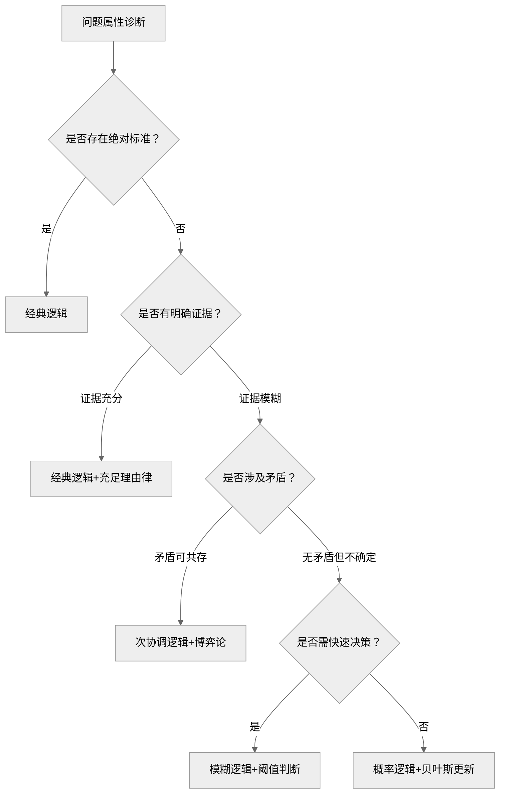
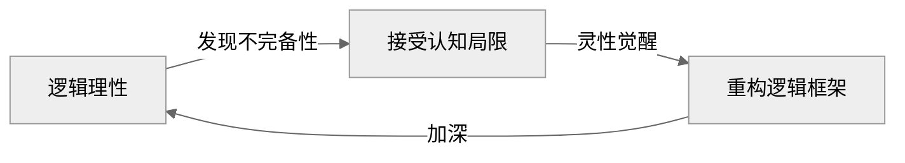

## 如何做决策/分析？

更确切的说，这个问题应该描述为：

如何在<mark>有限的认知 + 无限的可能性/信息</mark>条件下，使用<mark>结构化的工具 + 理性思考</mark>，建立确定性？

防止认知偏见，激活系统 2:

- 系统 1 Check List
- 逻辑三律 + 充足理由律 + 灰度思考
- Critical Thinking
  - 歧义
  - 谬误
  - 替代理由
  - 缺失信息

结构化拆解

- TOSCA
- MECE

寻找高效产出路径

- 二八法则
- 长尾理论

动态迭代

- 溯因推理
- 设计思维

## 哪些笔记对我的个人提升起到了正向作用？它们是如何影响我的？

精力管理

刻意练习

认知训练模型

神经元连接

学会提问：批判性思维

沟通类 6 本书 + 像高手一样解决问题 SCQA

起床后的黄金一小时

5-am project

二八法则 + 长尾理论 + 战略性懒惰

## 如何高效阅读？

moneyxyz 谈读书的意义

将纸质书籍转化为行动

学会提问

沟通圣经：SQ3R 阅读法

把阅读作为方法：从选书到笔记的经验分享

## 《血酬定律》与《潜规则》

### a) 认同

- 枪杆子里出政权，也是一种暴力最强者说了算
- 只有握住了枪杆子，才能用笔杆子把这个“暴力集团”合法化
- 如果 GCD 真的是全心全意为人民服务，为何现在的贫富差距越来越大？

### b) 质疑

- 把中国历史横向和其他国家的历史做对比，分析中国历史的独特性：为何大一统出现在中国而非其他国家？
- 卢克文写过这种所谓大政府和小政府的区别，小政府当然也存在潜规则，但为何资本主义是目前发达国家的主流体系？
- 小政府存在哪些问题？大政府在哪些方面比小政府做的好？哪些不如小政府？

### 对比书籍：
- 《万历十五年》
- 《叫魂》
- 《枪炮、病菌与钢铁》

## 《置身事内》 + 《大国大城》

- 《转型中的地方政府》 by 周黎安
  - 关联点：行政发包制、政治锦标赛理论
  - 差异点：更抽象的理论建模
- 《小镇喧嚣》 by 吴毅
  - 关联点：基层政府经济行为田野记录
  - 差异点：微观个案深描
- 《结构性改革》 by 黄奇芬
  - 关联点：政策制定者视角的改革方案
  - 差异点：偏重实操建议
- 《21世纪资本论》
  - 关联点：全球视野下的财富不平等
  - 差异点：中国案例较少
- 《光变》
  - 关联点：京东方崛起中的政府角色
  - 差异点：
- 《芯片战争》
  - 关联点：政府如何在半导体产业中发挥作用
  - 差异点：
- 《大国大城》
  - 关联点：城市化与产业集聚的经济学
  - 差异点：
- 《变革中国》
  - 关联点：市场化转型制度变迁
  - 差异点：

## 《学会提问》

### a) 认同

关于批判性思维/逻辑学/分析问题的一般性方法已经大概有了一些轮廓。目前已经读过：

- 谈谈方法
- 简单的逻辑学
- 像高手一样解决问题
- 学会提问

对于逻辑性比较强的书籍，可以采用以下提问方式：

1.  Issue?
2.  Concusion?
3.  Reasons?
4.  Evidence?
5.  Assumption?

### b) 质疑

在原文中有两个概念 argument 和 reasoning, 二者的关系和区别分别是什么？

| **概念**              | **定义**                                                     | **关键特征**                                                 |
| :-------------------- | :----------------------------------------------------------- | :----------------------------------------------------------- |
| **Reasoning（推理）** | **个人内在的思维过程**：利用一个或多个想法支撑另一个想法的认知活动（P39）。 | - 动态的、不可见的思考过程  - 可能包含未表达的假设或跳跃 |
| **Argument（论证）**  | **推理的外化表达**：由“结论+支撑理由”组成的结构化陈述集合，用于说服他人（P39）。 | - 静态的、可见的语言/文字形式  - 必须包含明确的结论与理由 |

## 《像高手一样解决问题》

#### a) 认同

- 4S 模型
- 金字塔原理
- MECE 拆分问题
- 这里重点提一下**设计思维**：这是颠覆认知的输入，以前从未想过
  - 设计思维本质上是按照 why → how → what 的顺序解决问题
  - 传统的演绎推理则是按照 what → how → why 的顺序解决问题

#### b) 质疑

- 本书虽然经典，但是仍然有“应用断层”的问题：以企业案例为载体，让非管理者读者产生距离感

| 书籍             | 关联点                     | 差异点                   |
| :--------------- | :------------------------- | :----------------------- |
| 《思考，快与慢》 | 补充认知偏差的心理学原理   | 更侧重理论而非操作工具   |
| 《金字塔原理》   | 共享 MECE 等结构化表达方法 | 聚焦汇报呈现而非问题解决 |
| 《系统之美》     | 强化复杂系统动态认知       | 缺少商业场景落地案例     |

## 《谈谈方法》

### a) 认同

对所有事物保持怀疑的态度，然后小心谨慎地去逐步验证。这应该是批判性思维的最早来源了吧。化繁为简地拆分问题，对应《像高手一样解决问题》中提到的 [MECE 法则](book-@像高手一样解决问题.md)。

而反求诸己的行事风格，也对应了[强风吹拂](book-@强风吹拂.md)中提到的：主动迎接这些困难，而不是一味地客观强调困难。

### b) 质疑

- 笛卡尔对于上帝/灵魂存在的证明，需要用批判的眼光去看待。笛卡尔也许并没有跳脱他身处的那个时代，对上帝存在的证明十分模棱两可。猜测是为了在那个时代为了获得理论支持合法性而故意迎合教会的说辞。我们应该用科学精神取代上帝

- 对感官（经验主义）的系统性贬低

- 试图用数学/几何去解释一切科学，反例：

  - 量子力学

  - 哥德尔不完备定理：数学系统自身存在不可证命题

### c) 初探形而上学 (Metaphysic)

#### 1. **词源真相**

- **亚里士多德原意**：
  其弟子整理著作时，将研究“存在本身”的篇章**放在物理学著作之后** → 定名“物理学之后”
- **中文译名玄机**：
  《易经·系辞》“形而上者谓之道” → 严复精准捕获“超越有形世界”的精髓

#### 2. 核心内容

- 探究的是超越经验世界的“终极实在”（如亚里士多德的“存在之为存在”13，老子的“先天地生”的“道”7），试图回答万物运行的**最深层原理**。

#### 3. 和底层逻辑的区别

- 形而上学追问**存在本身**（如“自然律是客观还是建构？”），属于道的范畴；
- 底层逻辑聚焦**问题解决**（如“流量分发的算法逻辑”），强调操作效能，属于术的范畴

### d) 延伸阅读

| 书籍                     | 关联点                               | 差异点                             |
| :----------------------- | :----------------------------------- | :--------------------------------- |
| **斯宾诺莎《伦理学》**   | 用几何学写伦理学（笛卡尔方法的应用） | 否定笛卡尔二元论（提出“神即自然”） |
| **洛克《人类理解论》**   | 回应“天赋观念”争议                   | 经验主义立场（白板说 vs 理性主义） |
| **波普尔《猜想与反驳》** | 延续“怀疑-重建”脉络                  | 用“可证伪性”替代“绝对确定性”追求   |

## 《思考，快与慢》

### 前景理论与行为经济学的关联是什么？

> 行为经济学（Behavioral Economics）是结合心理学和经济学，研究人类在现实中做出经济决策时的非理性行为的学科，它修正了传统经济学中“完全理性人”的假设，关注认知、情感和社会因素如何影响决策，核心理论包括前景理论、心理账户等，应用广泛，旨在提供更贴近现实的决策模型和政策建议

前景理论（1979年发表）是行为经济学得以立足的基石和宣言。它从根本上改变了经济学的研究范式：

- 它用简洁优雅的模型（价值函数曲线图），首次以数学化的形式刻画了人类在不确定下决策的系统性偏差。这让“非理性”不再是杂乱无章的噪音，而是可建模、可预测的科学对象
- 它证明决策受制于框架、参照点和情绪，而非客观概率和最终效用。这直接挑战了新古典经济学的根基（人是完全理性的）
- 围绕前景理论，经济学家们展开了广泛研究，解释了一系列传统理论无法解释的异象：
  - 禀赋效应：一旦拥有某物，对其估值就会立刻升高（因为放弃它意味着“损失”）
  - 现状偏见：人们倾向于维持现状，因为改变带来的潜在损失感更突出
  - 沉没成本误区：因为已经“损失”了那么多，所以继续投入以避免“承认损失”带来的痛苦

### 系统 1 与系统 2 和[刻意练习](book-@刻意练习.md)的关联是什么？

**# 1. 心理表征与系统 1 的关系：**

刻意练习的目标，就是在特定领域内，通过系统2的艰苦努力，构建出高速、自动、精确的系统1模式（即心理表征）

专家与新手的核心区别，就在于他们系统1中的模式库质量

**# 2. 杰出榜样与锚定效应：**

这里锚定的不是价格数字，而是 “卓越的标准”和“可能的路径” 。它为我们设定了一个高价值的心理锚点，防止我们被自身较低的现有水平所“锚定”（认为自己只能到此为止）。这是正向利用锚定效应的绝佳例子。

**# 3. 3F 是系统 2 监督并重塑系统 1 的过程：**

- Focus（专注）：强制调用系统 2，打破系统 1 的自动模式
- Feedback（反馈）：提供外部或自我监控的信息，这是系统 2 进行判断的“数据”
- Fix（修正）：系统 2 根据反馈，设计出下一步的练习动作，通过重复，将这个修正后的模式刻写进系统 1

总结：

《刻意练习》本质上是一套驯化和优化系统 1 的方法论。 它提供了将系统 2 的 deliberate（刻意）努力，转化为系统 1 的 automatic（自动）能力的标准化流程

### 如何让系统 1 为我所用？

**# 1. 建立 System 2 的 Check list**

> - 锚定效应：我的第一印象是否受到了某个无关数字（初始报价、对比对象）的过度影响？
> - 可得性启发：这个判断是否仅仅因为最近看到了类似案例，而忽略了统计基率？
> - 过度自信：我对这个判断的信心是否远超我所掌握证据的实际支持度？
> - 损失厌恶：我是否因为害怕失去（已有的东西或机会），而拒绝了明显更优的选择？

**# 2. 刻意练习**

> - 专家直觉：象棋大师能瞬间看出棋局关键，是因为他们通过大量练习，在脑中存储了数万个棋局模式。你想在哪个领域拥有“专业直觉”？那就进行大量、有反馈的刻意练习
> - 读书/案例学习：广泛阅读历史、传记、商业案例，等于是在为你的System 1输入丰富的“故事模式”，未来遇到类似情境，它能更快地调用类比

**# 3. 创造外部视角**
System 1 天生偏爱具体、生动的“内部视角”

> - 基率思维：在做预测或计划时，刻意问：“类似的项目，通常的基准成功率是多少？”
> - “如果一个外部顾问来看这件事，他会怎么说？”

 **# 4. 预加载情绪标记**
利用System 1对情绪和联想的高效处理能力

> - 行动：将你希望养成的习惯或警惕的错误，与一个强烈、具体的情感或形象绑定。例如，想到“匆忙下结论”时，立刻联想到一次因此导致的尴尬失败场景（情感标记），这会让System 1自动产生警觉。

**# 5. 设计环境，而非依赖意志力**
认知负荷会削弱 System 2, 聪明的做法是优化环境，让正确选择变得“自动”，见[战略性懒惰](ref-战略性懒惰.md)

> - 示例：为了健康饮食，把水果放在手边，把零食收进柜子（让System 1的“顺手”指向健康选择）。为了专注工作，使用“专注模式”软件屏蔽干扰网站。

### 两个自我与战略性懒惰

| 维度     | 两个自我                                                     | 战略性懒惰                                                   | 行动启示                                                     |
| :------- | :----------------------------------------------------------- | :----------------------------------------------------------- | :----------------------------------------------------------- |
| 核心对象 | 体验自我：当下的感受流，厌恶阻力与消耗                       | 自动化、环境设计、决策最小化。目标是减少体验过程中的摩擦、决策负担与无效努力 | 通过建立系统（如健身流程）、设计环境（如书房无手机）、自动化账单，将日常琐事对体验自我的干扰降至最低，保护其专注与心流 |
| 核心目标 | 记忆自我：事后的叙事者，追求意义、峰值与价值                 | 聚焦高价值、创造资产、设定系统。目标是积累那些能写入人生故事的价值与成果 | 运用80/20法则，将省下来的精力与时间，投入到能产生长期复利、构建人生“资产”的事情上（如深度学习、创造作品、经营关系），这些将成为记忆自我的优质素材 |
| 核心智慧 | 峰终定律提示我们设计结局；持续时间的忽视提醒我们关注体验质量 | 寻找杠杆点：识别那20%能产生80%效果的高影响力活动（杠杆），并持续投入 | 好的“杠杆”，既能提升当下的体验质量（如通过最小有效剂量的锻炼获得内啡肽），又能为未来的记忆叙事积累硬核价值（如保持健康、习得技能） |

## 《内向者沟通圣经》

### a) 认同

我认为以下三个维度的沟通确实很重要：

- 通过理解领导者的需求来更好协作
- 向上管理对职业发展的帮助
- 项目管理中的沟通技巧

### b) 质疑

然而，作为执行层的工程师，我需要的是**“如何在现有岗位发挥内向优势，同时为未来领导角色铺路”**？

关键在于：**在不改变职位的前提下，如何提前培养领导者思维和技巧**？

- 项目管理：
  - Preparation: 提前准备书面文档，标注关键决策点和风险
  - Presence: 技术讨论时掌握会议节奏
  - Push: 把技术障碍转化为业务决策
- 向上管理：
  - Preparation: 从“提出问题”升级到“提供选项”
  - Presence: 用“阶段化交付”代替“不能做”
  - Push: 用“专长匹配+方案预研”证明我比其他人更适合
- 内向领导力
  - Preparation: 把技术风险转化为业务指标
  - Presence: 在技术方案中添加领导快速决策页面
  - Push: 同步进度时附加是否需要行动页面

### c) 延伸阅读

| 书籍                   | 关联点                     | 差异点                   |
| :--------------------- | :------------------------- | :----------------------- |
| 《安静：内向者竞争力》 | 心理学基础（荣格性格理论） | 侧重先天特质而非方法工具 |
| 《深度工作》           | 专注力价值强化             | 未涉及人际关系维度       |
| 《高难度对话》         | SAR模型补充                | 未区分性格特质应用场景   |

## 《刻意练习》

### a) 认同

「刻意练习」告诉我们两点：

- 无效的努力不会成功
- 经过正确的练习，普通人也能成为杰出人物

我们总是说，做自己就好，不要和别人比。其实这句话有两个大前提：

- 知道自己的目标在哪里
- 知道自己目前的定位在哪里

确定了起点和终点，所谓的刻意练习无非就是：

1. 找到这个领域内的杰出人物
2. 制定计划，不断地细化目标
3. 主动练习
   - 保持专注
   - 获得反馈
   - 及时纠正

与《精力管理》提到的仪式习惯

### b) 质疑

通过刻意练习不断地积累心理表征，最终成为杰出人物。下棋中的高手，能做到下一步，看三步。可伴随心理表征出现的，是**思维定式**。我们固然要肯定前人积累的宝贵经验，同时也要记住以下两点：

- 每个人刻意练习的经验都是独一无二的
- 已有的经验无法保证解决现在和未来的所有问题

因此：

- 每个人的心理表征都是独一无二的
- 要通过反馈和修正不断地优化自己的心理表征

### c) 延伸阅读

DeepSeek 推荐理由：

>延伸阅读选了同主题的《终身成长》互补，而《认知天性》提供具体技术支撑——用户若真读这三本，就能形成"理念+方法+工具"的完整知识链。

- 《终身成长》：成长型思维理论支撑
- 《认知天性》：科学学习法的神经学证据
- 《练习的心态》：专注力与刻意训练的心理学融合
- 《原子习惯》

## 《精力管理》

### a) 认同

- 精力是不断消耗的，同时也可以恢复。我们要做的是实现消耗和恢复的动态平衡
- 要做到动态平衡需要从四个维度管理精力
- 管理精力的手段是形成仪式习惯
- 所谓使命感就是对某件事物本身的渴望，仅仅因为它能带来满足感
- 现实乐观主义：看清事物真相，却依然朝着目标积极努力
- 宁静祷文
- 右脑主导的边缘型思考
- 摄入升糖指数低的食物
- 少食多餐：一天 5-6 餐，每餐 100-150 卡路里
- 不要等感到口渴后再喝水
- 每 90 分钟为一个工作周期

与《刻意练习》中提到的心理表征链接

### b) 质疑

- 凡事考虑到 worst case 是一种狭隘思维的视角？
- 意志力可无限扩展（忽略生理限制）

### c) 延伸阅读

《心流》米哈里：专注力与幸福感

《为什么精英这样用脑不会累》桦泽紫苑：神经科学视角

《深度工作》卡尔·纽波特：对抗分心

## 《简单的逻辑学》

### a) 认同

### b) 质疑

经典逻辑是否存在局限性 ？答案是显然的：四大定律是理想化的模型，适用于确定、静态、离散的领域，而现实世界却是动态、模糊、矛盾、连续（量子）的。Deep Seek 对比了新旧逻辑体系的异同，并给出了建议：

| 四大定律   | 与现实的矛盾点                                       | 现代逻辑学的修正                                             |
| ---------- | ---------------------------------------------------- | ------------------------------------------------------------ |
| 同一律     | 预设概念绝对不变，但现实中的对象可能随时间或语境变化 | 是或者不是                                                   |
| 矛盾律     | 要求绝对无矛盾，但现实中存在辩证矛盾                 | 次协调逻辑，容忍局部可控矛盾的存在                           |
| 排中律     | 强制二值（真/假），但现实存在模糊状态或不可判定命题  | 直觉主义逻辑 + 模糊逻辑，让真值连续化，允许中间态的存在（放弃离散的二值排中） |
| 充足理由律 | 休谟质疑因果必然性，认为理由只是经验的联想           | 理由的充分性用概率度量                                       |

对我而言，最重要的是需要知道自己在什么情况下使用哪种类型的逻辑工具箱，Deep Seek 给出了一套方法论：

正如《宁静祷文》中所说：

> 亲爱的上帝，请赐给我雅量从容的接受不可改变的事，赐给我勇气去改变应该改变的事，并赐给我智慧去分辨什么是可以改变的，什么是不可以改变的。 

这里，接受不可改变之事，即容忍可控的矛盾；改变应该改变的事，则需要分权重逐步处理；而分辨二者的智慧，则是接受逻辑无法闭环的可能性。为此，问自己三个问题：

- 认知层：我的焦虑源于追求不可能的逻辑闭环吗？→ 接受“可证伪性生存”：这个选择在现有证据下最优，但接受未来证伪可能
- 实践层：此刻该用经典工具维稳，还是现代工具纳新？→ 建立逻辑的“脚手架”而非牢笼：接受逻辑缺陷
- 哲学层：如果永远找不到充足理由，我仍愿选择它吗？→ 在不确定中锚定存在性理由：并非凡是都有理由

如爱因斯坦所言：

没有宗教的科学是跛子，没有科学的宗教是瞎子。

发现逻辑缺陷的过程，也是一步一步逼近真理的过程：

### c) 延伸阅读

| 书籍                           | 关联点                     | 差异点                   |
| :----------------------------- | :------------------------- | :----------------------- |
| **《思考，快与慢》**（卡尼曼） | 共探认知偏差（如情感误导） | 从心理学实验补充逻辑盲区 |
| **《批判性思维工具》**（保罗） | 共重论证结构分析           | 更侧重教育场景应用       |
| **《学会提问》**（尼尔·布朗）  | 共击谬误（如稻草人谬误）   | 聚焦提问技巧而非原理推导 |

## 《毫无意义的工作》

### a) 认同

- > 人们并不会将个人的职业视作后人对自己的主要评价来源，而是生前共度时光的伴侣和后代

- 揭露了资本主义对劳动异化的一种新形态：心里剥削代替物质剥削

### b)质疑

作者提出的问题确实直击社会痛点，然而，既然是观点类的书籍，就应该批判地去看待作者的观点。

**1. 未区分情绪宣泄与客观分析**

对于书中给出的一些例子，作者并没有区分，哪些是当事人的情绪宣泄，哪些是认真考量之后的科学分析。换言之，这本书提出的观点，虽然很符合当下社会的情绪，却缺乏客观性的论证。

例如，作者认为，工程师/科研工作者的社会贡献很低。诚然，个体所能突破的知识边界是很小的。根据统计学，只有科研民工的基数足够大，才能在其中出现不世出的天才。但是不积跬步，无以至千里。就是无数人积累起来的一小步，成就了科技进步的一大步。

**2. 静态预判未来，忽视技术奇点可能彻底重构劳动伦理**

再如，作者并没有站在时代的角度对工作进行回顾，却想当然的对未来进行了设想。

作者以火车站为例，对 AI 的冲击进行了反驳：即使现在自动售票很普及，车站还是需要相应的工作人员来解决儿童走失/失物招领等工作。作者认为，在 AI 时代，照料类的工作还是需要人去做，尽管其工作价值很难衡量。以现在的眼光看，似乎很正确，可是随着科技的发展，假如机器解决一切事情的那一天真的到来，我们的社会必定也跟现在大相径庭。以现在的社会去揣测未来有多少意义呢？

**3. 缺乏时代切片比较**

从二战结束到现在的 80 年中，科技飞速发展，劳动与生产的关系，个体与社会的关系，科技与未来的关系...可以说每过大约十年就会有巨大的变化。那么，是否应该分别论述每个时代下的狗屁工作，而不是一棍子打死的说，大部分从事金融业的人干的都是狗屁工作？

DeepSeek 说本书的中文版删减了 23 处争议论述，所以英文原版也值得一看。

对比《新教伦理与资本主义》：

| **维度**   | **韦伯《新教伦理》**（1905）     | **格雷伯《狗屁工作》**（2018） | **思想碰撞**       |
| :------- | :--------------------- | :------------------ | :------------- |
| **劳动价值** | 上帝召唤（Calling）→ 劳动即救赎证明 | 人性创造本能 → 劳动即意义实现    | **神圣性 vs 人本性** |
| **批判对象** | 传统主义劳动观（够用即止）          | 金融资本主义劳动异化（为钱丧失意义）  | **惰性 vs 异化**   |
| **历史判断** | 资本主义诞生的文化引擎            | 资本主义晚期的癌变病灶         | **助产士 vs 掘墓人** |
| **解决方案** | 接受“铁笼”（理性化不可避免）        | 打破铁笼（重构意义经济）        | **悲观 vs 激进**   |

关联点：格雷伯痛斥的“劳动神圣化”正是韦伯揭示的**新教伦理幽灵**——当“工作即美德”脱离宗教根基，异化成压迫现代人的道德枷锁。

### c) 延伸阅读

- 《倦怠社会》
  - 关联点：精神暴力机制分析
  - 差异点：韩炳哲聚焦功绩社会自我剥削

- 《工作、消费主义和新穷人》
  - 关联点：劳动伦理批判
  - 差异点：鲍曼强调制度性弃民制造

- 《优秀绵羊》
  - 关联点：精英教育制造“高级打手”
  - 差异点：教育系统前段批判

- 《规训与惩罚》by 米歇尔·福柯

- 《新教伦理与资本主义》

## 《二八法则》

### a) 认同

相较于二八分析法，我更认可二八思维法：

- 我们确实生活在一个 [VUCA](https://zh.wikipedia.org/wiki/VUCA) 时代
- 二八思维法是强迫我们去思考关键少数的投入/原因到底是什么

二八法则让我们发现系统内在的失衡关系，这是第一步，更重要的是**去行动/改进**，让 80% 的次要多数尽可能往关键少数的 20% 靠拢。

### b) 质疑

#### 质疑 1

书中提到，做自己擅长的事情，并把它当作自己的工作。从效率的角度讲，这样也没错。可是不断突破「舒适区」就是在不断地挑战自己不擅长的事情。如何去平衡二者？

Deep Seek 解析了我的疑问：

>既想遵循帕累托法则专注优势领域，又意识到突破舒适区对成长的必要性。ta的潜台词或许是“**如何平衡专精与拓荒**”，这需要从系统视角拆解。

Deep Seek 列出了专精与拓荒的区别：

| 维度      | **效率导向**                     | **成长导向**                          |
| :-------- | :------------------------------- | :------------------------------------ |
| 表现      | 做擅长之事                       | 突破舒适区                            |
| 目标      | 短期成果最大化                   | 长期能力边界扩展                      |
| 80/20侧重 | 用80%精力深耕已擅长的20%核心技能 | 用20%精力探索相邻能力区的「战略支点」 |
| 风险      | 路径依赖导致竞争力衰退           | 资源分散削弱当前价值                  |

突破舒适区，本质上是把新的挑战转化为新的擅长领域，为此可以分三步走：
1. 在新领域识别「最小关键行动」（如先掌握核心20%知识）
2. 通过刻意练习将其升级为优势技能
3. 纳入个人价值网络，形成复合杠杆

特别需要注意的是，要选择与既有优势协同的领域：如画家学数字绘画工具；切记不要盲目进入毫无关联的领域

#### 质疑 2

作者提到的关键少数决定论，本质上是一种精英思维，这放到社会学中，是否会存在局限性？使用二八法则分析社会问题是否客观？

> 二八法则的价值在于**揭示资源分配的非均衡性**，但将其升华为“客观规律”则陷入简化论陷阱，因为它忽视了社会结构的制约性，以及资本的代际优势传递，把个人成就完全归功于自身努力。

### 4. 卡片链接

本书有两点与现有知识库产生连接：

- 在工作中使用二八法则，找到一至两位导师，导师需要自主选择，对应[刻意练习](book-@刻意练习.md)中提到的某领域中的杰出人士
- 在日常生活中使用二八法则，保持快乐的习惯中的一些观点与[精力管理](book-@精力管理.md)也很吻合：
  - 锻炼身体 vs. 体能管理
  - 做脑操 vs. 左右脑交替思考
  - 培养精气神/与朋友欢聚 vs. 情绪管理

Deep Seek 建议：

> 将80/20法则与「复利效应」「机会成本」建立概念链接，形成**决策杠杆模型**知识簇

### 5. 行动

>找到 20% 最快乐/有效的事情，并非再把这些事情原原本本地再重复一遍，而是为了发现某个/某些基本性质，找出自己擅长做的事情，以及哪些事情对自己是重要的

列出自己的四个领域：

1. 快乐领域 --> 尽可能多地列举你记得的快乐时光。之后，再试着找出它们的共同点
2. 不快乐领域 --> 不可能占其余全部80%的时间，因为对大多数人而言，在快乐和不快乐领地之间还有一大块中间地带
3. 成就领域 --> 表现出色的短暂时期 
4. 无成就领域 --> 效率最低、颗粒无收的时期

### 6. 延伸阅读

| 书籍             | 关联点       | 差异点                             |
| :--------------- | :----------- | :--------------------------------- |
| **《精要主义》** | 聚焦关键事务 | 更强调心理决策机制                 |
| **《深度工作》** | 杠杆时间应用 | 侧重个体专注力管理                 |
| **《长尾理论》** | 资源分配模式 | 论证非关键多数的价值（与本书互补） |

## 《博弈论与生活》

- 对于「战争是政治的延续」这句话有了新的理解：国与国之间的交流即是博弈。大家尽量先在谈判桌上博弈，如果陷入囚徒困境/公地悲剧，则将不可避免地进行战争。
- 联系吴思的「血酬定律」，更像是博弈论中的懦夫博弈/边缘政策：暴力集团和当权者不断试探对方的容忍限度，并希望对方先屈服。最终，暴力集团以命相博。
- 「你切我分」实现公平分配的方法很受用：首先消除无争议的部分，然后平分有争议的部分。但是前提是需要第三方/外部权威来监督。

现在遇到问题有了一种新的思考思路，即可以使用博弈论的观点来看待某些问题。

## Misc

- 长尾理论 vs 二八法则
- 经典逻辑 vs 现代灰度思考
- 从设计思维（MVP）看人脑与 AI 的关系
- 从微观神经元角度谈学习的本质
- 系统 1 与系统 2 的相互转化 刻意练习 4P 法沟通
- 沟通的本质：语言中枢与二语习得
- 我思故我在与形而上学，攻壳机动队