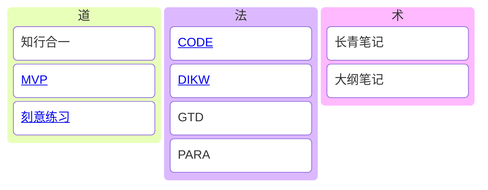

置顶一段很受用的话，来自 https://sspai.com/post/78133

><mark>我们往往低估了长期影响，而高估了短期影响。</mark>
>
>到了那样的一天，AI 真的能帮我们准确、高效地分析文本内容，那么我们读书的意义是什么呢。我有一个不那么功利的回答：因为 AI 不能替代我们去体验和思考，因为我们需要通过思考不让自己被异化。人创造了神，却在很长时间一段时间让神主宰人的命运；人创造了金钱作为交易的工具，金钱却逐渐成为了评价人的尺度；人创造了技术，如果不想再次重蹈覆辙、被自己的创造物所掌控，我们必须要自己去思考。<mark>真正的问题不是机器能否思考，而是人类能否思考</mark>。这个时代相比过往，更加要求我们去认识自己。
>
>我想起自己初中时期曾有一段时间深陷「我存在的意义」的困惑。由于周围没有适合讨论的人，于是我试着和书籍去讨论。这段经历让我体会到了阅读不仅有趣，而且有用。我想，每个人或许总会在某个时刻遇到类似的情况：有一个很感兴趣的事情，有一个困扰你的问题，然而网上的答案不能让你满意，周围也没有合适的伙伴来讨论，但是还有书籍。

---

## MOC

- [x] [blog-我的知识管理-笔记篇](blog-我的知识管理-笔记篇.md)
- [x] [blog-@review-我的知识管理-最小可行性系统回顾](blog-@review-我的知识管理-最小可行性系统回顾.md)
- [x] [blog-@review-我的知识管理-2025 上半年回顾](blog-@review-我的知识管理-2025上半年回顾.md)
- [x] [blog-我的知识管理-再谈笔记构建](blog-我的知识管理-再谈笔记构建.md)
- [ ] [ref-如何管理笔记的元数据](ref-如何管理笔记的元数据.md)
- [ ] [card-渐进式阅读](card-渐进式阅读.md)

以下概念虽然没有明确的书面定义，但却是我一直在践行的，算是 know why 级别的概念：

---

## 2025-07-12

截止今天，我一共产出了 49 篇笔记：

- 6 篇 blog
- 12 篇 card
- 8 篇 note
- 23 篇 ref

我把这 49 篇笔记系统地进行了分类，分别放在四个 review 中：

- PKM
- 社会可续
- 问题解决
- 自我管理

于是，现在笔记变得有结构了起来：

- README 中放所有 review
- review 中放同类型的 card/blog
- review 的作用有两种：
	- 充当 card/blog 的 MOC
	- 记录该主题下的所思所想，当其篇幅足够长时，便可产出为 blog
- note/ref 产出 card/blog, 不再对其进行细分
- 由于 review/note/ref/card/blog 都在同一个文件夹中，因此所有笔记是相同层级的，相互之间是可以引用/链接的，于是避免了分类导致的知识边界

## 2025-07-21

从[blog-君主论](blog-@君主论-认知领土拓展.md)中提取了「AI 雇佣军」的概念，要警惕 AI 的双重面孔：

| **工具性价值**   | **认知侵蚀风险** |
| :--------------- | :--------------- |
| 信息检索加速器   | 削弱信息溯源能力 |
| 模板化方案供应商 | 僵化问题解决思维 |
| 语言修饰助手     | 弱化逻辑自洽训练 |

需警惕*依赖雇佣思考者的人，永远在焦虑中等待崩溃*

## 2025-07-23

