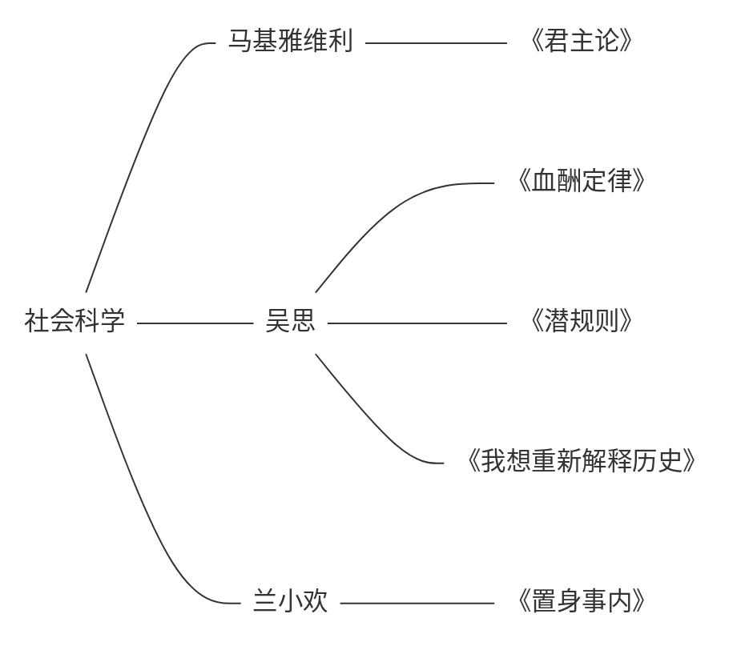

## MOC

文字版：
- 社会科学
	- 马基雅维利
		- 《君主论》
			- note
			- ref
			- [blog](blog-@君主论-认知领土拓展.md)
	- 吴思
		- 《血酬定律》
			- ref
		- 《潜规则》
		- 《我想重新解释历史》
	-  兰小欢
		- 《置身事内》
			- note
			- ref

- [x] [血酬定律/潜规则](book-@血酬定律-潜规则.md)
- [x] [中国政府与经济发展](book-@置身事内.md)
- [x] [狗屁工作](book-@毫无意义的工作.md)
- [x] [认知领土拓展](blog-@君主论-认知领土拓展.md)  
