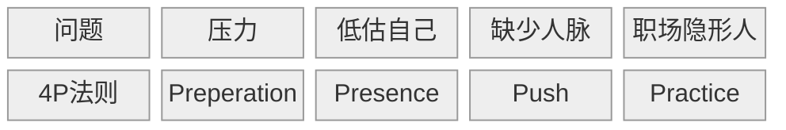

## 1. 核心思想

性格可以管理，只需 4 个步骤，内向者即可摆脱职场隐形人的现状，激发自己的领导潜力。

## 2. 列出最关键的三个概念

4P 法则

- 准备（Preparation）
- 展示（Presence）
- 推动（Push）
- 练习（Practice）

## 3. 主题归档

- 沟通
- 职业发展

## 4. 写作框架

### 4.1 写作动机是什么（问题意识/现实意义）？

>你是不是胸怀抱负的企业中层，需要引领他人提高业绩，实现目标？可能你是项目负责人，也可能你作为普通员工，希望承担更多的责任和挑战；如果你从事技术、科研或财务工作，很有可能你的性格更为文静，也可能你不曾像你的销售部、管理部的同伴们一样接受过系统的人际关系处理技能培训；也许作为一名女性，在你的工作领域男性占据着主导地位；也可能作为一名公司员工，你的意见总是得不到重视。
>
>你可能经常觉得自己内向。内向性格有不同的等级，有些情况下，即使“话痨”也会失语，不知道如何应对令人不适的人际关系。作为一名经理，不论是管人还是管项目，你的团队里一定会有内向者。本书会教你学会理解他们、指导他们，引导他们为组织发挥最大的能力。

### 4.2 论证方法是什么（定性/定量）？

定量分析：

>我亲自采访了来自多个行业的 100 多位内向者。有些采访基于事先准备的问题提纲，有些则无非是在客户公司走廊里或者在飞机上与邻座的闲聊。
>
>带着记者的视角，我列席了各种团队会议、学术研讨、培训课程，寻找内向型领导者掌控局面的实际例子。我记录在笔记本上的观察结果最终汇聚成了本书。
>
>我发现在社交网站上发布特定的问题也能收到很多回复。很多人喜欢跟我书面沟通，他们提出了丰富多样的建议。本书也参考了活跃在本行业前沿的学术和商业思想家们的独特观点。

第 1 章：内向者的四大致命陷阱

列举了当你任凭自己被无效的内向行为所统治时所面对的挑战。你将会了解到压力，你眼中的自己远逊于别人眼中的你，不懂经营“关系”，职业发展将受阻，和成为职场隐身人是怎样严重阻碍你成功获得领导能力的。

第 2 章：解锁成功之道，把拦路石变成垫脚石

4P 法描述了一套打破现状、有效管理内向性格的明确实用的方法。4P 法就像一套导航地图，帮助你制定策略，全方位增强领导能力。你还能学到如何使用 4P 法这个工具，分析哪些行为是有效的，哪些行为是无效的，从而不断提升自己的能力。在这一章你将学到以下四点：

- “准备”意味着你要有一套作战方案，按步骤为人际交往做好准备
- “展示”意味着你要完全活在当下，也就是“此刻所在的地方”
- “推动”意味着你要主动承担风险，强迫自己离开舒适区域
- “练习”意味着你要持续不断地将这些有效果的行为内化为自身能力的一部分

第 3 章：内向者，唤醒你心中的狮子

其中包括一个“内向型领导能力测试”，这个测试能够帮助你识别哪些是自己已经掌握的内向型领导技能。它还能协助你瞄准自己需要加强的技能领域，从而集中火力去弥补这些不足。除此之外，这个测试还可以作为一个基准，用来衡量你的进步，也可以当作你寻求上司指导时谈话的跳板。

第 4 章到第 9 章分别介绍了如何使用 4P 法来应对各种典型的工作场景。各种各样的工具、实际案例和实用技巧将会向你展示具体的做法。

第 4 章：告别公共演讲恐惧症

将会教你如何掌握向群体和个人演讲的技巧。

第 5 章：内向者如何做领导

分享了很多成功的内向型领导者的秘诀，帮助你赢得下属的尊重。

第 6 章：内向者如何做好项目管理

侧重于项目管理中的人力资源管理方面，你将会了解到内向型领导者如何激励团队取得惊人的成果。

第 7 章：上司是用来管理的

将会为你提供模板和工具，用于增强你和上司之间的联系。

第 8 章：不做会议隐形人

将会教你使用各种方法在会议上表达自己的观点，从而将你的会议参与度提升到一个全新的高度。

第 9 章：内向者如何建立自己的人脉网

强调公司内部和外部的人际交往，跟前面数章一样，你将会学到如何合理利用你的内向特征，高度集中、富有创造性地发展这项重要的领导技能。

第 10 章：提升内向者的竞争力，只需 4 步

讲述了如果你能打造自己的强项，走出角落，你自己和你的企业将会得到的各种益处。

第 11 章：下一步走向成功

侧重于接下来的行动，学会调整自己的行为绝对不能一蹴而就，而是一个循序渐进的过程，就像一瓶美酒，随着时间流逝变得越发醇厚芬芳。你将会得到一份发展计划来帮助你专注于现在和将来的行动，从而适应你不断扩展的领导者职责。

### 4.3 结论是什么？

使用 4P 法则进行沟通的意义在于：

- 个人层面：
  - 准备：哪怕一点点准备都可以缓解紧张情绪
  - 展示：关注当下，给人留下正面印象
  - 推动：迈出第一步，你就成功了 90%
  - 练习：内向者需要不断练习
- 公司/组织层面：
  - 准备：我的表现就是公司的绩效
  - 展示：拥有展示能力可以促进团队工作
  - 推动：挖掘自己的潜能，就是提升公司的投资回报
  - 练习：优秀公司的核心价值就是打造领导者

## 5. 批判性思考

### 5.1 作者的学术背景、政治倾向或价值预设是什么？

作者是一个外向的人，从事企业咨询、演讲、培训工作已经超过 25 年，其婚姻超过 35 年，丈夫的性格属于内向型。

作者为来自各类企业的数千名领导者提供培训、咨询服务。

作为为《美国退休人士协会会刊》(AARP The Magazine)、人力资源协会和《亚特兰大宪法日报》(Atlanta Journal Constitution)撰稿的职场专栏作家，作者对成功领导者做过广泛的调查研究，其中包括很多内向型领导者。

### 5.2 我是否认同或反对作者的观点？

## 6. 行动/用途

## 7. 渐进式总结

**内向者在工作中遇到的挑战有哪些？**

- 压力
- 你眼里的自己远逊于别人眼中的你（即低估自己）
- 不懂经营“关系”，职业发展将受阻（即缺少人脉）
- 成为职场隐形人

**为什么要在工作中学会经营关系？**

>办公室政治（好的那种）也相当于在银行里储存政治资本，它会随着时间的推移产生复利。这意味着要跟正确的人建立关系，不一定非得是企业中职位最高的人，但通常是受到他人尊重，并且人脉广阔的人。储存政治资本需要花时间跟这些人相处，发现他们最关注的事情和他们最迫切的需要，并判断企业的发展方向。从你的人脉网络了解更多与企业文化相关的信息，能够帮助你实现自己的目标。

**4P 法分别针对以上四类挑战作出解决方案：**

**准备阶段需要做什么？**

>准备意味着你要拿出一个通盘计划，因此你应该花时间独自为人际交往制定策略（例如，明确目的，想出具体要问的问题和要说的话，做笔记，并且跟一个值得信赖的朋友排练一下）。观察那些擅长人际交往的人，将他们的方法融入到自己的风格当中。这样会产生很好的效果。

**展示阶段需要做什么？**

- 专注于当下/此刻在一起的人
- 当场展示
- 为意外情况做准备

**推动阶段需要做什么？**

推动意味着走出舒适区，进入不舒适的人际互动领域

**内向者如何做好项目管理？**

项目管理者要做到以下几点：

- 准备
  - 解决复杂的团队人员矛盾，识别团队成员们各自不同的工作技能和发展需求
  - 与团队成员单独交谈，让团队成员信任自己（单独交谈足够吗？有时项目需要多人一起 align）
  - 使用书面形式清晰传达自己的需求
- 展示
  - 征求意见
  - 选择适合的交流方式
    - 邮件：报告/案例/计划/预约
    - 聊天软件：简短回复/物流现场的统筹规划
    - 电话：提醒别人注意一封已发邮件/希望与他人发展关系或建立信誉
    - 面对面：传达重要信息/明确意见/远程会议打开摄像头
  - 根据团队成员的性格特点切换开关
- 推动
  - 在达到里程碑时称赞团队
  - 称赞团队成员
    - 认可团队成员的努力
    - 选择合适的方式称赞
  - 持续向项目相关人员提供项目最新的进展信息
  - 面对变更，与团队成员进行清晰有效的沟通
  - 变得幽默，展示笑容
- 练习

**如何管理你的上司/向上管理**？

准备阶段：

- 向上司提问：你/公司的目标是什么，我在整个大局中应该处于什么样的位置，其他同事的目标与我的工作领域有什么关系？
- 了解上司的性格/做事风格
- 做好充足的准备，帮助上司更好的了解我，从而让他更好的帮助我：
  1. 我在这个职位可以利用哪些优势来帮助我的上司？
  2. 哪些项目能够发挥我的才能和工作经验？
  3. 我在哪些项目中可以学习新技能，获得新观点？
  4. 上司有哪些宝贵知识、技能或经验值得我学习？
  5. 我的上司愿意指导我吗？用什么方式？如果他觉得自己不是合适人选，那么他可以向我推荐其他专业人士吗？

展示阶段：

- 保持自我：
  - >虽然你要根据上司的管理和领导风格进行自我调整，但是你也要做自己。你们面谈时，一定要请上司对你工作表现的正反两个方面给出反馈意见。问他具体的反馈意见，准备明确的问题
  - >要尊重你的经理的时间，保持注意力集中和明确的目标。考虑一下提前发送信息给他审阅，如果你的上司也是内向者，就更有必要这么做了。通过这种方式，你可以建立起相互信任
- 开始新工作/更换新老板后，尽快作出成绩
- 不抱怨

推动阶段

- 和上司交流时，使用 SAR 方法提供反馈：
  - >首先描述具体情况（S），然后讲述你所采取的行动（A），以及这种行为产生的结果（R）。然后提供一个备选方案，以及这个备选方案会带来的结果。这是你对如何解决这个问题提出的建议。它的目的在于开诚布公地探讨如何做出建设性的改变，而不是追究和指责
- 明确向上管理的边界在哪里
  - >要注意的是，你的上司一定得是乐于接受反馈意见的那一种。如果你的经理感觉受到威胁，或者你所在的公司正处于混乱状态，给上司提建议可能就不太安全，甚至可能会毁了你的工作。在这种情况下，向公司内部的你尊敬的其他人寻求指导，来解决你的上司的问题，而且要记住，即使在这种情况下，你还是能学到很多东西。很多人在事后回想时，都觉得他们其实从工作效率不高的上司那里学到的最多
  - >另外一种不适合管理上司的情况是，上司所做的工作已经违背了道德规范
- 和上司交流，了解公司的变化

练习阶段

>管理上司是一门科学。通过定期会面、提出问题和给出反馈，可以确保你们共同的目标。如果上司换人，则更要抓住机会进行沟通。这可以帮你了解自己是否正在朝着正确的目标前进，如果与目标的方向不一致，自己要采取什么纠正措施，这也是你了解这些信息的唯一方式。另外，随时加深对组织的了解，这样你的目标就能与公司保持一致的发展方向。在未来发展中，你将会成为你的上司最宝贵的合作伙伴。

**如何在会议中不做隐形人？**

在会议中做隐形人会导致以下后果：

- 我的贡献不被认可
- 我的想法被别人抢先说出或被别人操控
- 在别人眼中没有给团队增加价值

准备阶段：

- 了解会议目的：
  - 会议希望得到什么样的结果？
  - 向团队宣布一个决定还是要让团队接受一个决定？
  - 会议是要作出决定吗？
  - 会议目的是为了解决问题、提出想法、发泄感受还是表彰成绩？
  - 我被邀请参加会议的原因是什么？如果是我的老板要求我代替他出席，我是否被授予了决策权？
- 会议的议程是什么
  - 如果没有议程，主动找上司要一份议程，或者主动申请准备议程，然后交给团队审阅
- 在会议上主动表达自己的意见
  - 最好在刚开始的 5 分钟内让别人听到我的首次发言。会议刚开始时，说句评论、提个问题，甚至是转述别人说过的话都要更容易一些，而且别人更会认为你做出了贡献
- 计划位置
  - 如果是电话会议，站着说话比坐着更有活力
  - 线下会议坐在离领导几个座位的地方
