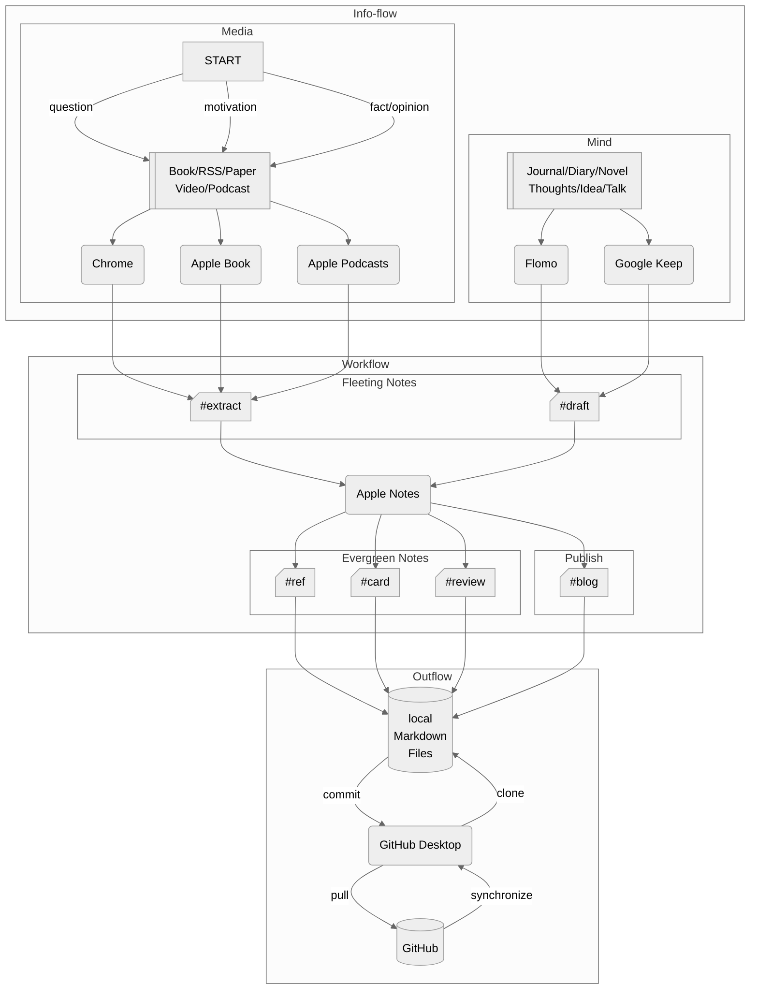

```mermaid
%%{init:{'theme':'neutral'}}%%
flowchart TD
    %%Source:
    L1@{ shape: lin-rect, label: "Journal/Diary/Novel </br> Thoughts/Idea/Talk" }
    L2@{ shape: lin-rect, label: "Book/RSS/Paper </br> Video/Podcast" }
    %%T1x: Mind
    T11(Flomo)
    T12(Google Keep)
    %%T2x: Infosource
    T21(Chrome)
    T22(Apple Book)
    T23(Apple Podcasts)
    %%T24(Zotero)
    %%T25(PegBoard?)

    subgraph 1[Info-flow]
        subgraph Mind
        L1 --> T11 & T12
        end
        subgraph Media
        START:::hidden --> |question|L2
        START:::hidden --> |motivation|L2
        START:::hidden --> |fact/opinion|L2
        L2 --> T21 & T22 & T23
        end
    end
    
    subgraph 2[Workflow]
        T(Apple Notes)
        subgraph FN[Fleeting Notes]
        tag1@{ shape: notch-rect, label: "#extract"}
        tag2@{ shape: notch-rect, label: "#draft" }
        end
        %%subgraph Prog[Progressive Reading]
            %%subgraph LN[Literature Notes]

            %%end        
            subgraph EN[Evergreen Notes]
            tag3@{ shape: notch-rect, label: "#ref"}
            tag4@{ shape: notch-rect, label: "#card"}
            tag5@{ shape: notch-rect, label: "#review"}
            end
        %%end
        subgraph Blog[Publish]
            %%subgraph Publish[Publish]
        tag6@{ shape: notch-rect, label: "#blog"}
            %%end
        end
    %% Fleeting Notes
    T11 & T12 --> tag2
    T21 & T22 & T23 --> tag1
    tag1 & tag2 --> T

    %%T --> LN & EN & Publish
    T --> tag3 & tag4 & tag5 & tag6
    end

    subgraph 3 [Outflow]
    %% vscode & GitHub
    vsCode@{ shape: db, label: "local </br> Markdown </br> Files"}
    GitHub@{ shape: db, label: "GitHub"}
    GD(GitHub Desktop)
    vsCode --> |commit|GD
    GD --> |pull|GitHub
    GitHub --> |synchronize|GD
    GD --> |clone|vsCode
    end
    tag3 & tag4 & tag5 & tag6 --> vsCode
```

