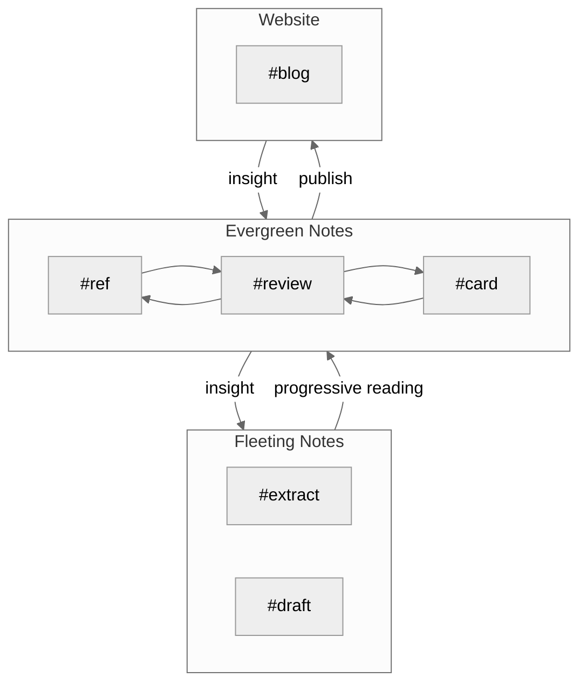
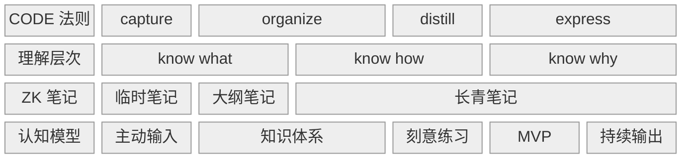

## 0. 引言

一个好的知识体系可以用 12 个字概括：

1. 用得着
2. 想得起
3. 找得到
4. 记得住

多于三个的复杂流程会让我失去执行的动力，因此，我把知识管理系统的建立分成三步：

1. 输入
2. 加工
3. 输出

其中，「输入」要解决的问题是如何用得着，或者说「哪些内容应该被记录在知识库中」；「加工」要解决的问题是如何想得起/找得到，或者说「如何记录新知识，并且在需要的时候能被快速检索出来」；「输出」要解决的问题是如何记得住，或者说「如何将新知识纳入现有体系」。

由于输入的内容都是信息，因此我把输入称为信息流。加工和输出的过程分别称为工作流和输出流。接下来，我就分别从需求和工具两个角度，依次介绍一下这三个流程。

## 1. 信息流

### 1.1 信息的分类

我把信息源分为两类：

- 客观存在的第三方媒体，比如书籍/资讯/视频/论文/播客...
- 主观产生的灵感，比如自我的想法/与他人的交流...

对于媒体，我参照[PKM-ref-把阅读作为方法：从选书到笔记的经验分享](PKM-ref-把阅读作为方法：从选书到笔记的经验分享.md)中提到的观点：

>书籍帮助我们在信息洪流中保持⼼态的从容，远离信息过载的焦虑

要系统的学习知识，书籍永远是第一选择。当然，对于一些粗颗粒度的知识，视频/播客/在线文章等是很好的途径。不论是何种信息源，我们应该做到「主动输入」，即在对信息进行加工之前，先筛选信息。

### 1.2 信息的筛选

在筛选信息时，用批判性思维看待检索结果：

- 以「解决问题」为导向：学习是为了解决问题
- 判断：「这是事实还是观点」

如果检索内容是事实，那么我们就能以此为基础进行延伸；如果检索内容是观点，那么我们就要进行交叉验证。

## 2. 工作流

在接受信息源之后，下一步就要对其中的信息进行归纳总结。这便是我的工作流。

### 2.1 我的笔记分类

在[PKM-review-卡片盒笔记法](PKM-review-卡片盒笔记法.md)中，我总结了网上的一些笔记方法。再次重申，知识体系的构建分为两种：

1. 自上而下的「层级结构」
2. 自下而上的「网状结构」

两种结构没有绝对的对错之分。实际上，根据使用场景的不同，二者应该是共存的关系：

- 想要系统地从零开始学习一门学科，层级结构显然更合适
- 如果是阅读论文等细颗粒度等内容，此时我们已经对这类知识有一个大概的轮廓认知。自下而上的层级结构更有助于知识点之间的发散和连接

据此，我把笔记分为三种：

1. 临时笔记
2. 大纲笔记
3. 长青笔记

#### # 临时笔记

临时笔记就是在接受信息源后，第一时间记录的内容。按照信息源的类型，我把临时笔记分为两种类型：

- 主观产生的 draft
- 客观存在的 extract

#### # 长青笔记

正如[PKM-ref-三种卡片类型](PKM-ref-三种卡片类型.md)中所说：

>临时笔记的最终归宿都应该是长青笔记。

关于临时笔记如何变成长青笔记，已经在中[PKM-card-渐进式阅读](PKM-card-渐进式阅读.md)说过，在此不再赘述。

长青 (Evergreen) 一词参考了花园浇水的过程。只有不停地灌溉，植物才能永葆长青。同理，当临时笔记变成长青笔记后，不应该被放置一处，不再做任何改变。原因如下：

- 一方面，回顾长青笔记，寻找其中的关联，会产生新的想法；
- 另一方面，新知识与长青笔记的碰撞也会产生新的灵感。实际上，这个过程就是把新知识逐渐转化为自己已有知识的过程。

我把长青笔记分为两种类型：

- 对于一家之言的观点，标签为 ref
- 对于客观存在的事实，标签为 card

#### #大纲笔记

事实上，大纲笔记应该也算作长青笔记的一种。之所以单独列出来，是因为相比上一节提到的单纯记录内容的 ref/card，大纲笔记兼具管理/检索/记录灵感的功能：

- 对相同主题的 ref/card 内容进行总结/类比/归纳，并打上标签 review；如果存在「组块」(chunk)，也可以创建新的 card 笔记
- 日常的所思所想/日记等，为未来的长青笔记留出空位

从这个角度看，大纲笔记也是层级结构和网状结构的连接/平衡点。

## 3. 输出流

单纯把新的知识记录下来而不使用，这是没有意义的。其实古人早有一个成语概括，那便是「学以致用」。根据知识的类别，可以分为两种方式：

- 对于偏理论的知识，使用「费曼学习法」，从「5W1H」六个维度，用自己的话总结概念
- 对于偏实践的知识，使用「刻意练习」+「MVP」

最后，自己总结的经验/概念，写成博客发布，并打上 blog 标签。

事实上，完全可以把知识库的输出当作是个人版的 GPT，整个写作的过程就是在逐层递进的问自己为什么。 通过 Q&A 不断训练自我，强化知识的理解。

## 4. 总结

### 4.1 各类标签和笔记的关系图

### 4.2 CODE 法则

## 4.3 对引言的回答

Q1: 哪些内容应该被记录在知识库中？

A1: 主动输入：以问题为导向 + 批判性思维

Q2: 如何记录新知识，并在需要的时候快速检索？

A2.1: 临时/长青笔记：渐进式阅读

A2.2: 大纲笔记：管理/检索/预留灵感

Q3: 如何将新知识纳入现有体系？

A3: 费曼学习法 + 刻意练习 + MVP
