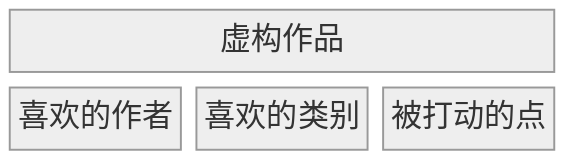
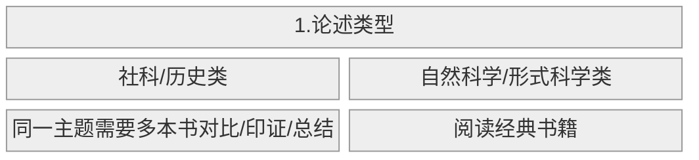
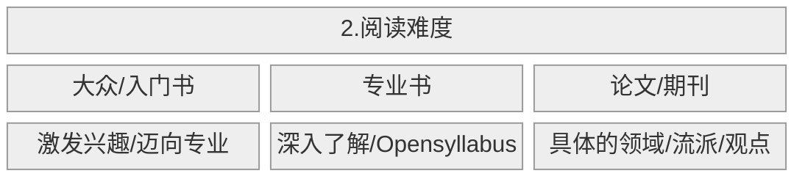

## 引言：为什么要读书？

><mark>书籍的本质是沉思，它就像知识储备的压舱⽯，可以帮助我们在信息洪流中保持⼼态的从容，远离信息过载的焦虑</mark>[^批注5]。

[^批注5]: 再次强调书籍的优先性高于线上文章

作者的工作流参考了 GTD 思想：

1. 收集
2. 处理：未读书库是什么/为什么需要它/如何管理它？
3. 计划
4. 执行
5. 回顾：怎么做读书笔记
6. 输出：怎样把阅读阅读所得切实运用起来

## 1. 收集

### 1.1 认知层面：如何确定待读书籍？

作者认为，与书交流是比与人交流更为方便经济的认识自我的方式。那么，如何找到适合自己的书籍：

- 去（独立）书店翻找真实的书籍
- 他人推荐
- 自己的兴趣：<mark>从一个节点出发，跟随自己的兴趣，总会抵达某处。回头再看来时寻找的路，都是每个人独有的经验，而非弯路 
- 积累、维护自己关于阅读的信息渠道：同一作者/同一系列/好的书评人主页

### 1.2 工具层面：用什么工具将所有待读书籍统一收集到一处[^批注1]？

[^批注1]: 目前我的存书量并不多，暂时用不到这一点

- 有灵活的添加方式：可以从图书资源添加、根据 ISBN 添加，也可以批量添加；
- 对数据有完全的自主权，不用担心一些书籍没有收录或者被下架，也可以自定义新的字段辅助管理。所有字段可以自行修改，不用担心无法修改「读过」的时间；
- 可以批量下载图书元数据，减少人工工作量；
- 有良好的图书资源管理机制：如果图书书目和资源分开管理，将使得维护成本大幅提高；
- 有强大的数据组织能力：可以方便地查看封面、标题、作者等各种信息，可以自定义栏目并进行多维度筛选，可以设置层级标签；
- 书目能够导出，可以与笔记系统打通。

## 2. 处理[^批注2]

[^批注2]: 同 1，目前只需要明确一点，即读的书越多，相对应的不懂的知识就越多，如图所示：
通过快速阅读，判断书一本书的种类，其实就是在训练自己的信息抽取能力，这本身也是一种知识的能力体现。

## 3. 计划

### 3.1 为什么需要制定年度阅读计划？

- 有助于构建个人知识框架
- 根据阅读的难易程度确定阅读顺序
- 养成良好的阅读习惯

### 3.2 如何制作阅读计划？

1. 明确自己希望了解的主题
  a. 长期关注的领域是否存在一些需要深度探究的方向
  b. 近期的困惑/关注点
2. 针对主题设置书单
3. 选取一些主题之外的书籍阅读，避免信息茧房和培养更多元、立体的思考
4. 如果书单过长，也要适当删减，原则为：
  a. 保证广度
  b. 保证书籍的内容质量
  c. 找到长期/中期/新方向的平衡点

### 3.3 如何选择阅读主题

作者把书单主要分为**虚构类**和**论述类**。

对于论述类作品，按照类型和难度[^批注3]两个角度筛选：
[^批注3]: 最好的专业入门书籍是大学基础课课本

## 4. 执行：几个坚持阅读的方法

几个对我比较有启发的点：

- 不必死磕一本书，实在读不下去就放弃这本书，但是不要放弃阅读的习惯
- 同时阅读几本难度不同的书
- 追踪读书进度

## 5. 回顾

作者把从书中摘抄出来的内容称为原子笔记：

- 对原子笔记的重点进行渐进式阅读
- 不必吃透整本书，只要确保提取的部分可以运用到目前现有的知识体系即可

## 6. 输出

读完书，做完笔记，还要对新的体系进行输出。可以是写作/分享/决策[^批注4]

[^批注4]: 和[刻意练习](PKM-ref-认知模型.md)异曲同工

## 7. 在 AI 的大环境下，读书的意义究竟是什么？

既然现在有 ChatGPT, 还需要读书吗？
>我们需要有⾜够强的判断⼒去分辨，它究竟在⼀本正经地胡说⼋道，还是提供了⼀个可以相信的答案。或者需要有⾜够强的敏锐⼒去区分，哪些问题适合 ChatGPT 去解决，哪些不适合。

当 AI 进化为神，我们还需要读书吗？
><mark>真正的问题不是机器能否思考，⽽是⼈类能否思考。这个时代相⽐过往，更加要求我们去认识⾃⼰</mark>。
