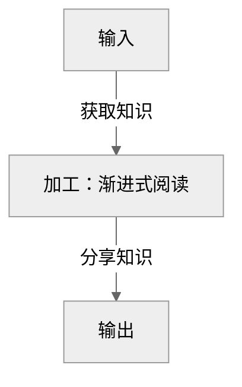

## What

## Why

* 简化工作流步骤能让我们在状态不好的时候更好地启动和执行
* 在简化的同时也要保证工作流的完整性

## Step 1: 输入

* 纸质书[^批注4]：
    1. 封面：写下吸引自己的页面+自己对内容的看法
    2. 封底：用自己的话总结书中要点+自己可以马上付诸行动的点
    3. 消化几天，然后进行写作输出，每本书只提取三点
* 文章：
    1. 有限输入：信息时代最大的挑战不是如何获取信息，而是如何把别人的知识内化成自己的知识[^批注5]
    2. 及时阅读
    3. <mark>读完并非结束，而是知识管理的开始！</mark>

## Step 2: 加工：渐进式阅读

 1. 确定信息源的位置，方便以后查找
 2. 对所有感兴趣的部分画线
 3. 第二遍阅读，对重点加粗
 4. 第三遍阅读，对重点高亮
 5. 用自己的话对加粗和高亮进行总结
 6. 重组输出：加入自己的想法/思考/例证/创造，见 Step 3 输出

## tips: 渐进式阅读

* 渐进式阅读可以分次分批完成，不需要追求一次完成[^批注1]，因为：
  * 知识的应用需要一定的时间去沉淀
  * 每次执行的心理压力不大，有更好的动力去执行
* 不是每篇笔记都需要走 6 步，要根据笔记的内容/质量/特点，有选择的记录，一切笔记形式以思考为主
* 1-4 最好都在同一个文档中进行，可以最大程度保留上下文语境
* 在执行 3/4 时，要不停的追问：「这对我有用吗？」而非「这是有趣的吗？」
* 在执行 5/6 时，要不停的追问：「我如何用它产生新的想法？」

## Step 3: 输出

如何检验自己对知识的吸收程度？不是搭建多么完善的笔记体系，而是：

* 能否应用到实际生活/工作[^批注2]
* 能否和自己现有的知识体系产生连接，用自己的话/自身经历进行输出，然后让其他人获取到你的知识点[^批注3]

[^批注1]: 所以管理项目卡是十分必要的
[^批注2]: i.e. MVP 法则
[^批注3]: i.e. 费曼学习法
[^批注4]: 很有意思的做法，将来阅读纸质书时尝试一下
[^批注5]: 好句