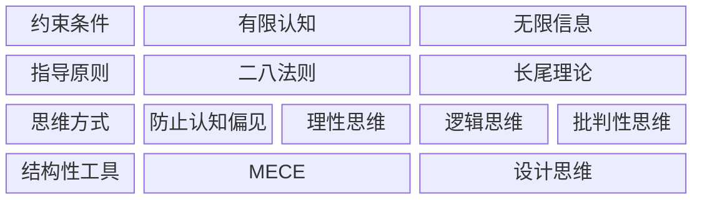

总结如下：

## 1) 约束条件

两点事实：

1. 人的认知是有限的[^9]
2. 外部的可能性/信息是无限的

为此，我们应该寻找高效的产出路径，指导原则应该是：

- 二八法则
- 长尾理论

对于当前有价值 (Value) 的事情，使用二八思维法则[^1]，不断地减小系统或环境阻力，最终实现自动化 (Automation)，找到可以实现最大产出的最小投入，从而确定最佳杠杆点 (Leverage)[^2]

对于尚未发现价值的事情，使用长尾理论，找到能够提升自己的利基产品[^3]

## 2) 思维方式

- 为了防止认知偏见，应该激活系统 2[^4], 从而保持理性思维[^5]
- 分析问题要讲究逻辑（经典逻辑理论[^6]+现代逻辑理论）
- 批判性思维[^7]

## 3) 结构化工具

4S 模型[^8]解决战略性问题：

- 使用 MECE 拆分问题
- 利用设计思维实现原型 → 测试 → 迭代的循环

[^1]: [book-@二八法则.md](book-@二八法则.md)：导致80%结果的20%的原因是什么

[^2]: [ref-战略性懒惰](ref-战略性懒惰.md)：三个生活哲学的关键词

[^3]: [book@长尾理论](book-@长尾理论.md)：利基产品

[^4]: [book-@思考，快与慢](book-@思考，快与慢.md)：制定系统 1 的 Check List

[^5]: [book-@谈谈方法](book-@谈谈方法.md)：符合客观事实；执行坚决；出现问题多找主观原因

[^6]: [book-@简单的逻辑学](book-@简单的逻辑学.md)：逻辑三律 + 充足理由律

[^7]: [book-@学会提问](book-@学会提问.md)：有没有歧义/谬误/替代理由/缺失信息

[^8]: [book-@像高手一样解决问题](book-@像高手一样解决问题.md)

[^9]: https://www.bilibili.com/video/BV1AStozWELF/?spm_id_from=333.1387.favlist.content.click&vd_source=bfb2e50dad8e670124c382656b85473e ：认知负荷模型
