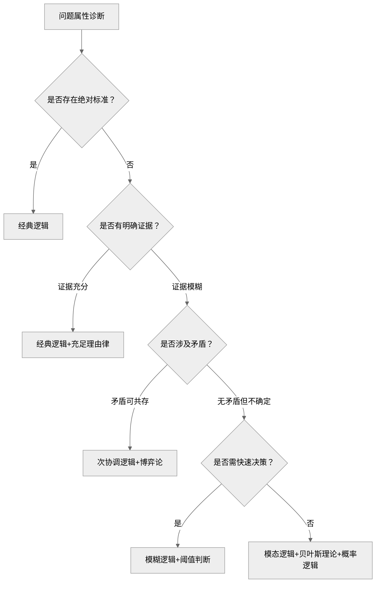

## 1) 传统逻辑学 vs. 现代逻辑学

在传统逻辑学[^1]领域，理性的宇宙观如下：

- 亚里士多德：提出了传统逻辑三律，确定了逻辑的二元性
- 莱布尼茨：补充了充足理由律，从此逻辑具有了偶然性

然而，现实世界是动态、模糊、矛盾、连续、量子的，二者的差异如下：

| 四大定律   | 是什么？           | 与现实的矛盾点                   |
| ---------- | ------------------ | -------------------------------- |
| 同一律     | 预设概念绝对不变   | 现实中的对象可能随时间或语境变化 |
| 矛盾律     | 要求绝对无矛盾     | 现实中存在辩证矛盾               |
| 排中律     | 强制二值（真/假）  | 现实存在模糊状态或不可判定命题   |
| 充足理由律 | 因果论是逻辑的基石 | 休谟质疑理由只是经验的联想       |

对我而言，最重要的是需要知道自己在什么情况下使用哪种类型的逻辑工具箱，Deep Seek 给出了一套方法论：

发现逻辑缺陷的过程，也是一步一步逼近真理的过程：

正如《宁静祷文》中所说：

> 亲爱的上帝，
>
> - 请赐给我雅量从容的接受不可改变的事（即容忍可控的矛盾）
>
> - 赐给我勇气去改变应该改变的事（分权重/优先级逐步处理）
>
> - 并赐给我智慧去分辨什么是可以改变的，什么是不可以改变的（接受逻辑无法闭环的可能性）

为此，问自己三个问题：

- 我的焦虑源于追求不可能的逻辑闭环吗？→ 这个选择在现有证据下最优，但接受未来证伪可能
- 此刻该用经典工具维稳，还是现代工具纳新？→ 接受逻辑缺陷
- 如果永远找不到充足理由，我仍愿选择它吗？→ 接受论点：并非凡事都有理由

## 2) 认知锚点

与其他书籍的关联如下：

- 人类倾向于使用系统 1. 只有当系统 1 出现认知负荷，才会去调用系统 2. 换言之，系统 2 的理性思考来源于系统 1 的直觉[^2]
- 使用批判性思维，大胆怀疑，小心求证[^3]
- 贝叶斯脑：经验/直觉相当于先验假设，使用理性分析后，得到后验概率[^4]

## 3) 现代逻辑学书籍推荐

**1. 《逻辑学：一点点就够》 (Graham Priest)**

- **推荐理由：** 你已经知道传统逻辑太理想化，这本书会告诉你逻辑学是如何处理“矛盾”、“模糊”和“未来”的。它会向你展示除了二元论之外的**多值逻辑、模态逻辑**
- **核心收获：** 现实中的模糊性也是可以被逻辑符号化的

**2. 《策略思维》(Thinking Strategically) —— 阿维纳什·迪克西特 / 奈尔伯夫**

- **推荐理由：** 它是博弈论的经典科普。它不会教你复杂的数学公式，而是教你如何用逻辑去预测对手的行动，如何在信息不完全的情况下做决策
- **核心收获：** 验证你关于“博弈是逻辑在社会层面应用”的想法，学会“向前展望，向后推理”

**3. 《系统之美》(Thinking in Systems) —— 德内拉·梅多斯**

- **推荐理由：** 你在提问中提到“已知和问题会随时间、地点改变”。这其实是**系统思维**的范畴。这本书会教你如何看清事物背后的反馈回路（Feedback Loops），而不仅仅是因果直线
- **核心收获：** 理解为什么逻辑推导在复杂系统中往往会失效（因为存在延迟和非线性反馈），学习如何与不确定性共处

**4. 《纳瓦尔宝典》或《穷查理宝典》**

- **推荐理由：** 既然你已经读了《思考，快与慢》这种学术底蕴深厚的书，这两本属于“实战派”的逻辑思维应用。查理·芒格提出的“多元思维模型”正是将你读过的所有书（脑科学、博弈论、心理学、逻辑）缝合在一起的终极形态
- **核心收获：** 学习如何像一个智者一样，在现实世界中灵活运用这些“理想化模型”

## 4) 从逻辑学到博弈论

与 AI 对话后得出的有关博弈论的新洞见：

* 博弈论的本质：在社会层面，不断地通过逻辑推演，在不确定性中寻找纳什平衡[^5]
* 博弈论是三个学科的交叉点：
	* 逻辑学
	* 概率论
	* 心理学
- 博弈论不仅要研究“我知道什么“，更要研究”我知道你知道我知道什么“

[^1]: [book-@简单的逻辑学](book-@简单的逻辑学.md)

[^2]: [book-@思考，快与慢](book-@思考，快与慢.md)

[^3]: [book-@学会提问](book-@学会提问.md)

[^4]: [book-@脑科学讲义](book-@脑科学讲义.md)

[^5]: [book-@博弈论与生活.md](book-@博弈论与生活.md)
