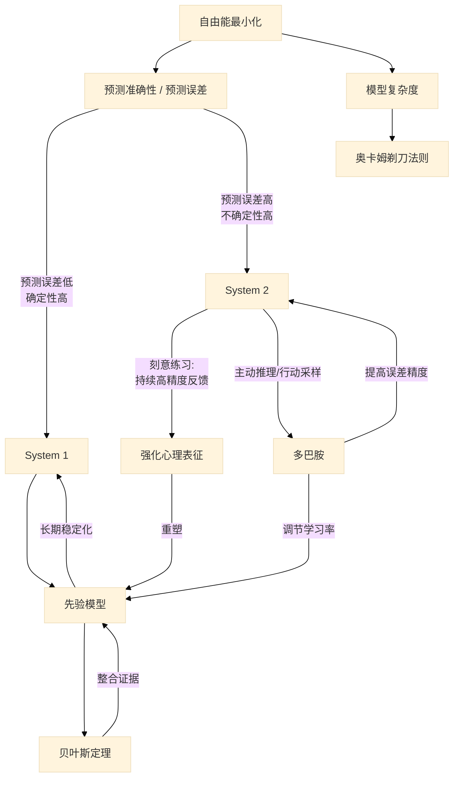

# 认知科学逻辑链

## 1. 问题描述

这篇笔记想要解决的问题是：

以下概念：

- `奥卡姆剃刀原理`
- `贝叶斯理论`
- `多巴胺`
- `双系统`
- `自由能`
- `刻意练习`

它们的关联是什么？如何形成一条逻辑链的？

## 2. 我的初步理解

我对于单个概念的一些理解：

> - 大脑：是一台预测机器，面对感官输入它要做各种预测，从而形成最合理/最优的决策，最后转化为行动
> - 自由能：相当于变分的贝叶斯公式，可以表示为预测误差 + 复杂度，大脑总希望自由能最小化
> - 贝叶斯公式：后验概率 ＝ 先验概率 × 似然函数
> - 多巴胺：大脑的奖赏系统，是驱使人类学习和行动的动力来源
> - 奥卡姆剃刀原理：对于两个相似的推断，人们总是偏爱相信相对简单的那一个
> - 双系统：系统 1 主管情绪/态度/生理性活动。当系统 1 出现认知困难，系统 2 开始接管，使用理性的、大量耗能的方式进行决策
> - 刻意练习：一种使用系统 2 的方法论，通过保持专注（focus），获得反馈（feedback）以及持续修正（fix），最终不断强化自己的心理表征，或者说内化成系统 1 的生理性/自动化的反应

基于此，逻辑链如下：

> 当人类在思考/决策/分析时，本质上都是在进行预测
>
> 根据自由能公式，大脑很懒，它总是希望在尽可能少耗能的同时，又可以尽可能准确的进行预测
>
> 而自由能公式的本质是贝叶斯理论
>
> 那么，以贝叶斯公式为锚点进行展开：
>
> - 先验概率：系统 1 产生的情绪/态度/立场/心理表征会形成我们的第一印象
> - 似然函数：大脑通过感知系统得到的输入
> - 后验概率：更新后的认知
>
> 奥卡姆剃刀原理可以算是先验概率的基石，一开始我们的大脑总是会不自觉地启动系统 1, 进行不耗能的判断
>
> 这里就出现了一个问题：当先验概率和似然函数差距过大，大脑应该相信谁？
>
> 这时，就轮到多巴胺出场了
>
> 当人类的期望高于预估，多巴胺就会疯狂分泌，从而促使我们进行学习/行动，这是就会启动系统 2
>
> 正所谓实践是检验真理的唯一标准，只有实践过后，我们才会知道之前的预测是否正确，从而进行下一轮决策
>
> 而一个很好的进行实践的方法论，就是刻意练习

## 3. 认知盲点

这样的逻辑老实讲我自己都很难说服自己，于是问了 ChatGPT, 它告诉了我存在哪些认知盲点

### a) 贝叶斯公式

漏掉了一个关键参数：精度/权重/方差

所谓精度，指的是我对这个信息的确信程度：

- 先验精度高 → 我更相信自己原来的先验模型
- 感官精度高 → 我更相信当下输入（即似然函数）
- 两者都不高 → 进入探索/不确定状态

更新后的贝叶斯公式应该是：

`后验概率 = 先验概率 × 先验精度 × 似然函数 × 似然精度`

所以，贝叶斯公式讨论的是`先验模型该不该更新`的问题

### b) 多巴胺

根据贝叶斯公式，当新证据（即感官输入）与先验产生的预测不相符时，产生预测误差，即：

`预测误差 = 感官证据 - 先验模型`

而多巴胺奖励的是预测误差（Reward Prediction Error）：

- 比预期好 → 多巴胺上升
- 符合预期 → 基线
- 比预期差 → 多巴胺下降

同时，多巴胺还会负责预测误差的精度调配，告诉大脑哪些预测误差值得学习，哪些只是噪声

所以，多巴胺讨论的是`模型应该以何种幅度更新`的问题

### c) 双系统

之前对于双系统的理解过于粗浅

从预测加工的角度看：

- 系统 1: `被自由能最小化长期验证过的`
- 系统 2: `在不确定性下高精度更新机制`

### d) 刻意练习

AI 的回答我认为很好：

刻意练习的本质就是`用高精度误差，重塑低精度但稳定的先验模型`

### e) 奥卡姆剃刀法则

为什么说剃刀法则是自由能原则的结果？

AI 给出了解释：

`剃刀法则说的是，在预测能力相同的前提下，复杂模型会付出额外代价`

自由能 = 预测误差 + 模型复杂度

因此，低复杂度的模型会胜出

## 4. 模型总结

### a) 初步总结

在与 AI 深度对话后，我的总结如下：

> 首先，生物的本能是自由能最小化原则：减少不确定性与系统复杂度 
>
> 如何减小系统复杂度？这里我们遵循的是奥卡姆剃刀原则：在预测能力相同的前提下，复杂模型会付出额外代价（即更多耗能） 
>
> 再来说如何不确定性，或者说是预测误差 对于未知的事物，我们存在两种情况：高确定性状态与低确定性状态  
>
> 对于高确定性状态，我们使用贝叶斯理论进行推断，其中先验概率源自我们由系统 1 形成的、经过自由能最小化原则长期验证过的先验模型；似然函数就是我们的感官输入，或者叫做证据。似然和先验的差值被称为预测误差。预测误差的精度调配由多巴胺完成。最后，根据似然和先验的权重高低来决定我们是更相信模型还是证据；  
>
> 对于低确定性状态，我们使用主动推理：大脑出现认知困难，开始调用系统 2 搜集高预测误差的证据。而刻意练习是实现系统 2 流程的一套不错的方法论。本质上，刻意练习所谓的强化心理表征，就是用高精度的预测误差不断校正先验模型的过程

### b) AI 校正

AI 对我的总结提出了校正：

- 自由能不是本能，而是`约束条件`
- 确定性与不确定性是可以`互相转化`的，并非二元对立
- 多巴胺并非负责全部精度调节，更准确的说法是，负责`价值、行动、学习律`相关的精度调节

### c) 终极版本

AI 给的最终版本是：

生物系统受到`自由能最小化`的硬约束：为了维持自身稳定，必须在预测准确性与模型复杂度之间取得平衡。

在预测能力相同的前提下，复杂模型需要更高的维护成本，因此自由能最小化自然导向`奥卡姆剃刀`式的模型偏好。

不确定性并非二元状态，而是连续变化的。当预测误差的精度较低时，大脑主要依赖由`系统 1 `形成、经过长期自由能最小化而稳定下来的先验模型，通过`贝叶斯推断`整合感官证据进行快速决策。

当预测误差精度被调高、或不确定性持续存在时，大脑会调用`系统 2`，采用高成本但高精度的推理与行动采样机制。`多巴胺`在其中调节哪些预测误差值得被学习，从而影响学习率与模型更新幅度。

`刻意练习`是一种人为设计的环境，通过持续提供高精度、可校正的预测误差，迫使系统 2 反复介入，逐步重塑先验结构，最终将高成本的认知过程压缩并内化为系统 1 的自动化反应

用 mermaid 语法可以表示为：

## --- 参考笔记 ---

[book-@刻意练习](book-@刻意练习.md)

[book-@思考，快与慢](book-@思考，快与慢.md)

[book-@脑科学讲义](book-@脑科学讲义.md)

[book-@贝叶斯定理](book-@贝叶斯定理.md)

[ref-人性矩阵系列-05-大脑](ref-人性矩阵系列-05-大脑.md)

[ref-人性矩阵系列-06-认知](ref-人性矩阵系列-06-认知.md)

