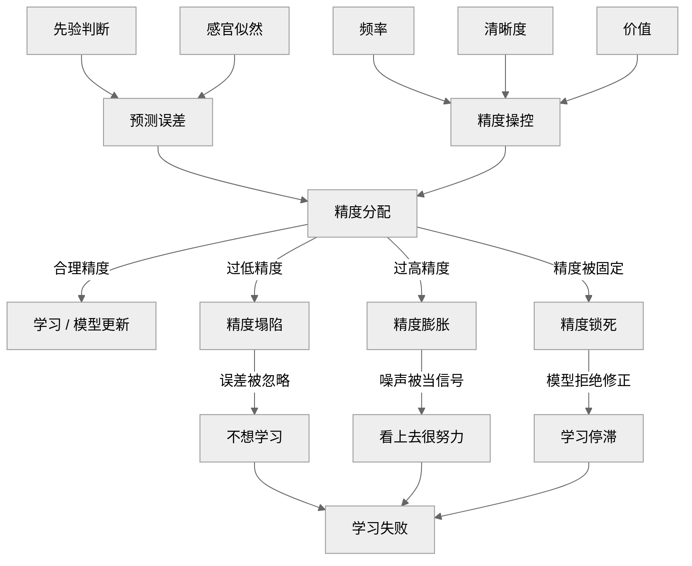

在 atom-26-04 中讨论了大脑是如何分配预测误差精度的问题

这篇笔记讨论的是，“我”应该如何正确调用学习率，从而合理分配预测误差精度？

*注：前三章是我用自己的话把 AI 的总结又复述了一遍，最后一章是我的总结*

何为精度控制？

> 操控精度，从另一个角度来说，也是问题定义的本质：
>
> 对预测误差的边界设定，告诉自己哪些误差允许进入系统

我们的评判标准有三个：

- 误差是否出现（频率）
- 误差是否清晰（可归因？可修正？）
- 误差是否有价值（与生存/身份/奖惩绑定？）

下面分别说一下精度操控的三个类型

## a) 精度锁死

### 是什么

> 先验精度过高，使得反证全部被视为噪声

### 典型机制特征

- 标准答案 / 唯一正确路径
- 身份、道德、立场与观点绑定
- 错误被解释为“态度问题”而非模型问题

### 认知后果

- System 1 先验精度被拉满
- System 2 即使被调用，也只能做“辩护式推理”
- 学习停止，但主观确定性很高

### 生活实例

- 国内的应试教育
- 战狼自媒体：不谈问题只谈立场

## b) 精度通胀

### 是什么

> 过多、过快、过强的反馈，使大量低信息量误差被错误地赋予高精度

### 典型机制特征

- 高频即时反馈
- 强情绪绑定
- 不需要长期建模即可获得刺激

### 认知后果

- 多巴胺系统被训练去追逐“新奇”而非“结构”
- 慢变量（长期模型）精度被系统性压低
- System 2 变得难以长时间维持

### 生活实例

- 工作中的 KPI 指标
- 短视频
- 社交媒体点赞

## c) 精度坍塌

### 是什么

> 误差存在，但无法被定位、归因或修正，导致学习率被主动关闭

### 典型机制特征

- 延迟反馈
- 结果与行动弱相关
- 成败高度随机或被外部解释

### 认知后果

- 多巴胺系统放弃调制
- System 2 不再被调用

### 生活实例

- 犬儒主义
- 躺平主义
- 没干劲

## d) 总结

用一个模型总结：

ChatGPT 提醒我，要说有什么遗漏的话，可以加一个二阶修正项——情绪/生理状态：

> 在现实中，精度并不是纯理性分配的，而是强烈依赖于：
>
> - 疲劳 / 睡眠
> - 压力 / 威胁感
> - 安全感 / 控制感
>
> 在自由能框架下，这些状态会整体性地`抬高或压低精度阈值`
>
> 如果你愿意形式化，它大概是：
>
> - 不直接生成预测误差
> - 不直接操控精度
> - 而是`改变精度分配的默认增益`
>
> 不过我要强调：
>  **不加这个节点，你的逻辑仍然是自洽的**。
>  这更像是一个“二阶修正项”，而不是结构漏洞。

结合我自己的经历：

- 我的国内教育：标准答案，应试教育 → 精度锁死
- 我的国外教育：问题导向，贴合世界 → 合理精度
- 少看短视频/电子榨菜：否则一味接受刺激/噪声，不加思考 → 过高精度
- 鼓捣笔记软件和插件：重视工具而忽略了笔记内容本身 → 过高精度赋予工具而非笔记对象
- 定期回顾：追踪反馈，检查结果与行动是否一致 → 预防过低精度
