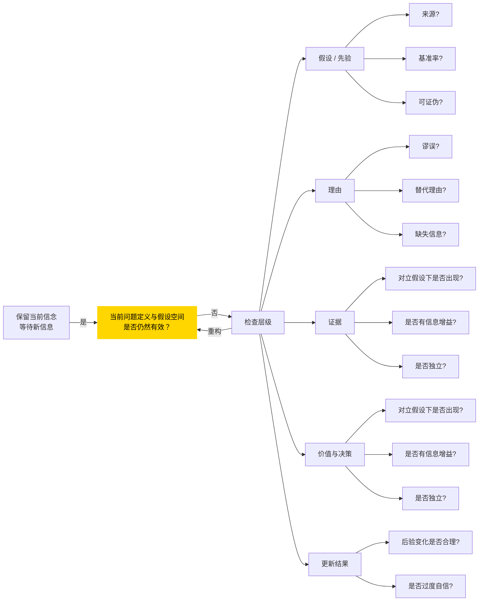

## 0. 初始问题

[book-@学会提问](book-@学会提问.md)这本书的核心概念是批判性思考，这与贝叶斯思想[book-@贝叶斯定理](book-@贝叶斯定理.md)不谋而合

我们总说，提出一个好的问题远比得到答案重要

贝叶斯定理不是为了证明某个假设正确的可能性，而是通过不断增加信息修正假设

所谓的批判性思考，就是不断通过更新的信息，完善问题描述的过程

那么，批判性思考/提出正确问题与贝叶斯的关系是什么？

## 1. 初始理解

我的理解如下：

首先，贝叶斯理论的局限性在于，只能在已有的假设集合上进行更新，而批判性思考则允许接受“论题尚未定义清晰”这样的观念，即重构假设空间本身

其次，批判性思考通过以下几点，为贝叶斯理论创造了使用的前置条件：

- 问自己假设/猜想（assumption）是什么？以及为什么我会形成这样的 assumption？
- 问自己议题（issue）的论证过程中，理由（reason）是否存在谬误/替代理由/缺失信息/模糊，从而明确假设空间是否完整

接着，问自己议题的论述过程中，证据（evidence）的精度如何：

- 如果论题的对立面成立，该证据是否依然出现？如果出现，说明其和论题的相关性不高
- 这个证据在区分假设时，是否存在信息增益？是否属于噪声？

还有，批判性思维还要考虑现实中价值体系对权重分配的影响：

- 不可能有 100% 的正确或者错误，我们能做的只是在这二者之间不断地调整自己的概率权重
- 相同的后验概率，对应不同的价值体系，会导向完全不同的行动方案

最后，不断地重构假设，更新先验，实现动态迭代

## 3. 认知差距

在和 AI 多次对话后，发现其实贝叶斯思想其实是批判性思维中的一部分，于是更新问题：

贝叶斯思想到批判性思考中间的差距有哪些？

> - 批判性思考不是一套步骤，而是一种持续检查“问题—信息—信念”是否对齐的机制
> - 贝叶斯更新只是其中一个局部工具，用于在**问题尚且成立时**调整信念强度
> - 一旦任何环节显示失配，理性行为不是继续更新，而是退回去重构问题本身 

## 4. Checklist

AI 回答如下：

> **A. 问题定义层**
>
> - 这个议题是否被过早二分？
> - 是否存在未被提出的第三种解释？
> - 这个问题是否值得当前投入的认知成本？
>
> **B. 假设 / 先验层**
>
> - 我的核心假设是什么？
> - 这个假设来源于经验、统计，还是情绪与身份？
> - 是否考虑了基准率？
> - 假设是否可被证伪？
>
> **C. 论证结构层**
>
> - 理由是否存在逻辑谬误？
> - 是否存在被忽略的替代理由？
> - 假设空间是否被人为收窄？
>
> **D. 证据评估层**
>
> - 在对立假设下，该证据是否仍常出现？
> - 是否真的提供信息增益？
> - 多条证据是否信息独立？
>
> **E. 更新与决策层**
>
> - 后验变化是否与证据强度匹配？
> - 行动是否受价值权重影响？
> - 错误代价是否对称？
>
> **F. 迭代与停止**
>
> - 是否需要重构问题本身？
> - 是否继续更新，还是暂时搁置？
> - 当前不确定性是否被诚实保留？

AI 为我补充了五点内容：

> 1. 基准率（base rate）是多少——防止罕见事件被情绪放大，问自己“如果我完全不知道这个具体案例，仅仅基于历史频率，我会给它多大的概率？”
> 2. 证据是否独立——问自己“这些证据在信息源上是否真正独立？如果不是，我是不是在重复更新？”
> 3. 假设是否被设计成不可证伪——“在什么情况下，我会明确降低对这个假设的信任？”
> 4. 要区分“信念更新”与“行动阈值”——“如果我错了，代价有多大？这种代价是否对称？”
> 5. 信念更新不是无休止的——“我现在是在获得新信息，还是只是在反复加固已有立场？”

## 5. mermaid 图表

最后，整个思考过程用图表可以表示为：

这个图表始终围绕一个核心问题——当前信念是否仍然配得上现有信息？

换句话说就是：

我是不是在用一个已经过期、过窄、或带偏见的问题框架看事情？

为此，结合批判性思考的内容，可以从 5 个层面检查

同时，设置了 idle 状态，如果没有新信息，就保持当前信念

AI 总结道：

> 如果把这整套系统翻译成人话，它其实是在不断问一句话：
>
> **我现在看到的不适感，是因为信息更新，
>  还是因为我一开始问错了问题？**
>
> - 如果是前者 → 留在检查层级里更新
> - 如果是后者 → 回到核心，推倒重来
> - 如果两者都没有 → 安静地等待新信息

