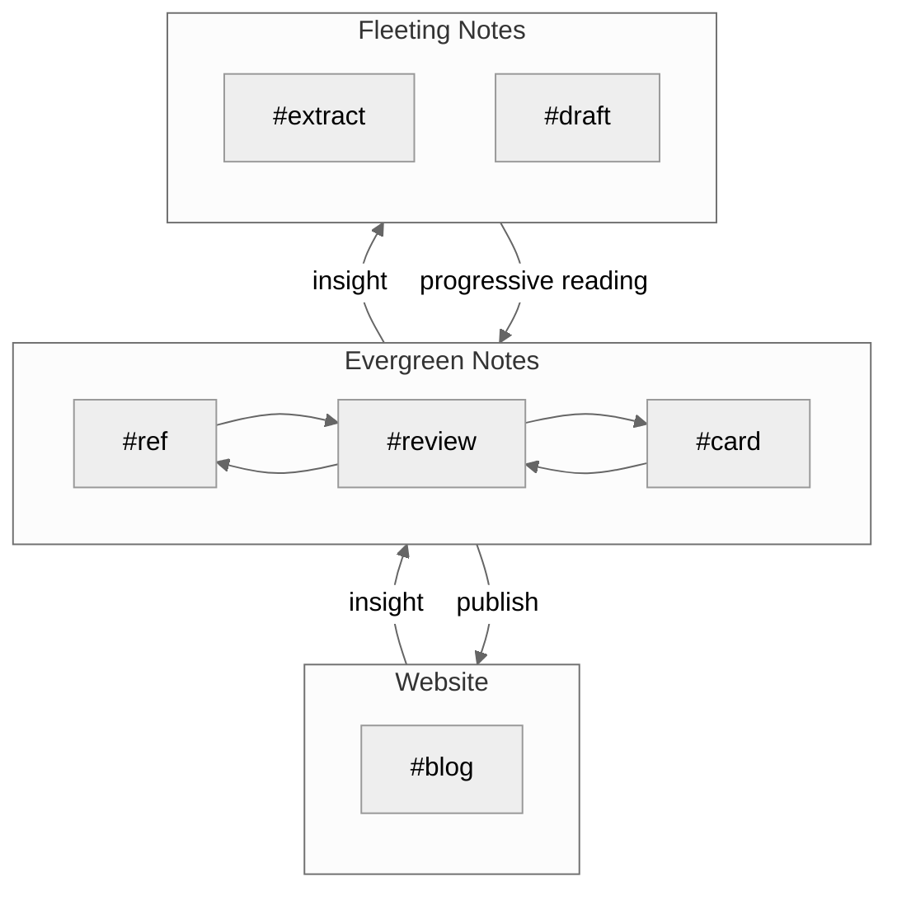
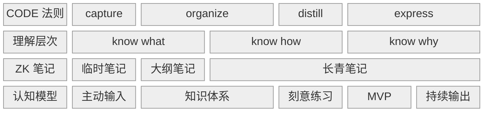
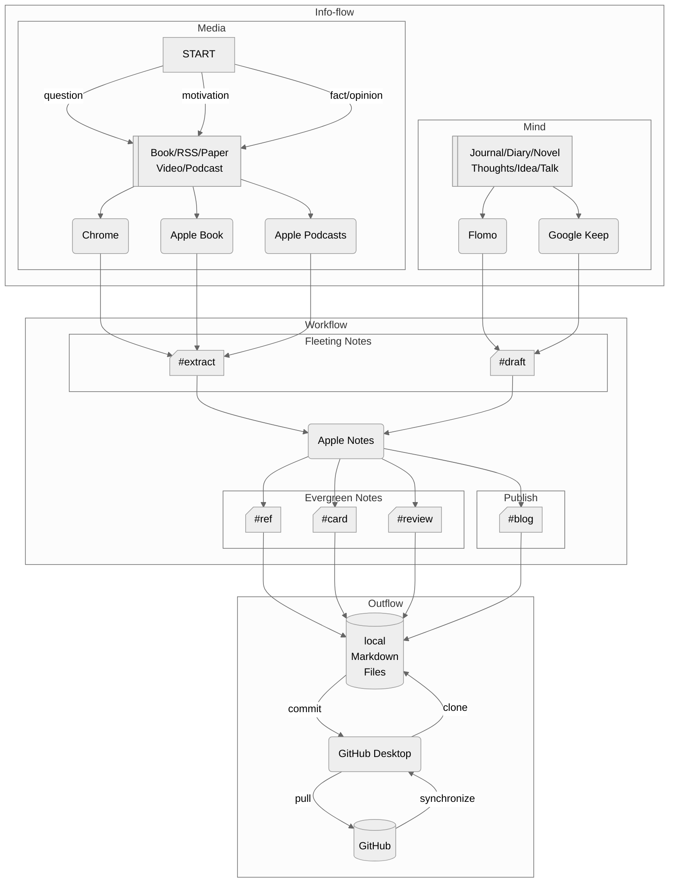
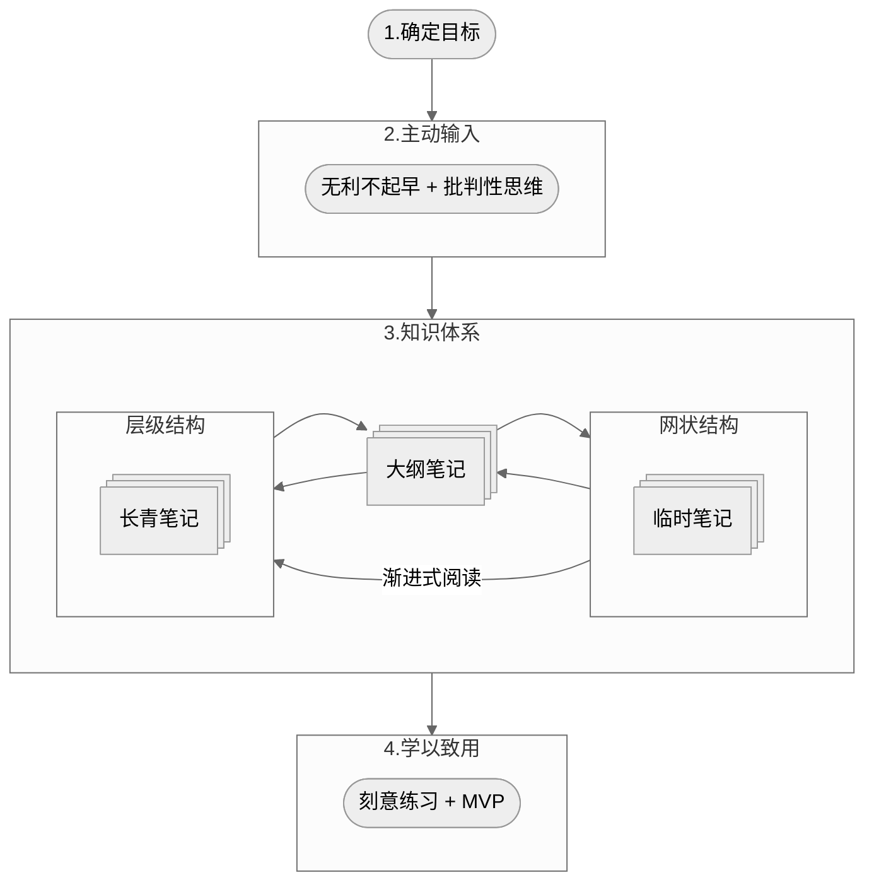
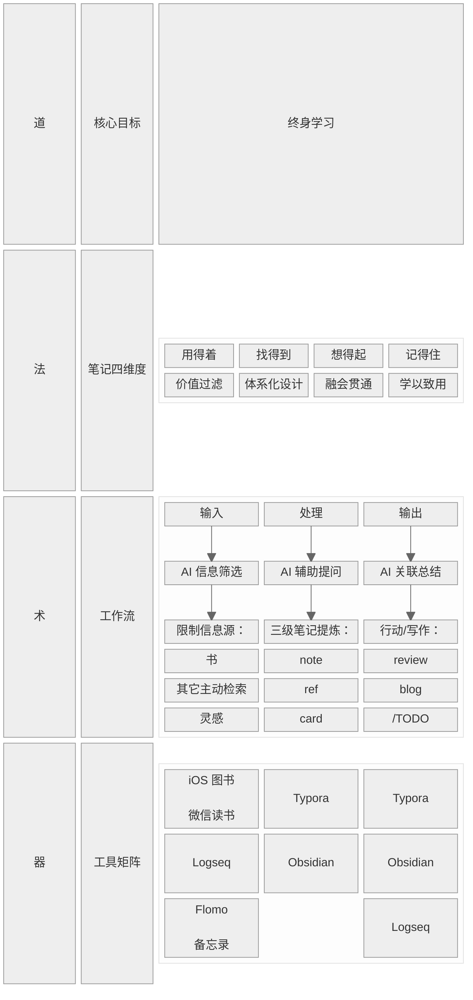
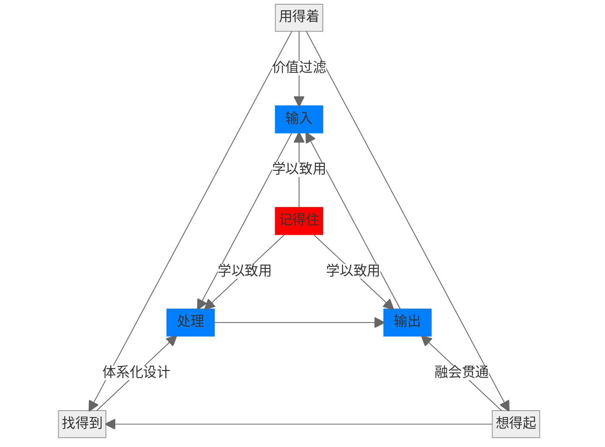
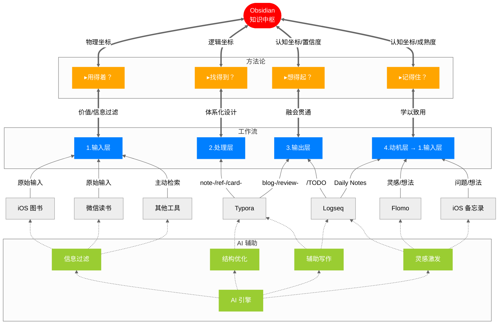
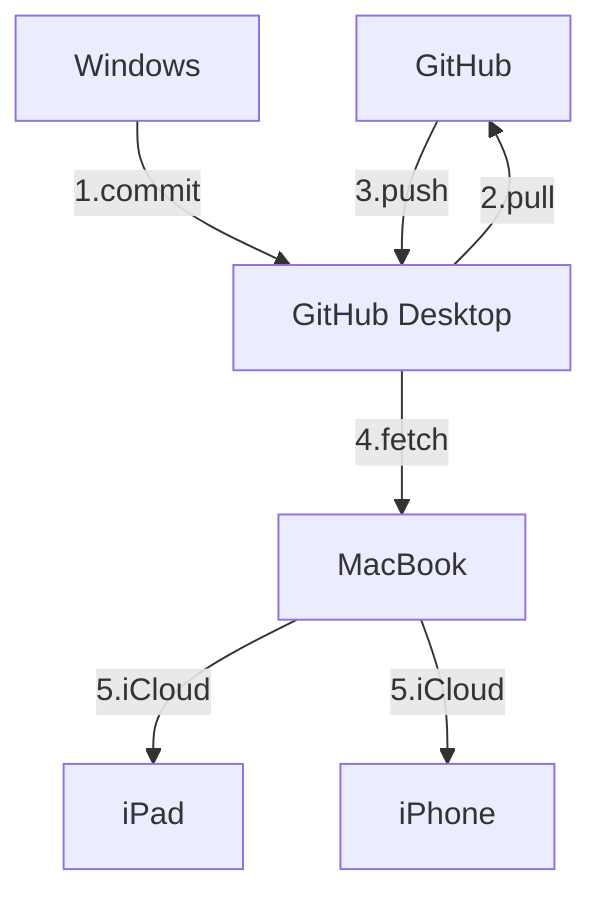

---
date:2026-01-06
---

# 2024-11-17

## 0. 引言

一个好的知识体系可以用 12 个字概括：

1. 用得着
2. 想得起
3. 找得到
4. 记得住

多于三个的复杂流程会让我失去执行的动力，因此，我把知识管理系统的建立分成三步：

1. 输入
2. 加工
3. 输出

其中，「输入」要解决的问题是如何用得着，或者说「哪些内容应该被记录在知识库中」；「加工」要解决的问题是如何想得起/找得到，或者说「如何记录新知识，并且在需要的时候能被快速检索出来」；「输出」要解决的问题是如何记得住，或者说「如何将新知识纳入现有体系」。

由于输入的内容都是信息，因此我把输入称为信息流。加工和输出的过程分别称为工作流和输出流。接下来，我就分别从需求和工具两个角度，依次介绍一下这三个流程。

## 1. 信息流

### 1.1 信息的分类

我把信息源分为两类：

- 客观存在的第三方媒体，比如书籍/资讯/视频/论文/播客...
- 主观产生的灵感，比如自我的想法/与他人的交流...

对于媒体，我参照[ref-把阅读作为方法：从选书到笔记的经验分享](ref-把阅读作为方法：从选书到笔记的经验分享.md)中提到的观点：

> 书籍帮助我们在信息洪流中保持⼼态的从容，远离信息过载的焦虑

要系统的学习知识，书籍永远是第一选择。当然，对于一些粗颗粒度的知识，视频/播客/在线文章等是很好的途径。不论是何种信息源，我们应该做到「主动输入」，即在对信息进行加工之前，先筛选信息。

### 1.2 信息的筛选

在筛选信息时，用批判性思维看待检索结果：

- 以「解决问题」为导向：学习是为了解决问题
- 判断：「这是事实还是观点」

如果检索内容是事实，那么我们就能以此为基础进行延伸；如果检索内容是观点，那么我们就要进行交叉验证。

## 2. 工作流

在接受信息源之后，下一步就要对其中的信息进行归纳总结。这便是我的工作流。

### 2.1 我的笔记分类

在[!review-PKM](!review-PKM.md)中，我总结了网上的一些笔记方法。再次重申，知识体系的构建分为两种：

1. 自上而下的「层级结构」
2. 自下而上的「网状结构」

两种结构没有绝对的对错之分。实际上，根据使用场景的不同，二者应该是共存的关系：

- 想要系统地从零开始学习一门学科，层级结构显然更合适
- 如果是阅读论文等细颗粒度等内容，此时我们已经对这类知识有一个大概的轮廓认知。自下而上的层级结构更有助于知识点之间的发散和连接

据此，我把笔记分为三种：

1. 临时笔记
2. 大纲笔记
3. 长青笔记

#### # 临时笔记

临时笔记就是在接受信息源后，第一时间记录的内容。按照信息源的类型，我把临时笔记分为两种类型：

- 主观产生的 draft
- 客观存在的 extract

#### # 长青笔记

正如[ref-三种卡片类型](ref-三种卡片类型.md)中所说：

> 临时笔记的最终归宿都应该是长青笔记。

关于临时笔记如何变成长青笔记，已经在中[card-渐进式阅读](card-渐进式阅读.md)说过，在此不再赘述。

长青 (Evergreen) 一词参考了花园浇水的过程。只有不停地灌溉，植物才能永葆长青。同理，当临时笔记变成长青笔记后，不应该被放置一处，不再做任何改变。原因如下：

- 一方面，回顾长青笔记，寻找其中的关联，会产生新的想法；
- 另一方面，新知识与长青笔记的碰撞也会产生新的灵感。实际上，这个过程就是把新知识逐渐转化为自己已有知识的过程。

我把长青笔记分为两种类型：

- 对于一家之言的观点，标签为 ref
- 对于客观存在的事实，标签为 card

#### 大纲笔记

事实上，大纲笔记应该也算作长青笔记的一种。之所以单独列出来，是因为相比上一节提到的单纯记录内容的 ref/card，大纲笔记兼具管理/检索/记录灵感的功能：

- 对相同主题的 ref/card 内容进行总结/类比/归纳，并打上标签 review；如果存在「组块」(chunk)，也可以创建新的 card 笔记
- 日常的所思所想/日记等，为未来的长青笔记留出空位

从这个角度看，大纲笔记也是层级结构和网状结构的连接/平衡点。

## 3. 输出流

单纯把新的知识记录下来而不使用，这是没有意义的。其实古人早有一个成语概括，那便是「学以致用」。这里我从[ref-认知训练模型](ref-认知训练模型.md)得到了刻意练习和最小可行性系统这两个很重要的概念。于是，根据知识的类别，可以分为两种方式：

- 对于偏理论的知识，使用「费曼学习法」，从「5W1H」六个维度，用自己的话总结概念
- 对于偏实践的知识，使用「刻意练习」+「MVP」

最后，自己总结的经验/概念，写成博客发布，并打上 blog 标签。

事实上，完全可以把知识库的输出当作是个人版的 GPT，整个写作的过程就是在逐层递进的问自己为什么。 通过 Q&A 不断训练自我，强化知识的理解。

## 4. 总结

### 4.1 各类标签和笔记的关系图

### 4.2 CODE 法则

### 4.3 实现信息流与工作流的工具与标签

这里主要从以下两篇文章中总结而来：

- [ref-打造个人工作流-系统篇](ref-打造个人工作流-系统篇.md)
- [ref-打造个人工作流-认知篇](ref-打造个人工作流-认知篇.md)

### 4.4 工作流总览

### 4.5 对引言的回答

Q1: 哪些内容应该被记录在知识库中？

A1: 主动输入：以问题为导向 + 批判性思维

Q2: 如何记录新知识，并在需要的时候快速检索？

A2.1: 临时/长青笔记：渐进式阅读

A2.2: 大纲笔记：管理/检索/预留灵感

Q3: 如何将新知识纳入现有体系？

A3: 费曼学习法 + 刻意练习 + MVP

# 2024-11-24

近年来，随着 notion/obsidian 等一众新型笔记软件井喷式的出现，让知识管理变得丰富了起来。在[ref-打造个人工作流-认知篇](ref-打造个人工作流-认知篇.md)中，作者认为笔记软件属于特殊的一类工具软件，因为它们往往自带一套方法论。例如，如果使用 OneNote 就必须接受它提供的自上而下式的层级结构。随着层级结构越来越深，笔记也越记越乱。因此，当「双链」这个功能伴随着「卡片盒笔记法」这个概念横空出世，看着那一团知识网图，没有人会不为之心动。

然而，正如[ref-请不要神化双链笔记-少数派](ref-请不要神化双链笔记-少数派.md)所说，双链并不能反映链接之间的主次关系。如果不按照一定的结构去管理，知识体系绝不会自己生长出来。

而我在实践之后，也不禁要提出以下几个疑问：

- 卢曼搞学术研究是否能和我们的日常生活划等号？
- 卢曼的社科研究是否也可以用于其他领域？
- 卢曼生活的年代是否有其科技发展的局限性？
- 网上吹捧的卡片盒笔记法是否全部反映了卢曼的笔记思路？

同样地，在以下三篇中，作者也没有完全参照卢曼的卡片盒笔记法，而分别根据自己的需求进行了适当的简化：

- [ref-极简三步-我的个人知识管理工作流-少数派](ref-极简三步-我的个人知识管理工作流-少数派.md)
- [ref-巧用分类法解决使用卡片笔记时遇到的困境-少数派](ref-巧用分类法解决使用卡片笔记时遇到的困境-少数派.md)
- [ref-三种卡片类型](ref-三种卡片类型.md)

不可否认，卡片盒笔记法提供了一种全新的「自下而上」的知识体系管理思路。然而，我们不应该一股脑的就把这种方法奉为圭臬。更理性的做法，是根据自身的需求，<mark>在「自上而下」和「自下而上」之间找到平衡点</mark>。

---

# 2024-11-30

在 [blog-我的知识管理-笔记篇](blog-我的知识管理-笔记篇.md)中可以总结以下论点：

1. 使用主动输入过滤信息源
2. 使用渐进式阅读让来自第三方信息源的临时笔记变为长青笔记
3. 大纲笔记是实现层级结构和网状结构知识体系的平衡点
4. 使用主动输出让新知识归入现有知识体系之中

由此，可以提取六个知识点：

- 长青笔记
- 大纲笔记
- 渐进式阅读
- 知识体系
- 主动输入
- 主动输出

我使用长篇幅去论述的，是前四个点；然而今天我突然意识到一个问题：我们总是妄想把所有看到/听到的内容记录下来放在一处，然后在需要的时候拿出来。可事实上，大部分表象的问题都可以通过网络搜索解决。没有自己的思考，把信息放在笔记中（即使它已经被总结/归纳/对比/验证，可是它并没有为我所用）和放在网络中是没有区别的。从一定程度上来讲，只要知识能够为我所用，那么有没有笔记也是无所谓的。因此，<mark>笔记只是知识体系的一种形式，要杜绝形式上的完美主义</mark>。我们不应该期望通过输入和加工得到输出。相反，是输出决定了输入，进而决定了在加工过程中笔记的形式。

# 2025-05-15

以下体系：

- [blog-我的知识管理-笔记篇](blog-我的知识管理-笔记篇.md)
- [blog-@review-我的知识管理-最小可行性系统回顾](blog-@review-我的知识管理-最小可行性系统回顾.md)

已经实施半年有余，最近再回顾一下。

这些方面做的不错：

- 主动输入：阅读书籍为主，中长视频和 AI 为辅
- 主动输出：使用快捷指令复制读书笔记模版，使用 vscode 的 markdown 功能填写模版内容
- 既保证了数据的本地化，又可以同步到 iCloud 和 GitHub

这些方面不尽如人意：

1. 单纯的 markdown 文件只能记录文字，目前记录的文件大多为很有框架/条理的读书笔记，缺少一些灵感/想法/思路/工作/生活的记录
2. 缺少像 notion/obsidian 等笔记软件的 dataview （管理/追踪/回顾）功能
3. ios 备忘录在大部分情况下仅作为备忘录使用
4. flomo 的使用频率逐渐减少，也许是因为其使用场景大多为手机端

**如何解决第一个痛点**？

出于以上动机，选择 logseq 作为补充。logseq 的定位是 outliner，即大纲，是一条串起思路的线。logseq 的优势在于不需要考虑把笔记放到哪里，可以做到打开软件无压力记录。当然，后面还是要定期对日志中的内容进行分类。结构化/体系化的文字表达形式应该依然由 vscode 完成。因此，可以把 logseq 作为 review 类文档的「碎片」。事实上，这篇文档也正是我在 logseq 中记录的 PKM 相关内容的集合。

那么 logseq 的使用场景为：

- 记录：使用日志记录每天的所思所想
- 回顾：利用双链/图谱定期回顾想法
- PKM 的输出应该从工作和生活两个方面展现。因此，一旦 PKM 中的知识被应用，应该使用一款软件进行记录

目前 logseq 的 Pages 分为以下几类：

- 行动类的 TODO/DOING/DONE
- 书籍类：关联主题，列出行动
- 主题类：关联书籍，形成树状知识体系

**如何解决第二个痛点？**

尝试使用了以下几款软件：

- 无边记
- notion
- anytype
- calibre
- zotero

然而效果都不尽如人意。主要是目前的管理项目成本太高。创造书籍条目，添加元数据，再分组查看，这些更多的是形式主义。后来想想，其实就目前而言，logseq 的主题目录就已经足够。当然，对于 anytype 或者 notion 的探索不应该就此打住。关于个人生活的项目管理，使用 anytype/notion 是完全可行的，只是不在本次的 scope 中罢了。

.md 文件优点是可靠且容量小，缺点是不容易浏览。思维导图刚好可以弥补这一缺憾。今天刚好发现了一个在 vscode 中很不错的插件，可以把 .md 文件在线预览为思维导图！可惜仍然存在不足：

- 链接无法跳转
- 无法渲染 mermaid

不过这样也倒逼我做一些改变（当然现在想想也很值得）：

- 对于读书笔记的文档，建立两种标签：
  - note: 记录高亮/笔记
  - ref: 系统化地总结全书
- 对于这两类标签，尽量不用图表/mermaid, 每一行的字不要太多，多使用子标题
- 对于 card 类文档，尽量使用 mermaid 进行可视化，这样便于查看和理解
- 定义 review 类文档的作用：搜集 topic, 有点类似于 blog 但是以日期为子标题，更多的是为了记录一个思考的过程。另外，一些在视频或者其他地方看到的信息，如果值得记录，也会加入到 review 中

**关于第三点...**

其实现在我也不那么 care 备忘录具体记录什么东西了。我把它简单的分了四个文件夹：

- Fleeting
- prog. Reading
- Distill
- Archive

其实就是对应了 GTD/CODE/PARA 的原理。任何我想到的东西，都可以迅速记录在备忘录中。Archive 的标志是，它的内容被记录到 docs 的文档中。

**总结：**

目前的常用工具有：

- iOS 图书：电脑/移动端（手机+平板）阅读书籍+导出高亮文字和笔记
- iOS 备忘录：移动端的灵感记录+碎片化捕捉
- vs code：电脑端编写读书笔记 (ref)+发布博客 (blog)
- logseq：电脑端记录日志+碎片化信息整理+为博客提供大纲 (review)

做读书笔记应该是把新知识纳入自己知识库的第一步。用王阳明的话说，叫做要做到「知行合一」。这里的行指是批判性的思想，也可以是行动，或者一次写作。

# 2025-05-18

最近看到了两篇不错的文章：

- [透过信息架构 看各笔记软件](https://sspai.com/post/76736)
- [笔记的策略：文件夹、标签、链接、冗余和可靠性](https://sspai.com/post/98086)

与其他视频/文章不同，这两篇文章并没有从具体的软件出发，而是从更高的一个维度去看待笔记/知识库。以下是一些总结：

**记笔记/知识库的原则是什么？**

- 记笔记只是第一步，你的最终目标还是要完成工作/生活中的具体任务/项目，实现你的目标
- 笔记系统的原则：简单/易维护
- 知识库的作用是为了帮助我们完成记忆的工作

**《信息架构：超越 web 设计》是如何对信息结构进行分类的？**

信息结构分为三大类：

- 层级结构（即文件夹）
- 数据库（元数据管理）
- 超文本/网状结构（单链/双链/反链）

通常在知识库中，这三种结构要结合使用：

- 先设计层级结构，但其深度和广度不宜太多
- 多用数据库
- 超文本用作层级结构或数据库的补充

另外，以下系统可以用作补充：

- 标签：信息环境中更大的信息块，用于粗颗粒度的检索+快速分类
- 导航：引导用户在网络中访问的系统
- 搜索：信息检索

**如何设计标签系统？**

- 避免过多使用标签，定期 review/简化你的标签系统
- 避免在正文中使用标签
- 少使用嵌套标签
- 标签的命名要简短且准确
- 把标签作为数据库中的一种元数据（logseq 目前使用双括号[[]]作为标签）

# 2025-05-26

最近似乎终于找到了 GitHub project 以及 issues 的正确用法：

- 为每一本书建立一个 issue, 加入主题/作者/进度/类别等标签和元数据，实现图书管理和总览
- 然后再使用 vscode 打开相应的 note/ref 文档，预览思维导图模式进行查阅

一言以蔽之，文档的记录使用 vscode + logseq, 书籍/主题的管理使用 GitHub.

# 2025-06-13

对 DeepSeek 的使用场景愈发和我对于文档的分类清晰：

- note 是阅读完书籍后形成的渐进式总结
- ref 是根据 note 的内容，辅以 DeepSeek 形成的系统化总结
- card 分为两种，通常以 mermaid 语句呈现：
  - 一种是根据 note 和 ref 的内容，精炼而成的原子笔记，记载了书籍中最核心的观点/内容
  - 另一种是在 B 站看到的值得三连的视频/公开课，由于其本身已经高度结构化，只需要提炼其最核心的观点即可

以同心圆描述三者的关系：card 是最核心的内容，由内至外分别为 card-ref-note.

**如何使用 card?**

- 每个 card 拥有若干主题，主题使用标签来描述
- 若干 card 描述同一主题，该主题可以汇总为 review
- 同样地，在 review 中也许会发现某些 card 之间的联系，形成新的 card 或者体系
- 若干 card 可以作为 blog 写作的大纲，使用 AI 辅助写作。备选 AI 有：
  - Refly
  - NotebookLM
  - DeepSeek

# 2025-06-21

在和 DeepSeek 讨论关于笔记软件的对话中产生了一些灵感，遂把这些想法记录下来：

刚才说的算是打造个人知识库的一个方面：工具篇。按照黄金圈法则，这算是 How 层面的东西，或者按照道法术器的角度，这算是术/器的层面。刚才所有的提问，归根结底是在问：**为了打造知识库，我需要记笔记，那么应该用什么样的笔记软件来实现这一功能？**

至于 Why/道层面，我的目标是很明确的：成为一名终身学习者，通过不断的主动学习去认知这个世界，也认知自己，然后始终以开放的心态迎接生活。打造个人知识库是我实践主动学习的表现，记录的笔记是学习的结果。而我打造知识库的目的则是使用个人知识库辅助我更好地思考问题。

此外，我还有自己一套法/术层面的东西：如何打造个人知识库？按照 MECE 拆分法则，可以把这个问题拆解为：如何通过以下维度处理笔记？

- 用得着：记录的东西应该是有价值的，现在和未来能够用得到的东西
- 想得起：遇到新知识/输入可以做到和已有知识体系产生联想
- 找得到：能够通过一套体系化的设计，在用到笔记是相对迅速的找到笔记
- 记得住：这里并不是在过分强调记忆力。事实上随着年纪的增大，记忆力显然会衰退；而这正应该是打造知识库的一个原因。所谓记得住，我更多的是强调要做到融会贯通，也就是用最基本的描述去**理解**概念（费曼学习法）

为此，我的知识库工作流分为三个阶段：

- 输入
- 处理
- 输出

关于输入...
在 VUCA 时代更要严格限制输入。实际上，尽管网络上的信息越来越花哨，我认为书依然是最好的信息源，因为它显然经受住了时间的考验。基本上每看完一本书，这本书中提到的一些参考书籍就是我下一本要看的书了。慢慢地，横向类比和纵向延申，我相信可以形成一张大的知识网络。此外，主动寻找信息源：也就是要带着问题去检索。看完书以后，对哪些知识点/观点有疑问，主动搜索谷歌/B站，然后把它们的观点收纳进来。
以上，可以解决**用得着**的问题

关于处理...
这里就涉及到如何处理笔记了。我的原则是：把书读厚，然后再把书读薄。要做到这点，我会为每本书创建三个 markdown 文件：

- note 记录在读的过程中画出的高亮部分
- ref 是系统化的总结全书（核心观点/重要概念/全书架构/写书的现实意义/作者背景）
- card 是结合 note 以及 ref 形成的最核心的部分，大多使用 mermaid 语法，用一张图表示出来
  三个文档代表了对书籍的三种程度的理解，我把 note/ref/card 称为三种读书笔记的 type. 以上，通过 typora 的沉浸式写作体验，可以解决**找得到**的问题
  此外，Obsidian 支持 yaml 语法。利用这一特点，我为每个 card 文档添加元数据（标签/作者/日期...）。此外，它还具有强大的 dataview 和双链功能，可以形成知识图谱，可视化笔记之间的联系，这就解决了**记得住**的问题
  最后，虽然 note/ref/card 都是对一本书记的笔记，我只选择给 card 文档添加元数据，但是三个文档统一使用type+书名命名，可以让我在还没有打开文档之前就大概知道这些笔记是关于什么的。而我回顾时，会先看 card 类型，然后再看 ref，如果哪里不太清楚，再返回 note 中寻找。这样就完成了note/ref/card 之间的双向循环。
  以上，可以解决**找得到**的问题。 

关于输出...

- 每读完一本书，记录采取的行动 (logseq/obsidian)
- 当 card 积攒到一定数量，发现 card 之间的 insight，融会贯通，对某一特定主题进行写作，并加入 type: review (logseq/obsidian/typora)
- 对于纯文学类书籍，可以写观后感/读后感，加入 type: blog (logseq/obsidian/typora)
  此外，灵感的来源是基于现有的认知，这既是输出，也是下一次写作/行动的输入(logseq/flomo/iOS 备忘录)

最终，我可以形成输入→处理→输出→再输入的循环体系。

# 2025-06-22

## 0. 总览

这次，我从“道→法→术→器”的角度对知识库体系再次更新。这个表是我在拥有了大概 40+ 笔记后做的总结：

由于兼顾了视觉上的美观和整洁，还需要用文字补充说明表中不够清晰的关系(*注：引用代表该部分是 AI 辅助写作原文*):

- 法与术的对应关系
- 器与术的对应关系
- AI 在整个体系中的作用

接下来分章节对上述三点进行说明。

## 1. 法-术的对应关系

1. 输入阶段（限制信息源）→ 保障“用得着”：
   - 通过严格筛选书籍和主动检索，确保输入的信息具有长期价值
   - AI 在信息筛选阶段的作用是：
     - 可信度评估
     - 知识坐标定位

2. 处理阶段（三级笔记提炼）→ 实现“找得到”和“记得住”：

   - note/ref/card 的三级结构提供了体系化的组织方式（找得到）：
     - note: 捕获书中重要的原始信息
     - ref: 对全书进行解构 → 重组
     - card: 将知识内化为可理解、可复用的模型（记得住）

   - AI 在处理阶段的作用是：
     - 辅助提问：帮助深化思考（如生成批判性问题）
     - 辅助总结：帮助建立连接（如跨领域链接），促进融会贯通

3. 输出阶段（行动/写作）→ 达成“学以致用”（即“想得起”和“记得住”）：
   - 通过 review/blog 等输出形式，将知识与实际应用场景结合
   - 通过 /TODO 记录行动，将知识转化为行为改变
   - AI 在辅助总结阶段的作用是：
     - 帮助生成行动要点
     - 帮助形成写作框架

## 2. 术-器的对应关系

1. 输入阶段工具：
   - iOS图书/微信读书：获取高质量书籍内容（用得着）
   - Logseq：记录临时灵感（通过 daily notes），作为输入缓冲区
   - Flomo/备忘录：快速捕获碎片灵感，经过筛选后进入正式处理流程

2. 处理阶段工具：
   - Typora：用于沉浸式撰写和提炼 note/ref/card，其流畅的书写体验有助于专注思考（记得住）
   - AI 工具在撰写过程中提供实时辅助

3. 输出阶段工具：
   - Typora：用于撰写长文（review/blog）
   - Obsidian：通过知识图谱和全局搜索实现知识的快速检索（找得到），并通过可视化关联促进知识联想（想得起）
   - Logseq：管理行动项（/TODO），将知识转化为行动（学以致用）

## 3. AI 的跨层级增强

1. > 在输入阶段，AI 不仅是信息筛选器，还通过预读生成问题框架，为后续处理阶段做准备（提前激活“想得起”）

2. > 在处理阶段，AI 的辅助提问和总结不仅作用于当前笔记，还会主动关联知识库中的已有内容（如提示与某card 的关系），强化“找得到”和“想得起”

3. > 在输出阶段，AI 的总结功能会识别行动模式和知识应用点，形成闭环反馈，进一步优化输入（如推荐相关新书）

## 4. 图表总结：两个关键循环

> 整个体系形成一个增强回路：
>
> 输入（高质量）→ 处理（深度提炼）→ 输出（有效应用）→ 通过AI和工具强化各环节 → 产生更多高质量输入（如写作引发的新问题/行动中产生的新灵感）。这样，图表中分开的四个层级和各个模块，通过上述关系紧密连接为一个有机整体。

最后，用 mermaid 图表表示法-术之间的对应关系：

我用两个三角矩阵展示了工作流与笔记四维度的对应关系：

- 外圈是法层四维度
- 内层是术层工作流

这里着重强调了记得住，因为它是这两个所有循环的驱动核心：我们记笔记最终的目的是要**学以致用**。

实际上，上图中的”记得住“蕴含一个前提，即出于什么样的原因让我开始想去检索笔记？可能是一个问题，也许是一个突发的灵感，或者是一个对输出结果的批判性观点。这里统一叫做动机。所以，除了输入/处理/输出以外，我增加了一个**动机层**。**动机是输出的结果，也是新输入的开始，如此就可以形成工作流的循环。**这张图展示了工具矩阵是如何支撑起工作流与笔记四维度的：

这套体系的特点是：

- 以 Obsidian 为中枢，驱动工作流的进行，其它工具对应服务于各项流程
- AI 为增强引擎：我刻意使用虚线表示 AI 对工具的影响，是为了说明 AI 仅仅是辅助，还是要以人的判断为主
- 四维度作为标准评判笔记的质量

以上，**不同的工具对应不同的心流状态**，让我更好地形成自己的知识体系。

# 2025-07-12

截止今天，我一共产出了 49 篇笔记：

- 6 篇 blog
- 12 篇 card
- 8 篇 note
- 23 篇 ref

我把这 49 篇笔记系统地进行了分类，分别放在四个 review 中：

- PKM
- 社会可续
- 问题解决
- 自我管理

于是，现在笔记变得有结构了起来：

- README 中放所有 review
- review 中放同类型的 card/blog
- review 的作用有两种：
  - 充当 card/blog 的 MOC
  - 记录该主题下的所思所想，当其篇幅足够长时，便可产出为 blog
- note/ref 产出 card/blog, 不再对其进行细分
- 由于 review/note/ref/card/blog 都在同一个文件夹中，因此所有笔记是相同层级的，相互之间是可以引用/链接的，于是避免了分类导致的知识边界

---

# 2025-07-21

从[blog-君主论](blog-@君主论-认知领土拓展.md)中提取了「AI 雇佣军」的概念，要警惕 AI 的双重面孔：

| **工具性价值**   | **认知侵蚀风险** |
| :--------------- | :--------------- |
| 信息检索加速器   | 削弱信息溯源能力 |
| 模板化方案供应商 | 僵化问题解决思维 |
| 语言修饰助手     | 弱化逻辑自洽训练 |

需警惕*依赖雇佣思考者的人，永远在焦虑中等待崩溃*

---

# 2025-07-23

今天发布了一篇[博客](blog-我的知识管理-纸质记录篇.md)，列举了纸质笔记的应用场景和使用方法。其中提到：

>A6 负责记录：
>
>- 关系图谱/头脑风暴
>- 行动追踪
>- 概念定义

目前暂时还没有应用行动追踪。对于概念定义，这比较符合线性的书写习惯，暂无额外的想法。

对于关系图谱和头脑风暴，最终还是要归档到数字笔记中，形成规范的文档。此外，<mark>有必要找到一种方法，把所有的批判性思维（质疑/联想/类比）集中一处 ，最好以可视化的形式展现出来，因为这些才是我独一无二的产出</mark>。随着积累的知识越来越多，有必要形成类似思维导图的层级结构，同时又不能局限于思维导图，需要更灵活地展现各个知识点之间的关联。一个好的关系图谱应该包括两点：

- 清晰明确的关系展现：**父子/同级**
- 知识点和知识点之间需要必要的**文字和箭头说明**

最近尝试了以下方法：

1. 白板类：使用插件 Excalidraw (以及高阶版的 Excalibrain)
2. 使用笔记作为 MOC, 在笔记中插入：
   - markmap 代码
   - mermaid 代码
   - 使用插件把 markdown 笔记当作 mindmap 查看
   - 表格

根据前面提到的两点的标准，对这些方法进行打分：

| 展现难度      | 白板类 | 思维导图 | mermaid | 表格     |
| ------------- | ------ | -------- | ------- | -------- |
| 父子关系      | 低     | 低       | 低      | 无法实现 |
| 同级关系      | 低     | 无法实现 | 低      | 低       |
| 文字/箭头说明 | 低     | 无法实现 | 高      | 低       |
| 排版/语法     | 高     | 低       | 高      | 无       |
| 加载卡顿程度  | 中     | 高       | 低      | 无       |
| 可视化程度    | 高     | 中       | 高      | 低       |
| 未完待续...   |        |          |         |          |

---

# 2025-07-24

最近开始在移动端（iPad mini 7/iPhone 13）使用 obsidian, 遂产生了同步的新需求：如何在移动端更好地同步笔记？之前的同步方案已经在[这里](blog-我的知识管理-笔记篇.md)给出。我还是更习惯使用 Windows 电脑进行编辑。现在把_Aleph 文件夹放在了 MacBook 的 Obsidian 应用程序文件夹中，这样就可以通过 iCloud 实现电脑和移动端的同步了：

1. 在家中使用 Windows 电脑编辑然后把笔记同步至 GitHub
2. 使用 MacBook 从 GitHub Desktop fetch 云端笔记，作为补充编辑选项（外出/旅行）
3. 使用 iCloud 同步移动端笔记

于是现在的方案如下：

需要说明的是，笔记加工的主力军还是电脑，移动端仅作为阅读使用。这套方案唯一的阻碍就在于，每次使用 Windows 电脑编辑完，还需要在 MacBook 中使用 GitHub Desktop fetch 一次。 

---

# 2025-08-25

### a) CODE 和 DIKW 的对应关系

以前：依次对应

现在：E 不一定对应智慧，消化之后的表达可能只是浅层的知识，需要不断迭代 CODE 才能最终形成智慧

### b) 笔记工具箱

以前：Flomo + Logseq + Obsidian + 备忘录

现在：舍弃了 Flomo 和 Logseq，改用纸笔进行一元化记录 —> Pocket 活页整理 —> 输入知识库  —> Personal 活页消化树状知识并记录 Bridge Notes + Pocket 记录原子笔记

### c) 备忘录结构优化

以前：Fleeting  —> prog. Reading  —> Distill —> Archive

现在：inbox  —> mini essay  —> archive

Inbox 作为收集箱，mini essay 为特定主题的大纲

### d) 关于 Distill

- 让 AI 精简数字笔记内容，打印至 Personal 活页
- 提炼关键概念，抄写至 Pocket 活页形成原子笔记

### e) 关于知行合一

- 知对应 Zettelkasten
- 行对应 PARA
- 知与行需要 LYT 结合：
  - 创建 MoCs
    - 以主题为导向
    - 以问题为导向
  - 创建 Bridge Notes 专门总结批判性思考：
    - 双栏布局
    - 对话式笔记：正题/反题/合题

### f) 关于认知负荷

以认知负荷理论为基础，打造知识库：

- 最小化外在负荷
- 最大化相关负荷

### g) DKIA 模型

结合目前已有的知识点，创造自己的人生模型：DKIA (Drive-Knowledge-Integration-Action)

- Drive Layer
  - Meta-Tool
    - Critical Thinking
    - 80/20 法则
  - Floyd 心理人格结构：自我/本我/超我
  - 精力金字塔：意志/思维/情绪/体能
  - Cogito
- Knowledge Layer
  - DIKW
  - Feyman
  - Zettelkasten
- Action Layer
  - 指导思想
    - 刻意练习
    - 锚点思维
  - 实现方式
    - PARA
    - CODE
- Integration Layer
  - MoCs
  - Bridge Notes

Drive 驱动 Knowledge 和 Action, Knowledge 和 Action 通过 Integration 连接，Integration 反馈给 Drive.