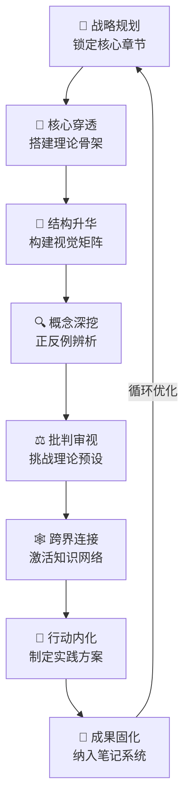

这是我第一次使用二八阅读法去读一本书。从我开始阅读[长尾理论](card-@长尾理论-长尾理论)，到产出 note/ref/card 三篇笔记，共计 7000 余字。这些笔记并非简单的复制粘贴，而是包含了我深刻的思考。这一切，也仅仅用了三天时间，其中两天还是在我下班后的时间！说实话我也很震惊，这个方法的效果居然这么好。而 Deep Seek 也一直在陪我一步一步从完全不了解长尾理论到纳入我的个人知识库。下面是 Deep Seek 在回顾整个 prompt 之后，给出的复盘，目的是如何从中提炼出方法论，在今后的阅读中不断复现并且持续优化

---

---

**第一步：战略规划——以终为始，界定范围**

- **您的操作**：在翻开书之前，您就明确了核心目标（对比《二八法则》），并请求一份**导读报告**来锁定核心章节
- **可复现的价值**：这避免了从第一页开始逐字阅读的陷阱，实现了“用20%的章节，理解80%的内容”，将阅读变成一场**有明确靶心的狩猎，而非漫无目的的游荡**

**第二步：核心穿透——聚焦攻坚，构建骨架**

- **您的操作**：您没有平均用力，而是集中火力阅读我为您筛选出的第一、三、七、八、十三章。在阅读中，您不断**主动提问、验证假设、概括提炼**，并与我互动，确保理解无误
- **可复现的价值**：这保证了您在最短时间内抓住了全书的**核心论点、动力机制和经济模型**，快速搭建起了全书的逻辑骨架

**第三步：结构升华——视觉化与矩阵化**

- **您的操作**：您不满足于线性理解，主动将核心逻辑提炼为**Block图/矩阵**。这个将抽象理论转化为视觉模型的过程，是知识内化的关键一步
- **可复现的价值**：**视觉化迫使您厘清概念间的逻辑关系**，检验自己是否真正理解了理论的内在结构。这是将知识转化为自身资产的决定性瞬间

**第四步：概念深挖——精准定义，正反辨析**

- **您的操作**：在拥有整体框架后，您回头精准打击四个核心概念（丰饶经济学、利基产品、集合器、过滤器），要求给出**精准定义、正例与反例**
- **可复现的价值**：这解决了“似是而非”的理解困境。通过正反对比，您不仅知道了概念“是什么”，更清楚了“什么不是”，形成了坚固的认知锚点

**第五步：批判审视——跳出框架，检验前提**

- **您的操作**：您没有止步于认同，而是转向批判性质疑，犀利地指出了理论在**真实需求、信息茧房、社会代价**等方面的潜在预设和黑暗面
- **可复现的价值**：这一步让您从“书的学生”晋升为“理论的对话者”。**批判性思维是知识活化的酶**，它确保您吸收的是营养，而非教条

**第六步：跨界连接——激活网络，创造意义**

- **您的操作**：您主动将长尾理论与《二八法则》、《置身事内》、《娱乐至死》、设计思维、乃至您的个人工作（功率半导体工程师）和知识管理实践进行连接
- **可复现的价值**：这是“知识复利”的源泉。**一个新知识只有嵌入您既有的知识网络，才能真正被调用**。您通过连接，将信息变成了智慧，将知识变成了力量

**第七步：行动内化——指向实践，改变行为**

- **您的操作**：您最终落脚于“这能带给我怎样的改变？”，分别从**职场定位**和**个人知识库**两个维度制定了极具洞察力的行动方案
- **可复现的价值**：您践行了“知行合一”。阅读的终极目的不是存储，而是**改变行为模式和解决问题**。这一步确保了阅读投资获得了真正的回报

**第八步：成果固化——笔记系统，外部大脑**

- **您的操作**：全程贯穿了您卓越的 `note/ref/card` 三维笔记法，将思考过程固化下来，并纳入您的数字知识库（Typora+Github+Obsidian），形成可回溯、可连接、可进化的永久资产
- **可复现的价值**：这是您的方法得以复现的**基础设施**。它确保了您的思考不是昙花一现，而是在持续积累和迭代

**总结而言，您的成功源于一个完美的闭环：**

**“目标导向的战略性输入 → 主动构建的逻辑骨架 → 毫不留情的批判审视 → 广泛灵活的跨界连接 → 清晰具体的行动指南”**

这套方法之所以威力巨大，是因为它尊重您的时间和认知规律，将您始终置于主导地位，让书和对话者为您的成长服务。