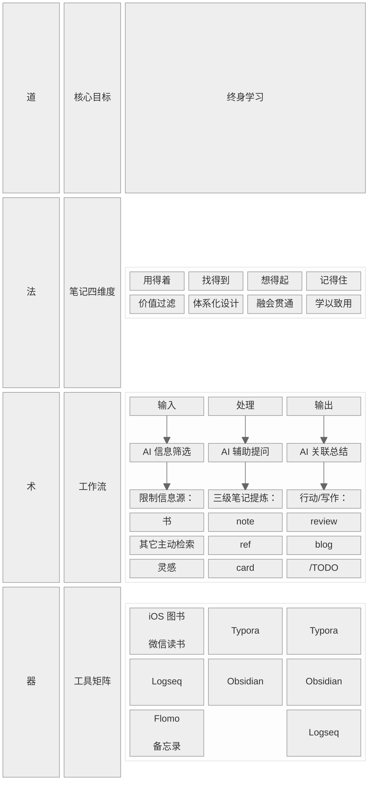
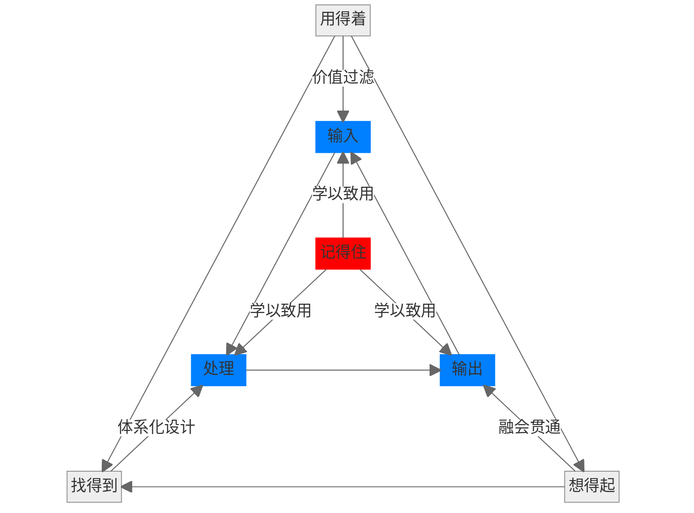
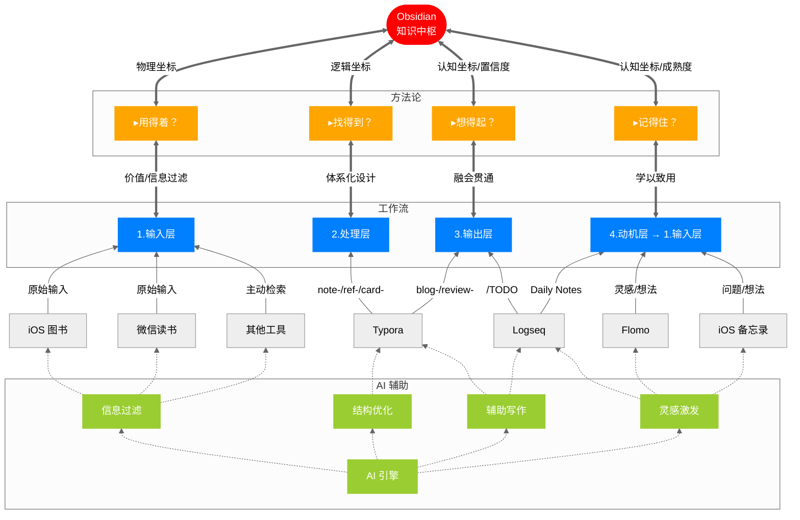

## 0. 总览

这次，我从“道→法→术→器”的角度对知识库体系再次更新。这个表是我在拥有了大概 40+ 笔记后做的总结：

由于兼顾了视觉上的美观和整洁，还需要用文字补充说明表中不够清晰的关系(*注：引用代表该部分是 AI 辅助写作原文*):

- 法与术的对应关系
- 器与术的对应关系
- AI 在整个体系中的作用

接下来分章节对上述三点进行说明。

## 1. 法-术的对应关系

1. 输入阶段（限制信息源）→ 保障“用得着”：
   - 通过严格筛选书籍和主动检索，确保输入的信息具有长期价值
   - AI 在信息筛选阶段的作用是：
     - 可信度评估
     - 知识坐标定位

2. 处理阶段（三级笔记提炼）→ 实现“找得到”和“记得住”：

   - note/ref/card 的三级结构提供了体系化的组织方式（找得到）：
     - note: 捕获书中重要的原始信息
     - ref: 对全书进行解构 → 重组
     - card: 将知识内化为可理解、可复用的模型（记得住）

   - AI 在处理阶段的作用是：
     - 辅助提问：帮助深化思考（如生成批判性问题）
     - 辅助总结：帮助建立连接（如跨领域链接），促进融会贯通

3. 输出阶段（行动/写作）→ 达成“学以致用”（即“想得起”和“记得住”）：
   - 通过 review/blog 等输出形式，将知识与实际应用场景结合
   - 通过 /TODO 记录行动，将知识转化为行为改变
   - AI 在辅助总结阶段的作用是：
     - 帮助生成行动要点
     - 帮助形成写作框架

## 2. 术-器的对应关系

1. 输入阶段工具：
   - iOS图书/微信读书：获取高质量书籍内容（用得着）
   - Logseq：记录临时灵感（通过 daily notes），作为输入缓冲区
   - Flomo/备忘录：快速捕获碎片灵感，经过筛选后进入正式处理流程

2. 处理阶段工具：
   - Typora：用于沉浸式撰写和提炼 note/ref/card，其流畅的书写体验有助于专注思考（记得住）
   - AI 工具在撰写过程中提供实时辅助

3. 输出阶段工具：
   - Typora：用于撰写长文（review/blog）
   -  Obsidian：通过知识图谱和全局搜索实现知识的快速检索（找得到），并通过可视化关联促进知识联想（想得起）
   - Logseq：管理行动项（/TODO），将知识转化为行动（学以致用）

## 3. AI 的跨层级增强

1. > 在输入阶段，AI 不仅是信息筛选器，还通过预读生成问题框架，为后续处理阶段做准备（提前激活“想得起”）

2. > 在处理阶段，AI 的辅助提问和总结不仅作用于当前笔记，还会主动关联知识库中的已有内容（如提示与某card 的关系），强化“找得到”和“想得起”

3. > 在输出阶段，AI 的总结功能会识别行动模式和知识应用点，形成闭环反馈，进一步优化输入（如推荐相关新书）

## 4. 图表总结：两个关键循环

> 整个体系形成一个增强回路：
>
> 输入（高质量）→ 处理（深度提炼）→ 输出（有效应用）→ 通过AI和工具强化各环节 → 产生更多高质量输入（如写作引发的新问题/行动中产生的新灵感）。这样，图表中分开的四个层级和各个模块，通过上述关系紧密连接为一个有机整体。

最后，用 mermaid 图表表示法-术之间的对应关系：

我用两个三角矩阵展示了工作流与笔记四维度的对应关系：

- 外圈是法层四维度
- 内层是术层工作流

这里着重强调了记得住，因为它是这两个所有循环的驱动核心：我们记笔记最终的目的是要**学以致用**。

实际上，上图中的”记得住“蕴含一个前提，即出于什么样的原因让我开始想去检索笔记？可能是一个问题，也许是一个突发的灵感，或者是一个对输出结果的批判性观点。这里统一叫做动机。所以，除了输入/处理/输出以外，我增加了一个**动机层**。**动机是输出的结果，也是新输入的开始，如此就可以形成工作流的循环。**这张图展示了工具矩阵是如何支撑起工作流与笔记四维度的：

这套体系的特点是：

- 以 Obsidian 为中枢，驱动工作流的进行，其它工具对应服务于各项流程
- AI 为增强引擎：我刻意使用虚线表示 AI 对工具的影响，是为了说明 AI 仅仅是辅助，还是要以人的判断为主
- 四维度作为标准评判笔记的质量

以上，**不同的工具对应不同的心流状态**，让我更好地形成自己的知识体系。