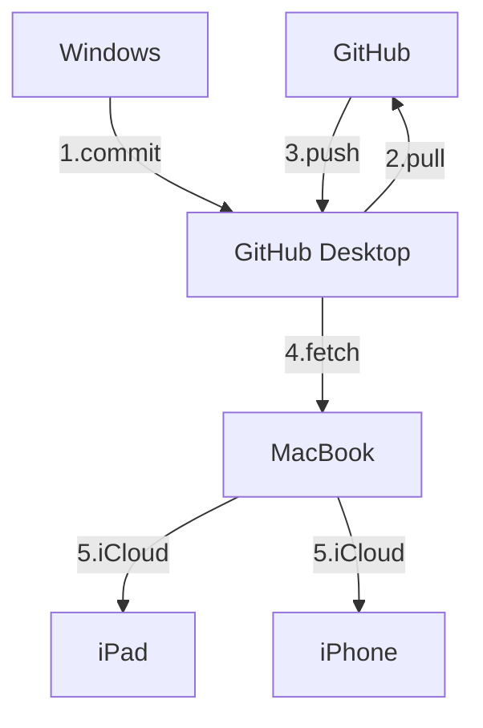

## 2025-07-12

截止今天，我一共产出了 49 篇笔记：

- 6 篇 blog
- 12 篇 card
- 8 篇 note
- 23 篇 ref

我把这 49 篇笔记系统地进行了分类，分别放在四个 review 中：

- PKM
- 社会可续
- 问题解决
- 自我管理

于是，现在笔记变得有结构了起来：

- README 中放所有 review
- review 中放同类型的 card/blog
- review 的作用有两种：
	- 充当 card/blog 的 MOC
	- 记录该主题下的所思所想，当其篇幅足够长时，便可产出为 blog
- note/ref 产出 card/blog, 不再对其进行细分
- 由于 review/note/ref/card/blog 都在同一个文件夹中，因此所有笔记是相同层级的，相互之间是可以引用/链接的，于是避免了分类导致的知识边界

---

## 2025-07-21

从[blog-君主论](blog-@君主论-认知领土拓展.md)中提取了「AI 雇佣军」的概念，要警惕 AI 的双重面孔：

| **工具性价值**   | **认知侵蚀风险** |
| :--------------- | :--------------- |
| 信息检索加速器   | 削弱信息溯源能力 |
| 模板化方案供应商 | 僵化问题解决思维 |
| 语言修饰助手     | 弱化逻辑自洽训练 |

需警惕*依赖雇佣思考者的人，永远在焦虑中等待崩溃*

---

## 2025-07-23

今天发布了一篇[博客](blog-我的知识管理-纸质记录篇.md)，列举了纸质笔记的应用场景和使用方法。其中提到：

>A6 负责记录：
>
>- 关系图谱/头脑风暴
>- 行动追踪
>- 概念定义

目前暂时还没有应用行动追踪。对于概念定义，这比较符合线性的书写习惯，暂无额外的想法。

对于关系图谱和头脑风暴，最终还是要归档到数字笔记中，形成规范的文档。此外，<mark>有必要找到一种方法，把所有的批判性思维（质疑/联想/类比）集中一处 ，最好以可视化的形式展现出来，因为这些才是我独一无二的产出</mark>。随着积累的知识越来越多，有必要形成类似思维导图的层级结构，同时又不能局限于思维导图，需要更灵活地展现各个知识点之间的关联。一个好的关系图谱应该包括两点：

- 清晰明确的关系展现：**父子/同级**
- 知识点和知识点之间需要必要的**文字和箭头说明**

最近尝试了以下方法：

1. 白板类：使用插件 Excalidraw (以及高阶版的 Excalibrain)
2. 使用笔记作为 MOC, 在笔记中插入：
	- markmap 代码
	- mermaid 代码
	- 使用插件把 markdown 笔记当作 mindmap 查看
	- 表格

根据前面提到的两点的标准，对这些方法进行打分：

| 展现难度    | 白板类 | 思维导图 | mermaid | 表格   |
| ------- | --- | ---- | ------- | ---- |
| 父子关系    | 低   | 低    | 低       | 无法实现 |
| 同级关系    | 低   | 无法实现 | 低       | 低    |
| 文字/箭头说明 | 低   | 无法实现 | 高       | 低    |
| 排版/语法   | 高   | 低    | 高       | 无    |
| 加载卡顿程度  | 中   | 高    | 低       | 无    |
| 可视化程度   | 高   | 中    | 高       | 低    |
未完待续...

---

## 2025-07-24

最近开始在移动端（iPad mini 7/iPhone 13）使用 obsidian, 遂产生了同步的新需求：如何在移动端更好地同步笔记？之前的同步方案已经在[这里](blog-我的知识管理-笔记篇.md)给出。我还是更习惯使用 Windows 电脑进行编辑。现在把_Aleph 文件夹放在了 MacBook 的 Obsidian 应用程序文件夹中，这样就可以通过 iCloud 实现电脑和移动端的同步了：

1. 在家中使用 Windows 电脑编辑然后把笔记同步至 GitHub
2. 使用 MacBook 从 GitHub Desktop fetch 云端笔记，作为补充编辑选项（外出/旅行）
3. 使用 iCloud 同步移动端笔记

于是现在的方案如下：

需要说明的是，笔记加工的主力军还是电脑，移动端仅作为阅读使用。这套方案唯一的阻碍就在于，每次使用 Windows 电脑编辑完，还需要在 MacBook 中使用 GitHub Desktop fetch 一次。 

---

## 2025-08-25

### a) CODE 和 DIKW 的对应关系

以前：依次对应

现在：E 不一定对应智慧，消化之后的表达可能只是浅层的知识，需要不断迭代 CODE 才能最终形成智慧

### b) 笔记工具箱

以前：Flomo + Logseq + Obsidian + 备忘录

现在：舍弃了 Flomo 和 Logseq，改用纸笔进行一元化记录 —> Pocket 活页整理 —> 输入知识库  —> Personal 活页消化树状知识并记录 Bridge Notes + Pocket 记录原子笔记

### c) 备忘录结构优化

以前：Fleeting  —> prog. Reading  —> Distill —> Archive

现在：inbox  —> mini essay  —> archive

Inbox 作为收集箱，mini essay 为特定主题的大纲

### d) 关于 Distill

- 让 AI 精简数字笔记内容，打印至 Personal 活页
- 提炼关键概念，抄写至 Pocket 活页形成原子笔记

### e) 关于知行合一

- 知对应 Zettelkasten
- 行对应 PARA
- 知与行需要 LYT 结合：
	- 创建 MoCs
		- 以主题为导向
		- 以问题为导向
	- 创建 Bridge Notes 专门总结批判性思考：
		- 双栏布局
		- 对话式笔记：正题/反题/合题

### f) 关于认知负荷

以认知负荷理论为基础，打造知识库：

- 最小化外在负荷
- 最大化相关负荷

### g) DKIA 模型

结合目前已有的知识点，创造自己的人生模型：DKIA (Drive-Knowledge-Integration-Action)

- Drive Layer
	- Meta-Tool
		- Critical Thinking
		- 80/20 法则
	- Floyd 心理人格结构：自我/本我/超我
	- 精力金字塔：意志/思维/情绪/体能
	- Cogito
- Knowledge Layer
	- DIKW
	- Feyman
	- Zettelkasten
- Action Layer
	- 指导思想
		- 刻意练习
		- 锚点思维
	- 实现方式
		- PARA
		- CODE
- Integration Layer
	- MoCs
	- Bridge Notes

Drive 驱动 Knowledge 和 Action, Knowledge 和 Action 通过 Integration 连接，Integration 反馈给 Drive.