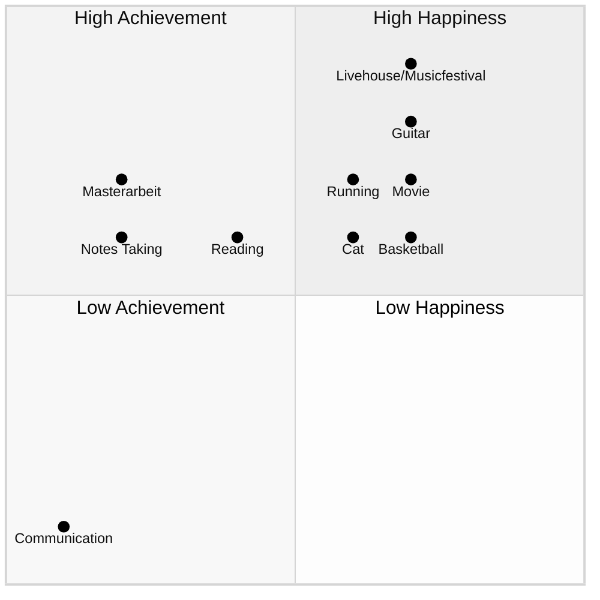
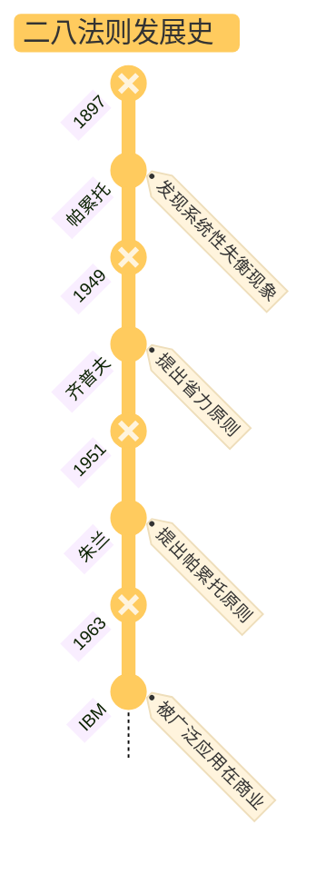

# card
## 3. 批判性思考

### a) 认同

相较于二八分析法，我更认可二八思维法：

- 我们确实生活在一个 [VUCA](https://zh.wikipedia.org/wiki/VUCA) 时代
- 二八思维法是强迫我们去思考关键少数的投入/原因到底是什么

二八法则让我们发现系统内在的失衡关系，这是第一步，更重要的是**去行动/改进**，让 80% 的次要多数尽可能往关键少数的 20% 靠拢。

### b) 质疑

#### 质疑 1

书中提到，做自己擅长的事情，并把它当作自己的工作。从效率的角度讲，这样也没错。可是不断突破「舒适区」就是在不断地挑战自己不擅长的事情。如何去平衡二者？

Deep Seek 解析了我的疑问：

>既想遵循帕累托法则专注优势领域，又意识到突破舒适区对成长的必要性。ta的潜台词或许是“**如何平衡专精与拓荒**”，这需要从系统视角拆解。

Deep Seek 列出了专精与拓荒的区别：

| 维度      | **效率导向**                     | **成长导向**                          |
| :-------- | :------------------------------- | :------------------------------------ |
| 表现      | 做擅长之事                       | 突破舒适区                            |
| 目标      | 短期成果最大化                   | 长期能力边界扩展                      |
| 80/20侧重 | 用80%精力深耕已擅长的20%核心技能 | 用20%精力探索相邻能力区的「战略支点」 |
| 风险      | 路径依赖导致竞争力衰退           | 资源分散削弱当前价值                  |

突破舒适区，本质上是把新的挑战转化为新的擅长领域，为此可以分三步走：
1. 在新领域识别「最小关键行动」（如先掌握核心20%知识）
2. 通过刻意练习将其升级为优势技能
3. 纳入个人价值网络，形成复合杠杆

特别需要注意的是，要选择与既有优势协同的领域：如画家学数字绘画工具；切记不要盲目进入毫无关联的领域

#### 质疑 2

作者提到的关键少数决定论，本质上是一种精英思维，这放到社会学中，是否会存在局限性？使用二八法则分析社会问题是否客观？

> 二八法则的价值在于**揭示资源分配的非均衡性**，但将其升华为“客观规律”则陷入简化论陷阱，因为它忽视了社会结构的制约性，以及资本的代际优势传递，把个人成就完全归功于自身努力。

## 4. 卡片链接

本书有两点与现有知识库产生连接：

- 在工作中使用二八法则，找到一至两位导师，导师需要自主选择，对应[刻意练习](book-@刻意练习.md)中提到的某领域中的杰出人士
- 在日常生活中使用二八法则，保持快乐的习惯中的一些观点与[精力管理](book-@精力管理.md)也很吻合：
  - 锻炼身体 vs. 体能管理
  - 做脑操 vs. 左右脑交替思考
  - 培养精气神/与朋友欢聚 vs. 情绪管理

Deep Seek 建议：

> 将80/20法则与「复利效应」「机会成本」建立概念链接，形成**决策杠杆模型**知识簇

## 5. 行动

>找到 20% 最快乐/有效的事情，并非再把这些事情原原本本地再重复一遍，而是为了发现某个/某些基本性质，找出自己擅长做的事情，以及哪些事情对自己是重要的

列出自己的四个领域：

1. 快乐领域 --> 尽可能多地列举你记得的快乐时光。之后，再试着找出它们的共同点
2. 不快乐领域 --> 不可能占其余全部80%的时间，因为对大多数人而言，在快乐和不快乐领地之间还有一大块中间地带
3. 成就领域 --> 表现出色的短暂时期 
4. 无成就领域 --> 效率最低、颗粒无收的时期

快乐的事情有哪些共性？

- 提升体力
- 提升情绪

## 6. 延伸阅读

| 书籍             | 关联点       | 差异点                             |
| :--------------- | :----------- | :--------------------------------- |
| **《精要主义》** | 聚焦关键事务 | 更强调心理决策机制                 |
| **《深度工作》** | 杠杆时间应用 | 侧重个体专注力管理                 |
| **《长尾理论》** | 资源分配模式 | 论证非关键多数的价值（与本书互补） |

# ref
## 1. 核心思想

在原因与结果、投入与产出、付出与回报之间存在着一种内在的失衡，少量的原因、投入和付出将获得大量的结果、产出和回报。

## 2. 核心概念

### 二八法则

别名：帕累托法则/帕累托定律/80/20 准则/省力原则/失衡原则

- Why?
	- 资源分配天然不均衡，少数核心因素主导多数结果
- How?
	- 量化分析投入产出比，识别高价值因子
- What?
	- 80% 的结果由 20% 的原因导致

## 3. 主题归档

类型：

- 认知心理学
- 资源管理

关联领域：

- 蝴蝶效应([Wiki](https://wuu.wikipedia.org/wiki/%E8%9D%B4%E8%9D%B6%E6%95%88%E5%BA%94))
- 混沌理论 ([Wiki](https://zh.wikipedia.org/zh-hans/%E6%B7%B7%E6%B2%8C%E7%90%86%E8%AE%BA))

## 4. 全书框架梳理

- 第一部分：认识二八法则
  - 第 1 章： 介绍二八法则的起源、发展与定义
  - 第 2 章：在实践中运用 80/20 法则并区分 80/20 分析法与 80/20 思维法
- 第二部分总结了在商业运作中成功运用80/20法则的例子
- 第三部分阐述了如何运用80/20法则提升个人的工作和生活水平

## 5. 写作动机

问题意识：破除“努力即正义”的均等资源谬误

现实意义：在 VUCA 时代，提供聚焦关键要素的生存策略

## 6. 观点提炼

### a) Why

### b) How

### c) What

## 7. 批判性思考

### a) 作者背景

牛津MBA/贝恩咨询顾问（方法论源于管理实践）

### b) 政治倾向

### c) 价值预设

1. 效率至上主义（隐含：时间可货币化计量）
2. 反平均主义（警惕“公平”导致的集体平庸）
3. 精英思维（关键少数决定系统进化）

# note

## 二八法则的起源

帕累托首先在经济研究中，发现了系统性失衡现象：

>某一群体占总人口数的百分比（即总相关人口的百分比）与这一群体所享有的收入或财富之间存在一种恒定的数量关系。

省力原则：
>各种资源（人力、物力、时间、技巧以及其他任何生产资料）都存在一种进行自我调整以实现工作量最小化的趋势，因此，大约 20%~30% 的资源占到与这一资源相关生产活动的 70%~80%.

关键少数原则：
>80% 的问题通常是由 20% 的原因引起的。在质量管理中，通过帕累托分析/帕累托图，可以识别出对产品质量影响最大的因素，从而将资源集中于解决这些关键问题，提高整体质量效率。

二八法则的广泛应用：

> 1963年，IBM公司发现，一台电脑大约80%的工作时间是在执行大约20%的程序代码。

## 什么是二八法则？

> - 80/20 [^1]法则认为，少量的原因、投入和付出将获得大量的结果、产出和回报
> - 原因与结果/投入与产出/付出与回报之间存在一种内在的失衡

[^1]: 特别需要注意的是，二八法则中的数字并不重要。这二者之和也不一定是 100. 因为比较的是完全不同的两组事物。可以是 60/30 或者 70/30, 重要的是去发现这两组事物之间存在的不平衡。

## 为什么二八法则如此重要？

- 反认知：

  > 当我们考察或者分析因果相关的两组数据时，最有可能得到的结论是存在一种不平衡模式。这种不平衡可能是65/35、70/30、75/25、80/20、95/5、99.9/0.1，或者是这些数据之间的任意一种组合。不过，进行比较的这两个数之和却未必等于100。

- 原因和结果之间存在巨大的不平衡性

- 二八法则在生活、学习和工作中都有着广泛应用

## 为什么混沌理论与二八法则具有强相关性？

混沌理论的解释见[Wiki](https://zh.wikipedia.org/wiki/%E6%B7%B7%E6%B2%8C%E7%90%86%E8%AE%BA)

混沌理论和二八法则都认为：

> - 世界不是线性的
> - 原因和结果之间的关系也是不平衡的
> - 强调自组织现象的存在：某些力量比其他力量更强大，而且它们都努力争取额外的资源
> - 起初一些微小的影响因素，一旦通过“临界点”，便可以在反馈回路的作用下，被无限放大而且产生意料之外的结果
> - 对初始条件的敏感性依存：起初微弱的领先位置能够转变成更有利的领先位置，甚至在后来取得决定性的领先，直到原来的平衡状态被打破，而另一种微小的力量又开始发挥巨大的影响力

## 二八法则可以带来什么好处？

我们不仅要批判和鉴别低生产力，更要做出改变：

- 重新分配现有资源，使其得到高效利用
- 让低效率资源在现有领域得到更高效的运用

> 我们应该鉴别、发展、丰富少数高效率资源，与此同时，摒弃或者大幅度削减对我们没有多少价值的大多数低效率资源

## 二八法则的分类有哪些？

### a) 二八分析法

why: 假设存在二八关系，然后搜集相关事实来揭示真正存在的关系

how: 定量分析

what: 确定原因、投入、付出与结果、产出、回报间的关系

用途：

- 关注引发这一关系的关键性原因，即产出80%产量（或者是任何数量的产出）的20%的投入
- 适时改变表现不佳的另外80%的投入——它们仅仅贡献了20%的产量

误区：使用线性方式运用二八法则，过于简化因果/出入的关系

### b) 二八思维法

定义如下：

> - 首先要思考二八法则是否在这一领域起作用
> - 非定量分析：并不需要我们搜集数据或者验证前提假设
> - 之后就可以据此行事

用途：

> 要进行 80/20 思维，我们必须不断地问自己：导致80%结果的20%的原因是什么？我们绝不能认为自己已经知道答案，而是要下功夫去进行创造性思考。与“次要多数”相对的“关键少数”投入或者原因是什么？关键部分在什么地方受到了干扰？

在每个重要领域，用 20% 的努力来争取 80% 的回报：

> 传统观念认为，不要把所有的鸡蛋放在一个篮子里。80/20法则却让我们仔细挑选一个篮子，把所有鸡蛋都放进去，然后像老鹰一样盯紧它。

## 我们如何运用二八法则？

作为80/20思维者，我们不能急于采取行动，而是先静心思考，领悟出一些东西后再采取有针对性的行动：做到有所为有所不为，即针对有限目标集中采取行动；同时要做到处事果断并富有成效，即投入尽可能少的精力和资源追求完美结果。

花一些时间仔细思考：对你而言，80/20法则是否在这些领域都起作用。具体的百分比是否为80/20并不重要，而且也不可能对其进行精确测量。对你而言，关键问题是花费的时间与取得的成就和收获的快乐之间是否存在着严重失衡。你最有效率的20%时间是否创造出了80%的价值？你80%的快乐时光是否集中出现在20%的生命历程中？

观察生活中是否存在这种失衡现象，思考哪些事情（20%）能够真正带给我们（80%）快乐/财富/意义，然后把精力和时间多用在这些事情上面

无论是对个人还是职场关系而言，少数但深厚的人际关系总是比宽泛而肤浅的关系要好。当你在某些方面花了很多时间结果却还是令人失望时，这就是失当的人际关系，应尽早终止。我们能承纳的人际关系数量有限，不要过早地或让低质量的关系填补上这个缺额。

要慎重选择，用心培养。

## 如何利用二八法则实现降本？

- 简化：通过撤销不盈利的活动使业务简单化
- 专注：关注少数改变现状的动力源
- 对比：对业绩进行比较

## 如何利用二八法则进行时间管理？

>- 努力工作，尤其是为别人工作，并不能实现自身追求
>- 独到的思想和做自己想做的事才能为我们带来高额回报
>- 做自己喜欢的事情，并把它视为工作
>- 20% 的人不但占有了 80% 的财富，而且享受了工作中 80% 的乐趣
>- 减少行动，因为多行动则势必减少思考

## 二八法则在人际关系中的运用

### a) 假设

- 在我们的人际关系中，20% 的人际关系具有80%的价值
- 我们人际关系 80% 的价值，来自我们最早建立起来的 20% 的亲密关系
- 然而，对于这创造了 80% 值的 20% 人际关系，我们的关注度远不到 80%

### b) 交友原则

- 乐于共处
- 互相尊重
- 经验共享
- 互惠互利
- 互相信任

你需要发展六七位最好的职场盟友：

- 一两个比你年长的导师
- 两三个同伴
- 一两个以你为师的人
