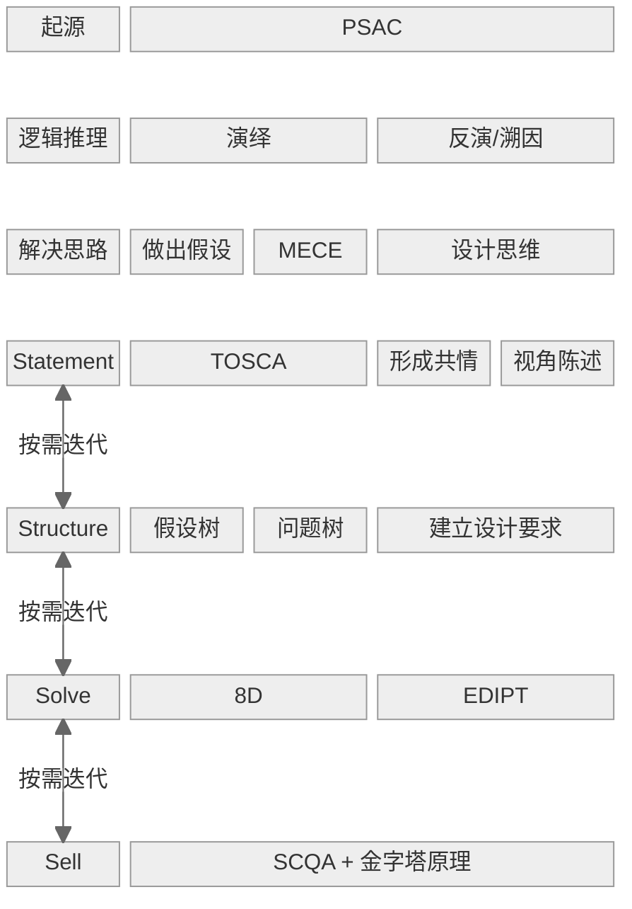

## 1. 核心内容

## 2. 参考笔记

[ref-像高手一样解决问题](ref-像高手一样解决问题.md)

[ref-像高手一样解决问题](ref-像高手一样解决问题.md)

## 3. 批判性思考

#### a) 认同

- 4S 模型
- 金字塔原理
- MECE 拆分问题
- 这里重点提一下**设计思维**：这是颠覆认知的输入，以前从未想过
  - 设计思维本质上是按照 why → how → what 的顺序解决问题
  - 传统的演绎推理则是按照 what → how → why 的顺序解决问题

#### b) 质疑

- 本书虽然经典，但是仍然有“应用断层”的问题：以企业案例为载体，让非管理者读者产生距离感

## 4. 相关链接

## 5. 行动

- [ ] 以企业案例为载体，让非管理者读者产生距离感 → 如何解决应用断层的问题？
- [ ] 做汇报时使用金字塔原理
- [ ] 分析问题时使用问题树

## 6. 延伸阅读

| 书籍             | 关联点                     | 差异点                   |
| :--------------- | :------------------------- | :----------------------- |
| 《思考，快与慢》 | 补充认知偏差的心理学原理   | 更侧重理论而非操作工具   |
| 《金字塔原理》   | 共享 MECE 等结构化表达方法 | 聚焦汇报呈现而非问题解决 |
| 《系统之美》     | 强化复杂系统动态认知       | 缺少商业场景落地案例     |