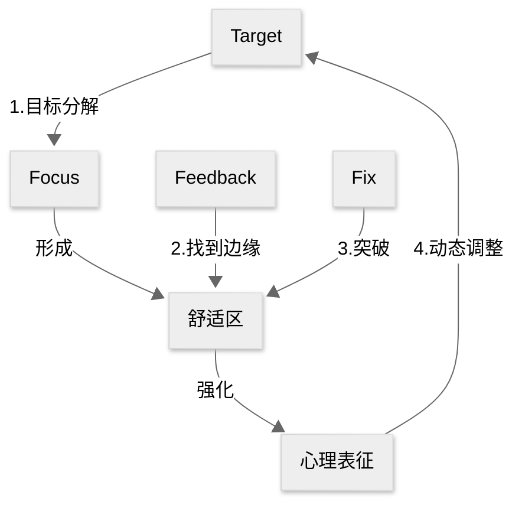

---
author:
  - 「美」Anders Ericson
  - 「美」Robert Pool
title: ref-刻意练习
date: 2024-12-31
tags:
source:
---
# card
## 1\. 核心内容

### a) Why

即使缺少天赋，使用**刻意练习**（deliberate practice）也能让我们成为某个领域的杰出人物

### b) How

1.  设定目标：成为某个领域的**杰出人物**/达到某个领域的**领域标准**
2.  让杰出人物作为导师/根据领域标准制定训练计划
    1.  训练者要认清自己当前的水平/定位
    2.  通过**有效反馈**寻找**舒适区边缘**
    3.  通过**反复修正**突破舒适区，不断强化**心理表征**（mental representation）
3.  根据心理表征对目标进行**动态调整**

# ref
## 1. 核心思想

通过高度结构化、目标明确的刻意练习，任何人皆可突破天赋限制，重塑大脑与身体能力，成为特定领域的专家。

## 2. 核心概念

### 刻意练习（deliberate practice）

- 定义：在舒适区外进行目标分解、即时反馈、反复修正的专业化训练
- 示例：小提琴手针对薄弱乐章逐小节纠正音准
- 反例：每天重复弹奏已熟练的曲目

### 心理表征（mental representation）

我查阅了 mental representation 的原始解释，个人感觉这个词放在刻意练习中并不合适，于是参考[这里](https://www.bilibili.com/video/BV1qM4m197z2/?spm_id_from=333.337.search-card.all.click&vd_source=bfb2e50dad8e670124c382656b85473e)使用「形成习惯」一词代替。

- 定义：大脑中形成的专业领域信息的高效组织模式
- 示例：棋手瞬间识别棋局优劣的直觉判断
- 反例：新手仅能看到分散的棋子位置

### 有效反馈

- 定义：由导师或数据系统提供的精准改进建议
- 示例：运动员通过录像分析动作角度误差
- 反例：自学写作却无人指出逻辑漏洞

### 舒适区边缘

- 定义：介于当前能力与潜能挑战之间的训练强度
- 示例：程序员尝试解决超出当前水平的算法题
- 反例：只做简单练习题或直接挑战无法理解的难题

## 3. 主题归档

类型：

- 认知心理学
- 技能习得方法论

关联领域：

- 教育理论
- 神经可塑性研究
- 人才培育策略

## 4. 全书框架梳理

核心论点：使用刻意练习可以发挥人类潜能

分论点1：没有天赋的普通人依然可以成为某个领域的专家

- 案例：莫扎特和帕格尼尼在成功之前并没有人说他们天赋异禀

分论点2：如何使用刻意练习

- 目标分解：音乐练习的段落切割
- 及时反馈：运动员生物力学分析
- 跳出舒适区：医学诊断难度递增训练

分论点3：从生物学的角度论述刻意练习对大脑的改善

- 案例1：伦敦出租车司机的海马体增大
- 案例2：盲人阅读者的视觉皮层重组

分论点4：如何在工作中使用刻意练习

- 案例1：外科医生的模拟手术训练
- 案例2：教师教案的迭代优化机制

分论点5：如何在生活中使用刻意练习

- 案例1：儿童兴趣引导的三阶段模型
- 案例2：成人技能突破的时间管理方案

## 5. 写作动机

问题意识：

- 揭穿“天赋决定论”对个人发展的压制
- 解决传统重复练习的低效困境

现实意义：

- 为教育体系提供科学训练框架
- 给职场人提供可迁移的进阶方法论
- 破除年龄限制的潜能开发指南

## 6. 观点提炼

### a) Why

人类潜能可突破生理/年龄限制，专家能力可被科学构建

### b) How

1. 创建领域标准
2. 寻找顶级导师
3. 建立反馈系统
4. 突破舒适区

### c) What/Who

在各领域培育出远超常人的专业表现者

## 7. 批判性思考

### a) 作者背景

- 心理学家安德斯·艾利克森（Anders Ericsson），佛罗里达州立大学教授，专攻专家绩效研究40年

### b) 政治倾向

- 无

### c) 价值预设

- 坚信“可习得性”优于“先天决定论”
- 主张训练质量＞训练时长
- 否定1万小时定律的机械解读

# note

## 有目的的练习

所谓有目的的练习是与天真的练习区分开来的：
>有目的的练习具有几个特征，使得它与我们所说的“天真的练习”区分开来。所谓“天真的练习”，基本上只是反复地做某件事情，并指望只靠那种反复，就能提高表现和水平。

 有目的的练习具有以下特点：

- 定义明确的特定目标
- 保持专注
- 有反馈
- 走出舒适区

>因此，我们在这里简单地总结有目的的练习：走出你的舒适区，但要以专注的方式制订明确的目标，为达到那些目标制订一个计划，并且想出监测你的进步的方法。哦，还要想办法保持你的动机。

## 心理表征

>心理表征是一种与我们大脑正在思考的某个物体、某个观点、某些信息或者其他任何事物相对应的心理结构，或具体或抽象。一个简单的例子是视觉形象。

我的理解为，人们潜意识/下意识会做的事情，或者是与自我认知发生关联的事情，而这种心理表征会随着刻意练习的增加而变得丰富。

>这些表征是信息预先存在的模式（比如事实、图片、规则、关系，等等），这些模式保存在长时记忆之中，可以用于有效且快速地顺应某些类型的局面。对于所有的心理表征，有一点是相同的：尽管短时记忆存在局限，但它们使得人们可以迅速地处理大量信息。事实上，人们可能把心理表征定义为一个概念式的结构，设计用于回避短时记忆施加在心理加工上的一般局限。

作者认为，杰出人物之所以能够成为杰出人物，是他们具有强大的心理表征：

>将杰出人物和我们其他人区分开来的主要因素是：他们经过年复一年的练习，已经改变了大脑中的神经回路，以创建高度专业化的心理表征，这些心理表征反过来使得令人难以置信的记忆、规律的识别、问题的解决等成为可能，也使得他们能够培养和发展各种高级的能力，以便在特定的专业领域中表现卓越。

心理表征的好处：

- 预测未来
- 寻找规律
- 无意识决策中的最优解
- 有助于制定计划
- 从「知识陈述」转变为「知识转换」

>心理表征的一个重要好处在于，可以帮助我们处理信息：理解和解读它，把它保存在记忆之中，组织它、分析它，并用它来决策

## 刻意练习

>简单地讲，我们说刻意练习，因为它与其他类型的有目的的练习在两个重要的方面上存在着差别。
>
>首先，它需要一个已经得到合理发展的行业或领域，也就是说，在那一行业或领域之中，最杰出的从业者已达到一定程度的表现水平，使他们与其他刚刚进入该行业或领域的人们明显地区分开来
>
>其次，刻意练习需要一位能够布置练习作业的导师，以帮助学生提高他的水平。导师必须已经达到一定的水平，并且有一些可以传授给别人的有益的练习方法。
>
>有了这个定义，我们可以在有目的的练习（其中，人们想尽一切办法来推动自身的提高）与既有目的、又获得指导的练习之间总结出明显的区别。特别是在刻意练习中，受训者了解表现最杰出者的成就，并且受到后者的指导，同时，他们还理解，这些表现最杰出者在哪些方面表现卓越。刻意练习也是一种有目的的练习，而且知道该朝什么方向发展，以及怎样去达到目标

有目的的练习更强调个人的努力，而刻意练习强调的是在杰出人物的指导之下进行的有目的的训练，具有以下特点：

- 该领域存在杰出人物作为导师
- 需要人们跳出舒适区，不断尝试那些刚好超出当前能力范围的事物
- 导师要根据学员的目标设定详细的计划
- 学员要根据导师的计划主动练习，及时反馈
- 心理表征是产生反馈的手段

## 如何寻找杰出人物？

>如果你试图从这些行业或领域中辨别表现最杰出的人，要牢牢记住一件事：主观的判断本来就容易受到各种偏见的影响。“理想的情况是找到客观的、可复制的测量指标，以便前后一致地从普通从业者之中挑选出最优异的从业者。如果这一理想的状况不可能实现，那么尽可能做到接近理想。
>
>找到主观上你认为的杰出人物，不以客观标准来判断。
>
>一旦你已经辨认出杰出人物，那么，辨别出是什么使得这个人和其他人表现不同，那些差别就可以解释他的卓越成就。

关于一万小时法则，作者认为，尽管具体的数字不一定是一万小时，但是要做到杰出，任何领域都需要花很多时间去训练：

>在任何一个有着悠久历史的行业或领域，要想成就一番事业，致力于变成业内的杰出人物，需要付出许多年艰苦卓绝的努力。也许并不需要恰好1万小时的练习，但要花很长时间练习。

## 刻意练习在工作中的应用

首先要认识到三种错误思想：

- 人的能力收到基因限制
- 只要做某件事情的时间足够长，就一定会更擅长
- 只要努力就会有提高

>刻意练习的心态提供了截然不同的观察视角：任何人都可以进步，但需要正确的方法。如果你没有进步，并不是因为你缺少天赋，而是因为你没有用正确的方法练习。一旦你理解了这一点，进步就只取决于你想出什么是“正确的方式”了。

在工作中使用刻意练习的方法是「边干边学」（learning by doing）：

>阿特着手制订一些方法，使正常的商业活动可以转变成为有目的的练习或者刻意练习的机会。
>
>“边干边学”方法的一个好处是，它使人们熟悉练习的习惯，并思考如何练习。一旦他们理解了日常练习的重要性，并意识到可以用练习来实现多大的进步，那么，他们会找机会将其他的日常商业活动转变成练习活动。

如何找到一种符合刻意练习原则的方法：

>对于商业世界中任何一个着眼于寻找有效改进方法的人，我的基本建议是找寻一种与刻意练习原则相一致的方法，问自己以下这些问题：这种方法，是不是逼着人们走出舒适区，迫使人们尝试做一些对他们来说并不容易的事情？它有没有提供关于绩效和表现的即时反馈，以及关于可以做些什么事情来提高绩效和表现的反馈？那些制订了这种方法的人，有没有辨别出他们所处的特定行业或领域之中的最杰出人物？有没有确定是什么因素将杰出人物与其他人区分开来？训练是不是被设计用来提高行业或领域内的杰出人物所拥有的那些特定技能？如果对所有问题的回答全都是肯定的，尽管也许不能保证那种方法有效，至少可以肯定，它是有效方法的可能性大得多。

- 跳出舒适圈，做一些不容易的事情
- 有反馈
- 有无杰出人物
- 是否明确目前与杰出人物的差距在哪
- 是否明确要提高的内容与杰出人物一致

## 知识与技能的区别

>传统的方法也一直是先找出关于正确方法的信息，然后很大程度上让学生去运用那些知识。刻意练习则完全相反，它只聚焦于绩效和表现，以及怎样提高绩效和表现。
>
>当你观察人们在职业领域和商业世界中如何接受训练时，会发现一种趋势：不重视技能，过于重视知识。主要的原因是传统和方便：向一大群人介绍知识，比起创造条件让人们可以通过练习来提升技能，要容易得多。
>
>一般来讲，专业学院着重关注知识而不是技能，因为教学生知识，然后为检验学生掌握知识的情况而设计一些测验，要比教学生技能容易得多。此外，人们一般认为，如果掌握了知识，也就能相对容易地熟练掌握技能。结果，当大学生进入职场时，通常发现自己需要大量的时间来提升工作中需要的技能。另外，许多专业领域并不会比医学专业更好地帮助从业人员磨砺他们的技能，大多数情况下，甚至在这方面比医学专业做得更差。在这些行业和领域之中，人们同样以为，只要简单地积累更多的经验，就能提高从业者的技能水平。
>
>正如在许多情况下，只要你已经想出了怎样来正确地提问，就已经知道了一半的正确答案。在专业的或商业的背景中涉及提高绩效和表现时，正确的问题是“我们怎样改进相关的技能”，而不是“我们怎样传授相关的知识”。

知识≠技能，实际上技能的培训比知识更难，而我们往往认为技能比知识难。

## 在生活中使用刻意练习

1. 找一位导师
2. 制定练习计划
    1. 学员要主动练习
    2. 每次训练时长不超过一小时
3. 导师不仅要指导学员练习，还要帮助学员建立心理表征，其中包括
    1. 应该注意哪些特定的方面
    2. 犯过哪些错误
    3. 怎样识别卓越的表现
4. 如何对待瓶颈期：
    1. 搞清楚到底是什么让你停滞不前。你犯了些什么错？什么时候犯的？逼着自己走出舒适区，看一看是什么拦住了你前进的路
    2. 设计一种练习方法，专门来改进那个特定的弱点。一旦你已经弄懂了问题是什么，你也许能够自己纠正，或者，可能得向一位经验丰富的教练或导师寻求建议。不论是哪种方法，在练习的时候要重点关注发生了什么
    3. 如果依然没有进步，那就需要再试试其他方法/更换导师

## 使用 3F 创建有效的心理特征

>为了在没有导师的时候有效地练习某种技能，牢牢记住以下三个F，将是有帮助的。这三个F，其实是以字母F开头三个单词，即：专注（focus）、反馈（feedback）以及纠正（fix it）。将技能分解成一些组成部分，以便反复地练习，并且有效地分析、确定你的不足之处，然后想出各种办法来解决它们。
>
>我们只有努力去复制杰出人物的成就，失败了就停下来思考为什么会失败，然后再去复制，一旦失败了，再次停下来思考原因，如此一而再再而三地尝试，才能创建有效的心理表征。成功的心理表征与人们的行为而不是思想紧密相连，这是一种拓展的实践，着眼于复制原始的作品，这种复制行为可以创建我们寻求的心理表征

## 如何坚持练习

两个误解：

1. 几乎没有科学证据证明，这世间存在一种可在任何情形中运用的一般的“意志力

2. 意志力和天生才华，都是人们在事实发生了之后再赋予某个人的优点

保持动机的两个方法：

- 弱化停下脚步的理由
  - 每天留出独立的一小时进行训练
  - 保证充足的睡眠和健康
- 强化继续前行的理由
  - 内部动机
    - 相信自己可以成功
    - 当练习有一定成果后，会反馈给我们作为继续坚持下去的动力
  - 外部动机
    - 社会动机：他人的认可与崇拜
    - 加入具有相同追求的团体/组织，与他们分享你的秘诀/成绩/遇到的困难，互相信任支持
    - 把对同一件事情感兴趣的所有人聚集起来/吸引他们加入一个团体，把团体的共同目标和情谊作为你自己目标的额外动机
  - 细化目标，将其分解成一系列可控的目标，每达到一个目标后，就给自己一个奖励

>对于那些长期保持有目的训练或刻意练习的人们，有一件事情与之相似。他们通常培养了各种习惯，帮助自己继续前行。我觉得，所有希望提高在某一行业或领域中的技能水平的人，应当每天花1个小时或更多的时间，专心练习那些需要全神贯注投入才能做好的事情。这是一条经验法则。
>
>保持这种推行此类体制运行下去的动机，包括两个组成部分：继续前行的理由和停下脚步的理由。你不再做自己当初想做的事情，是因为停下脚步的理由最终战胜了继续前行的理由。因此，你要保持动机，要么强化继续前行的理由，要么弱化停下脚步的理由
