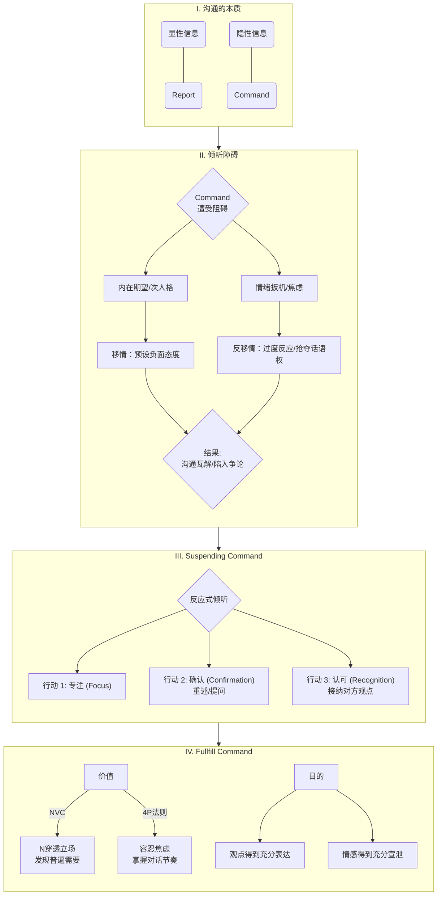
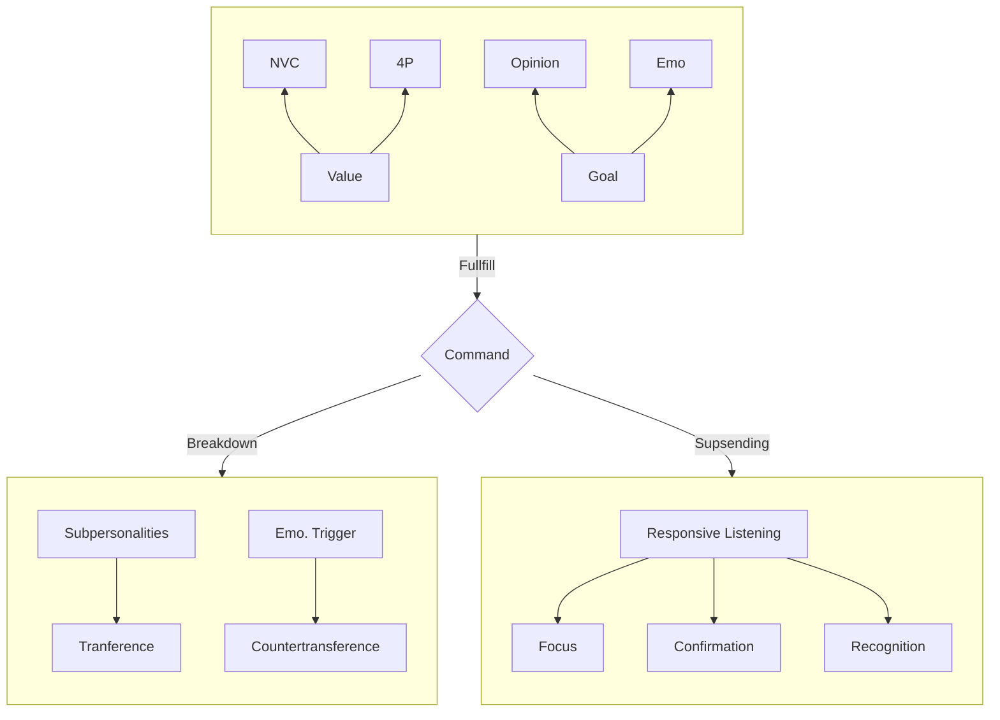

# note
## 0. notebooklm 导读

### I. 重点精读章节（20% 的章节，带来 80% 的核心收获）

这五章侧重于**克服内在障碍**和**掌握积极倾听的技巧**，对于您作为 INTJ-A 性格的工程师，尤其是在处理职场沟通中的情绪和冲突时，至关重要。

| 篇目/章节                                  | 核心主题（与 INTJ/工程师的关联）                             | 阅读目的                                                     |
| ------------------------------------------ | ------------------------------------------------------------ | ------------------------------------------------------------ |
| **第三章：沟通是如何瓦解的**               | 沟通瓦解的复杂因素：信息、元信息、移情与反移情。             | **认知升级：** 了解沟通失败不仅是技巧问题，更是心理过滤和无意识期望导致的。这对于理解跨文化（德语/英语）语境下的间接沟通（如“要求”而非“报告”）至关重要。 |
| **第五章：内在的期望损害了我们倾听**       | 内在的偏见与期待（客体关系理论）：我们如何基于过去的经验和不安，预设并歪曲了当前听到的信息。 | **自我觉察：** 识别工作和家庭中，自己的“次人格”或“内在冲突”如何投射到对话中，导致过度敏感或疏离。这有助于您放下预设，专注事实。 |
| **第六章：情绪化让我们具有防卫性**         | 情绪扳机与防卫性反应：批评、羞耻感和焦虑如何触发我们的反击或退缩。 | **冲突管理：** 理解过度反应的根源在于长期的记忆或羞耻感，而非当下的事实。学习容忍适当的焦虑，抗拒“战或逃”的本能。 |
| **第七章：倾听的核心：暂时搁置自己的需求** | **倾听的本质：** 搁置自我需求、不急于打岔、不给出建议、不假装感兴趣。 | **技巧核心：** 这是全书方法论的基石。对于倾向于理性分析和提供解决方案的您，学会控制给出忠告的冲动，真正做到“搁置自我”至关重要。 |
| **第九章：如何化解情绪化反应**             | **“反应式倾听”** 的具体步骤：抑制反驳冲动，重述对方立场以表示理解，不带防卫性地邀请对方详述。 | **实践工具：** 学习在激烈的讨论中（如技术评审或排期谈判）如何保持冷静，用重述来打破争论循环，并赢得思考时间（4P法的“展示”阶段）。 |

### II. 快速阅读章节（标题、导言或总结即可）

这些章节提供背景、理论或特定的应用场景，您可以快速浏览以建立全书的逻辑框架，并将精力集中在核心技巧的学习上。

| 篇目/章节                            | 核心主题（快速阅读原因）                       | 建议阅读内容                                                 |
| ------------------------------------ | ---------------------------------------------- | ------------------------------------------------------------ |
| **第一章：为什么倾听这么重要**       | 倾听的必要性与“被听见即被重视”的感受。         | **前言和导读：** 您已通过阅读四本沟通书，充分认识到倾听的重要性，只需略读以建立上下文。 |
| **第二章：倾听可形塑自我及人际关系** | 倾听对自我认同（社会自我、真我）的塑造作用。   | **第一段与总结：** 了解倾听作为人类基本需求（需求）和塑造个性的理论基础。 |
| **第四章：“什么时候才轮到我说？”**   | “自我中心”是倾听的主要障碍之一。               | **重点段落：** 核心观点已涵盖在第七章“搁置需求”中，只需了解“急于表达自己”是常见障碍即可。 |
| **第八章：同理心自开放做起**         | 同理心的概念：开放、敏锐度与自我超越。         | **关键定义：** 了解同理心并非同情，而是“为他人设想”。这与第五、六、七章精读内容有重叠，可作补充阅读。 |
| **第十章至十三章（第四篇）**         | 倾听在亲密伴侣、家庭、朋友及同事关系中的应用。 | **总结及练习：** 聚焦于**第十三章**中关于**同事和主管倾听**的部分，其余关系应用可根据您的生活需求快速查阅。 |

## 1. 我自己的总结

### Chap 3. 沟通是如何瓦解的

i) **沟通的两层意义：Report 和  Command**

> 格雷戈里·贝特森（Gregory Bateson）的观点，认为所有的沟通都有两层意义：**报道（report，文字信息）要求（command，即元讯息/metacommunication）**，后者决定了信息被接收的方式，并声明了双方关系的本质

我的理解：

Report 就是说者说出的文字本身的意思

Command 是说者隐藏在文字后面的真实需求

meta-communication 这个概念在[沟通圣经](book-@沟通圣经.md)中也有提及，在那里它被定义为除了沟通之外一切和沟通相关的东西，例如肢体语言、语气语调、眼神交流、情绪变化等。在本书中，作者进一步强调，meta-communication 决定了 Report 被接受的方式，以及听者和说者的关系

**ii) 移情 (Transference) 和反移情 (Counter-transference)**

移情：抛开沟通内容 (Report)，根据内在/先前建立的期待而产生的先入为主的态度/评价/观点/偏见 (Command)

反移情：本来应该是话语权流动的沟通维度，我却主动抢过话语权，把沟通变成了演讲，见[好好说话：五维话语权](book-@好好说话.md)

**iii) 改变自己对他人的反应方式，而非去改变他人**

面对抱怨等负面情绪，我们可以这样做：

1. 观察元信息，总结说话内容，提出开放式问题
2. 认可感受，直接连接到对方的需要
3. 进入请求/协作模式

一个例子：

1. 我观察到 xxx, 是不是因为 xxx
2. 我理解你感到失望/愤怒，因为你重视/需要 xxx
3. 那么我们现在一起看看，有没有更好的方式能满足你对 xxx 的需求？也许我们这样 xxx 做可以更好？

### Chap 5. 内在的期望损害了我们倾听

**i) 内在偏见与说话者的信誉**

> 我们内在的偏见会筛选我们所听的及所说的，常常表现为先入为主的期待。这种期待尤其影响我们对说话者信誉（credibility）的评估

在项目管理中，我可能会对哪些同事/上级产生负面期待，从而损害我对他们关键技术反馈的倾听质量？

|                    |                      |                                                              |
| ------------------ | -------------------- | ------------------------------------------------------------ |
| 潜在的负面期待     | 目标群体             | 倾听的损害（内在筛选）                                       |
| **“缺乏技术细节”** | **销售、市场人员**   | 您可能只关注他们报告中的技术事实（Report），而忽略了他们元讯息（Command）背后的 **商业需求和客户关系需求**。您可能会因为他们**“滥用倾听”**（说得太多，或总是改变话题）而感到费力，最终放弃倾听。 |
| **“总是爱抱怨”**   | **生产、运营人员**   | 当他们抱怨生产流程或排期时，您可能将此视为“唠叨”（认为对方信用破产），并认为他们没有提出解决方案，从而损害了对抱怨中隐含的**“请求/需要”**（如需要更高的效率、更稳定的流程）的倾听。 |
| **“不关心项目”**   | **不积极配合的同事** | 当您认为某位同事对工作“不热衷”或“只是专心于自己的工作”时，您可能会判定其**信誉度低**，从而认为他们即使说了有价值的话，也不值得您费力去听。 |

如何搁置这些态度，打破因说话者信誉低导致的倾听障碍？

- 信誉低（如总是抱怨的人）的说话者，即使说得再清楚，听者也会感到倾听“太费力”。有意识地承认这种“费力”感，并将其**视为自己的内在偏见**而非对方的本质缺陷，是搁置态度的第一步
- 当意识到自己的负面期待可能被投射到对话中时（如认为对方在指责），可以借鉴沙利文的**“反投射评论”（counterprojective comments），明确否认被投射的角色。**例如，在听到抱怨时，先说：“我不是要指责你，只是想了解这个需求对项目有多重要。”（这在跨部门沟通中尤其能稳定情绪）
- 搁置态度，意味着去理解说话者独特的内在经验世界，通过开放式提问（如“如何”“怎样”），邀请对方详述隐藏在表面内容（Report）背后的情感和需要（Command）

**ii) 次人格对内向者向上管理的影响**

> 第五章提出了“分裂的自我”即**“次人格”（subpersonalities）**的概念，认为我们的倾听困难源自这些**早期“客体关系”的残留物**被触发

当您在向上管理中（例如，向不了解技术的上级提交关键决策或争取资源时），如果您的提议被质疑或拒绝，您内在的“孩子气”次人格最可能被触发为哪两种极端的反应？

- 摆烂，把所有后果归结于我的建议没有被采纳
- 生气地指责对方

这两种反应是典型的“战或逃”（Fight or Flight）过度反应，是“孩子气”次人格被触发后，用于保护自我和对抗羞辱感的自然反应

- 在愤怒爆发前，您的内在期待（移情）可能是将上级视为“严厉的权威”或“不理解自己专业的无知者”。被质疑触发了您“不被尊重”的羞耻感，从而导致您陷入“失控的情绪化反应”
- “摆烂/指责” 对应的是 “战”（Fight）：当感受到权威（上级）的批评或拒绝时，“青春期”的次人格（因为没有完全学会抗拒父母的挑衅而倒退回孩子的角色）会爆发，将责任外化，以保持自身的完整性

请进一步思考，如何借鉴非暴力沟通（NVC）“感受的根源源于自身需要”“被贬低”“不被认可”期待，转化为对您自身“需要”（如需要自主、需要能力认可）的客观“观察”，从而避免陷入情绪化的防卫？

|                                        |                    |                                                              |                                                              |
| -------------------------------------- | ------------------ | ------------------------------------------------------------ | ------------------------------------------------------------ |
| 外部触发（观察）                       | 情绪化反应（感受） | 隐藏的内在需要（Need）                                       | NVC 转化（行动准备）                                         |
| 上级质疑我的技术方案或拒绝我的资源请求 | 愤怒、羞耻、被贬低 | **需要能力认可** (Appreciation)、**需要自主权** (Autonomy)、**需要公平** | **（对内）** 承认这种情绪源自对自身需要的看重，而不是因为对方“错”了 **（对外）** 在回应前，用反应式倾听**重述**上级的立场，确保上级感受到**尊重**，而不是反击 |

**iii) 失控感与会议节奏掌控**

> 本书强调倾听的困难常常涉及“失控”，因为我们害怕将要听到的事，放弃控制权会让我们不安。而内在的冲突（如“去做吧”与“不能做”的垂直分裂）也阻碍了我们接纳自己和他人的差异

对于您规划内向领导力发展，并提升4P 法则中“展示（Presence）”能力的目标，请问：

1. 您如何利用识别“次人格”的内省方法，在 ，提前预估并缓解可能阻碍您有效倾听和协作的“失控感”？
2. 如何将容忍“失控感”的练习，转化为在激烈技术讨论中“掌握会议节奏”的工具？（提示：思考容忍不确定性如何为您赢得思考时间。）

内省工具的应用（Preparation 阶段）：在准备阶段，预估沟通中的风险点。例如，当您知道要在会议上捍卫一个有争议的技术方案时：

  ◦ 识别冲突的声音： 哪一个“次人格”在说“去做吧”（理性分析家：这是事实，必须坚持），哪一个在说“不能做”（害怕冲突的孩子：一旦争吵，一切都会失控）？这种“垂直分裂”正是失控感的来源

  ◦ 提前安抚： 告诉自己，我已做了书面准备和风险标注，我不需要通过控制谈话来证明价值

容忍失控感（容忍不确定性）是内向者掌握会议节奏（Presence）的关键策略：

| 机制               | 实践方法                                                     | 掌握节奏                                                     |
| ------------------ | ------------------------------------------------------------ | ------------------------------------------------------------ |
| **接受不确定性**   | **主动使用沉默和停顿**：当有人提出质疑时，不要急于回应，而是**容忍随之而来的焦虑**。给自己和对方**留出时间**。 | **赢得思考时间**： INTJ 需要时间整合信息。沉默是一种**有效的倾听**姿态，能够减缓对话速度。 |
| **转化防御为协作** | 运用**反应式倾听（responsive listening）**：在听到对方的批评或质疑时，用自己的话重述对方的立场。 | **打破争论循环**：通过重述（而不是反驳），打破争论的“拔河”状态，迫使对方纠正你的理解。这能将对话从**辩论**模式（零和游戏） 转化为**协作**模式（共同解决设计题） |

### Chap 6. 情绪化让我们具有防卫性

#### i) 反应式倾听

**a) 本质上是 [NVC](book-@非暴力沟通.md) 中关切地倾听他人这一原则的具体实践：**

> 1．在发觉有争论迹象时，抑制住自己想反驳的冲动，专注地倾听对方的故事
>
> 2．以不加防卫、不予反对的方式，邀请对方表达他的想法、感受与期望
>
> 3．用自己的话重述对方的立场，说明你认为他想到与感受到的是什么
>
> 4．请对方纠正你的印象，或更详细描述他的看法
>
> 5．把自己的反应保留到稍后再说。在针对重要或有争议的议题时，等候一两天再说出自己的意见。在小事上，可停顿一下，询问对方愿不愿意听听你的意见

| 反应式倾听                   | 对应 NVC 要素                 | 目的和来源支持                                               |
| ---------------------------- | ----------------------------- | ------------------------------------------------------------ |
| 抑制反驳冲动，专注倾听       | 观察                          | 搁置自我（放下批判）：只有放下“自己所想的、渴望及评判”，才能像摄像机一样接收信息，并避免防卫性反应 |
| 邀请对方表达想法、感受与期望 | 感受 + 需要                   | 倾听人们所说的内容里隐含的感受 抱怨的背后往往是一个请求 |
| 用自己的话重述对方的立场     | 反馈/确认 (Empathic Response) | 重述能让对方知道你已抓住他的论点，获得被了解和被认同的慰藉，并避免误解 |

**b) 是[五维话术](book-@好好说话.md)中从沟通到谈判的过程**

沟通：反应式倾听的作用是消除误解、增进理解。它通过**认同**对方的观点（即使不同意）来化解防卫性。只有在“你已抓住他的论点”，对方感到被了解后，他才会更愿意开放自己，去倾听你想说的

谈判：谈判是创造价值、解决冲突的维度。NVC 教导我们穿透对立的“立场”，去发现背后共享的、普遍的“需要”。通过反应式倾听，您可以将争论从“谁对谁错”（立场）转化为“我们各自需要什么”（需要），为后续的共赢谈判（如争取排期、资源）打下基础。反应式倾听是解决争论的

**c) 相当于问题解决中的 5 Why, 目的是找到隐藏在情绪背后的真实需求**

- 通常人们话中最重要的隐含讯息，正是在内容背后的感受，而感受的根源在于自身需要
- 达到这种深度理解的方法是调查，例如要求对方说得更详细，使用开放式问题（如“如何”“怎样”“什么”“为什么”）来引导对方深入
- 反应式倾听的步骤 4（请对方纠正或更详细描述）正是这种“5 Why”机制的应用。它要求你不断寻求确认和深化理解，而不是总结后就结束

#### ii) 搁置建议与掌控情绪

**a) 为什么我会不加克制的打断对方/给予忠告/分享自己类似的经验**

- 内在需求： 倾听者无法忍受随之而来的焦虑（Anxiety）。当别人有困扰时，我们“总觉得我们必须说些什么，好消除那种焦虑”
- 焦点转移： 给予忠告反映出听的人无法忍受自己的焦虑，即我们是在处理自己的感受，而不是在听对方的故事
- 倾听核心： 因此，倾听的核心是 “暂时搁置自己的需求”

**b) 使用 4P 法则化解**

- 准备阶段：提前识别并抗拒可能引发您过度反应的“情绪扳机”（如对无逻辑批评的敏感），可以减少情绪化反应的发生
- 展示阶段：在激烈的技术讨论中，您无需急于回应。通过运用反应式倾听，您可以赢得宝贵的思考时间，从而“掌握会议节奏”。这正是将内向者的“反思”特质转化为稀缺的领导力资源

#### iii) 总结

如果您倾向于理性分析和解决问题，那么在沟通中，您的大脑就像一台“高性能的技术处理器”，当接收到问题（输入）时，它会立刻运行程序并输出最优解。

而倾听的艺术，就是学习在接收到输入时，先给这个“处理器”设置一个“情绪缓冲层”和“重述过滤器”。在您真正理解对方的“需求”（而不仅仅是“问题”）之前，这个缓冲层为您赢得了冷静思考和分析对方元讯息（Command）的时间，确保您的理性分析服务于建立关系和发现需要，而非仅仅是解决症状

### Chap 7. 倾听的核心：暂时搁置自己的需求

这一章将前几章讨论的心理障碍（内在期待、防卫性）转化为具体可操作的技巧，即专注、确认和认可，共同构建了反应式倾听的基石

### i) 如何专注 (Foucus)

-  搁置分心的事
- 不思考自己的反应
- 主动把握对方的“要求”或情感宣泄

- 刻意努力
- 如果无法专注，要诚实地告诉对方，我现在真的不能专心听你说话
- 倾听绝不是被动接收器，而是主动、开放、询问，并配合对方步调的过程

### ii) 如何确认 (Confirmation)

- 用自己的话重述对方论点，请对方更正或确定，目的是为了让对方情感得到充分宣泄和更详尽表达
- 重述的关键在于提问，让对方知道你正在努力了解，而不是你已经知道
- 避免使用封闭式陈述（如“我知道了”、“我曾经也碰到过相同的情况”）来切断对话

### iii) 如何认可 (Recognition)

- 开启话题后，在表明自己的看法之前，先让对方说说他的观点
-  认可意味着提供深度了解的联结桥梁，而非肤浅的同情
- 即使你不同意对方的观点，也要先表达对对方观点的接纳，这有助于对方感到被了解，并更有意愿听你的看法

### iv) 如何面对冲突

- 说出自己的感受（什么困扰着我们，期待什么）
- 不需要为别人的感受负责，只需要去察觉/了解

### Chap 9. 如何化解情绪化反应

无

## 2. 模型总结

可以看出，关键词为 Command, 因此可以把这个模型简化为：

