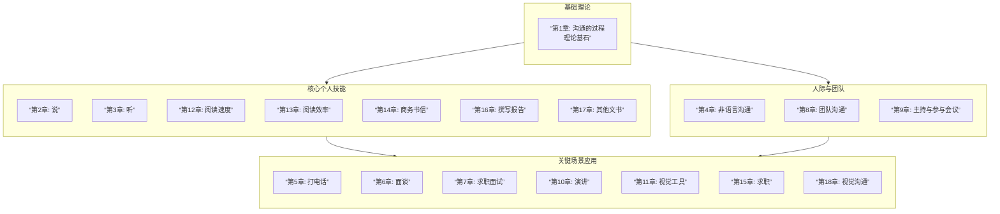

# note

## 1. 内容摘抄

### Chap 1. 沟通的过程

> 说明有哪些因此可能会阻碍两个说同一种语言的人之间的沟通

- 三观
- 妄下结论
- 刻板印象
- 缺乏兴趣/知识
- 表达不准确
- 情绪
- 个性

### Chap 2. 说

无

### Chap 3. 听

> 列出并说明哪五种做法可以表示我们正在专心倾听

- 鼓励对方
- 得到信息
- 增进关系
- 解决问题
- 理解对方

> 听者如何避免分心

- 点头，然后等候
- 专心看着说话者
- 重复对方说的最后几个字，但不要过于频繁
- 说“了解”、“嗯”、“真的”等
- 回应对方，如果有不懂的地方，可以先重复对方说的内容，然后用 5W1H 提问

### Chap 4. 人际互动与非语言沟通

> 什么是“后设沟通” (meta-communication)？

meta 是超越或者附加的意思 → 后设沟通就是沟通之外附加的东西

即所有在文字之外，我们拿来阐释他人所说的话的线索

> “沉默”如何有助于沟通的过程？

这里的“沉默”指的是主动倾听，鼓励对方继续说下去，甚至把对方本不愿意表达的感觉和态度表达出来，其作用为：

- 鼓励响应
- 双向沟通

> 如果你求职面试迟到了三十分钟，也不道歉，对方可能会怎么想？

迟到 → 对方会认为我没有时间观念，以及对这次面试不够重视，并且不会为他人着想

不道歉 → 对方会认为我没有礼貌

> 研究肢体语言的科学称为什么？

人体动作学 (Kinesics):

- 肢体语言与传达出的语言信息相关
- 通常这种非语言沟通比说出来的文字更有力
- 借此可以了解沟通人的情绪

> 人类似乎有一个个人空间感。这个“个人空间”根据互动形态与彼此关系可以氛围哪四种距离？

- 亲密距离
  - 实际的接触 → 亲密的朋友/亲人
  - 拥挤的空间（电梯、地铁）内 → 肌肉紧张、避免眼神接触、退缩，潜在表达为“抱歉侵入你的私人空间，我不是有意的”
- 个人距离
- 社交距离：商业会谈
- 公共距离：非正式/正式集会

> 假设你跟对方各方面条件都差不多，如果你说话时看着对方，对方会对你有什么印象？

对方会认为我充满个人魅力，并且希望得到反馈

> 当两个人以上在交谈时，大家通常会轮流发言，使整个对话过程顺畅不冲突。有哪些非语言信号可特别用来推动整个对话的过程？

- 眼神
- 手势
- 面部表情
- 点头

> 如果语言信息和非语言信息互相矛盾，我们会相信哪个信息所传达的意义？

非语言信息

### Chap 12. 增进阅读速度

人们在屏幕上阅读的效率，往往比不上在纸张上阅读的效率 ，因此如果有长篇的、重要的或困难的内容，最好能打印出来

### Chap 13. 提高阅读效率

你应该在大致了解整体的内容与结构之后才开始阅读

这不只会使你阅读起来更轻松，也会使你阅读得更快

这个做法需要两个技巧

**i) 浏览**：

1. 了解结构：在开始仔细阅读之前，就对整个内容有个大致的了解
2. 评估：这样你就可以判断其价值，知道该什么时候读它，又需要投入多少精力。分类标准如下：
   - 必要的：需要仔细阅读
   - 有用的：读完必要的内容有，有时间再读
   - 不重要的

**ii) 略读** ：

- 方式
  - 找到主题段落中的主题句
  - 视觉标记：如斜体/加粗/画框/高亮
  - 语言标记：如首先/例如/因此
- 略读规则
  1. 用最快的速度阅读
  2. 遇到有趣的地方也不要停下来，专心评估整篇内容
  3. 先读目录、标题和总结
  4. 阅读每章的第一段，因为第一段应该包含整章内容的主题，说明其基本假设
  5. 阅读接下来每一段的第一句 ，而且只读第一句。每一段的第一句应该会总括该段落的主旨，就其给予基本信息。不要把整段都读完，第一句之后都属于细节，如果有需要，稍后才回来阅读
  6. 这些段落的第一句，应该能够按照逻辑顺序连贯起来 。如果你遇到哪一句与前面配合不起来，试试该段落的最后一句。如果还是行不通，先不要理会这一段，继续读下一段的第一句
  7. 在结尾的部分，放慢速度，把最后两三段完整读过去。这部分应该会包含推论、结论、结果等，此外还可能包含整份文件或整章的总结，尽管并没有标题指出来

**iii) SQ3R 阅读法**

1. Survey: 浏览目录/索引/前言等，找到想读的部分
2. Question: 对阅读内容进行提问
   - 主题是什么
   - 论点是什么
3. Read: 就是单纯的阅读，如果内容复杂可以读两遍，可以画线但是不要做笔记
4. Recall: 回忆读过的章节中的论点/论据/逻辑链，不要抄原文
5. Review: 快速检查前面四个步骤

## 2.逻辑链

