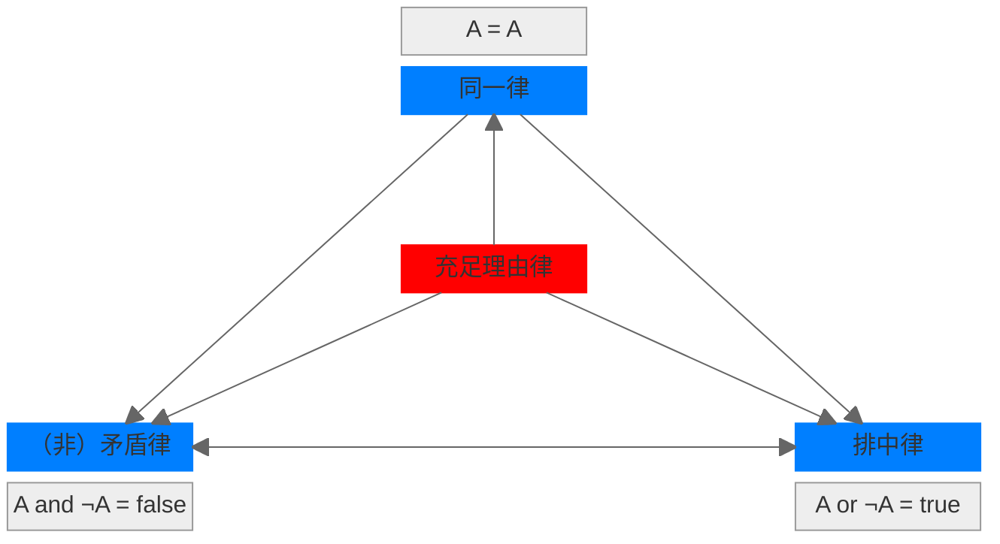

# card
## 1. 核心内容

### a) 逻辑三律

亚里士多德在逻辑学中提出经典逻辑三律：

- 同一律
- （非）矛盾律
- 排中律

其中，同一律是推理的基础，而（非）矛盾律和排中律共同构建的二值体系，保证了逻辑推理的结果是真值（真或者假）。

### b) 充足理由律

莱布尼茨在 17 世纪提出了充足理由律，更多地是在强调逻辑推理的原因/理由/动机。基于此，莱布尼茨提出了理性的宇宙观：

真理分为两种：

- 基于（非）矛盾律的理性真理，具有必然性
- 基于充足理由律的事实真理，具有偶然性

### c) 四大定律之间的关系

- 同一律、矛盾律和排中律是传统逻辑的基石，它们确保推理的内部一致性、确定性和清晰性
- 充足理由律不是纯粹的逻辑定律，而是形而上学或认识论原则，它为逻辑推理提供外部解释和依据，使推理更完整

## 1. 核心思想

逻辑学是清晰思考与有效沟通的艺术，通过掌握基本原理和避免常见谬误，人们可以更准确地认识真相、理性决策。

## 2. 核心概念

### 逻辑学的四大定律

- 同一律 (Law of Identity)
  - 同一时间，同一方面，事物只能是其本身
- 不矛盾律 (Law of Non-contradiction)
  - 同一时间，同一方面，针对同一事物，如果出现两个完全相反的命题，则它们是互相矛盾的
- 排中律 (Law of Excluded Middle)
  - 同一时间，同一方面，两个互相否定的命题中，必有一个是真的，不存在中间状态
- 充足理由律 (Law of Sufficient Reason)
  - 事物是客观存在的，任何结论都不是凭空产生的，必须有充分的理由来支持。

### 如何定义术语

- 归类：把术语所代表的客观事物放入最相近的类别（class）之中
- 区分：确定其与同类其他事物的不同特性（attribute）
- 示例：正义的定义
  - 归类：社会美德
  - 区分：使成员各有所得
  - 结果：避免与宽容/慷慨混淆
- 反例：把椅子定义为坐具
  - 未区分摇椅和牙科椅的功能差异
  - 未归类到家具这一更精准的类别
  - 结果：沟通中误用概念

### 论证

论证由两个基本要素组成：

- 前提/因为
- 结论/所以

最有效的论证总是试着得出最简单明了的结论。

论证的形式：

- 演绎论证 (Deductive reasoning)：从一般到特殊
- 归纳论证 (Inductive reasoning)：从特殊到一般

## 3. 主题归档

类型：逻辑学

关联领域：批判性思维

## 4. 全书框架梳理

- 第 1 章：being logical 需要搭建的思维框架
  - 确认事实与观点
    - 事物与事件是客观存在的
    - 例句：事实需要我们主动去认识。

  - 语言与真相的关系
    - 避免模糊语言
    - 例句：语言要忠实表达客观事物本来面貌。

- 第 2-3 章：逻辑思维的基本原理及其表现形式
  - 四大定律

- 第 4-5 章：非逻辑思维的根源及其论述形式
  - 态度性根源：怀疑论
  - 26 中谬误  

## 5. 写作动机

问题意识：公众逻辑能力下降导致沟通低效、易被误导

现实意义：培养真相导向的思维习惯，应对信息爆炸时代的认知陷阱

## 6. 观点提炼

### a) Why

非逻辑思维扭曲真相，源于态度不端（如玩世不恭者预设立场）

### b) How

识别根源（如压制理性、滥用专家意见），坚守“论证服务于真相”

### c) What

真诚是基础但不充分，需结合常识与证据（示例：权威观点需验证其理由）

## 7. 批判性思考

### a) 作者背景

美」D.Q.McInerny 哲学教授（圣母大学），神学研究经历

### b) 政治倾向

### c) 价值预设

- 真相客观性（反对相对主义）

- 逻辑普适性（逻辑是“人类理性基本原理”）
- 道德关联：逻辑服务于善（第六章强调“推理目的必须正当”）
