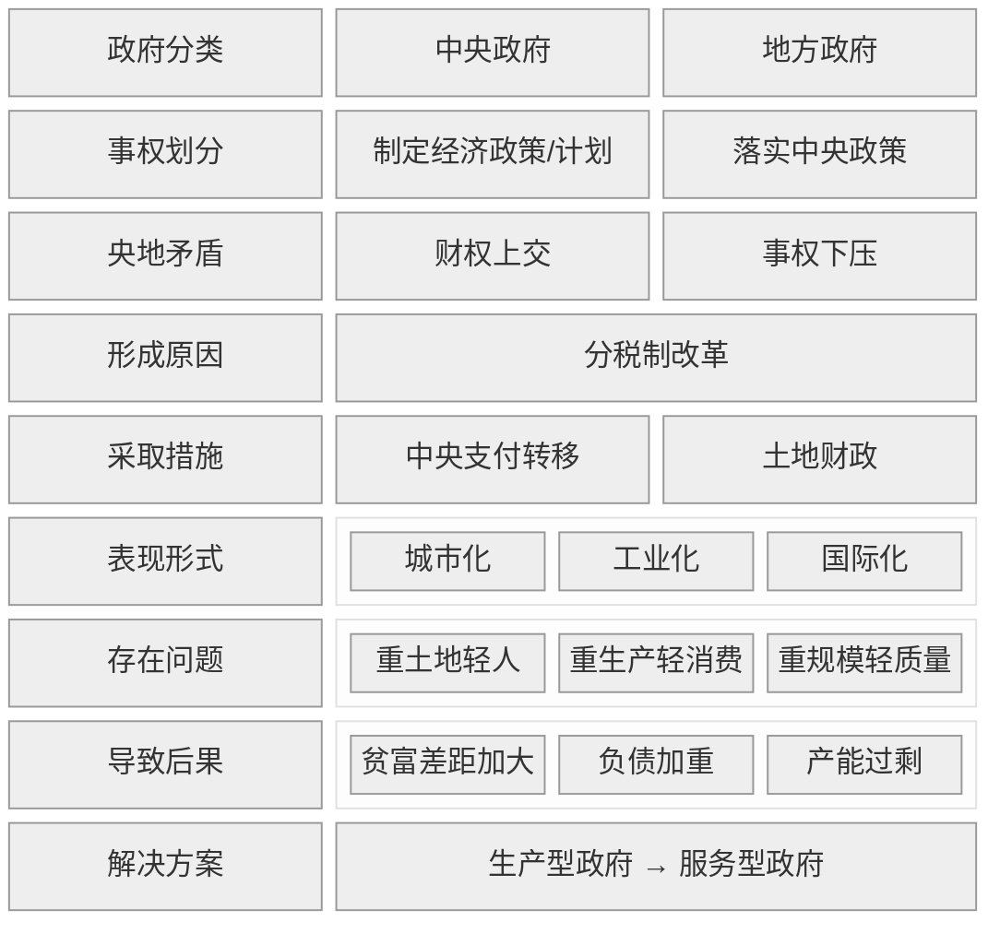
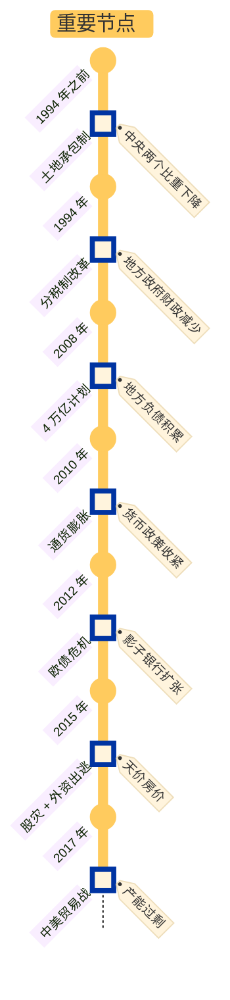

# card

## 1\. 核心内容

中国政府分为中央政府和地方政府。中央政府负责制定宏观经济目标/计划，地方政府负责因地制宜，执行计划。

在计划经济和改革开放初期，我国经济发展失衡。具体体现在两个方面：

- 横向：地区/省份间发发展不平衡
- 纵向：在中央 --> 省--> 市 --> 县的行政划分下，财权层层上收，事权层层下压

为了增加中央财政收入，增强宏观调度能力，政府在 1994 年开始实施分税制改革。分税制改革后，国税和地税互相分立，税收向中央集中，便于中央实施财政转移。地方政府则从两个方面增加税收：

- 城市化：大兴土地财政和土地金融，主要表现为房地产财政
- 工业化：招商引资，发展乡镇企业

城市化和工业化的本质都是让农民的身份发生改变：农民分别变为工人和市民。这样做虽然能让经济快速发展，但也会导致一系列债务问题：

- 过度工业化
    - 国企效率不高，从而导致资源浪费
    - 产能过剩，从而引发国际贸易战
- 过度城市化
    - 重生产、轻消费，忽略了城市建设应该以人为本（即提高公共服务），从而导致人们的贫富差距过大

政府在经济发展中的角色是调控经济发展的速度。随着时代的发展，中国政府的角色也要进行改变：从生产型政府转变为服务型政府。

附中国经济发展过程中的重要节点：

### a) Why

如何解决计划经济遗留的发展失衡问题？

- 横向：地区间发展差距过大
- 纵向：中央财权弱化与地方事权过载

中央政府需重塑财政集权能力，推动全国统一大市场建设

### b) How

如何实现发展再平衡？

- 中央政府
    - 分税制改革
        - 中央强化宏观调控
        - 转移支付平衡地区差异
    - 国际化
        - 加入 WTO
- 地方政府
    - 工业化：招商引资竞赛（税收优惠 + 国企改制）
    - 城市化：土地资本化（土地财政 + 土地金融）
- 个人身份转换：农民 → 工人/市民，支撑工业化与城市化进程

### c) What

成就与代价分别是什么？

- 成就
    - 经济高速增长（2001-2010年均增速10.5%）
    - 城镇化率跃升（1993年28%→2020年64%）
- 代价
    - 国企低效 → 资源错配/产能过剩 → 贸易摩擦
    - 重基建轻服务 → 贫富分化加剧

生产型政府模式下，债务驱动增长不可持续 → 需向服务型政府转型，重构“人本导向”发展逻辑

## 2\. 参考笔记

## 3. 批判性思考

### a) 认同

- 中国政府应该从“生产型”向“服务型”过度

### b) 质疑

暂无

## 4\. 卡片链接

## 5. 行动

- [ ] task1

## 6. 延伸阅读

- 《转型中的地方政府》 by 周黎安
  - 关联点：行政发包制、政治锦标赛理论
  - 差异点：更抽象的理论建模
- 《小镇喧嚣》 by 吴毅
  - 关联点：基层政府经济行为田野记录
  - 差异点：微观个案深描
- 《结构性改革》 by 黄奇芬
  - 关联点：政策制定者视角的改革方案
  - 差异点：偏重实操建议
- 《21世纪资本论》
  - 关联点：全球视野下的财富不平等
  - 差异点：中国案例较少
- 《光变》
  - 关联点：京东方崛起中的政府角色
  - 差异点：
- 《芯片战争》
  - 关联点：政府如何在半导体产业中发挥作用
  - 差异点：
- 《大国大城》
  - 关联点：城市化与产业集聚的经济学
  - 差异点：
- 《变革中国》
  - 关联点：市场化转型制度变迁
  - 差异点：

# ref
## 1\. 核心思想

中国政府通过深度介入经济运作（如“土地财政”、产业投资、资源调配）推动工业化与城市化，这种“生产型政府”模式是中国经济高速增长的核心动力，但也积累了“债务风险”与“结构失衡”，未来需向“服务型政府”转型。

## 2\. 核心概念

### 1994 年分税制改革

- 定义：
    - Why?
        - 为提升中央财政收入占比（“弱中央”问题）
        - 增强宏观调控能力
    - How?
        - 通过划分税种归属（中央税/地方税/共享税）
        - 分设国税地税机构
        - 税收返还 + 转移支付制度，从根本上取代财政包干制
    - What?
        - 取代财政包干制的系统性财政体制改革
        - 央地收入分配关系的制度化重构
- 示例：增值税的央地共享（75%:25%）
    - 背景：增值税原为地方主体税源（改革前地方政府留存 75% 以上），1994 年后被划为央地共享税
    - 支撑点：
        - 税种归属：明确纳入共享税范畴（非地方税或中央税）
        - 分成机制：中央政府强制拿走75%（地方仅留25%）
        - 征收机构：由国家税务局（而非地税局）统一征收
    - 结果：
        - 中央财政增收：中央增值税收入占比从 1993 年的 21% 飙升至 1994 年的 55%
        - 制度化分配：超越传统“财政包干”的谈判分成，形成刚性规则
    - 为何是典型示例？
        - 完全符合分税制改革的 “How 层”机制（税种划分 + 分成比例 + 国税征收）
        - 直接服务于 “Why 层”目标（中央财权强化）
- 反例：契税（1997 年前为纯地方税）
    - 背景：契税是对土地、房屋权属转移征收的税种，1994 年分税制改革时未被纳入共享税范畴，保留为地方独享税
    - 矛盾点：
        - 税种归属：未按“税种三分法”划为共享税（2009 年后才逐步上调中央分成比例）
        - 征收机构：1994-2018年由地方税务局征收（未移交国税）
        - 财政效果：
            - 地方留存 100%（1994-2009年）→ 强化地方依赖非共享税
            - 催生“ 土地财政替代性路径 ”（如搭配土地出让抬高契税收入）
    - 结果：分税制改革的不彻底性留白，为地方政府预留了自主财源拓展空间，客观上助推了后续土地财政膨胀
    - 为何是典型反例？
        - 暴露了分税制改革的制度设计边界：
            - 未将所有税种纳入央地分成体系（契税等保留为地方税）
            - 未实现税收征管完全集中（地税局保留部分征管权）

### 土地财政

- 定义：
    - Why?
        - 制度性诱因：分税制改革后，地方税收收入占比骤降，而支出责任未减，由此导致了中央和地方之间的结构性矛盾：“财权上收、事权下放”
        - 发展需求驱动：地方政府禁止直接发债（截止至 2014 年），倒逼地方开辟非预算内财源
        - 两项政策激活了土地资产价值，使地方政府成为土地市场唯一垄断供给方：
            - 1998 年住房商品化改革
            - 2003 年土地招拍挂制度
    - How?
        - 土地出让收入
            - 操作方式：征收农地 → 政府储备 → 招拍挂出让
            - 财政转化路径：70年土地使用权一次性拍卖（占地方财政 30%-50%）
        - 土地抵押融资
            - 操作方式：城投公司以土地为抵押物向银行贷款
            - 财政转化路径：形成地方政府表外债务（隐性债务主体）
        - 房地产开发税收
            - 操作方式：土地增值税/契税/房产税等
            - 财政转化路径：可持续税收流但依赖房价上涨
        - 土地开发溢出收益
            - 操作方式：基建投入拉升周边地价 → 下一轮出让溢价
            - 财政转化路径：自我强化的正反馈循环
    - What?
        - 核心载体：
            - 土地出让金（非税收入，占地方基金收入 90%+）
            - 地方政府融资平台（LGFVs, 以土地抵押负债超60万亿）
        - 典型特征：
            - 周期依赖性：与房地产景气度强正相关
            - 不可持续性：增量土地减少 + 债务利息累积
            - 二元结构：农村土地低价征收 → 城市高价出让
- 示例：城投公司“自循环”土地融资模式
    - 背景：
        - 1994 年分税制改革后，地方税收分成比例大幅压缩，但土地出让收益划归地方
        - 2000 年代初，地方政府为弥补财政缺口，依托\*\*融资平台公司（城投公司）\*\*构建“土地金融”循环：城投购地 → 土地抵押贷款 → 土地出让金充实财政
    - 支撑点：
        - 土地资本化：政府指令城投公司高价竞拍本地土地，土地出让金计入政府性基金收入
        - 融资属性：城投以土地为抵押向银行融资，资金用于支付购地款，形成“财政增收-债务增加”闭环
        - 核心目标：短期内做大财政收入，支撑基建投资（如新城开发、轨道交通）
    - 结果：
        - 快速城市化：2001-2021 年全国土地出让收入累计 62.9 万亿元，推动 300% 的基建扩张
        - 债务风险积累：2023 年地方政府隐性债务达 14.3 万亿元，城投平台资产负债率普遍超 80%
    - 为何是典型示例？
        - 完全符合土地财政的“信用扩张”本质：土地作为抵押品撬动金融杠杆，将未来收益贴现为当下资本，支撑高速城市化
- 反例：农民土地权益剥夺与财富逆向分配
    - 背景：
        - 宪法规定农村土地集体所有，但征地制度使政府垄断土地增值收益
        - 城市化进程中，农民仅获有限补偿
    - 矛盾点：
        - 公平性缺失：土地财政依赖低成本征地（补偿不足市价 10%）和高价出让，级差地租被政府独占，而非返还土地所有者
        - 目标异化：定义中“土地资本化推动发展”变为“以地敛财加剧不公”
    - 结果：
        - 财富逆向分配：2001-2021 年住宅均价涨 5 倍，一线城市达几十倍，普通居民购房负担剧增；有房者财富增值，无房者被挤出
        - 社会矛盾激化：河南 Q 县截留中央拨付的宅基地补偿金，引发农民对政府信任崩溃
    - 为何是典型反例？
        - 揭示土地财政的制度性缺陷：其可持续性以牺牲农民权益和代际公平为代价，背离“发展工具”初衷

### 政府引导基金

- 定义：
    - Why?
        - 引导社会资本投向特定产业：新能源/光伏等
        - 社会资本天然规避早期科创/基础科研等高风险项目，政府需要接入其中来填补缺口
        - 推动区域经济转型升级
    - How?
        - 财政出资 20-30% 作劣后级 LP(Limited Partner) ，吸引社会资本（银行/企业/个人）担任优先级 LP，定向投资战略产业
        - 政府优先承担亏损
        - 政府投资盈利后本金收回财政，收益部分再投入新基金
    - What?
        - 由政府出资设立，按市场化方式运作的政策性投资基金
            - 母基金架构（FOF）：70% 基金采用“引导基金→子基金→项目”三级放大
            - 专项基金
- 示例：
    - 背景：2019 年合肥国资投资蔚来汽车
    - 支撑点：70 亿注资换取 24.1% 股权，要求总部迁址合肥
    - 结果：带动新能源产业链集聚，2022 年税收回报超投资额
    - 为何是典型示例？
        - 展示政府比风投更敢押注战略产业
- 反例：
    - 背景：湖北某市 2016 年半导体基金
    - 矛盾点：未绑定核心技术团队，盲目投资落后产线
    - 结果：项目烂尾，基金亏损 83%
    - 为何是典型反例？
        - 违背产业规律导致政府失灵

### 债务风险传导链

- 定义：
    - Why?
        - 1994年分税制改革导致“财权上收、事权下放”，地方政府财力缺口扩大
        - GDP 考核导向下，地方政府过度依赖“负债驱动投资”发展基建
        - 表外融资（如城投债、PPP）缺乏透明度，风险跨市场传染
    - How?
        - 地方政府债务 → 金融机构资产恶化 → 信贷紧缩与流动性危机 → 企业融资成本上升 → 实体经济衰退 → 税收减少+社保支出增加 → 更大债务
    - What?
        - 债务违约通过三重循环，将局部流动性危机放大为系统性风险：
            - 金融系统
            - 实体经济
            - 财政收支
- 示例：
    - 背景：2018-2020 年，西部某省融资平台集中到期债务占地方财政收入的 180%，主要投向低回报基建项目
    - 支撑点：分税制后地方财力缺口 + 政绩考核压力 → 过度举债
    - 结果：中央紧急提供300 亿纾困资金，但 GDP 增速仍下跌 4.5%
    - 为何是典型示例？
        - 完整呈现“举债动机 → 金融传染 → 实体衰退 → 财政反噬”闭环，揭示传导链的不可逆性和系统性危害
- 反例：
    - 背景：2021 年黑龙江鹤岗市债务率超 600%，触发财政重整条件
    - 矛盾点：
    - 结果：
        - 2 年内债务率降至 300%，未引发区域性金融震荡
        - 民生支出保持稳定，未出现企业连锁倒闭
    - 为何是典型反例？
        - 证明通过早期干预和制度性阻隔（如财政重整机制），可破解传导链的自我强化逻辑，避免局部风险升级为系统性危机

## 3\. 主题归档

类型：

- 政治经济学
- 中国政府
- 中国经济

关联领域：

- 发展经济学
- 公共政策
- 制度分析

## 4\. 全书框架梳理

核心论点：中国政府是中国经济的引擎

### a) 微观机制：地方政府如何推动经济发展？

分论点1：中央和地方政府的事权划分不同：中央负责制定计划，地方负责落实中央政策

- 案例：浙江省‘省直管县’财政实验（省管县 vs 市管县财政效率对比）
    - 背景：1994 年分税制改革导致基层财政困境
    - 支撑点：县财政留成比例提高 → 百强县数量占全国 1/4
- 金句：事权层层下压，财权逐级上收，县级政府成了压力最大的一环

分论点2：分税制减少了地方政府的财政资源，于是地方政府实施土地财政等措施填补收支缺口

- 案例：天津‘海河产业基金’运作 （1994 年分税制 → 土地财政兴起）
    - 背景：2008 年 4 万亿刺激计划
    - 支撑点：政府出资 200 亿撬动社会资本 5020 亿 → 芯片/航空产业落地
- 金句：土地资本化创造的不是财富，而是把未来的收益变成今天可用的资本

分论点3：地方政府通过建立“产业引导基金”等手段帮助乡镇企业实现工业化

- 案例：合肥国资投资京东方
    - 背景：2015 年中央提出的“中国制造 2025”战略
    - 支撑点：90 亿拨款 + 土地优惠引进 6 代线 → 面板产业链集群产值超千亿
- 金句：地方政府像风险投资者，敢于押注技术路线尚不成熟的关键产业

### b) 宏观现象：地方政府推动经济发展模式有哪些特点？

分论点1：过于重视 GDP 等经济指标导致债务风险

- 案例：贵州独山县‘天下第一水司楼’
    - 背景：西部大开发基建热潮
    - 支撑点：400 亿债务建烂尾景观 → 全县年财政收入不足 10 亿
- 金句：主官任期制下的工程，常常是“前人借钱，后人还债”

分论点2：地方政府在城市化建设中重土地轻人，导致贫富差距扩大

- 案例：东莞‘世界工厂’农民工困境
    - 背景：户籍制度改革滞后
    - 支撑点：600 万外来工仅 15% 有本地医保 → 消费率比全国低 10%
- 金句：人的城市化落后于土地的城市化，就像电路只完成了布线却未通电

分论点3：中国政府在国际贸易竞争中面临转型

- 案例：中兴通讯被制裁事件
    - 背景：2018 年中美贸易战
    - 支撑点：芯片禁运导致产线停摆 → 倒逼国家大基金二期加码半导体
- 金句：全球化不是伊甸园，技术链的断裂可能瞬间让繁荣归零

## 5\. 写作动机

问题意识：

- 破解西方“中国崩溃论”与“威胁论”的误判，揭示中国经济的真实运作逻辑

现实意义：

- 为理解“供给侧改革”“双循环”等政策提供底层认知框架

面向群体：

- 对中国经济现象困惑的企业家、学生、政策研究者

## 6\. 观点提炼

### a) Why

中国需在保持经济增长的同时防范系统性风险，实现从“生产型”政府到“服务型”政府的转型

### b) How

政府要充当“风险资本 + 基础设施供应商”复合角色：

- 财税改革约束地方债务
- 发展资本市场替代土地财政，实现产业升级
- 强化民生支出

### c) What

- 政府官员取消 GDP 考核
- 政府采购
- 重视民生
    - 税收优惠：试点房产税
    - 全国统筹医保

## 7\. 批判性思考

### a) 作者背景

- 复旦经济学院教授
- 留美经济学博士
- 擅长制度分析与实证研究

### b) 政治倾向

- 无？？？

### c) 价值预设

- 承认政府干预在特定阶段的必要性，反对完全自由市场原教旨主义
- 警惕权力与资本结合导致的寻租（如部分 PPP 项目腐败）
- 隐含立场：渐进改革优于激进转型

# note
## Part 1. 微观机制

### Part 1. 综述

微观机制部分，分别对应第一至四章

在微观机制中，作者介绍了地方政府推动经济发展的模式

### 1. 简述地方政府的事权划分

#### a) 中国政府体系的特点

- 政治集中：中央政府确保地方官员拥有统一的意识形态
- 行政分权：充分发挥地方的主动性和积极性
- 上下分治：中央负责制定计划，地方负责「因地制宜」地落实

#### b) 政府的权力受到哪些约束？

- 做事的能力：取决于掌握的资源
- 做事的意愿：取决于各方的积极性和主动性

#### c) 地方政府间事权划分的基本逻辑是什么？

- 公共服务的规模经济与行政/地理/文化边界
- 信息复杂性：上有政策，下有对策
- （上下级官员的）激励相容

#### e) 原文引用

- >不能脱离政府来谈经济，是理解中国经济的基本出发点。
- >只有理解了地方政府的事权划分，才能清楚地方政府能干哪些事，以及用哪些资源去做这些事。
- >要想把握政府的真实意图和动向，不能光读文件，还要看政府资金的流向和数量。科学的财税体制是优化资源配置、维护市场统一、促进社会公平的制度保障。政府的事权必然要求相应的财力支持。
- >1994 年开始实施分税制。此后地方政府的支出一直高于收入，入不敷出的部分要通过中央转移支付来填补。

### 2. 分税制改革是什么？

#### a) 背景

我国一开始使用承包制

财政承包制下，交完了中央的，剩下的都是地方自己的

改革开放后，「两个比重」越来越低：

- 中央财政预算收入占全国财政预算总收入的比重
- 全国财政预算总收入占 GDP 的比重

在这种背景下，国家开始分税制改革

#### b) 税收分类

- 中央税：关税/消费税
- 地方税：营业税/个人所得税/房产税
- 共享税：增值税

#### c) 改革对地方经济发展方式的影响？

分税制减少了地方政府手头可支配的财政资源

以下措施可以填补预算内收支缺口：

1. 土地财政
2. 中央转移支付
3. 增加税收规模
4. 税收返还

#### d) 土地财政

地方政府为什么重视制造业？

- 增值税在生产环节征收
- 制造业可以带动三产发展，增加相关税收

地方政府重视制造业的后果是什么？

- 重视企业而轻视民生
- 重视生产而轻视消费

土地的资本化运作

- 制造业的核心是资本化运作
- 与人力相比，土地更容易被资本化
- 土地的资本化运作，本质是把未来的收益抵押到今天去借钱
- 我国的土地资本化，靠土地公有制实现:
  - 城市土地归国家所有
  - 农村土地归集体所有
  - 农地先经过征地变为国有土地，然后才可以用于发展工商业或建造住宅
- 土地资本化的风险是什么？
  - 如果借来的钱投资质量高，转化成了有价值的资产和未来更高的收入，那债务就不是大问题；如果地方官员在任期内搞面子工程，过度借债搞大项目，则会引发债务问题
  - 人力和土地资源的使用效率不高
  - 经济发展开始进入中期阶段，市场竞争越来越激烈，技术要求越来越高

### 3. 基层财政存在哪些困难？

地区间经济发展不平衡：

- 东西之间
- 南北之间

### 4. 政府在工业化中的角色是什么？

“东亚经济奇迹”一个很重要的特点，就是政府帮助本土企业进入复杂度很高的行业，充分利用其中的学习效应、规模效应和技术外溢效应，迅速提升本土制造业的技术能力和国际竞争力

1. 建立“产业引导基金”
2. 与社会资本共同投资“私募基金”
3. 发展“战略新兴产业”

## Part 2. 宏观现象

### Part 2. 综述

在宏观现象中，作者从三个维度总结了地方政府推动经济发展模式的特点，分别对应三个章节：

- 第五章--> 城市化建设 --> 重土地轻人 --> 贫富差距加大
- 第六章--> 招商引资 --> 重规模、扩张 --> 负债加重
- 第七章--> 发展战略 --> 重生产轻消费 --> 产能过剩、贸易冲突

### 5. 城市化建设

第五章开篇，作者描述了“城市化建设的链条关系”：

- >通过出让城市土地使用权，可以累积以土地为信用基础的原始资本，推动工业化和城市化快速发展
- >中国特有的城市土地国有制度，为政府垄断土地一级市场创造了条件，将这笔隐匿的财富变成了启动城市化的巨大资本，但也让地方财源高度依赖土地价值、房地产和房价
- >房价连着地价，地价连着财政，财政连着基础设施投资，于是经济增长、地方财政、银行、房地产之间就形成了“一荣俱荣，一损俱损”的复杂关系

#### a) 城市房价高的原因是什么？

- >房价中长期主要由供求决定，房屋供需与人口结构密切相关，因为年轻人是买房主力
- >年轻人大都流入经济发达城市，但这些城市的土地供应又受政策限制，因此房屋供需矛盾突出，房价居高不下

#### b) 地区间城市发展不平衡的原因是什么？

根源之一在于土地和人口等生产要素流动受限：

- >城市化的核心不应该是土地，应该是人
- >要实现地区间人均收入均衡、缩小贫富差距，关键也在人
- >要真正帮助低收入群体，就要增加他们的流动性和选择权，帮他们离开穷地方，去往能为他的劳动提供更高报酬的地方，让他的人力资本更有价值
- >同时也要允许农民所拥有的土地流动，这些土地资产才会变得更有价值

#### c) 贫富差距的敏感度和经济增速的关系是什么？

- >经济增速高时，虽然收入差距在拉大，但低收入人群的收入水平也在快速上升，人们更看重自己的劳动收入（即工作能力），社会对贫富差距的敏感度在一段时间内没有那么高
- >经济增速慢时，人们更看重自己的资产收入（如房产），社会对不平等的容忍度减弱，贫富差距更容易引发社会矛盾

#### d) 我国的城市化经历了哪三个阶段？

- 1994 年前，乡镇企业崛起，农民离土不离乡，城市化速度不快
- 1994 年分税制改革之后，农民工进城大潮形成，土地的城市化速度远大于人的城市化速度：地方政府以土地为杠杆撬动城市建设，但是城市的新移民并没有得到相应的公共服务（教育/医疗/养老等）
- 十八大之后，城市化重心逐步从“土地”向“人”转移

### 6. 城市化建设导致的债务问题

#### a) 债务的一般经济学原理

债务是什么？

- >是借来的钱，即（未来需要偿还的）本金 +（额外需要支付的）利息

为什么会有债务？

- >债务源于人性：总想尽早满足欲望，又对未来盲目乐观，借钱时总觉得将来能还上

债务的特点是什么？

- >债务常常把风险集中到承受能力最弱的穷人身上

#### b) 我国债务的成因、风险、后果

我国债务的成因是什么？

- >我国债务迅速上涨始于 2008 年
- >当年在金融危机的大背景下，我国出口打击很大
- >为防止经济下滑，中央出台财政刺激计划，同时放宽金融管制以及对地方政府的投融资限制，带动基础设施投资大潮，也推动大量资金涌入房地产

我国债务累积分为哪些阶段？

- 2008 - 2009: 4 万亿计划，载体为基建和房地产
- 2010 - 2011: 通货膨胀抬头，货币政策收紧
- 2012 - 2015: 欧债危机导致影子银行（例如信托贷款）开始扩张
- 2015 - 2016: 股灾+资本外逃
- 2017 - 2018: 中美贸易战+中央政策：去产能，不炒房

我国企业债务的特点是什么？

- >地方政府融资平台企业的债务占 GDP 较高，资金主要投向基础设施，项目回报率低
- >“国进民退”现象凸显：国企规模迅速扩张，但其多占用低资金没有转化为同比例低新增收入，推升了整体债务负担
- >房地产是支柱型产业，不仅本身规模巨大，而且直接带动钢铁、玻璃、家具、家电等众多行业。在购置土地环节，发达国家一般要求企业使用自由资本金，而我国允许房企借钱买地，这就刺激了放弃竞相抬高地价和储备土地

我国银行债务的特点是什么？

- >银行不仅发放贷款，也持有大多数债券
- >银行偏爱以土地和房产为抵押物的贷款，因为这些抵押物让银行的风险降低
- >银行投资有风险，因此银行会和信托公司/券商合作，成立“影子银行”（功能类似银行，但不受银行监管）

银行信贷的保障有哪些？

- 优良抵押物
  - 土地
  - 房子
- 政府担保

#### c) 如何化解债务风险？

偿还已有债务：

- 压缩支出：国企混改
- 增发货币：
  - 金融危机前：降低利率。前提是投入货币之后，经济能够增长，实际收入能增加
  - 金融危机后：“量化宽松”，即央行增发货币来买入各类资产，把货币注入经济。问题是，央行购买的各种金融资产会推高资产价格，受益的是相对富裕的人，增发的货币难以转到穷人手中
  - 把债务货币化：用无利率的货币替代有利率的债务，以政府预算收支的数量代替金融市场的价格（即利率）来调节经济资源配置

遏制新增债务：

- 限制房价上涨
- 限制土地财政和土地金融
- 限制政府担保和国有企业过度借贷
- 改革资本市场，用股权代替债权

总结：

- >总体来说，我国债务风险的本质不是金融投机的风险，而是财政和资源分配机制的风险
- >在中国，政府和国企主导投资，国有银行主导融资
- >这一体系在过去的经济增长中发挥过很大的作用，但如果投资主体不变，权力不下放给市场，那想要构建政府和银行风险的直接融资体系、想让分散的投资者去承担风险，就不符合“谁决策谁担风险”的逻辑

### 7. 发展战略

第七章将展开讨论“我国对国际经济体系的冲击”，并且从国际冲突的角度出发，由外向内再度审视国内经济结构的失衡问题

#### a) 产能过剩是什么？

1. 生产效率下降
   1. 宏观：GDP 增速放缓，低于债务增速
   2. 微观：地方政府过度投资，为“僵尸企业”输血，扭曲了资源配置，且土地财政和土地金融过度依赖地价和房地产
2. 国际失衡：由于重生产轻消费，中国必须向国外输出剩余产能，对国际经济体系冲击巨大，从而导致贸易战
3. 产业升级：由于产能过剩，我国制造业竞争激烈，价格和成本不断降低。要想在国内市场上存活和保持优势，头部企业必须提高质量和技术，这进一步冲击了发达国家的国际分工体系

#### b) 国内经济结构为何失衡？

作者认为，我国经济结构失衡的最突出特征是消费不足。这存在两方面的可能性：

1. GDP 中老百姓可供支配的收入份额下降
2. 老百姓把更大一部分收入存了起来，储蓄率上升

对于第二点，作者认为是三点共同作用的结果：

- 计划生育导致老年人储蓄率偏高
- 政府民生支出不足：教育/医疗/养老
- 房价上涨导致老百姓消费不足

对于第一点，作者认为，如果百姓的收入份额下降，一定对应着政府/企业份额的提升：

- 经济发展初期，将更多资源从居民消费转为资本积累，变成基础设施和工程，可以有效推动经济起飞和产业转型，提高生产率和收入
- 起步时百废待兴，绝大多数投资都有用，都有回报，关键在于加大投资，加速资本积累
- 但当经济发展到一定阶段后，这种方式就不可持续了，原因有四点：
  - 基础设施和工业体系趋于完善，投资难度加大
  - 居民消费不足，无法消化投资形成的产能
  - 贫富差距拉大
  - 过剩产能导致的国际冲突

#### c) 以中美贸易战为例，中国经济如何对外国形成冲击和反弹？

落后国家崛起的两大特征：

- 对先进国的高效模仿和学习
- 结合本土实际，带有本国特色，发展路径与先进国有诸多不同之处

因此，落后的工业国在崛起过程中与先进国之间的种种冲突，历史上是常态

作为对中国经济的观察者，作者认为要培养出一种发展的观念：

- 理解发展目的不等于发展过程，发达国家目前的做法不一定能解决我们发展中面临的问题
- 我国过去的一些成果经验和发展模式也不可能一直有效，因为时代在不断发展

中国对美国的最大冲击点是什么？

- 作者认为，中国对美国的就业冲击并不重要
- 相比之下，对美国的技术冲击和挑战更加实在，这也是中美贸易冲突和美国技术遏制可能会长期化的根本原因：
  - >对站在科技前沿的国家来说，新技术的发明和应用一般从科学研究和实验开始，再到技术应用和专利阶段，然后再到大规模工业量产
  - >但对一个后起的发展中国家来说，很多时候顺序是反过来的：先从制造环节入手，边干边学，累积技术和经验，然后再慢慢根据自身需要改进技术，创造一些专利产品销量逐步扩大、技术逐步向前沿靠拢之后，就有了更多资源投入研发，推进更基础、应用范围更广的科研项目

作者认为，尽管美国的科技技术依然领先，但是全球最大的市场在中国

如果市场和科技渐行渐远，对双方都是巨大损失：

- >我国在基础科研质量、科技成果转化效率等方面，还有很长的路要走
- >而美国要想在全球再找一个巨大的市场，也是天方夜谭
- >没有了市场，美国公司持续不断的高额研发支出很难持续，也就难以长久维持技术优势

如何才能突破技术壁垒，实现国产替代？

- 技术高压可能让我国企业在短期内受挫
- 但很多相对落后的国产技术也因此获得了市场机会，可能提高市场份额和收入，进而增大研发力度，进入“市场-研发-迭代-更大市场”的良性循环，最终实现国产替代
- 但是这一切的前提，是我国能真正支撑起“国内大循环为主体，国内国际双循环”的模式：
  - 作者认为，实现这一战略转型的关键是“提高居民收入和消费”
    - 要提高居民收入，就要继续推进城市化，让人口向城市，尤其是大城市集聚：
      - >虽然制造业是生产率和科技进步的主要载体，但从目前的技术发展和发达国家的经验看，制造业的进一步发展吸纳不了更多就业
      - >产业链全球化之后，标准化程度越来越高，大多数操作工序都由机器完成
      - >比较高端的制造业，资本密集度极高，自动化车间里没有几个工人。所以解决就业和提高收入必须依靠服务业的大力发展，而这只能发生在人口密集的城市中
    - 扩宽居民的财产性收入
    - 改革金融体系和资本市场，壮大国内市场
      - 市场从建立到完善，其规模和效率都需要逐步提升，完善的市场本就是经济发展的结果，而不是前提
  - 地方政府也要改变角色：
    - 遏制其投资冲动
    - 降低其生产性支出
    - 加大民生支出

### 8. 总结

#### a) 关于中国政府在经济发展中所扮演的角色

中国政府，尤其是市县一级的地方政府，通过政策、财政、金融等手段深度参与经济发展，最终让政府置身于市场之中，把竞争机制引入政府：

- 中央政府设定经济发展目标，然后放权给地方政府，让地方政府互相竞争，优化资源配置
- 这种中央协调 + 地方地方分权竞争的模式，属于中国特色
  - 优点
    - 把官员的晋升和地区经济表现挂钩
    - 以市场竞争约束地方官员
    - 当地的经济表现能力为地方官员和政府工作提供及时的反馈
  - 缺点
    - 官员缺乏淘汰机制
    - 地方保护主义
    - 市场的长周期与官员任期短周期之间的矛盾
- 政府角色的转变：从生产型到服务型，加大人力资本的投资，比如教育、医疗等民生支出
- 区分经济发展过程和发展目标：
  - 经济发展必然要改变旧有的生活方式，重新分配利益，所以必然伴随着矛盾和冲突
  - 政府的关键作用之一，就是调控改变速度的快慢
    - 社会变化过程快慢之间，对身处其中的人而言，感受天差地别
    - 对于环境的变化，人们需要时间去适应
    - 人不是机器部件，不可能瞬间调整，也没有人能一直紧跟时代，所以稳定的改革过程要留下足够的时间和资源去缓冲

#### b) 关于发达国家和发展中国家经济发展的差异

对处于技术前沿的发达国家来说：

- 提高生产率的关键是不断探索和创新
- 其相对完善的市场经济是一套分散化的决策体系，其中的竞争和价格机制有利于不断“试错”和筛选胜者

对发展中国家来说：

- 提高生产率的关键不是探索未知和创新
- 而是学习已知的技术和管理模式，将更多资源尽快组织和投入到学习过程中，以提高学习效率
- 后进国家虽然有模仿和学习先进国家技术的“后发优势”，但其“组织学习模式”不可能一直持续下去：
  - 当技术和生产率提高到一定水平之后，旧有的模式若不能成功转型为“探索创新模式”，就可能会阻碍经济进一步发展
  - “后发优势”可能变成“后发劣势”。

#### c) 关于中国的地方经济发展

经济发展的关键在于工业化和城市化：

- 表面上看，这是个工业生产技术和基础设施建设的问题
- 但看深一层，这是个“农民转变为工人和市民”的问题

行政区域决定了可行的经济发展政策的边界

在我国，可行的政策空间和演变路径受三大制度约束：

- 农村集体所有制
- 城市土地公有制
- 户籍制度
