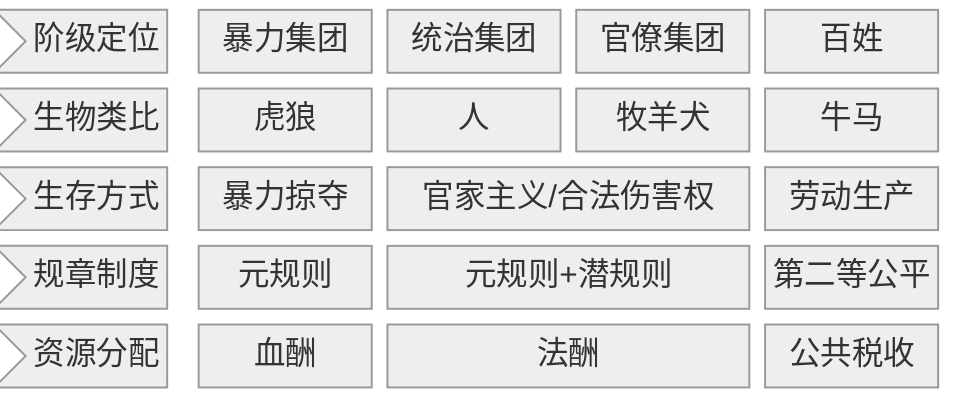

# card

## 1\. 核心内容

在一个稳定的大一统社会中，统治集团和官僚集团负责管理，百姓进行经济生产。

不论是统治集团还是官僚集团，都会追求自身利益最大化：

- 上级是暴力最强者，因此他们制定元规则
- 下级在执行元规则时，也会按照潜规则进行利益再分配

元规则和潜规则的执行除了要保证社会正常的运作之外，还拥有合法的掠夺权。

然而，他们也受到血酬定律约束。如果生产-生存平衡被打破，百姓/官员就会放弃生产，转变为暴力集团进行财富掠夺。

当支持暴力集团的基数足够大，便代表了「正义」或者「民意」。于是，原有的统治集团被推翻，新的暴力集团成为统治阶级，循环往复。

血酬定律所描述的核心问题，就是生命与生存资源的交换。

血酬的价值是由拼命争夺的对象的价值决定的。

### a) 血酬

- what
    - 通过暴力掠夺换取的酬劳
- why
    - 生产带来的财富小于暴力掠夺带来的财富
- how：
    - 暴力掠夺的强度/广度与血酬正相关
    - 与成本（道德/机会/财务）负相关

### b) 法酬

- what
    - 法酬 = 全部税收 - 公共税收 （维持社会基本运转 + 百姓基本生存所需要的资金）
    - 暴力集团变为统治集团后，制度化的血酬
- why
    - 统治集团和官僚集团追求利益最大化
- how
    - 皇室利用征税获得的财富
    - 官家利用潜规则/合法伤害权获得的财富

### c) 元规则

- what
    - 暴力最强者说了算
    - 各种规则的规则
- why
    - 追求自身利益的最大化
- how
    - 暴力竞争
    - 谁拥有让对手得不偿失的伤害能力，谁就拥有规则的否决权
- who
    - 暴力竞争的胜利者
    - 接受暴力集团统治的人

### d) 潜规则

- what
    - 潜规则是偏离元规则的、当事人实际遵守并执行的规则
    - 潜规则在明朝被称为「陋规」
- why
    - 元规则产生的收益不足以满足当事人的利益需求
    - 受到血酬定律约束，如果利益（法酬）分配不均，将招致暴力集团报复
- how
    - 当事人将元规则的代表屏蔽于局部互动之外
    - 将元规则的代表拉入私下交易之中
- who
    - 制定潜规则的人
    - 接受潜规则的人
    - 元规则的代表

### e) 官家主义

- what
    - 暴力资源集中在统治者手中
    - 统治者选拔代理人管理
    - 代理人不能世袭，没有武装力量
- why
    - 区别于历史书中所讲的封建帝国主义
    - 皇权专制无法体现潜规则对中国历史的影响
- how
    - 从血酬定律和元规则的角度看，中国历史呈现为一个又一个暴力集团的崛起
    - 他们打天下，坐江山，建立大一统帝国，立法定规，吃法酬，然后被另一个暴力集团推翻，如此循环不已
- when
    - 从秦汉到明清
- who
    - 皇族
    - 官府
    - 官员

### f) 第二等公平

- what
    - 相对于绝对公平，第二等公平是在潜规则框架下实现的相对公平
- why
    - 通过经济生产得到的酬劳高于流血卖命换取的酬劳
- how
    - 拿人钱财，替人消灾
- who
    - 百姓

# ref
## 1. 核心思想

中国历史演进的核心动力是暴力集团与生产集团博弈形成的元规则/暴力最强者说了算，一切制度、道德、文化的本质都是暴力掠夺与生存策略的演化产物。

## 2. 核心概念

### 潜规则

- 定义：
  - Why?
    - 规避元规则的高执行成本，实现各方风险最小化的利益交换
  - How?
    - 通过非正式契约形成灰色秩序，取代表面制度
  - What?
    - 隐藏的权力分配
- 示例：
  - 背景：明清衙役征收粮税
  - 支撑点：官方要求1石粮，衙役通过“淋尖踢斛”“折色火耗”等手法实收2石
  - 结果：农民默认为生存成本，朝廷默认为基层激励
  - 为何是典型示例？
    - 展示权力如何通过非正式渠道变现
- 反例：
  - 背景：海瑞任应天巡抚时严禁潜规则
  - 矛盾点：拒绝所有灰色收入导致官僚系统瘫痪
  - 结果：政策无法执行被调离
  - 为何是典型反例？
    - 证明潜规则是系统维持运行的润滑剂

### 血酬定律

- 定义：
  - Why?
    - 暴力决定资源分配
  - How?
    - 通过暴力投入获取生存资源（血酬 = 暴力掠夺收益）
  - What?
    - 通过换血/卖血得到的酬劳，即暴力价值的计算法则
- 示例：
  - 背景：土匪绑票定价
  - 支撑点：根据农户家产精确计算赎金（如牲畜折价/土地年产出）
  - 结果：形成“不竭泽而渔”的可持续掠夺
  - 为何是典型示例？  
    - 展示暴力收益的理性化计量
- 反例：
  - 背景：明末李自成“追赃助饷”政策
  - 矛盾点：无差别拷掠官绅导致统治基础崩塌
  - 结果：迅速失去政权
  - 为何是典型反例？
    - 破坏血酬可持续性原则

### 元规则

- 定义：
  - Why?
    - 暴力优势决定规则制定权
  - How?
    - 暴力集团使掠夺合法化
  - What?
    - 所有规则的母规则
- 示例：
  - 背景：清朝“八旗圈地令”
  - 支撑点：武力征服者立法强占汉民土地
  - 结果：建立“铁杆庄稼”特权制度
  - 为何是典型示例？
    - 暴力直接转化为法权
- 反例：
  - 背景：孔子周游列国推行仁政
  - 矛盾点：在武力兼并时代倡导道德治国
  - 结果：终生未被重用
  - 为何是典型反例？
    - 证明无暴力支撑的规则无效

## 3. 主题归档

类型：

- 中国政府

关联领域：

- 暴力博弈
- 权力寻租
- 历史运行逻辑

## 4. 全书框架梳理

核心论点1：暴力集团生存策略

分论点1：血酬的演化形态

- 案例：土匪经济
  - 背景：民国山东匪帮分红制
  - 支撑点：暴力集团也会从事生产活动，且似乎比官府更“公平”  
- 金句：土匪的股份制合作，比衙门更讲契约精神  

分论点2：暴力合法化路径

- 案例：
  - 背景：唐太宗“天下英雄入吾彀中”
  - 支撑点：科举制作为赎买机制  
- 金句：

核心论点2：生产集团应对逻辑

分论点1：

- 案例：
  - 背景：明末陕西饥民吃“观音土”仍纳税
  - 支撑点：农民“良民-流民-暴民”转化  
- 金句：纳税是购买暴政勒索权的赎金  

分论点2：法酬的转移支付

- 案例：
  - 背景：票号镖银抽成的暴力折现
  - 支撑点：晋商与镖局分润制度  
- 金句：  

核心论点3：制度僵化陷阱

分论点1：“崇祯死弯”概念

- 案例：
  - 背景：辽东战事与三饷加派
  - 支撑点：剿饷→流寇→剿饷恶性循环  
- 金句：“越剿匪，匪越多”的财政癌变  

分论点2：“淘汰清官”概念

- 案例：
  - 背景：官僚集体抵制清丈田亩
  - 支撑点：海瑞在应天府的改革困局  
- 金句：

## 5. 写作动机

问题意识：

- 解释中国历代政府的真实运行逻辑

现实意义：

- 揭示制度运行的真实逻辑，为当代改革提供历史镜鉴
- 如果暴力掠夺是历史常态，文明如何可能？

## 6. 观点提炼

### a) Why

暴力均衡是人类生产行为的条件之一

### b) How

暴力博弈 → 潜规则 → 显规则演化路径

### c) What

血酬定律/法酬/元规则等概念体系

## 7. 批判性思考

### a) 作者背景

- 作家
- 历史学者

### b) 政治倾向：

- 市场经济与经济发展正相关
- 违反第一定律，政权就不稳定
- 收权还是放权，取决于执政者的利害计算

### c) 价值预设

- 人性永恒趋利避害
- 暴力是终极权力来源
- 制度是博弈的暂时均衡
