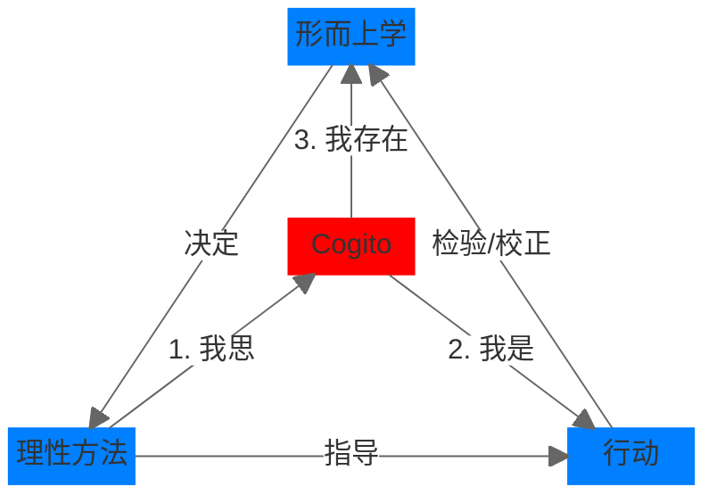

# card
## 1. 核心内容

Cogito 是笛卡尔的核心思想，包含三个阶段：

1. 我思 (je pense)
2. 我是 (je suis)
3. 我存在 (je existe)

Cogito 是连接形而上学思想、方法和行动的拱心石：

- 客观上：
  - 形而上学的思想决定了理性的方法论
  - 方法论指导行动
  - 行动反过来可以对形而上学的思想进行检验/校正
- 主观上：
  - 通过方法论让“我”进行“我思”（反思/怀疑）
  - 因为“我”思考，所以“我（灵魂上）存在”
  - 我思之后，“我”的物理实体会有所行动 → “我是”

笛卡尔认为，理性/理智是人人都有的，然而要很好的使用它们，需要正确的方法论。方法论又衍生出行事规则。笛卡尔分别列出了四条规则：

- 方法论
  - 避免先入为主
  - 化繁为简
  - 从易到难
  - 整体复盘
- 行动
  - 遵守当地法律/风俗
  - 行事果断
  - 行事不成，反求诸己
  - 遵守以上三条

# ref
## 1. 核心思想

谈谈两种方法：

1. 如何正确引导自身理性
2. 如何在各门学科中探求真理

## 2. 核心概念

### 我思故我在

这句话的第一表述是法语而非拉丁语，蕴含了三个阶段：

1. 我思 (je pense)
2. 我是 (je suis)
3. 我存在 (je existe)

“我”作为实体的存在，唯一属性是“思”。这里的思应该理解为**反思/怀疑**。除了“思”以外的任何属性都不能决定“我”的实体性/存在，因为怀疑本身的这种不可怀疑性保证了“思”的实在属性。

## 3. 主题归档

类型：哲学方法论

关联领域：

- 认知论革新
- 科学方法论

## 4. 全书框架梳理

- 1 章：笛卡尔对各门学科的不同看法
- 2-3 章：笛卡尔所探讨的方法论的主要原则，以及从这一方法论中所提取的行为准则
- 4 章：笛卡尔证明上帝和人类灵魂存在的理由
- 5 章：探讨了一系列的物理学问题，例如医学/人类与动物灵魂之间的差异
- 6 章：笛卡尔的写作动机  

其中，前四部份是重点。

## 5. 写作动机

问题意识：

- 打破经院哲学教条主义
- 解决科学革命中的认识论危机（如伽利略审判）

现实意义：

- 为新兴自然科学提供方法论护盾（避免宗教迫害）
- 确立理性而非权威作为真理标准

## 6. 观点提炼

### a) Why

传统逻辑存在局限性，例如三段论只能说明已知的事物

### b) How

构建新的方法论

### c) What

指导思想：保持理性

方式：保持理性和正确行事的四条规则

## 7. 批判性思考

### a) 作者背景

Rene Descartes, 17 世纪法国哲学家、数学家和科学家。出身贵族，参加了 1618 年爆发的三十年战争。他生前公开发表的作品有：

- 《谈谈方法》
- 《第一哲学沉思集》
- 《哲学原理》
- 《论灵魂的激情》

以下内容摘自译者（左天梦）附录：

> 在笛卡尔所处的时期，传统大学衰败，城市受到战争和瘟疫的袭击。几何学与数学在实践领域的应用取得巨大进步，天文学、医学和物理学得到长足发展。哲学家和科学家们敏锐的感受到“新科学”在这个世界中的无限生机，本书就在这样的背景时代下应运而生。

### b) 政治倾向

- 表面妥协（献书给索邦神学院）
- 实质颠覆：用“上帝是几何学家”取代“上帝是立法者”

### c) 价值预设

- **理性至上**：数学推理可解决一切问题
- **形而上学**：严格区分心灵（思考）与物质（广延）
# note
## 如何理解理性？

>并不是因为有的人更理性、其他人不够理性而导致对相同的事物持有不同看法，而是因为我们使用了不同的方法来对待相同的事物。光有理性是不够的，重点在于能够恰当的运用它。

## 保持理性的四条规则

> 第一，凡是不了解的观点，我绝不将之当成是真的，也就是说，**避免轻率地下判断还有先入为主**，只相信在脑海里清楚明白地呈现出来的观点和完全不受怀疑的事物；
>
> 第二，把我要去研究的难题尽可能分成一小块一小块，然后**逐步解决**；
>
> 第三，理清我的思路，**从最简单、最容易认识的对象开始，逐步上升到最复杂的认识对象**；对本身没有先后之分的事物，也分门别类和排序；
>
> 最后，检查每一处数据的完整性以及进行总体复查，确保**没有任何疏漏**。

## 正确行事的四条规则

> 第一条：遵守国家的法律还有民俗的习惯，坚守自身的信仰；
>
> 第二条：行事上尽可能做到坚定和果断，一旦确定某个想法之后，即使存在着很大的怀疑，也坚决遵循这条路走下去；
>
> 第三条：一直努力地去战胜自己，而不是战胜命运，去改变自己的愿望而不是世界的秩序，始终相信除了能够掌控自己的想法之外，其他事情是无法掌控的；
>
> 第四条：耗费一生的时间来培养我的理性，使用我所制定的方法，在对真理的认知道路上前进。

## 我思故我在

> 我毫不犹豫地将这条真理看作是我所追寻的哲学第一原理......我无法假装我不存在。恰恰相反，我怀疑其他事物的真实性，反映出“我存在”这一事实是如此明显和肯定。**如果我停止了思考，即使我之前所想的全部东西都是真实的，我也没有理由相信自己存在了**。此处，我意识到自己是一个实体，而它的本质或者说天性是思想，因此，它不用占据任何空间以及依靠任何有形之物。为了将这个自我——也就是灵魂，通过它，我才能使我——完全区别于肉体，认识这个自我是非常惬意的事，其实形体不在，灵魂仍将是它自己。
>
> 理性告诉我们，我们的思考不完全是真实的，因为我们并非完美，在清醒的时候所作的思考比睡梦中所想的，应该过呢国家真实和准确。