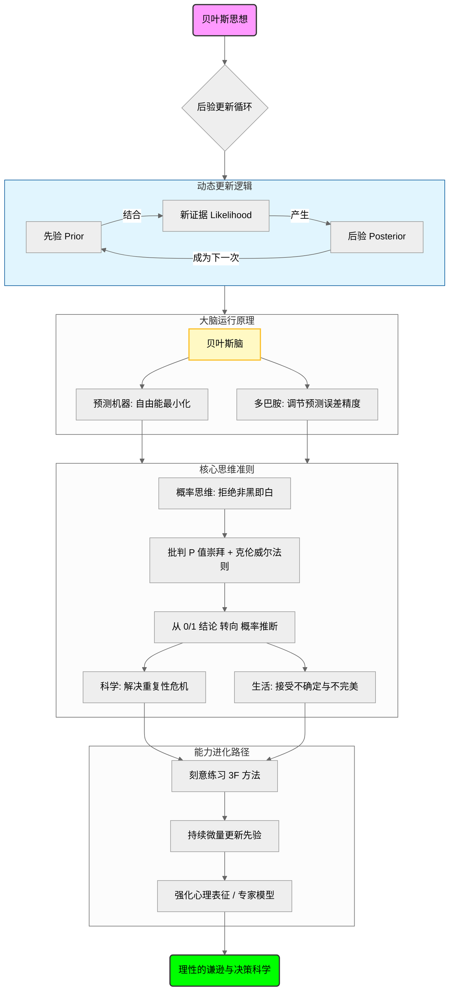

# card

本 card 基于 ref 中的观点提炼和 AI 补充，由 Gemini 3 Flash 精简总结而成，mermaid 总览如下：

对 mermaid 的解释如下（注意，以下文字由 AI 生成）：

> 这本书不仅是在讲述一个数学公式，更是在揭示一套关于**“人类如何通过不确定信息趋近真相”**的万物理论
>
> **在科学推断上**，它批判了传统频率派对 P 值的盲目崇拜，主张科学不应是“非黑即白”的假设检验，而应是基于证据强度（似然比）不断调整“假设为真”的后验概率。它提醒我们要警惕低先验概率下的“显著发现”，从根源上反思科学界的重复性危机
>
> **在决策逻辑上**，它将概率转化为“胜算”，通过奥卡姆剃刀选择简单的解释，并恪守“克伦威尔法则”——永远不把概率设为 0 或 1。这要求决策者保持逻辑的开放性，承认自己可能犯错，从而在复杂动态的环境中寻求“似然比”最高的路径
>
> **在认知与修养上**，它指出先验虽然带有偏见，却是我们理解世界的基石。高手与普通人的区别，不在于是否有先验，而在于能否像“刻意练习”一样，通过 3F 模式不断捕捉微量信息来精密化更新心理表征。这是一种“动态修正”的觉悟，即接受结果的不完美，但追求过程的不断进化
>
> **在底层机制上**，贝叶斯思想直指生命本质——大脑是一台“预测机器”，遵循“自由能最小化”原则，通过多巴胺调节预测误差的精度。我们感知到的现实，实际上是大脑根据先验对感官信号进行的“最佳解释”
>
> **全书的核心启示是：** 贝叶斯思维是一种**理性的谦逊**。它教导我们：世界是不可完全预测的，但通过不断微调我们的先验，我们可以从“错误”中学习，在概率的迷雾中，通过持续更新，做一个更接近真相的聪明人

# ref

## 1. 核心思想

如何建立一套思维框架，帮助我们在不确定性中：

- 持续更新认知
- 动态调整决策

## 2. 核心概念

### 统计推断/概率推断

见：note - 1  b)

### 先验判断

- 定义：
  - 在没有额外数据支撑的情况下，对事物的主观判断

### 似然（likelihood）

- 定义：
  - 最大似然估计是根据已知实验数据，判断哪种假说最有可能产生当前的实验结果

### p 值

- 定义：
  - 先假定某一假说为真，在这种情况下看到类似结果的概率有多大
- 不是什么：
  - p 值衡量的不是假说为真的可能性有多大
- 应用：
  - 当 p 值小于 α (通常为 0.05)，我们就可以拒绝原假设，对极端结果予以重视

### 奥卡姆剃刀法则

见：note - 3 c)

## 3. 主题归档

类型：

关联领域：

## 4. 全书框架梳理

第一章首先介绍了贝叶斯定理的基本概念和发展历史

后面三章分别从科学、生活、大脑三个方面介绍了贝叶斯思想 

最后一章回归脑科学，讲述贝叶斯脑的由来

## 5. 写作动机

问题意识：

现实意义：

## 6. 观点提炼

在第二章，作者主要论述了为什么在科学研究中使用概率推断不是一个好方法：学术界过于看重 p 值对原假设的影响，而先构建假设，后推算结果发生的概率这件事情是值得商榷的。因为这是一种先假设为真，后来进行验证的思想。如果使用贝叶斯思想，则属于统计推断，是基于已有的事实/结果去推断假设成立的概率。科研人员应该用批判性思维去不断调整假说为真或者假的概率，而不是下一个为真或者为假的结论，然后推翻对立面的一切证据。

AI 补充：

> 你提到了 P 值和贝叶斯统计的区别，这里可以补充一个更本质的数学直觉：
>
> - **频率派**（P值）关注的是：**“如果假设为真，观察到这组数据的概率是多少？”** 即 `P(Data∣Hypothesis)P(Data∣Hypothesis)`
> - **贝叶斯派**关注的是：**“既然观察到了这组数据，假设为真的概率是多少？”** 即 `P(Hypothesis∣Data)P(Hypothesis∣Data)`
> - **补充点：** 书中其实隐含了一个严厉的批评——科学界的“P 值崇拜”导致了**重复性危机**。很多所谓的“显著发现”其实是因为先验概率极低（比如心灵感应），但因为 P 值达标就被宣布为真。贝叶斯思维要求科学家在看实验结果之前，先审视这个假设本身“听起来有多靠谱”（先验概率）

第三章讲的是如何使用贝叶斯思想做决策：把概率这种数学/统计学概念换成胜算更方便理解——我们可以说胜算很大，但是不能说胜算为 100%。这一章提到了效用和奥卡姆剃刀法则，告诉我们在做决策时，我们倾向于选择更简单的假说作为先验

AI 补充：

> 你在总结中提到了胜算（Odds）和奥卡姆剃刀。在决策部分，有一个极重要的概念值得补充：**证据的强度（似然比）**
>
> - **补充点：** 贝叶斯公式告诉我们：**新胜算 = 旧胜算 × 似然比**
> - 当你面对新信息时，你要问的不是“我该不该相信它”，而是“如果我的假设是真的，看到这个证据的可能性，比假设是假的时看到它的可能性大多少倍？”这能帮你过滤噪音

第四章告诉我们，在使用贝叶斯思想时，先验判断会存在很多认知偏差，例如框架效应，证真偏差，锚定、近固、频率偏差；然而，先验是很重要的。我们日常生活中做的决策，大多都是凭借直觉，即使没有人可以说清楚先验究竟有多牢固。而这也是厉害的人和普通人的区别——厉害的人更擅长持续不断的微量化更新先验概率，这让我想到了《刻意练习》中提到的 3F 方法。那么，更新先验概率的过程，也就是不断强化心理表征的过程。但不论如何，应该有这样一种觉悟：人会犯错，决策也会失效；我们能做的就是尽可能的考虑周全，然后接受不完美的结果

AI 补充：

> 你在总结最后提到“人会犯错……接受不完美”，这对应了贝叶斯统计中极其重要的一条准则：**永远不要把先验概率设为 0 或 1**。
>
> - **补充点：** 只要你认为某事“绝无可能”（概率为 0），那么无论后续有多少证据，贝叶斯公式计算出的后验概率永远是 0。这就是所谓的“死脑筋”。**保持逻辑开放性**（概率永远在 0 到 1 之间）是贝叶斯主义者的道德修养

第五章从脑科学出发，微观讲述了使用贝叶斯思想时大脑的内部流程。首先，大脑本身就是一个做预测的机器。作者提到了自由能的概念：大脑为了自由能最小化，会尽可能的降低惊讶度与复杂度。所以，我们看到的东西，其实都会经过我们大脑的加工，变成符合大脑期望的信号进入决策流程。而多巴胺在其中起到了至关重要的作用。多巴胺负责调节预测误差精度，它决定了我们是应该相信先验还是似然，进而让大脑产生（或者不产生）学习/行动的动机

AI 补充：

> 你提到的 **3F 方法（Focus, Feedback, Fix it）** 与贝叶斯更新的结合非常精辟
>
> - **Focus（专注）：** 相当于在收集高质量的感官数据（Likelihood）
> - **Feedback（反馈）：** 产生预测误差（Prediction Error）
> - **Fix it（修正）：** 也就是后验概率更新先验的过程
> - **补充：** 所谓“厉害的人”，其核心竞争力在于他们的**先验模型极其精细**。普通人看到棋局看到的是散乱的棋子，而大师看到的是“势”和“模块”，这种高级的心理表征就是经过无数次贝叶斯更新后形成的、极高精度的先验

AI 总结：

> 你的理解已经非常透彻。如果非要补充一点，那就是作者在书末传达的一种**人文关怀**：
>
> 贝叶斯不仅是一种统计工具，更是一种**谦逊的态度**。它承认我们永远无法掌握绝对真理，只能通过不断的微调趋近真相。这种“**动态更新、永不终结**”的思维方式，是应对不确定性世界的最科学工具

# note

## 1. 序言/引言/第一章

### a) 贝叶斯公式

贝叶斯理论是在不确定性中持续跟新认知和动态调整决策的一种思维框架

如果以 $$H$$ 代表假设（Hypothesis），以 $$E$$  代表证据（Evidence），那么贝叶斯公式可以写成如下形式：

$$
P_{(H|E)} = P_(H) \cdot \frac{P_{(E|H)}}{P_(E)}
$$
各项内容的含义如下：

- $$ P_{(H|E)} $$ 代表后验概率（posterior probability）
-  $$ P_{(H)} $$ 代表先验概率（prior probability），即主观信念（由弗兰克·拉姆齐提出）/偏见/猜测
- $$ P_{(E|H)} $$ 代表如果假设成立，证据出现的概率有多大
-  $$ P_{(E)} $$ 代表这个证据在现实中出现的总概率是多少
- $$\frac{P_{(E|H)}}{P_(E)}$$ 代表似然比（likelihood ratio），即调整幅度

### b) 概率论的发展历史

| 流派     | 推断     | 内容                             |
| -------- | -------- | -------------------------------- |
| 贝叶斯派 | 统计推断 | 根据已有的结果推断假设成立的概率 |
| 频率学派 | 概率推断 | 根据构建的假设推断结果出现的概率 |

## 2. 科学中的贝叶斯思想

### a) 伯努利谬误

《伯努利谬误》：概率论简史 https://book.douban.com/subject/36713071/

所谓的伯努利谬误，指的是：

先假定假说为真，在这种情况下使用 p 值表征类似结构的概率有多大，属于频率学派

而贝叶斯理论鼓励科学家去研究哪些我们先验地持怀疑态度的理论

### b) 不确定性

- 随机不确定性
- 认知不确定性

## 3. 决策论中的贝叶斯思想

### a) 三段论式的演绎推理

苏格拉底的三段论式推理的含义是：

结论是根据前提推导而来

并不意味着结论就是正确的

### b) 效用理论（utility theory）

在经济学中，效用的定义为：

> 商品/服务带来的主观满足程度

书中作者把效用比作金钱，即“确定自己到底有多在乎某事”

其延伸概念为前景理论

而期望值就是概率与效用的结合

### c) 奥卡姆剃刀原理

> 如果两个假说都说得通，我们会选择相信更简单的那一个

先验概率就建立在奥卡姆剃刀原则之上

## 4. 生活中的贝叶斯思想

### a) 框架效应

> 两种表达方式，在逻辑上是等价的，然而措辞不同，人们的态度也会不同

### b) 证真偏差（confirmation bias）

> 人们更愿意为了证明既有观点去寻找有利证据，而不是为了证伪某个假说去寻找不利证据 

推荐书籍：《黑天鹅》

### c) 三种常见的认知偏差

- 近固：过于看重近期的数据
- 锚定：过于看重第一印象
- 频率：过于看重最常出现的东西

### d) 贝叶斯与直觉

> 我们无法获取所有相关信息，更不可能用贝叶斯公式把所有公式整合到一起，算出概率
>
> 我们能做的，就是想办法找到一些捷径，比如启发法，从贝叶斯方法的角度看，我们靠直觉本能做出来的决策并没有那么糟糕
>
> 现实中对于个人而言，没必要把概率算的那么清楚

### e) 如何有效地使用贝叶斯分析：确定的先验概率

> 超级预测这更擅长确定先验概率，而普通人无法对预测给出具体概率
>
> 使用贝叶斯分析法，必须先确定先验概率
>
> 如果你不知道某件事发生的概率有多大
>
> 那么看到证据后，你仍旧无法知道这件事发生的概率有多大

### f) 贝叶斯认知论

> 多数情况下，事物之间并不存在明确的边界，因为世界并不是由演绎推理和命题陈述构成的，也不是非黑即白的
>
> 事情可能存在反例，人可能犯错
>
> 将信念定义概率化，我们就可以避开“所有概念都是不确定的，所有观念都是虚无的”这种后现代主义思想

## 5. 贝叶斯式的大脑

### a) 大脑的工作原理

1. 模糊的感官信息
2. 大脑处理
3. 推测信息起因

大脑的核心任务是对世界做出合理预测，然后根据各个感官收集到的信息更新预测模型，其中：

- 预测 → 先验概率
- 感官数据 → 似然函数
- 更新后的预测 → 后验概率

但本质上，人是生活在自己的预测中

因为你体验到的不是感官数据，而是脑内预测

### b) 多巴胺与预测误差

这一段内容在第一次阅读时忽略了，后面在研究贝叶斯/多巴胺/双系统的关系时重新发现

预测误差 = 感官数据与先验模型之间的差异，又被称为“惊异度”

而多巴胺就是衡量预测误差的精度标准

- 如果似然数据和先验概率非常接近，后验概率也不会差多少，多巴胺分泌正常
- 感官数据精度极低，预测精度极高，说明大脑更相信先验模型，多巴胺分泌正常
- 感官数据精度极高，且与预测不符，产生预测误差，多巴胺分泌旺盛

> 大脑非常讨厌预测偏误，非常希望自己能够做出正确预测，所以它总是想要将预测和感官数据之间的偏差讲到最低
>
> 换言之，大脑之所以很关注预测偏误，是因为大脑想解决这一矛盾

### c) 自由能原理

由卡尔弗·里顿提出，这种贝叶斯模型又被称为“预测加工理论”

它的问题在于：

1. 要先预测自己的动作会产生何种影响
2. 要预测怎样做才能尽可能地获取更多信息

从信息论的角度来说，自由能约等于预测偏误：人脑非常厌恶预测偏误，总希望将其最小化

怎么做呢？

从生物角度讲：

- 保持内稳态
- 保持应变稳态：通过深思熟虑的、有计划的行为，尽量避免稳态修正

从贝叶斯的角度讲：

- 改变自身状态避免预测偏误
- 尽可能多的搜寻与世界相关的信息，以便做出更好地预测

## 贝叶斯式的生命

乔治·博克斯说：

> 其实所有模型都是错的，只不过某些模型很有应用价值

每个人的大脑中都有一个世界模型，可以从三个角度理解大脑：

> - 所有模型都可以做出预测
> - 所有预测模型都是不完美的
> - 比预测更重要的是预测偏误：如果精度极高的先验判断和精度极高的世界信息产生矛盾，那么后验概率就会发生很大变化

我们对世界的感知方式，其实就是连续不断的做出预测，然后根据感官数据进行检验

从这个理论出发，再谈科学中的贝叶斯理论：

> - 大脑的工作模式就是做出预测，然后根据新信息更新预测
> - 科学就是构建一个世界模型，然后尽量用真实世界对其进行检验：做出预测，然后用新信息更新预测，尽量降低预测偏误
> - 这里的认知偏差在于，我们通常认为科学是客观的，但是先验概率是主观的，只是我们对真实世界的试图最优，但是注定不完美预测
> - 同时，贝叶斯方法无法解决所有问题，而且也不是所有情况都适用

对于生活，贝叶斯给我们的启示是：

1. 没必要过于关注某个假说的对错、真假，因为你可以将信念用概率表示出来，然后不断调整它的数值，而不是人为设定某个阈值，然后拒绝或接受某个假说
2. 信念就是预测：很多争论本质上都是在争论某个词是否可以用来形容某一现象。然而大多数情况下，人们并不关注事件本身，只关注它到底被贴上了什么样的标签。这样做或许能帮助你赢得争论，但不会对这个世界做出的预测产生影响