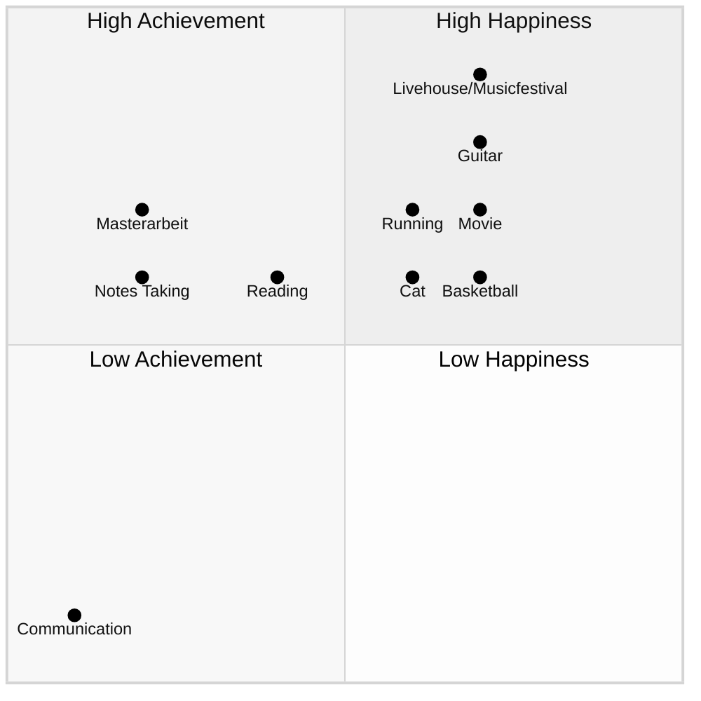

## 1. 核心内容

## 2. 参考笔记

[ref-二八法则](ref-二八法则.md)

[ref-二八法则](ref-二八法则.md)

## 3. 批判性思考

### a) 认同

相较于二八分析法，我更认可二八思维法：

- 我们确实生活在一个 [VUCA](https://zh.wikipedia.org/wiki/VUCA) 时代
- 二八思维法是强迫我们去思考关键少数的投入/原因到底是什么

二八法则让我们发现系统内在的失衡关系，这是第一步，更重要的是**去行动/改进**，让 80% 的次要多数尽可能往关键少数的 20% 靠拢。

### b) 质疑

#### 质疑 1

书中提到，做自己擅长的事情，并把它当作自己的工作。从效率的角度讲，这样也没错。可是不断突破「舒适区」就是在不断地挑战自己不擅长的事情。如何去平衡二者？

Deep Seek 解析了我的疑问：

>既想遵循帕累托法则专注优势领域，又意识到突破舒适区对成长的必要性。ta的潜台词或许是“**如何平衡专精与拓荒**”，这需要从系统视角拆解。

Deep Seek 列出了专精与拓荒的区别：

| 维度      | **效率导向**                     | **成长导向**                          |
| :-------- | :------------------------------- | :------------------------------------ |
| 表现      | 做擅长之事                       | 突破舒适区                            |
| 目标      | 短期成果最大化                   | 长期能力边界扩展                      |
| 80/20侧重 | 用80%精力深耕已擅长的20%核心技能 | 用20%精力探索相邻能力区的「战略支点」 |
| 风险      | 路径依赖导致竞争力衰退           | 资源分散削弱当前价值                  |

突破舒适区，本质上是把新的挑战转化为新的擅长领域，为此可以分三步走：
1. 在新领域识别「最小关键行动」（如先掌握核心20%知识）
2. 通过刻意练习将其升级为优势技能
3. 纳入个人价值网络，形成复合杠杆

特别需要注意的是，要选择与既有优势协同的领域：如画家学数字绘画工具；切记不要盲目进入毫无关联的领域

#### 质疑 2

作者提到的关键少数决定论，本质上是一种精英思维，这放到社会学中，是否会存在局限性？使用二八法则分析社会问题是否客观？

> 二八法则的价值在于**揭示资源分配的非均衡性**，但将其升华为“客观规律”则陷入简化论陷阱，因为它忽视了社会结构的制约性，以及资本的代际优势传递，把个人成就完全归功于自身努力。

## 4. 卡片链接

本书有两点与现有知识库产生连接：

- 在工作中使用二八法则，找到一至两位导师，导师需要自主选择，对应[刻意练习](card-@刻意练习-刻意练习.md)中提到的某领域中的杰出人士
- 在日常生活中使用二八法则，保持快乐的习惯中的一些观点与[精力管理](card-@精力管理-精力金字塔.md)也很吻合：
  - 锻炼身体 vs. 体能管理
  - 做脑操 vs. 左右脑交替思考
  - 培养精气神/与朋友欢聚 vs. 情绪管理

Deep Seek 建议：

> 将80/20法则与「复利效应」「机会成本」建立概念链接，形成**决策杠杆模型**知识簇

## 5. 行动

>找到 20% 最快乐/有效的事情，并非再把这些事情原原本本地再重复一遍，而是为了发现某个/某些基本性质，找出自己擅长做的事情，以及哪些事情对自己是重要的

列出自己的四个领域：

1. 快乐领域 --> 尽可能多地列举你记得的快乐时光。之后，再试着找出它们的共同点
2. 不快乐领域 --> 不可能占其余全部80%的时间，因为对大多数人而言，在快乐和不快乐领地之间还有一大块中间地带
3. 成就领域 --> 表现出色的短暂时期 
4. 无成就领域 --> 效率最低、颗粒无收的时期

快乐的事情有哪些共性？

- 提升体力
- 提升情绪

## 6. 延伸阅读

| 书籍             | 关联点       | 差异点                             |
| :--------------- | :----------- | :--------------------------------- |
| **《精要主义》** | 聚焦关键事务 | 更强调心理决策机制                 |
| **《深度工作》** | 杠杆时间应用 | 侧重个体专注力管理                 |
| **《长尾理论》** | 资源分配模式 | 论证非关键多数的价值（与本书互补） |

