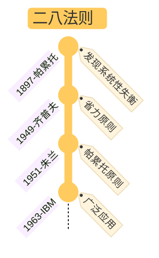

## §1 核心命题

**资源、原因、影响之间存在天然失衡——少量输入决定多数输出。**

不要被 "80/20" 这两个数字迷惑——这个比例不是数学定律，可以是 65/35、70/30、95/5、99.9/0.1，**两数之和也不一定等于 100**（因为是两组完全不同的事物在比较）。重要的不是数字，是**承认不平衡的存在并据此重新分配精力**。

## §2 关键区分：分析法 vs 思维法

这是这本书最容易被忽视的核心——

| | 二八分析法 | 二八思维法 |
|---|------------|------------|
| 性质 | 定量 | 定性 |
| 动作 | 搜集数据 → 验证 80/20 关系 | 不断追问"哪 20% 是关键少数" |
| 陷阱 | 把比例当数学公式，线性化套用 | 把它变成口号而不行动 |
| 何时用 | 已知投入产出可量化时（如销售/库存） | 决策不可量化时（如时间分配/人际） |

**二八思维法才是更大的财富**——它不是"算出 20%"，是**强迫自己持续提问**："导致 80% 结果的 20% 原因是什么？"

## §3 应用模式

### A. 杠杆点（核心）

> 找到能实现**最大产出的最小投入**——这就是杠杆点。

杠杆 = 价值 (Value) × 自动化 (Automation) [^1]

[^1]: 见 [ref-战略性懒惰](ref-战略性懒惰.md)：Value / Leverage / Automation 三关键词的"战略效率生活哲学"

### B. 时间管理

- 努力工作（尤其是为别人）不能实现自身追求
- 减少行动，因为多行动则势必减少思考
- 你最有效率的 20% 时间是否创造了 80% 价值？你 80% 快乐时光是否集中在 20% 生命历程？

### C. 专精 vs 拓荒（重要的张力）

|       | 效率导向（专精） | 成长导向（拓荒） |
|-------|------------------|------------------|
| 表现  | 做擅长之事 | 突破舒适区 |
| 80/20 侧重 | 80% 精力深耕已擅长的 20% 核心技能 | 20% 精力探索相邻能力区的"战略支点" |
| 风险  | 路径依赖 → 竞争力衰退 | 资源分散 → 当前价值削弱 |

突破舒适区的具体做法 ——
1. 在新领域识别"最小关键行动"（先掌握核心 20% 知识）
2. 通过刻意练习升级为优势技能
3. 纳入个人价值网络，形成复合杠杆

**注意**：选择**与既有优势协同**的领域（画家学数字绘画工具），切忌盲目进入毫无关联的领域。

### D. 人际关系

- 20% 的人际关系具有 80% 的价值
- 80% 的价值来自最早建立的 20% 亲密关系
- 6-7 位职场盟友：1-2 个比你年长的导师 / 2-3 个同伴 / 1-2 个以你为师的人

---

## §4 升级版理解：与长尾理论的关系

长尾**不是推翻**二八，是**扩展**：

| | 二八法则 | 长尾理论 |
|---|----------|----------|
| 关注 | 头部（关键少数） | 头部 + 尾部 |
| 经济前提 | 匮乏经济（货架有限） | 丰饶经济（货架无限） |
| 博弈 | 零和 | 正和 |
| 行动指南 | 集中资源到关键 20% | 同时经营头部与尾部利基 |

**判断用哪个**：
- 资源稀缺 / 注意力有限 / 个人时间分配 → 用二八（因为你是稀缺的）
- 平台 / 渠道近零成本 / 长尾可聚合 → 补充长尾视角（因为单点 20% 不够大）

## §5 边界与反例

- **数字陷阱**：把 80/20 当成精确公式 → 永远不会成立。比例本身随领域变化。
- **精英思维偏置**：把"关键少数决定论"放到社会层面 → 忽视结构约束、资本代际、机会不平等。**二八是个体策略工具，不是社会公平模型。**
- **零和误判**：在丰饶经济场景仍只看 20% → 错失长尾价值。
- **过度简化**：用线性方式套二八 → 失去对复杂因果的敏感度。

---

## §6 与其他 card 的关系

- 与 [card-@进化层级模型](card-@进化层级模型.md) 的"等位基因复利"：把自己视为基因库，定期淘汰低回报模块、强化高复利模块——是二八在自我管理上的进化论隐喻
- 与 [card-@精度操控三型](card-@精度操控三型.md) 的"合理精度"：精度通胀（被低信息量反馈占用）正是 80% 低价值活动的内在机制
- 与未来的 `card-@刻意练习`：找到该领域杰出人物 = 二八思维的具象化（导师就是 20% 的关键人际）
- 与未来的 `card-@系统1系统2`：二八思维法本质是强制系统 2 介入，对默认的"努力即正义"假设进行批判性审视

## §7 应用痕迹（被哪些笔记调用）

- [toolkit-@君主论与自我提升](toolkit-@君主论与自我提升.md)：**二八专精法则**（80% 精力投入 20% 关键领域）+ **二八拓荒法则**（20% 精力探索相邻能力区）
- [ref-战略性懒惰](ref-战略性懒惰.md)：High Impact 识别 + MED（最小有效剂量）
- [moc-@理性思考模型总结](moc-@理性思考模型总结.md)：作为"指导原则"层与长尾理论并列
- [book-@减法](book-@减法.md) / [book-@毫无意义的工作](book-@毫无意义的工作.md)：作为对"努力即正义"的批判工具

---

## §8 我的视角（从 tracking / inbox 提炼）

> 在做之前，没有人知道做多少会有期望产出。但要不断追问：究竟是哪 20% 才是最重要的——这样能让我始终专注在最重要的事情上。

二八不是"找到 20% 然后只做这 20%"，是**强迫自己每周/每月做一次"关键少数审查"**：
- 这周 80% 的成就来自哪几件事？
- 这周 80% 的疲惫来自哪几件事？
- 把多出来的精力投回前者，从后者撤资。

这是个**再分配机制**，不是一次性筛选。

---

## §9 起源（不重要的历史）

