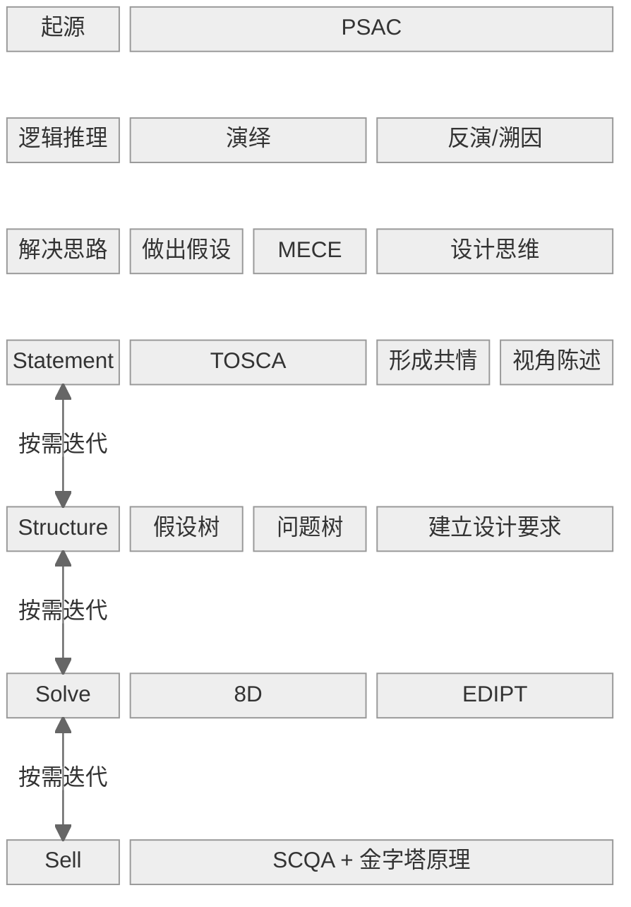

## 1. 核心内容

## 2. 参考笔记

[note-像高手一样解决问题](\docs\note-像高手一样解决问题.md)

[ref-像高手一样解决问题](\docs\ref-像高手一样解决问题.md)

## 3. 相关链接

## 4. 批判性思考

## 5. 行动

- [ ] 以企业案例为载体，让非管理者读者产生距离感 → 如何解决应用断层的问题？
- [ ] 做汇报时使用金字塔原理
- [ ] 分析问题时使用问题树