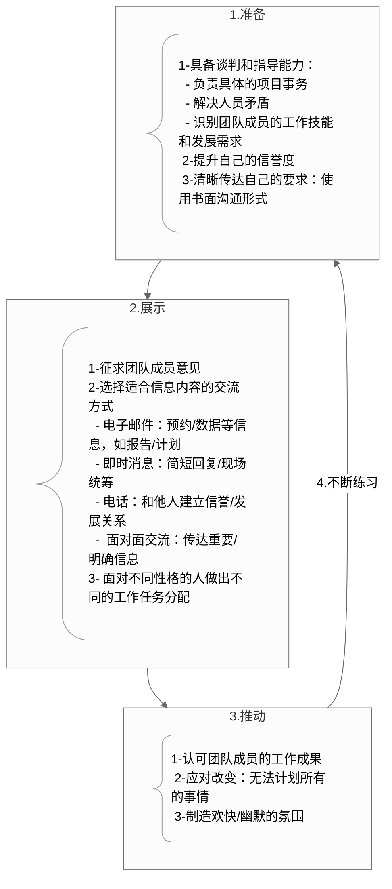
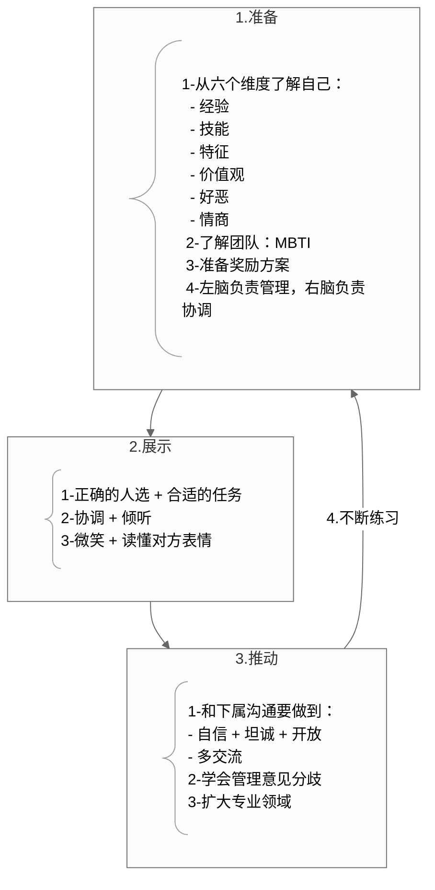
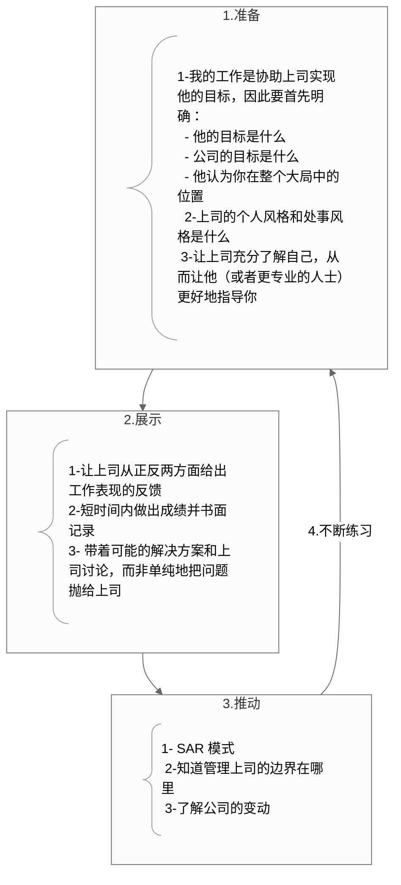

## 1. 核心内容

4P 法在以下三个领域的技术变形：

### a) 项目管理

### b) 领导者

### c) 向上管理

## 2. 参考笔记

[note-内向者沟通圣经](note-内向者沟通圣经.md)

[ref-内向者沟通圣经](ref-内向者沟通圣经.md)

## 3. 批判性思考

### a) 认同

我认为以下三个维度的沟通确实很重要：

- 通过理解领导者的需求来更好协作
- 向上管理对职业发展的帮助
- 项目管理中的沟通技巧

### b) 质疑

然而，作为执行层的工程师，我需要的是**“如何在现有岗位发挥内向优势，同时为未来领导角色铺路”**？

关键在于：**在不改变职位的前提下，如何提前培养领导者思维和技巧**？

- 项目管理：
  - Preparation: 提前准备书面文档，标注关键决策点和风险
  - Presence: 技术讨论时掌握会议节奏
  - Push: 把技术障碍转化为业务决策
- 向上管理：
  - Preparation: 从“提出问题”升级到“提供选项”
  - Presence: 用“阶段化交付”代替“不能做”
  - Push: 用“专长匹配+方案预研”证明我比其他人更适合
- 内向领导力
  - Preparation: 把技术风险转化为业务指标
  - Presence: 在技术方案中添加领导快速决策页面
  - Push: 同步进度时附加是否需要行动页面

## 4. 卡片链接

## 5. 行动

- [ ] 

## 6. 延伸阅读

| 书籍                   | 关联点                     | 差异点                   |
| :--------------------- | :------------------------- | :----------------------- |
| 《安静：内向者竞争力》 | 心理学基础（荣格性格理论） | 侧重先天特质而非方法工具 |
| 《深度工作》           | 专注力价值强化             | 未涉及人际关系维度       |
| 《高难度对话》         | SAR模型补充                | 未区分性格特质应用场景   |