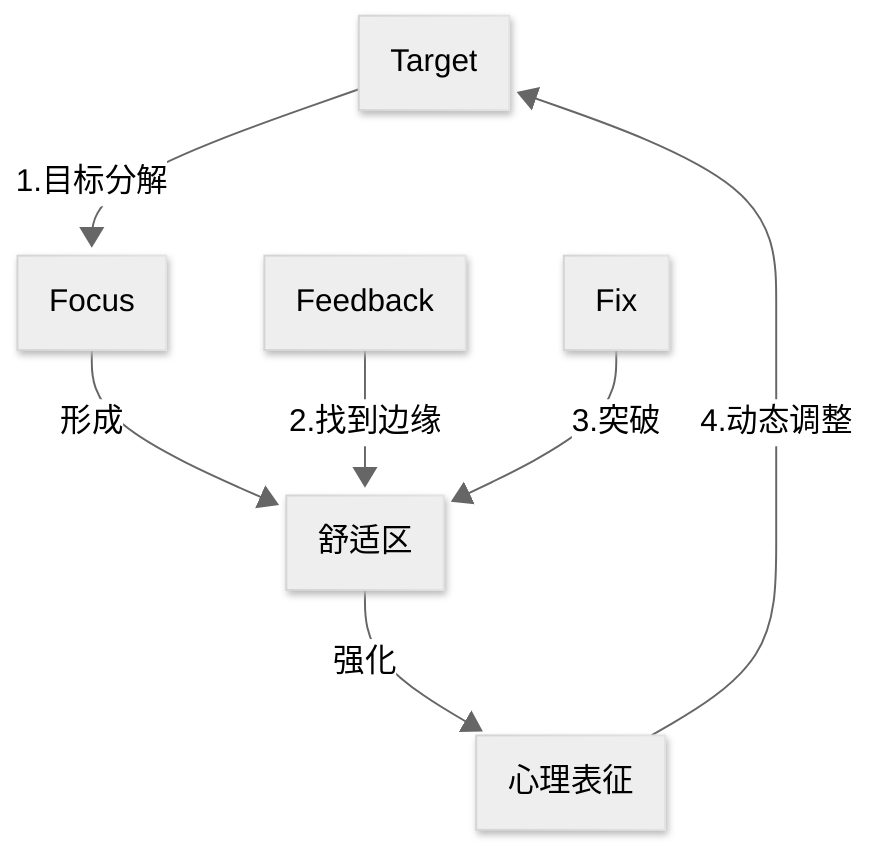

#自我管理

## 1\. 核心内容

### a) Why

即使缺少天赋，使用**刻意练习**（deliberate practice）也能让我们成为某个领域的杰出人物

### b) How

1.  设定目标：成为某个领域的**杰出人物**/达到某个领域的**领域标准**
2.  让杰出人物作为导师/根据领域标准制定训练计划
    1.  训练者要认清自己当前的水平/定位
    2.  通过**有效反馈**寻找**舒适区边缘**
    3.  通过**反复修正**突破舒适区，不断强化**心理表征**（mental representation）
3.  根据心理表征对目标进行**动态调整**

### c) What

刻意练习 = 有目的的练习 + 杰出人物指导

刻意练习的过程就是不断积累心理表征的过程

## 2\. 参考笔记

[note-刻意练习](/docs/note-%E5%88%BB%E6%84%8F%E7%BB%83%E4%B9%A0.md "note-刻意练习")

[ref-刻意练习](/docs/ref-%E5%88%BB%E6%84%8F%E7%BB%83%E4%B9%A0.md "ref-刻意练习")

## 3. 批判性思考

### a) 认同

「刻意练习」告诉我们两点：

- 无效的努力不会成功
- 经过正确的练习，普通人也能成为杰出人物

我们总是说，做自己就好，不要和别人比。其实这句话有两个大前提：

- 知道自己的目标在哪里
- 知道自己目前的定位在哪里

确定了起点和终点，所谓的刻意练习无非就是：

1. 找到这个领域内的杰出人物
2. 制定计划，不断地细化目标
3. 主动练习
   - 保持专注
   - 获得反馈
   - 及时纠正

### b) 质疑

通过刻意练习不断地积累心理表征，最终成为杰出人物。下棋中的高手，能做到下一步，看三步。可伴随心理表征出现的，是**思维定式**。我们固然要肯定前人积累的宝贵经验，同时也要记住以下两点：

- 每个人刻意练习的经验都是独一无二的
- 已有的经验无法保证解决现在和未来的所有问题

因此：

- 每个人的心理表征都是独一无二的
- 要通过反馈和修正不断地优化自己的心理表征

## 4. 卡片链接

[仪式习惯](/docs/card-@%E7%B2%BE%E5%8A%9B%E7%AE%A1%E7%90%86-%E7%B2%BE%E5%8A%9B%E9%87%91%E5%AD%97%E5%A1%94%E6%A8%A1%E5%9E%8B.md "仪式习惯")

## 5. 行动

- [ ] task1

## 6. 延伸阅读

DeepSeek 推荐理由：

>延伸阅读选了同主题的《终身成长》互补，而《认知天性》提供具体技术支撑——用户若真读这三本，就能形成"理念+方法+工具"的完整知识链。

- 《终身成长》：成长型思维理论支撑
- 《认知天性》：科学学习法的神经学证据
- 《练习的心态》：专注力与刻意训练的心理学融合