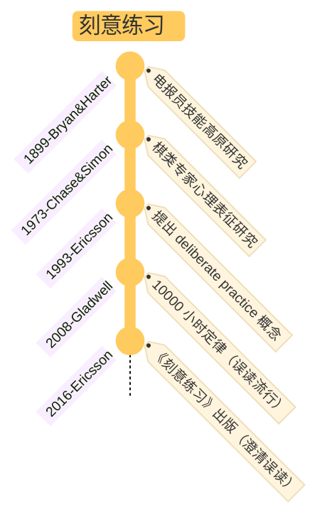

## §1 核心命题

**刻意练习不是"重复一万小时"，是用高精度预测误差不断校正先验模型——把系统 2 的高耗能努力，转化为系统 1 的自动化反应。**

天赋决定论错了——任何人都可以通过正确方法在某个领域达到杰出。但"正确方法"有具体定义：

- **舒适区边缘**做训练（不是简单的重复，也不是无法理解的难度）
- **明确目标 + 即时反馈 + 持续修正**（3F：Focus / Feedback / Fix）
- **杰出人物作为导师**或**领域客观标准**作为训练基准

不满足这些条件 → 你做的是"天真练习"，再多时间也没用。

## §2 关键区分：三种练习

| | 天真练习 | 有目的的练习 | 刻意练习 |
|---|----------|--------------|----------|
| 定义 | 反复做某件事，指望靠次数提升 | 走出舒适区 + 明确目标 + 反馈 + 监测进步 | 有目的的练习 + **杰出人物指导** + **领域已有成熟标准** |
| 例子 | 每天弹熟练的曲目 | 自己定难度逐步加大 | 老师指出薄弱乐章逐小节纠正 |
| 适用领域 | 任意 | 任意 | 必须是有客观标准/已有杰出人物的领域 |
| 效果 | 几乎为零 | 有限提升 | 接近天花板 |

**多数人停在"有目的的练习"层面**——因为找到合格导师 / 客观标准本身就很难。

## §3 应用模式

### A. 3F 流程

| 步骤 | 具体动作 | 贝叶斯对应 |
|------|---------|-----------|
| **Focus** | 强制调用系统 2，打破系统 1 自动模式 | 收集高质量似然数据 |
| **Feedback** | 外部 / 自我监控产出的精准信息 | 产生预测误差 |
| **Fix** | 系统 2 设计修正动作，重复将其刻进系统 1 | 后验更新先验 |

实操注意：3F **缺一不可**。常见失败：

- 只有 Focus（专注但没反馈）→ 进入精度坍塌
- 只有 Feedback（频繁数据但不调整）→ 进入精度通胀
- 只有 Fix（不断换方法但不专注）→ 模式无法巩固

### B. 找杰出人物（最难也最关键）

> 主观判断容易受偏见影响。理想是找到客观、可复制的测量指标。

如果客观标准不可得，**主观选你认为的杰出人物**也比没有强。然后**辨别 TA 与他人的差别**——那个差别就是你要训练的东西。

注意：**导师必须已经达到目标水平 + 有可传授的方法**。光有水平没方法的（"靠悟"）反而误导。

### C. 心理表征的构建

> 杰出人物的核心不是反应速度，是大脑中已经建立的**高度专业化的心理表征**——长时记忆里预存的模式（事实/图片/规则/关系）。

棋手看到的不是棋子，是"势"和"模块"。这种结构化的先验通过反复贝叶斯更新形成，使他们绕过短时记忆瓶颈。

构建心理表征的关键动作：
- 努力**复制**杰出人物的成就
- 失败 → 停下来**思考为什么**
- 再试 → 失败 → 再思考
- 反复直到表征稳定

**心理表征 = 知识陈述 → 知识转换的过渡**。普通人停在"知道"，高手做到"会用"。

### D. 工作中的边干边学

> 把日常商业活动转变为练习活动。

诊断问题（任何领域是否适合刻意练习）——
- 是否逼着人走出舒适区？
- 是否提供即时反馈？
- 该领域是否有公认的杰出人物？
- 是否能定位"我和杰出人物差在哪"？

如果四问都是肯定 → 这个领域可以套刻意练习。如果其中一两项缺失（比如工作中"杰出人物的客观标准"不清晰）→ 退回到"有目的的练习"，接受效率打折。

### E. 动机管理（最容易被忽视）

意志力不是靠"硬撑"——是设计：

| | 弱化"停下来"的理由 | 强化"继续"的理由 |
|---|------------------|----------------|
| 内部 | 充足睡眠/固定时间 | 相信自己能成功；细化目标后达成的反馈 |
| 外部 | 减少干扰 | 加入团体；社会动机；分享秘诀 |

**经验法则**：每天 1 小时全神贯注的练习。早期靠"弱化停下来的理由"维持，后期靠"强化继续的理由"内化。

---

## §4 升级版理解：神经元 + 贝叶斯

刻意练习的两层底层机制——

**生物层（神经元连接）**[^1]：
- 学习 = 不断建立 / 加强神经元连接
- 神经元具有可塑性，被重塑后还能再次重塑——这是终身学习的物质基础
- 集中注意力 → 提升神经冲动传递速度
- 压力过大 → 神经元退缩，不发展连接
- 运动 / 充足睡眠 → 促进神经元连接和恢复

[^1]: 见 [ref-神经元连接：高手与普通人的本质区别](ref-神经元连接：高手与普通人的本质区别.md)、[book-@粉红色柔软的学习者](book-@粉红色柔软的学习者.md)

**信息层（贝叶斯精度）**[^2]：
- 刻意练习 = 用**高精度预测误差**校正**低精度但稳定的先验模型**
- 舒适区边缘正是误差精度最高的区域——太简单（误差精度 0）/ 太难（误差精度淹没在噪声中）都不行
- 多巴胺调节哪些误差值得学习——这是为什么"有反馈"是 3F 的硬条件

[^2]: 见 [card-@贝叶斯更新](card-@贝叶斯更新.md) 与 [card-@精度操控三型](card-@精度操控三型.md)

**两层合起来**：刻意练习是**用环境设计制造高精度反馈**，让神经元被迫重塑——把系统 2 的显式推理压缩到系统 1 的自动反应。

## §5 边界与反例

- **一万小时定律的误读**：原文是"在有悠久历史的领域要花很长时间"，不是"任意 1 万小时就能成专家"。**质量 > 时长**。
- **不是所有领域都适用**：需要满足两个前提——领域有客观标准（或公认杰出人物）、有可传授的方法。商业、销售、创业等非结构化领域，刻意练习的边界很模糊。
- **天赋决定论错，但禀赋有作用**：刻意练习反对"天赋决定一切"，但不反对"个体差异存在"。某些领域（如运动）的生理上限确实存在。
- **意志力陷阱**：不要把刻意练习等同于"咬牙坚持"。靠意志力的练习不可持续——必须靠环境和动机系统支撑。
- **思维定式风险**：通过刻意练习构建的心理表征也会变成认知封闭。每个人的心理表征都是独一无二的，且无法保证解决未来所有问题——要持续通过反馈修正心理表征本身。

---

## §6 与其他 card 的关系

- [card-@系统1系统2](card-@系统1系统2.md)：刻意练习是系统 2 → 系统 1 的内化机制——三个 F 是系统 2 监督并重塑系统 1 的过程
- [card-@贝叶斯更新](card-@贝叶斯更新.md)：刻意练习的本质是"持续微量化更新先验"——高手的核心竞争力是先验模型极其精细
- [card-@精度操控三型](card-@精度操控三型.md)：3F 缺失 → 对应三型故障（缺反馈→精度坍塌；过强反馈→精度通胀；不修正→精度锁死）
- [card-@二八法则](card-@二八法则.md)：找杰出人物 = 二八思维的具象化——20% 的人决定 80% 的领域天花板，导师就是这 20%
- [card-@进化层级模型](card-@进化层级模型.md)：神经元可塑性是"基因 ⇌ 大脑 ⇌ 环境"反馈环的具体机制——刻意练习是对该环路的人为放大

## §7 应用痕迹（被哪些笔记调用）

- [moc-@认知链路](moc-@认知链路.md)：刻意练习作为认知链路的"实践层"——把贝叶斯+自由能+多巴胺转化为可训练的方法
- [book-@贝叶斯定理](book-@贝叶斯定理.md) §card：3F 与贝叶斯更新的对应关系
- [book-@精力管理](book-@精力管理.md)：仪式习惯就是刻意练习的"动机管理"具象——用环境弱化停下来的理由
- [tracking-@工作](tracking-@工作.md)：刻意练习模型用于工作场景的应用与反思
- [toolkit-@君主论与自我提升](toolkit-@君主论与自我提升.md)：费曼学习法 + PKM 国民军 = 刻意练习在知识管理上的具体落地

---

## §8 我的视角

> **每个人都该问自己：我想在什么领域成为杰出人物？如果答案是"没有"，刻意练习就不是你的工具——你需要的是"有目的的练习"。**

可执行的判断标准——

1. **诊断当前练习层级**：
   - 重复做熟练的事 → 天真练习（停止它）
   - 自己定难度逐步加大 → 有目的的练习（多数人到此为止，没问题）
   - 有客观标准 + 杰出人物 + 反馈系统 → 刻意练习（少数领域可达）
2. **找舒适区边缘**：不是"难"，是"刚好超出当前能力"。如果你**能勉强完成 60-80%**，这就是边缘。能 100% 完成 → 太简单；只能完成 20% → 太难。
3. **没有导师时的自救**：用三个问题代替导师——"杰出人物在这个具体动作上和我有什么差别？我能不能录下来对比？我每次失败的具体原因是什么？"
4. **警惕"努力幻觉"**：感到累 ≠ 在刻意练习。如果你做完后无法清楚说出"这次比上次进步在哪一具体维度"——你只是在消耗时间。

**刻意练习真正的考验不是坚持，是反馈系统。** 没有反馈，再多努力都是高能耗的自动化。

---

## §9 起源（不重要的历史）

