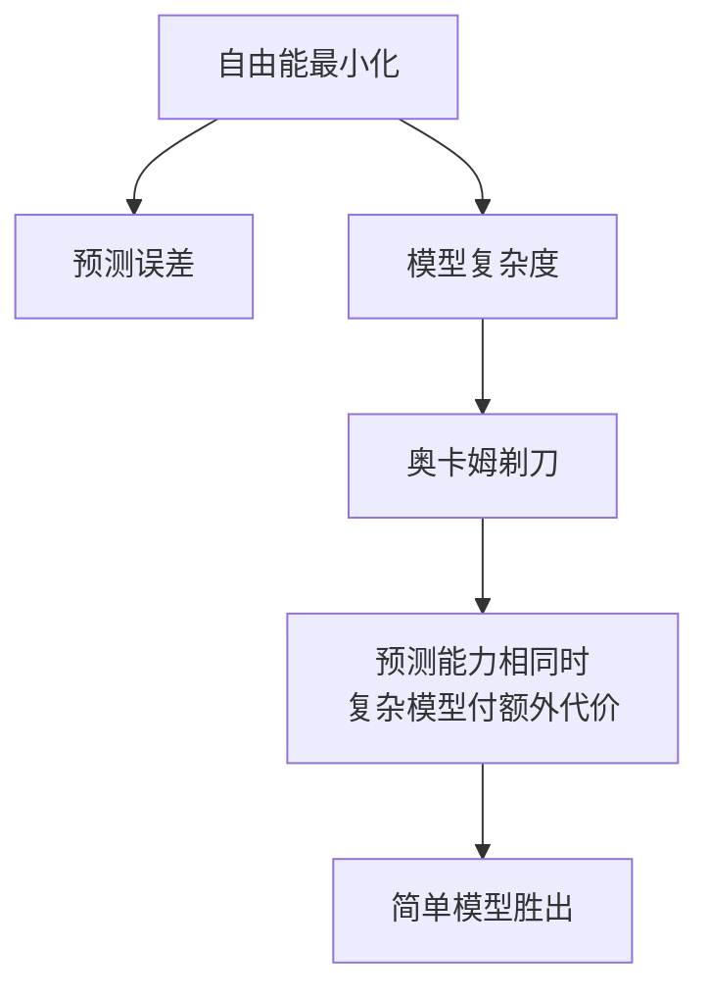

# 核心命题

奥卡姆剃刀不是一条「人们偏爱简单」的心理偏好，是自由能最小化的必然结果。

自由能 = 预测误差 + 模型复杂度。既然复杂度直接算在代价里，那么在「预测能力相同」的前提下，复杂模型一定输给简单模型——不是因为简单更优雅，是因为复杂模型的维护成本更高。

这句话把剃刀从「态度」降格成了「结算方式」：不是我应该偏爱简单，是大脑的账本本来就这么算。

---

# 机制：为什么剃刀是自由能的结果

| | 内容 | 出处 |
|---|---|---|
| 原意 | 「如无必要，不增实体」 | 逻辑学传统 |
| 引申 | 结论相同时，优先选择假设少的那个 | [moc-@九大模型应用索引](moc-@九大模型应用索引.md) §08 |
| 机制 | 自由能 = 预测误差 + 模型复杂度，复杂度是要付账的那一项 | v1 §3e（已归档，见 source） |

推论有三步：

1. 生物系统受自由能最小化的硬约束——要维持自身稳定，必须在「预测得准」和「模型别太贵」之间取平衡
2. 两个模型预测能力相同时，复杂的那个多付了维护成本，在自由能上直接吃亏
3. 所以自由能最小化自然导向剃刀式的模型偏好——不需要额外假设一个「爱简单」的心理机制

---

# 它在三个地方出现过

| 领域 | 怎么用的 | 出处 |
|---|---|---|
| 逻辑学 | 清晰定义、用符号语言避免过度复杂的论证 | [book-@简单的逻辑学](book-@简单的逻辑学.md) |
| 心理学 · 认知负荷 | 合理的删减比一味做加法更有效 | [book-@减法](book-@减法.md) |
| 资源分配 | 聚焦 20% 的关键投入，放弃剩余 80% 的低效部分 | [book-@二八法则](book-@二八法则.md) |

三条其实是同一件事在不同尺度上的样子：论证的复杂度、认知的复杂度、投入的复杂度，付的是同一笔账。

---

# 与相邻概念的边界

- 与 [card-@贝叶斯更新](card-@贝叶斯更新.md)：贝叶斯回答「先验该不该更新」，剃刀回答「在几个都能解释的模型里该留哪个」。前者管更新，后者管选型。
- 与 [PWPE与非对称决策模型](PWPE与非对称决策模型.md)：PWPE 处理的是误差和精度的加权，剃刀处理的是模型本身的成本项。PWPE 那条链假定模型已经选定，剃刀管的是选定之前。
- 与「战略性懒惰」（见 [Ni-Te-audit](Ni-Te-audit.md)）：战略性懒惰是把剃刀用在行动层——降低行动的组织成本；剃刀本体在模型层。

---

# 待填：剃刀什么时候不该用

> （留给作者）剃刀有一个明显的失效条件：**「预测能力相同」这个前提在现实里很难验证**。当两个模型的预测能力其实不同、只是你还没测出来时，用剃刀砍掉复杂的那个就是砍错了。
>
> 需要填的几件事：
>
> - 我自己有没有撞到过「用剃刀砍早了」的实例？
> - 这条边界跟「地图 ≠ 疆域」（[moc-@九大模型应用索引](moc-@九大模型应用索引.md) §01）是不是同一条？
> - 简化和过度简化的判据在哪——是不是就是「有没有先验证预测能力相同」？

---

> **代写声明**
>
> 2026-08-29：本卡由 Claude 起半成品，在 `moc-@认知链路`（v1）归档前把它 §3e / §4c 里唯一没被 PWPE 与 Ni-Te-audit 接住的一块（奥卡姆剃刀的机制解释）择出来单独成卡。「核心命题 / 机制 / 三处出现 / 边界」四节是对 v1 与九大索引 §08 已有文字的搬运与合并，没有新增论点；「待填」一节是作者自己的活。
