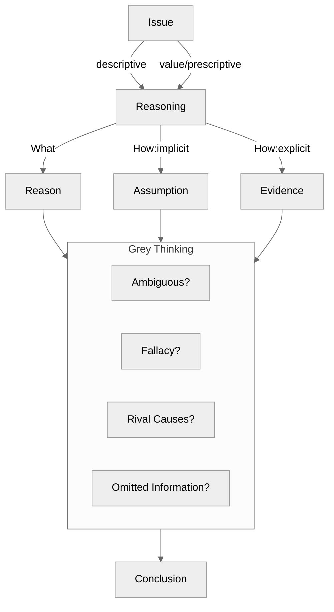

Critical Thinking 由三部分构成：

- 论题 (Issue)
  - 描述性论题 (Descriptive Issue): 不可以用二分思维 (Dichotomous Thinking) 的论题
  - 价值观/规定性论题 (Value/Prescriptive Issue): 可以用二分思维的论题（是/否、对/错、好/坏）

- 论证 (Argument)，其依据 (Warrant) 为：
  - 理由 (Reason)
  - 证据 (Evidence)
- 结论 (Conclusion)

Critical Thinking 的最终结果，就是要求一个人：

1. 虚怀若谷地接纳各种观点
2. 理性而又有理有据地批判这些观点
3. 在理性判断的基础上决定接受哪些观点或采取哪些行动

在原文中有两个概念 argument 和 reasoning, 二者的关系和区别分别是什么？

关于批判性思维/逻辑学/分析问题的一般性方法已经大概有了一些轮廓。目前已经读过：

- 谈谈方法
- 简单的逻辑学
- 像高手一样解决问题
- 学会提问

《快思考，慢思考》在本书和《刻意练习》中都有提及，可以作为下一本阅读的书籍。

对于逻辑性比较强的书籍，可以采用以下提问方式：

1.  Issue?
2.  Concusion?
3.  Reasons?
4.  Evidence?
5.  Assumption?