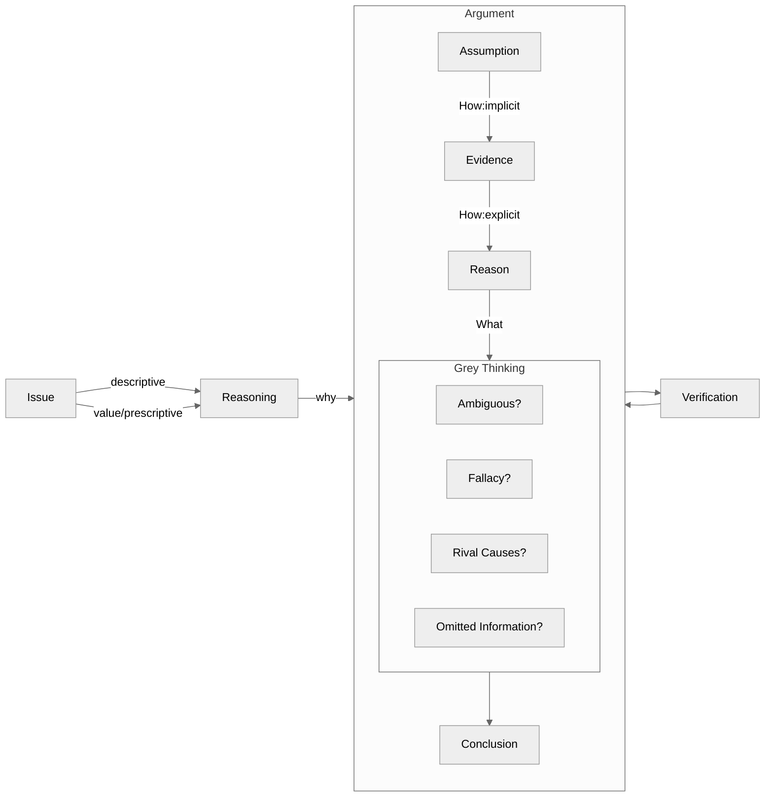

## 1. 核心内容

Critical Thinking 由两部分构成：

- 论题 (Issue)
  - 描述性论题 (Descriptive Issue): 不可以用二分思维 (Dichotomous Thinking) 的论题
  - 价值观/规定性论题 (Value/Prescriptive Issue): 可以**初步**二分思维的论题（是/否、对/错、好/坏），但最终结论需要超越二分法
- 论证 (Argument)
  - 论证的依据 (Warrant) 为：
    - 理由 (Reason)
    - 证据 (Evidence)
    - 未被言明的假设 (Assumption)
  
  - 论证的结果为结论 (Conclusion)
  - 论证可能存在歧义 (Ambiguous) /谬误 (Fallacy) /替代理由 (Rivial Cases) /缺失信息 (Omitted Information), 需要使用灰度思考来完善论证
  

论证和推理 (Reasoning) 的关系与区别：

- 推理是论证的基础，是一个人内在的思维过程
- 论证是推理的外在表达，必须结构化（理由 + 结论）
- 只有结论而没有支撑的理由，只能是纯观点 (mere opinion), 而非论证

Critical Thinking 的最终结果，就是要求一个人：

1. 虚怀若谷地接纳各种观点
2. 理性而又有理有据地批判这些观点
3. 在理性判断的基础上决定接受哪些观点或采取哪些行动

另外还要补充的是，结论还需要进行检验，从而形成动态反馈，持续回溯修改理由或者假设

## 2. 参考笔记

[ref-学会提问](ref-学会提问.md)

[note-学会提问](note-学会提问.md)

## 3. 批判性思考

### a) 认同

关于批判性思维/逻辑学/分析问题的一般性方法已经大概有了一些轮廓。目前已经读过：

- 谈谈方法
- 简单的逻辑学
- 像高手一样解决问题
- 学会提问

对于逻辑性比较强的书籍，可以采用以下提问方式：

1.  Issue?
2.  Concusion?
3.  Reasons?
4.  Evidence?
5.  Assumption?

### b) 质疑

在原文中有两个概念 argument 和 reasoning, 二者的关系和区别分别是什么？

| **概念**              | **定义**                                                     | **关键特征**                                                 |
| :-------------------- | :----------------------------------------------------------- | :----------------------------------------------------------- |
| **Reasoning（推理）** | **个人内在的思维过程**：利用一个或多个想法支撑另一个想法的认知活动（P39）。 | - 动态的、不可见的思考过程  - 可能包含未表达的假设或跳跃 |
| **Argument（论证）**  | **推理的外化表达**：由“结论+支撑理由”组成的结构化陈述集合，用于说服他人（P39）。 | - 静态的、可见的语言/文字形式  - 必须包含明确的结论与理由 |

## 4. 相关链接

## 5. 行动

## 6. 延伸阅读

《快思考，慢思考》在本书和《刻意练习》中都有提及，可以作为下一本阅读的书籍。